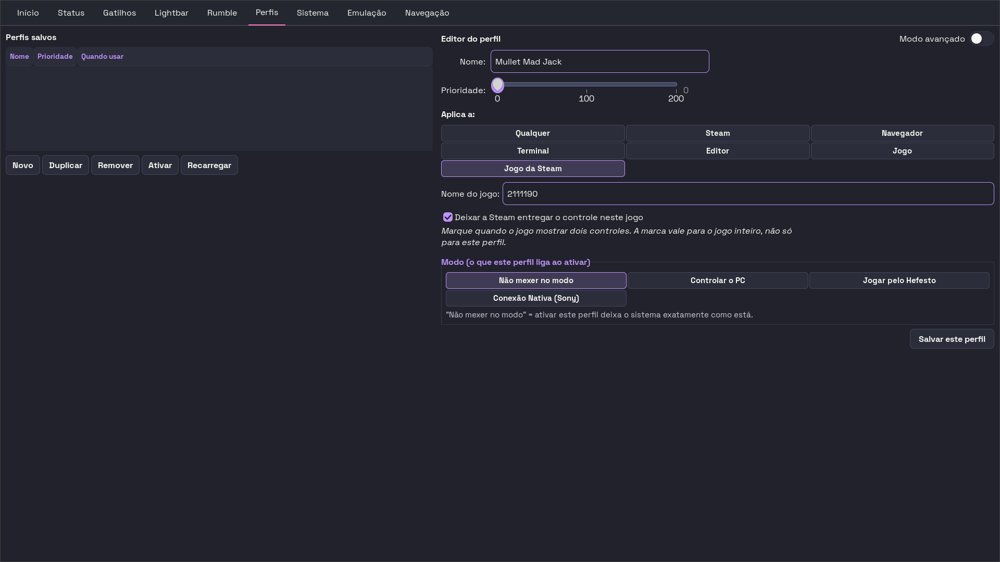

# DECISÕES — o que está parado esperando você

São seis decisões, cada uma com o contexto em duas linhas, o print (quando há) e as opções.
Marque o `[ ]` da opção que você escolher, escreva ao lado se quiser, e devolva o arquivo.
O que ficar sem marca fica parado — está escrito, embaixo de cada uma, o que isso custa.

## Quanto custa a sessão inteira

| Tipo | Quantas | Tempo | Quais |
| --- | --- | --- | --- |
| OLHO NA TELA | 2 | 15 a 25 min | 1, 2 |
| MÃO NA BANCADA | 1 | 2 min para decidir (45 min de mesa depois) | 3 |
| PALAVRA DE VOCABULÁRIO | 0 | — | — |
| DECISÃO DE PROJETO | 3 | 12 min | 4, 5, 6 |
| **Total** | **6** | **29 a 39 min** | |

---

## OLHO NA TELA

### 1. A janela depois dos sete consertos de largura está boa — fecho a sprint, ou tem aba para refazer?

`OLHO_NA_TELA` · 10 min (as dez abas, uma passada) · [JANELA-QUE-RESPIRA-01](docs/process/sprints/2026-08-01-JANELA-QUE-RESPIRA-01-os-consertos-de-largura-que-a-casa-ja-tinha-decidido.md)

Sete fileiras de botão perderam o `homogeneous`, seis parágrafos ganharam teto de linha (um caiu de 1869px para ~975px) e as ações dos Gatilhos desceram para o rodapé da coluna. O retrato offscreen prova a geometria; ele não prova que a aba ficou boa.

- [ ] **Aprovo as dez abas** — a sprint fecha e as fotos de hoje viram a linha de base das próximas levas.
- [ ] **Aprovo, menos as abas que eu apontar** — só as apontadas voltam à bancada; o resto para de ser reaberto a cada sessão.
- [ ] **Reprovo o conserto das ações dos Gatilhos** — desfaz a E9 da LARGURA-01, que foi pedido literal seu, e os ~770px de vazio dentro de cada moldura voltam.
- [ ] **O vazio dos Gatilhos não sumiu, mudou de lado: refaz a moldura** — nenhuma opção acima cobre isto, que é o que o próprio print mostra. *(levantada pelo cético)*
- [ ] **Aprovo a tela, mas a sprint só fecha quando o portão existir** — a E1 da própria sprint (contar `homogeneous=True` em fileira de botão) não existe 20 dias depois; foi a ausência dela que deixou sete fileiras atravessarem três sprints com a suíte verde. *(levantada pelo cético)*

**Se ficar sem resposta:** a sprint fica PARCIAL para sempre, e nenhuma leva de interface posterior tem linha de base aceita para comparar.

---

### 2. As nove entregas de interface que estão no código desde 31/07 e esperam só a sua palavra ficam, ou alguma volta?

`OLHO_NA_TELA` · 5 a 15 min · [LARGURA-01](docs/process/sprints/2026-07-29-LARGURA-01-a-mesma-largura-em-todas-as-abas.md) (E1-E4 e E9, 29/07) e [JANELA-FIEL-01](docs/process/sprints/2026-07-31-JANELA-FIEL-01-a-janela-que-para-de-reconciliar-e-o-botao-morto-no-pacote.md) (E1-E4, 31/07)

Commit cd5eaf1. Medida de janela offscreen prova geometria, não prova que ficou bom de olhar; e teste verde não prova que a janela parou de trocar sozinha o perfil. Só você fecha isso.

- [ ] **Aprovar as cinco de largura numa olhada com a janela maximizada** — a metade de geometria fecha e a E5-E8 pode começar. Cinco minutos passando pelas abas com Ctrl+PageDown.
- [ ] **Aprovar tudo numa sessão de 15 min, incluindo abrir um jogo e ver a janela reconciliar o perfil** — as duas sprints fecham inteiras; é a única forma de provar a E1 e a E4, que mexem em qual perfil a janela grava.
- [ ] **Reprovar o que não ficou bom, com foto** — eu desfaço item por item o que você apontar; o resto segue e fecha.
- [ ] **Triar a fila inteira pela foto, não duas sprints por vez** — os 13 PNGs de `docs/usage/assets/` já são a janela de hoje maximizada em 1920: zero minuto de janela viva para a metade de geometria, janela viva só para o que a foto não responde, e na mesma sessão caem as 26 que aguardam a sua palavra (a JANELA-QUE-RESPIRA-01 e a CARD-OCUPA-01 incluídas). A E1 e a E4 se provam SEM jogo — clicar "Ativar" noutro perfil e digitar "Navegacao" no Salvar Perfil, ~2 min. *(levantada pelo cético)*

**Se ficar sem resposta:** duas sprints ficam com cinco entregas em "entregue em código, aguardando a palavra dela", e a E5-E8 da LARGURA (Sistema, Emulação e Gatilhos, as que mais mudam a foto) não começa.

---

## MÃO NA BANCADA

### 3. Você autoriza o E-9 — escrever até mil reports por segundo num controle nomeado, com os quatro na mesa — e com o daemon fora do caminho de que jeito?

`MAO_NA_BANCADA` · 2 min para decidir; ~45 min de mesa · [O LAÇO DE ESCRITA-01](docs/process/sprints/2026-08-15-O-LACO-DE-ESCRITA-01-o-suspeito-que-sobrou.md), decisão D-38 (15/08)

É o ensaio que decide se o laço de escrita do Hefesto é o que derruba o rádio. Escreve no aparelho: o report de 47 bytes inteiramente zerado, sem jogo aberto, sem tocar NVS nem feature report.

- [ ] **Autorizo, com Modo Nativo** — zero escritas do daemon sem parar serviço nenhum e sem sudo. Caminho limpo e reversível por gesto.
- [ ] **Autorizo, com o daemon parado** — mais simples de auditar, e é gesto de sessão seu. Foi o que a página de decisões de 15/08 recomendou.
- [ ] **Não autorizo** — o suspeito que sobrou fica sem sentença, e a justificativa do throttle continua sem prova nem refutação.
- [ ] **Autorizo P0/P1/P2 agora, sem você na mesa; o P3 só com você presente** — P1 e P2 são os dois valores que o produto já usa (0,008 s e 0,032 s), então não há risco novo neles, e a §7.2 da própria sprint diz que "é entre P1 e P2 que a resposta interessa". E, no eixo operacional, o caminho é o botão "Desligar o Hefesto" da aba Início: um clique, sem terminal, sem sudo, reversível pelo mesmo botão, e o único que arma o flag que impede a ressurreição. *(levantada pelo cético)*

**Se ficar sem resposta:** o throttle de 32 ms continua cobrando latência em toda mudança de LED, gatilho e rumble com a mesa cheia, para proteger contra um mecanismo que ninguém provou existir.

---

## DECISÃO DE PROJETO

### 4. O Hefesto continua instalando um vigia permanente que reaplica o desligamento do Steam Input a cada 30 minutos?

`DECISAO_DE_PROJETO` · 5 min · [STEAM-INPUT-01](docs/process/sprints/2026-07-26-STEAM-INPUT-01-ela-nunca-mais-precisa-decidir.md) (E7 e E8)

O `install.sh` instala um `.path` e um `.timer`, e a documentação de usuário descreve um one-shot: quem lê o troubleshooting conclui que pode religar pela Steam, e o sistema desfaz. Medido em 26/07: o timer ficou `elapsed` sem próximo disparo e passou cinco horas sem rodar.

- [ ] **Manter o vigia, documentá-lo, e mostrar na tela se ele está vivo** — a sua escolha sobrevive ao reboot e você consegue ver isso.
- [ ] **Manter e só documentar** — barato; você continua sem saber, olhando a tela, se o guarda rodou ou está morto.
- [ ] **Parar de instalar o vigia** — nada mais desfaz o que você mexer na Steam; em troca, o desligamento global volta sozinho no primeiro update da Steam.
- [ ] **Separar o conserto da decisão, e avisar só quando houver problema** — o timer nascer `elapsed` depois de todo `install.sh` é defeito, não política: conserto uma linha da unidade sem perguntar. Na tela, o guarda morto entra como achado do cartão "Saúde do sistema", que já existe e já emite avisos, em vez de uma linha permanente dizendo "tudo bem" 99% do tempo. *(levantada pelo cético)*

**Se ficar sem resposta:** o produto segue instalando em silêncio um vigia que a documentação nega. *(Nota de higiene: a E8 manda corrigir duas linhas de `docs/usage/troubleshooting.md` que já não existem nesse formato; as menções vivas ao guarda estão em `docs/usage/instalacao.md`, `docs/usage/troubleshooting-8bitdo.md` e `docs/usage/bluetooth.md`.)*

---

### 5. Um perfil de desktop pode casar com a janela do cliente Steam — o "steam" sai da lista do seu perfil Navegação?

`DECISAO_DE_PROJETO` · 2 min · [FOCO-ERRANTE-01](docs/process/sprints/2026-08-18-FOCO-ERRANTE-01-o-x-aponta-para-a-steam-e-leva-o-perfil-junto.md), §4

Treze trocas de perfil no meio da partida em 54 minutos, todas porque uma janela invisível do `steamwebhelper` tem classe "steam" e o perfil Navegação casa com "steam". O arquivo é seu e eu não o edito.

- [ ] **Tirar "steam" e "Steam" do perfil Navegação** — o defeito some hoje, sem uma linha de código. Você perde o perfil de desktop enquanto navega na loja.
- [ ] **Manter "steam" e confiar na guarda nova** — o perfil de desktop continua valendo na loja; com o jogo fechado, a troca continua acontecendo, que é o comportamento certo.
- [ ] **O produto passa a recusar "steam" em regra de perfil de desktop** — fecha a classe inteira do defeito, e tira de você a possibilidade de ter perfil próprio para a loja.
- [ ] **Manter "steam" e exigir título, ou trocar `window_class` por `process_name`** — as duas custam zero linha de código e não perdem o perfil na loja: a janela fantasma foi medida com nome vazio, então exigir um título qualquer a mata; e o botão "Steam" que o próprio editor oferece já escreve `process_name`, não `window_class` — o seu `navegacao.json` está numa forma que o produto não gera mais. Precisa de um ensaio de dois minutos para confirmar o título e o executável da loja. *(levantada pelo cético)*

**Se ficar sem resposta:** a guarda da ONDA 1 cobre o caso do jogo vivo, e só ele; a pergunta de produto por trás continua sem resposta.

---

### 6. Criar perfil por jogo: você marca quais na lista, ou o produto semeia os treze de uma vez?

`DECISAO_DE_PROJETO` · 5 min · [JOGOS-QUE-ELA-TEM-01](docs/process/sprints/2026-08-06-JOGOS-QUE-ELA-TEM-01-escolher-da-biblioteca-em-vez-de-adivinhar-o-numero.md), E4

Medido em 06/08: 15 perfis na sua pasta e 13 jogos instalados — semear todos dobra a lista de uma vez. Apagar perfil é o estrago que a leva de 05/08 passou a semana consertando.

- [ ] **Eu marco quais, nada marcado por padrão, e vejo quantos e com que nomes antes de confirmar** *(sugerida)* — jogo que já tem perfil não é oferecido, colisão de nome é recusa e nunca sobrescrita, e o lote nasce com uma prioridade só.
- [ ] **Semear os treze de uma vez** — um gesto só, e a lista dobra sem você ver o que nasceu, numa ação cujo desfazer é apagar arquivo.
- [ ] **Não semear nada** — a lista da biblioteca já resolve escolher o jogo sem digitar número; criar cada perfil continua sendo um gesto por jogo.
- [ ] **Semear só os que faltam, mostrando os que já estão feitos — e com desfazer do LOTE** — a pasta já tem 8 perfis de jogo, então "os treze de 06/08" esbarraria nos que existem hoje; e apagar exatamente os N arquivos que este lote criou não é o mesmo gesto que apagar perfil seu. O vocabulário já existe no carregador (marca de semeadura, trava de arquivo, nunca sobrescrever) e a linha de comando já tem `delete`, `historico` e `restore`. *(levantada pelo cético)*

**Se ficar sem resposta:** a metade grande do seu pedido de 06/08 — "setar um perfil específico pra cada jogo" — continua sem dono nenhum no produto.

---

## Já decididas — não pergunte de novo

Estas entraram na primeira versão desta lista e o cético as derrubou: já têm resposta datada, ou
já estão em código, ou a pergunta estava mal feita. Ficam aqui para ninguém reabri-las.

| Pergunta | Quando | Onde ficou decidido |
| --- | --- | --- |
| Marcar "Este jogo não funciona" num jogo de co-op derruba os outros jogadores? | 09/08 | ESCONDER-EM-VEZ-DE-SAIR-01: esconde o físico, mantém os virtuais (commit 7a0a655) |
| Depois do reboot, vale a máscara do último perfil ou do último clique? | 22/07 e 09/08 | RESTORE-ESCOPO-01 e PERFIL-ADIADO-POR-JANELA-01: perfil de janela pertence ao autoswitch |
| Onde a tela diz que a troca de máscara foi adiada? | 19/08 | PONTE-NA-TELA-01, entregue no commit 609bbac (linha "Ponte com o jogo" na aba Início) |
| Três perfis empatados e nenhum incumbente: quem vence? | 27/07 | EMPATE-01: fica a ordem de carga, de propósito (código em 28/07, commit 7d6a855) |
| O R1 continua sendo Alt+Tab no desktop? | 15/08 | D-20: dois significados, decididos pelo foco. A opção "sem binding" é a que você recusou |
| O controle que navega perde também L1, R1 e D-pad? | — | Não decidida, mas mal formulada: a D-22 fala só dos quatro botões da frente |
| A marca colorida dentro do botão de gatilho vira clicável? | 14/08 | D-3: painel com as quatro marcas, e clicar na marca troca o alvo |
| "Cada jogador move o próprio cursor" vira sprint de input? | 14/08 e 15/08 | D-10 e D-19: os quatro navegam a janela; navegar não passa por uinput |
| A cor do plástico só pelo cabo, ou uma terceira medição? | 21/08 | `docs/data/cores-do-plastico.md`: automática pelo cabo hoje, e você pode escolher a cor |
| Onde a cor do plástico aparece na guia? | 15/08 | D-18/D-17: anel por dentro para a seleção, borda para a identidade |
| O selo "Saída muda" deveria estar ali? | 02/08 | SOM-CANAL-01: o "Sem som" saiu, o "Saída muda" ficou — sink mudo é trabalho invisível |
| O Hefesto continua instalando `JustWorksRepairing=confirm`? | 04/08 e 07/08 | RADIO-ABERTO-01 (preço declarado) e a nota de 07/08 (não participa da recusa medida) |
| As entregas em código que esperam o olho dela ficam como estão? | 27/07 e 09/08 | PROVA-DE-TELA-01 e ROTULOS-DE-SPRINT-01: o método já está decidido, falta execução |
| A bancada dos quatro controles roda agora? | 21/08 | A fila que você fixou: aba primeiro, bancada de rádio com o hardware na mesa |
| Abrir o Sackboy com dois controles no cabo para provar o vpad? | 09/08 | A prova certa é a §6 daquela sprint: quantos controles o jogo lista, não se o vpad cai |
| Sair para a janela do Hefesto e ficar 90 segundos sem tocar em nada? | 31/07 | Já medido (asset da Onda 2); falta colar o bloco na sprint, não medir de novo |
| Repetir o experimento do controle Sony só pela versão da Steam? | — | Não decidida antes; existe o registro da falta, não uma decisão |
| A aba "No jogo" ganha a cor do card? | 13/08 a 15/08 | E2 da MESA-CHEIA-07, D-1/D-2, e D-15/D-16/D-18: "sem cor" nunca foi opção |
| Os quatro navegam: a tela mostra um dono ou os quatro? | 15/08 | D-18 e D-22, com o badge singular já desenhado na entrega 3.5 de 14/08 |
| P1 manda R1 e P3 manda L1 no mesmo décimo: qual ganha? | — | Não é dela: o §8.2 se auto-autoriza a (b), reversível numa linha |
| A aba "No jogo" diz que o perfil está protegido? | 10/08 | A regra do lugar já está fixada (fato da janela vai em linha única acima dos painéis) |
| Os dezenove rótulos de gatilho viram a lista recomendada? | 30/07 a 07/08 | Decidido em parte; seguem abertos os ~10 rótulos que ninguém tocou |
| O termo em inglês entre parênteses fica no rótulo? | 07/08 | Resposta 6: "Arco de flecha (Bow)" e "Disparo (Weapon)" |
| Reabro o trilho da sala limpa (CR-01 a CR-06)? | 31/07 e 07/08 | CR-02 e CR-05 entregues; a licença escolhida fechou a CR-01 e a CR-06 |
| A CR-05 vai sozinha agora? | 31/07 e 07/08 | Entregue e fechada; o LICENSE fica MIT canônico e o NOTICE é o dono da ressalva |
| Ligar e desligar o Pro Controller três vezes? | 07/08 | IS-J5, custo zero, já autorizado: recontar com a mesma régua do kernel |
| O protocolo do cabo roda com jogo aberto ou sem? | 07/08 | DUAS-CONTABILIDADES-01: sem jogo é o padrão; com jogo só se você aceitar o risco |
| Conferir de olho se o plástico que acende 4 é o Jogador 1? | 15/08 | Medido na sua mesa, com os quatro no rádio; a divergência está em teste e no fonte |
| Rodar os dois protocolos do número aceso no Pro e no vpad? | 08/08 e 11/08 | SEGUNDO-ESCRITOR-01 e a referência do `hid_playstation`; já no mapa de canais |
| O E-7 (seis minutos de olho na lightbar) roda quando? | 21/08 | Fila decidida por você: depois da bancada de rádio. Resta confirmar se gruda nela |
| O ensaio do alto-falante por rádio entra na fila? | 15/08 e 16/08 | D-26 (alto-falante primeiro, contra a minha recomendação) e a condicional D-i |
| Dois ensaios chamados E-1: qual muda de nome? | — | A convenção já está em vigor no `docs/data/ensaios.csv`; falta escrevê-la, não decidi-la |
| A frase do campo de jogo cita a biblioteca? | 13/08 | Entregue no commit 5d4f28b, a seu pedido literal; o texto está vivo na interface |
| A janela pergunta "é o mesmo controle em outro modo?" | 06/08 | REGRA-NAO-REGISTRO-01: a cura por registro foi descartada, com dois motivos medidos |
| Editar o `universal-sanitizer.py` do HOME? | 27/07 | Decidido e executado no mesmo dia; a nota que diz "sem prova" é que está errada |
| Abrir uma partida com os quatro para provar "duplicado é melhor que zero"? | 21/08 | É item da bancada de 22/08; o mesmo aceite já falhou isolado em quatro sprints |
| A fita "Ajustes vão para" some nas seis abas em que não vale? | 14/08 e 21/08 | D-2 (requalifica, não esconde) e D4 (esmaecida, com a linha do motivo ao lado) |
| Vinte minutos abrindo três jogos (Duskfade e companhia)? | 16/08 e 21/08 | D-f: P3, depois da bancada de rádio. Pedir agora atropela a ordem que você fixou |
| Quanto do roteiro de hardware de 19/08 rodar com o controle na mão? | 19/08 e 20/08 | Quase tudo já tem prova de plástico (commit f5c7392); falta só as cinco cores da piscada |
| Rosa para a máscara e branco para o Modo Nativo na piscada? | 19/08 | O branco é palavra sua; o rosa do jogador 4 é do sprint de cores. Só o rosa da máscara está aberto |
| O que acontece com a cor à mão dos seus 18 perfis? | 24/07 | PERFIL-MANUAL-VENCE-01, a seu pedido: cor, gatilho e rumble travados sobrevivem à ativação |
| Os quatro perfis de fábrica continuam no pacote? | 07/08 | Resposta 17: o Hefesto é produto, tem que funcionar em máquina limpa |
| Sem o drop-in 51 do WirePlumber, o produto lê promoção ou indecisão? | — | Não decidida; o que mudou foi o significado do arquivo, em 08/08 (commit 4289ace) |
| Refazer a bancada dos quatro: a volta da lightbar, ou também o gatilho? | 13/08 e 16/08 | A volta da lightbar fechou em 16/08 (ESCRITOR-CRU-01) e a mordida do rumble em 13/08 |
| A tabela de "como re-parear" nasce com gesto medido ou frase genérica? | 04/08 | E5: dado e não código, com fallback honesto e sem inventar gesto. A entrega segue aberta |
| Jogo que só fala XInput: troca sozinho ou espera o clique? | 19/08 | Nenhuma das duas: tenta em ordem, você confirma uma vez com um gesto, e o produto grava |
| "Como DualSense" para outra marca: aparece com o preço, ou nasce desabilitada? | 01/08 | Palavra sua: a opção cara fica escolhível e o preço é dito. Resta só a foto |
| A TUI passa a ler gatilhos e analógicos? | — | A entrega segue aberta, mas "tirar a TUI" revogaria a ADR-002 e mexeria na ADR-011 |
| A luz de jogador volta só nos DualSense agora? | 07/08 | Decisão 22: não, a decisão 12 vale inteira |
| A lâmpada obedece ao jogo, ou o co-op à fila da casa? | 14/08 e 15/08 | O co-op obedece à fila: ordem do momento, congelada quando a mesa estabiliza (D-30) |
| Quando um controle sai, os outros renumeram? | 25/07 e 15/08 | NUM-01 e D-30: quem cai e volta recupera o número; só os presentes compactam |
| Autoriza o braço 3 do CURA-A/B-01? | — | Não decidido; a pergunta vizinha da §7 já está respondida pela decisão 22 |
| No chip do cabeçalho, o que carrega a cor? | 15/08 e 21/08 | Os dois: plástico na borda (identidade), lightbar no quadradinho (estado) |
| O quadradinho de 14x14 usa a cor crua ou a passada pelo contraste? | 17/07 | Decisão D8: crua; só os traços recebem contraste |
