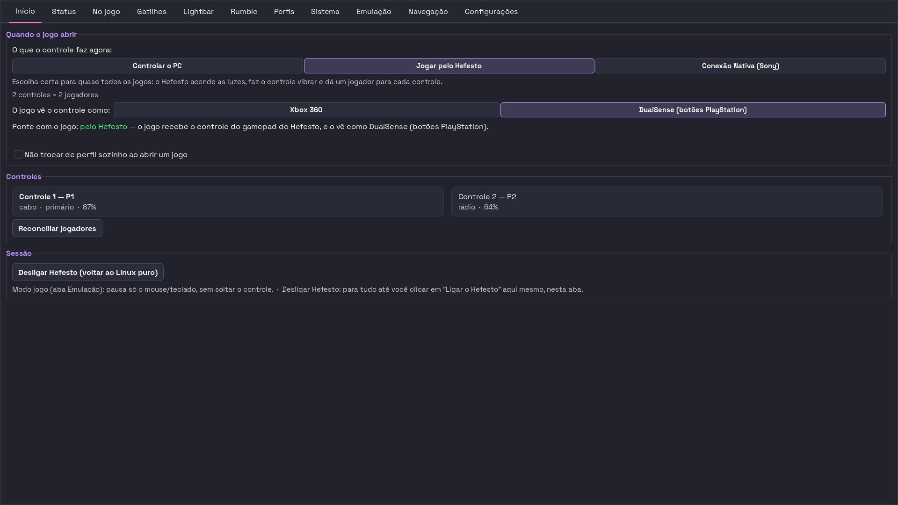

<div align="center">


# Hefesto — DualSense4Unix

**Gerenciador DualSense para Linux**

[](LICENSE)
[](https://www.python.org/)
[](https://www.gtk.org/)
[](CHANGELOG.md)
[](tests/)
[](https://github.com/[REDACTED]/hefesto-dualsense4unix/actions/workflows/ci.yml)

</div>

---

```
Versão: 0.1.2 (alfa)
Alvo:   Linux com systemd-logind · Python 3.10+
Licença: MIT
```

> **Alfa — software em maturação.** O Hefesto funciona e é usado todo dia na
> máquina em que é desenvolvido, mas ele mexe em partes sensíveis do sistema
> (regras udev, módulos de kernel, serviços e a configuração da Steam), e a
> validação em hardware cobre uma máquina só. Nada aqui promete estabilidade que
> ainda não foi medida. Leia [Limitações conhecidas](#limitações-conhecidas)
> antes de instalar.

## O que é

O Hefesto faz o DualSense do PS5 se comportar no Linux como se comporta no
console: **gatilhos adaptativos**, barra de luz, vibração na força que você
escolher, LEDs de jogador, giroscópio e touchpad. Com mais de um controle
plugado, cada um vira um jogador — co-op local sem configurar nada.

Fora do jogo, o mesmo controle vira mouse e teclado, para navegar do sofá.

Por baixo é um daemon em Python com três frentes de comando: uma janela GTK3, uma
interface de terminal e uma linha de comando. Controles de outras marcas
(Nintendo Pro, 8BitDo em modo Switch no cabo ou em modo DirectInput/PS4 por
Bluetooth) entram como jogadores adicionais.

### O que ele entrega

- **Gatilhos adaptativos** — 19 modos (Rigid, Pulse, Galloping, Machine, Bow,
  Automatic Gun e os demais), ajustáveis por gatilho e salvos no perfil.
- **Um controle virtual por jogador** — o jogo vê um DualSense completo (com
  vibração, gatilhos, luz e giroscópio) ou um Xbox 360, conforme a máscara que
  você escolher. Ver [os três modos](docs/usage/modos.md).
- **Perfis por jogo** — trocam sozinhos quando você abre a janela do jogo, com um
  cadeado para quando você não quiser que troquem.
- **Luzes** — cor da lightbar por controle (com cores automáticas de jogador) e
  os cinco LEDs de jogador no padrão oficial do PS5.
- **Vibração com política** — Economia, Balanceado, Máximo ou Auto por bateria,
  aplicada ao que o jogo pede antes de chegar ao motor.
- **Protocolo do DSX, parcialmente** — servidor UDP em `127.0.0.1:6969` que
  aceita o envelope do DualSenseX e as seis instruções principais
  (`TriggerUpdate`, `TriggerThreshold`, `RGBUpdate`, `PlayerLED`, `MicLED`,
  `ResetToUserSettings`). **Os 12 modos de gatilho "prontos" do DSX**
  (`Hard`, `Soft`, `Choppy`…) **ainda não têm tradução** — são curvas de força
  fechadas, e as tabelas que circulam estão num repositório sem licença. Um mod
  que use só os modos paramétricos funciona; um que chame `Instruction.Hard()`
  não faz nada. A lista completa do que falta está em
  [docs/protocol/udp-schema.md](docs/protocol/udp-schema.md).
- **Automação** — socket JSON-RPC local para scripts e um sistema de plugins
  Python com ganchos de tique, botão e bateria.

## Instalação

> **Onde esta versão mora.** Tudo o que esta página descreve — o redesign da
> janela, a faxina do repositório, a alfa 0.1.1 — está na branch
> `sprint/harmonia-uhid` do fork `[REDACTED]/hefesto-dualsense4unix`. O
> repositório de origem `AndreBFarias/hefesto-dualsense4unix` **não tem este
> código**: o `main` dele está no commit `398d3ed` e o último lançamento de lá é
> a **v3.0.0, de 28/04/2026**. Clonar de lá hoje entrega o projeto anterior a
> tudo isto. Medido em 25/07/2026; se o histórico já tiver sido unificado quando
> você ler, esta caixa é o primeiro parágrafo a apagar.

```bash
git clone -b sprint/harmonia-uhid \
  https://github.com/[REDACTED]/hefesto-dualsense4unix.git
cd hefesto-dualsense4unix
./install.sh
```

A branch é o ponto mais recente. Para a alfa exata, use a tag: `git checkout
v0.1.1`. O `main` desse mesmo fork é um ponto **anterior** da mesma linha — não
serve para instalar.

O instalador mostra um seletor de formato, pede a senha de administrador uma vez
e conduz o resto. As perguntas têm padrão seguro — dá para responder tudo com
Enter. Sem terminal interativo, use `./install.sh --yes`.

Depois, abra pelo menu de aplicativos ("Hefesto — DualSense4Unix") ou:

```bash
hefesto-dualsense4unix-gui
```

**Antes de instalar, saiba o que ele toca.** O Hefesto não é um aplicativo de
espaço de usuário puro: boa parte das curas mora em regra de udev, módulo de
kernel e serviço de sistema. Com os padrões de fábrica ele grava 14 regras udev
(mais uma 15ª que só entra por opt-in), drop-ins de `modprobe` e do BlueZ,
serviços em `/etc/systemd/system`, **três** módulos de kernel via DKMS
(`hid-nintendo`, `hid-playstation` e `rtw88-usb`), um parâmetro no cmdline do
kernel e ajustes na
configuração da Steam — cada um com sua flag de opt-out, e todos revertidos pelo
`./uninstall.sh`. A lista completa, item por item, está em
**[docs/usage/instalacao.md](docs/usage/instalacao.md)**.

Existem também pacotes `.deb`, Flatpak, AppImage, Arch, Fedora e Nix; para a
alfa, o caminho testado é o do código-fonte.

## Como usar

### A janela

Nove abas. A primeira, **Início**, é a de decisão: escolha ali *o que o controle
faz agora*.

| Modo | O que acontece |
|---|---|
| **Controlar o PC** | o controle vira mouse e teclado |
| **Jogar pelo Hefesto** | o jogo enxerga um controle virtual — é o padrão para jogar, e o único modo com co-op local |
| **Jogar direto (Sony)** | o Hefesto solta o controle e o jogo fala direto com ele |

As outras oito abas — Status, Gatilhos, Lightbar, Rumble, Perfis, Sistema,
Emulação e Navegação DSX — estão descritas uma a uma em
**[docs/usage/interface.md](docs/usage/interface.md)**.

### Atalhos no próprio controle

| Gesto | Ação |
|---|---|
| PS + D-pad cima / baixo | perfil seguinte / anterior |
| PS (toque curto) | abre a Steam (configurável) |
| PS + Options | modo jogo: suspende a emulação de mouse e teclado |
| Botão de microfone | muta o microfone do sistema |

Detalhes e configuração em [docs/usage/hotkeys.md](docs/usage/hotkeys.md).

### Linha de comando

```bash
hefesto-dualsense4unix status                     # estado do daemon e do controle
hefesto-dualsense4unix doctor                     # diagnóstico ponta a ponta (--fix corrige)
hefesto-dualsense4unix battery                    # bateria
hefesto-dualsense4unix profile list               # perfis salvos
hefesto-dualsense4unix profile activate fps
hefesto-dualsense4unix gamepad on --flavor xbox   # o jogo vê um Xbox 360
hefesto-dualsense4unix mouse on                   # controle vira mouse e teclado
hefesto-dualsense4unix native on                  # solta o controle para o jogo
hefesto-dualsense4unix led --color "#FF0080"      # lightbar
hefesto-dualsense4unix mic bt-status              # pré-condições do mic por Bluetooth
hefesto-dualsense4unix mic bt                     # sobe a ponte do mic por Bluetooth
hefesto-dualsense4unix tui                        # interface de terminal
```

O daemon roda como serviço `--user`:

```bash
systemctl --user enable --now hefesto-dualsense4unix.service
journalctl --user -u hefesto-dualsense4unix -f
```

Referência completa dos comandos em [docs/usage/cli.md](docs/usage/cli.md).

## Capturas de tela

Feitas em 25/07/2026, com a interface redesenhada e **quatro controles
conectados por Bluetooth ao mesmo tempo** — dois DualSense, um Nintendo Pro e um
8BitDo em modo DirectInput/PS4. Uma por aba, em
[docs/usage/interface.md](docs/usage/interface.md), com o que cada uma faz.

[](docs/usage/interface.md)

Na aba Sistema, o bloco "Detalhes técnicos" está borrado de propósito: o log
mostra o endereço Bluetooth real dos controles desta máquina, e os gates de
anonimato do projeto não varrem imagens.

## Limitações conhecidas

**Pareamentos Bluetooth somem — por dois motivos diferentes.** Se você procurar
só um, vai procurar no lugar errado metade das vezes:

- **Com crash do `bluetoothd`.** Corrupção de heap no serviço de Bluetooth do
  sistema (`malloc_consolidate(): unaligned fastbin chunk detected`) faz o
  serviço reiniciar e **apagar pareamentos**. O gatilho medido aqui é a
  reconexão de dois controles Nintendo-class em poucos segundos — o Pro
  Controller genuíno e um 8BitDo em modo Switch se apresentam com o mesmo
  identificador. É um problema aberto do BlueZ, sem correção upstream conhecida,
  e **não temos como consertá-lo daqui**.
- **Sem crash nenhum** (`NRestarts=0` — o serviço nunca reiniciou). A assinatura
  é `src/device.c:search_cb() ...: error updating services: Host is down (112)`,
  e o gatilho é banal: **o controle está pareado por Bluetooth e sendo usado
  pelo cabo ao mesmo tempo**. O rádio dele desliga, o BlueZ insiste em resolver
  os serviços de um endereço que não responde, e termina removendo o device.
  Medido em 25/07/2026.

O que fizemos nos dois casos foi reduzir o estrago: o Hefesto fotografa os
pareamentos na borda de cada conexão nova. Mitigação, e como distinguir um do
outro no log, em [docs/usage/bluetooth.md](docs/usage/bluetooth.md).

**8BitDo por Bluetooth: use o modo DirectInput/PS4, não o modo Switch.** Até
25/07/2026 esta seção dizia que o cabo era a única via confiável — e estava
errada por uma premissa, não por medição. Em modo Switch o controle se anuncia
como `057e:2009`, cai no `hid-nintendo` e morre no probe; em **modo
DirectInput/PS4** ele se anuncia como `054c:05c4`, o `hid-playstation` assume e
ele conecta de primeira. Validado ao vivo com **quatro controles por Bluetooth
simultâneos** (dois DualSense, um Nintendo Pro e o 8BitDo), um por jogador. Por
cabo, o modo Switch continua sendo o provadamente estável. Tabela de modos,
identidades e níveis de prova em
[docs/usage/troubleshooting-8bitdo.md](docs/usage/troubleshooting-8bitdo.md).

**A validação em hardware é de uma máquina só.** Pop!\_OS 24.04 com COSMIC é o
ambiente onde tudo é medido. Ubuntu tem cobertura de integração contínua, sem
hardware. Fedora, Arch, Debian e Mint têm pacotes mantidos, mas **nenhum foi
rodado com controle real** nesta linha.

**A troca automática de perfil não vê janelas Wayland nativas.** No COSMIC, o
portal ainda não expõe a janela ativa, então o reconhecimento cobre o que roda
sob XWayland — Steam e Proton, entre eles. Para os demais, troque de perfil pela
janela, pela linha de comando ou pelo combo no controle.

**O microfone por Bluetooth funciona, mas entrega metade do sinal.** O DualSense
não fala A2DP/HFP — ele manda o áudio como Opus dentro dos próprios relatórios
HID, e o Hefesto tem a ponte que decodifica isso e publica o microfone no
PipeWire (`hefesto-dualsense4unix mic bt`). Foi medida ao vivo, gravando áudio
de verdade. Duas ressalvas honestas: a ponte é **opt-in** (nunca sobe sozinha —
ligá-la custa ~35% dos relatórios de input, o que reduz as janelas de
giroscópio), e o firmware marca o microfone como mudo em 55% a 75% do tempo com
o mic no ar — sobra por volta de 40% do sinal, e a causa segue **em aberto**
(três hipóteses já foram testadas e refutadas por medição). O **fone** por
Bluetooth continua fora de escopo. Por USB, mic e fone funcionam normalmente.
Detalhe em [docs/usage/bluetooth.md](docs/usage/bluetooth.md).

**Distros sem `systemd-logind`** (Alpine OpenRC, Void runit, Artix) estão fora de
escopo — ver [ADR-009](docs/adr/009-systemd-logind-scope.md).

**Métricas e plugins são opt-in — e as métricas não têm chave para o usuário.**
Os plugins ligam por variável de ambiente
(`HEFESTO_DUALSENSE4UNIX_PLUGINS_ENABLED=1`). Já o endpoint Prometheus depende
de `metrics_enabled` no `DaemonConfig`, e **não existe hoje** variável de
ambiente, flag de linha de comando nem arquivo de configuração que ligue esse
campo: o daemon o constrói com três parâmetros só (`poll_hz`, `auto_reconnect`,
`ps_long_press_ms`). Na prática, subir as métricas exige mexer no código. Ver
[docs/usage/metrics.md](docs/usage/metrics.md).

## Documentação

- **Primeiros passos:** [docs/usage/quickstart.md](docs/usage/quickstart.md)
- **Instalação em detalhe:** [docs/usage/instalacao.md](docs/usage/instalacao.md)
- **A janela, aba por aba:** [docs/usage/interface.md](docs/usage/interface.md)
- **Os três modos e a máscara:** [docs/usage/modos.md](docs/usage/modos.md)
- **Perfis:** [docs/usage/creating-profiles.md](docs/usage/creating-profiles.md)
- **Atalhos no controle:** [docs/usage/hotkeys.md](docs/usage/hotkeys.md)
- **Bluetooth:** [docs/usage/bluetooth.md](docs/usage/bluetooth.md)
- **Linha de comando:** [docs/usage/cli.md](docs/usage/cli.md)
- **COSMIC / Wayland:** [docs/usage/cosmic.md](docs/usage/cosmic.md)
- **Quando dá errado:** [docs/usage/troubleshooting.md](docs/usage/troubleshooting.md)
  · [8BitDo](docs/usage/troubleshooting-8bitdo.md)
- **Decisões arquiteturais:** [docs/adr/](docs/adr/)
- **Protocolos (UDP, JSON-RPC, gatilhos):** [docs/protocol/](docs/protocol/)
- **Pesquisas e medições:** [docs/research/](docs/research/)
- **Histórico de versões:** [CHANGELOG.md](CHANGELOG.md)

O histórico de desenvolvimento — sprints, estudos, diário de descobertas — saiu
da árvore na faxina (commit `26456fa`) e está preservado inteiro na tag
`arquivo/processo-pre-1.0`. Os 20 comentários de código que ainda citam caminhos
`docs/process/...` se resolvem por ali:

```bash
git show arquivo/processo-pre-1.0:docs/process/ROADMAP.md   # ler um arquivo
git checkout arquivo/processo-pre-1.0 -- docs/process       # trazer a árvore
```

**Essa tag só existe no fork.** Ela não foi publicada em
`AndreBFarias/hefesto-dualsense4unix` (conferido: zero ocorrências em
`git ls-remote --tags`). Quem clonou pelo comando da seção
[Instalação](#instalação) já a tem; quem clonou do repositório de origem
precisa buscá-la antes:

```bash
git remote add fork https://github.com/[REDACTED]/hefesto-dualsense4unix.git
git fetch fork --tags
```

**Sobre os dois checklists de validação em hardware que moram nesse arquivo.**
`CHECKLIST_HARDWARE_V2.md` (57 itens) e `CHECKLIST-VALIDACAO-5-ONDAS.md` (43
itens) declaram um ritual pré-release: preencher os checkboxes em controle real
e arquivar o documento preenchido em `docs/process/validacoes/<release>/`. Esse
ritual **nunca foi executado**: os dois estão com **zero** caixas marcadas, e o
diretório `docs/process/validacoes/` não existe em nenhum commit da história do
repositório. Eles ficam preservados como registro de intenção — são um bom
roteiro de teste manual —, mas **não são o processo em vigor**. O processo em
vigor é o descrito acima: integração contínua em Ubuntu sem hardware, e
validação em controle real numa máquina só, sem documento assinado.

## Contribuindo

Leia [`.github/CONTRIBUTING.md`](.github/CONTRIBUTING.md) antes de abrir PR. O
essencial: tudo em português do Brasil e com acentuação correta; `pytest`,
`ruff` e `mypy --strict` fechando; e o gate de anonimato passando
(`scripts/check_anonymity.sh`).

```bash
pip install pre-commit && pre-commit install
```

Os ganchos barram na sua máquina o que o CI barraria depois: acentuação faltando,
`ruff` reprovado, gate de anonimato violado.

Relato de uso em distro fora da lista é especialmente bem-vindo: rode
`hefesto-dualsense4unix doctor`, anexe a saída e abra issue com a label
`validation-report`.

## Licença

MIT — veja [`LICENSE`](LICENSE).

---

*"A forja não revela o ferreiro. Só a espada."*
