# O que ela desenhou — o to-do por aba

**26/08/2026.** Doze fotos anotadas à mão, de oito abas. Este documento é o dono único do to-do que sai delas.

> *"PRECISO QUE MAPEIE CADA UMA DAS IDEIAS DE CADA IMAGEM ANTES E ME AJUDE A CRIAR UMA TO DO LIST POR ABA TÁ BOM?"*
> *"PRECISO QUE MAPEIE COM CALMA TODAS AS ABAS POR FAVOR DE CADA IMAGEM E ME TRAGA EM TEXTO E MD CONTENDO A IMAGEM DO PROBLEMA."*

**A conta:** 60 itens acionáveis — 11 grandes, 19 médias, 29 pequenas, 1 já feito. **23 blocos saem da tela.** 25 itens precisam de uma decisão dela antes de virarem código; 35 estão claros e podem começar hoje.

---

## 1. Os seis padrões que atravessam as abas

Consertar por padrão custa uma vez; consertar aba por aba custa onze. Dos cinco candidatos de partida, quatro se sustentaram, dois foram fundidos num só, e o material mostrou dois que a lista não previu — os dois mais baratos de todos.

### P1 · Texto de apoio vira tooltip

**14 itens, 6 abas.** É o pedido mais repetido do desenho todo: `GATILHOS-1`, `PERFIS-7/8/9/10`, `RUMBLE-8`, `INICIO-1/2/3`, `EMU-5`, `NAVEG-2/3/4/5`.

Três armadilhas medidas, e todas fazem a leva falhar se ignoradas:

1. **Tooltip em widget insensível não aparece no GTK3.** O `mouse_mode_hint_label` explica por que o "Emular mouse" está cinza — e o interruptor está cinza justamente quando a explicação importa. Pendurar a frase nele é apagá-la. Se for para tooltip, tem de ser num ícone "?" sensível ao lado.
2. **Parte desse texto não é ajuda: é diagnóstico vivo.** O "Estado da vibração:" (`main.glade:2075`) muda sozinho; a linha da ponte da Início nasceu de um defeito medido (PONTE-NA-TELA-01, 18-19/08); três dos sete parágrafos da Navegação dizem o que está acontecendo nesta máquina agora. Escondê-los sob o ponteiro devolve um defeito já pago. **Decisão D3.**
3. **Uma régua PRENDE o rótulo que ela quer tirar.** `tests/unit/test_t8_as_dezenove_frases_sem_aplicar_nada.py:131-136` afirma `rotulo.get_text() == spec.description`. Arrancar o rótulo dos Gatilhos reprova esse teste — a régua tem de passar a comparar a dica direto com o `PRESETS`, ou a leva fica vermelha por um motivo que não é defeito.

Detalhe barato: nos Gatilhos, **a metade tooltip já existe desde 25/08** (`triggers_actions.py:124,130`). O rótulo visível é duplicação pura — tirá-lo não perde uma palavra.

### P2 · O que o produto já faz sozinho sai da tela

**6 remoções por REDUNDÂNCIA, não por gosto.** Este padrão não estava na lista de partida e é o que mais simplifica:

| Sai | Porque o produto já entrega sozinho |
|---|---|
| "Ouvir no controle" (`STATUS-4`) | O seletor "Sons do jogo / Todo o som do PC" faz isso, dentro do mesmo card. E o botão nasce insensível por desenho com dois controles. |
| "Esconder os controles físicos neste jogo" (`PERFIS-6`) | `daemon/subsystems/gamepad.py:476-479` diz no fonte que a marca produz "o mesmo estado canônico de qualquer outro jogo". Zero appids marcados no disco dela. |
| Linha "Steam Input" da Emulação (`EMU-6`) | Já existe decisão dela contra ela: **D-VIGIA-DO-STEAM-INPUT** (`docs/data/decisoes-dela.csv:28`) — o fato vira achado do cartão "Saúde do sistema", não linha permanente dizendo "tudo bem" 99% do tempo. |
| "Desenho das 5 luzes" (`LIGHTBAR-1`) | O daemon já acende o padrão do número por `player_led_pattern(slot)`, e o co-op sobrescreve. |
| "Voltar todos ao automático" (`LIGHTBAR-9`) e "Apagar" (`LIGHTBAR-8`) | Sobras de gesto. |
| Frame "Sessão" da Início (`INICIO-4`) | Os mesmos botões já existem na aba Sistema (`INICIO-5`). |

### P3 · A mudança grava no perfil ativo, respeita o alvo, e a tela diz em qual perfil

Ela escreveu as duas metades na mesma caixa: *"todas as abas exibir sempre o Perfil Ativo pra indicar que a alteração da aba que vc tá agora irá ter a configuração Ativada naquele perfil"* e *"ambos os botões fazem o mesmo… E isso respeita a seleção pra salvar tal config pra todos os controles ou pro controle especifico x"*.

Cobre `PERFIS-1/2/3`, `GATILHOS-2` (já feito), `RUMBLE-9`, `STATUS-2/3`, `LIGHTBAR-8`.

**O que está quebrado hoje:**
- O card "Testar motores" **ignora a fita**: `rumble_set_checked`/`rumble_stop` (`app/ipc_bridge.py:593-605`, `:620-645`) mandam sem `uniq`. A aba Gatilhos, três centímetros ao lado, já manda (`triggers_actions.py:580-621`). Duas abas, o mesmo gesto, respostas diferentes.
- `ControllerOverrides` (`profiles/schema.py:900-904`) tem `leds`, `triggers`, `rumble`, `speaker` — **não tem `mic`**. Não existe onde escrever "Controle 1 ativo, Controle 2 mudo", que é exatamente a diferença entre as fotos 01 e 02.
- Os valores de teste do rumble **nunca chegam ao perfil** (`app/draft_config.py:108`: "weak/strong: teste de motores (NÃO PERSISTEM)"), e o toast diz "Vibração travada".
- **Nenhum dos 29 perfis dela tem a chave `controllers`.** O override por peça existe no esquema desde 10/08, tem applier e tem teste, e nunca foi gravado uma única vez no disco dela.

### P4 · Nasce ligado; só ela desliga

*"obviamente tudo ativo por default em todos os perfis até que eu mude"* — `STATUS-1`, `STATUS-5`, `LIGHTBAR-2`, `PERFIS-4`.

O contra-padrão que morre é o contrato **`None = sem opinião`**. Ela já o derrubou por escrito em 18/08 e a decisão está gravada (**D-AUDIO-E-GIRO-NASCEM-LIGADOS**, `docs/data/decisoes-dela.csv:37`, 25/08) — e **não foi implementada**. O disco prova: dos 29 perfis dela, **25 têm `mic: null` e 22 têm `speaker: null`**. Os quatro que têm áudio só o têm porque ela mexeu e salvou à mão. É a classe "a casa sabe e o produto não faz".

O mesmo padrão em Perfis: `PRIORIDADE_DO_PERFIL_DE_JOGO = 80` é constante FIXA (`profiles/loader.py:580`) — cada jogo novo nasce empatado com os quinze anteriores. "Nenhum perfil pode ter o mesmo número" não se resolve validando no Salvar; a constante tem de virar alocador.

### P5 · A identidade do controle é uma só, e aparece onde for preciso

Nome, ID Bluetooth, cor do plástico, modo de conexão — `LIGHTBAR-3/4/5`, `EMU-3`, `GATILHOS-3`, `RUMBLE-4`.

**Duas travas medidas:**

1. **A cor do plástico só é perguntada NO CABO, e a resposta não vai para o disco.** `app/actions/config/secao_controles.py:929` pula todo controle que não seja `usb`; o cache é privado da seção; `_chegou_a_cor` só repinta a borda. O sintoma está na foto de referência do próprio projeto: Jogador 1 e 4 (cabo) mostram "Nova Pink (lido)" / "Cosmic Red (lido)"; Jogador 2 e 3 (Bluetooth) mostram "Escreva a cor" vazio. Isso contradiz o que ela escreveu neste mesmo desenho: *"mesmo que no modo BT ou cabo"*. **Gravar o resultado da leitura quando o controle passa pelo cabo resolve os dois de uma vez.**
2. **Mostrar o ID BT na tela vaza MAC real para o repositório público, e nenhum portão vê.** `scripts/gui-captura/retratar_abas.py` fotografa cada aba para `docs/usage/assets/readme_*.png`, versionados e estampados no README. Os **dois** portões de anonimato pulam `.png` de propósito (`scripts/check_endereco_de_radio.py:103` e `tests/unit/test_docs_mac_anonimato.py:178`, pela lição ANONIMATO-BINARIO-FALSO-POSITIVO-01). No dia em que a Lightbar imprimir o ID, o MAC dela sai renderizado num PNG público com as duas réguas verdes. **Precisa de máscara na hora de fotografar, antes do primeiro pixel.**

### P6 · O desenho substitui a descrição

`LIGHTBAR-6`, `RUMBLE-4`, `RUMBLE-6`, `EMU-2`.

**O SVG está pronto há quinze dias e o produto nunca o abriu.** `assets/control-svg/dualsense.svg` tem **32 ids nomeados** — `corpo`, `lightbar`, `touchpad`, `mic`, `alto-falante`, `l2`, `r2`, `led-jogador-1..5`, `feat-rumble-esquerdo`, `feat-rumble-direito`, `feat-giroscopio`, `feat-acelerometro` — e o `<style>` já traz **cinco colorways** (`cosmic-red`, `nova-pink`, `galactic-purple`, `midnight-black`, `starlight-blue`), mais o mecanismo de acender (`.oculta` / `.oculta.acesa`). `grep -rn 'control-svg' src/` devolve **zero** — os únicos sete usos estão em `scripts/gerar-mapa.py` e `scripts/migrar-mapa-v2.py`, que o desenham no `specs.html`; **nenhuma linha da janela o abre**: os únicos consumidores são dois scripts que geram o `specs.html`.

Com `#corpo` pintado pela cor do plástico, `#lightbar` pela cor aplicada e os cinco `led-jogador-N` acesos pelo número, esse único desenho mostra sozinho tudo que o painel riscado da Lightbar mostrava com checkbox.

**Trava:** `assets/control-svg/` **não é instalado**. O `install.sh:3053-3059` copia só `assets/glyphs/*.svg`. Pôr o desenho na tela sem mexer no install e no `scripts/check_packaging_parity.sh` produz um card vazio numa máquina instalada, com zero erro no log.

---

## 2. O que preciso que você decida

### Primeiro estas seis — elas travam a leva inteira

**D1 · O gesto no card vale para a peça ou para o alvo da fita?**
Nas suas duas fotos a fita "Ajustes vão para" está em **Todos**. Quando você silencia o microfone do Controle 2 no card dele, o que grava: (a) só o Controle 2 fica mudo, e o produto deduz a peça pelo card em que você mexeu — o que faz o "Todos" deixar de valer para o áudio; ou (b) para valer só no Controle 2 você primeiro clica "Sony 2 · USB" na fita, como já vale hoje para lightbar, gatilhos e rumble?
*(Vale também para o rumble. Hoje o produto responde pelo SELETOR, e "deduzir a peça do card" já foi medido e recusado uma vez — `draft_config.py:1715-1766`.)*

**D2 · "Remover o Modo avançado" é mostrar sempre, ou apagar?**
Mostrar sempre os três campos técnicos (`window_class`, `title_regex`, `process_name`) na mesma tela, ou apagá-los da interface? **Se for apagar: seis perfis seus — Ação, Aventura, Corrida, Esportes, FPS e point_and_click — só existem por causa desses campos** e ficariam sem nenhuma tela onde editar a regra deles. Quer que virem outra coisa, ou que fiquem só-leitura?

**D3 · O texto que é diagnóstico vivo também vira tooltip?**
Três frases que você mandou esconder não são ajuda fixa — mudam sozinhas e dizem o que está acontecendo agora: o **"Estado da vibração: o JOGO controla a vibração"** (Rumble), a **linha da ponte** da Início (nasceu do defeito de o rodapé anunciar sucesso sobre uma recusa), e **três dos sete parágrafos** da Navegação ("Neste computador: o teclado na tela está instalado", "Sem tecla (não digitam nada): …", "Guardados, sem linha na lista: …"). Elas viram tooltip também, ou ficam na tela como **uma linha curta cada**, e só a ajuda fixa some?

**D4 · Onde mora o tooltip quando o widget está apagado?**
No GTK3, widget insensível não dispara tooltip. A frase que explica por que o "Emular mouse" está cinza some de vez se for para o tooltip dele. Proposta: **um ícone "?" sensível ao lado de cada título de quadro**, que é onde os textos longos passam a morar em toda a leva. Aprova esse padrão para todas as abas, ou prefere outro?

**D5 · O checkbox "Cores automáticas por controle" sai junto com a frase?**
Se sim, o botão "(Automático)" tem de **religar** o automático além de limpar a cor. Medido: só dois lugares na GUI ligam `auto_player_colors`, e o seu desenho tira os dois — e aplicar uma cor única desliga o automático sozinho. Feito ao pé da letra, na primeira vez que você aplicar uma cor o automático morre e não há botão que o traga de volta.

**D6 · As nove sprints que estão "aguardando a palavra dela" — o que você não marcou está aceito?**
Nove documentos dizem "ENTREGUE EM CÓDIGO — AGUARDANDO A PALAVRA DELA". Você fotografou essas telas e não as marcou. **A pergunta exata: nas duas fotos da aba Status e nas de Perfis, o que você NÃO marcou está aceito, ou você só não chegou lá?** Se "aceito", as nove fecham hoje.

### As outras — cada uma trava um item só

| # | Item | A pergunta |
|---|---|---|
| D7 | `PERFIS-3` | Quando o Hefesto trocar de perfil sozinho no meio do jogo e você estiver com **outro** perfil aberto no editor, o "Aplicar" grava no que está tocando no controle agora, ou no que está aberto na tela? |
| D8 | `PERFIS-10` | Você **riscou** o "(o que este perfil liga ao ativar)" em vez de encaixotar. Ele simplesmente some, ou vai para o tooltip do quadro "Modo"? *(Proposta de regra geral: risco = some; caixa azul = vira tooltip.)* |
| D9 | `STATUS-5` | (1) Você escreveu "dois botões" e nomeou três coisas: são **[Ativar giroscópio] [Ativar acelerômetro] [Calibrar sensores]**, ou giro+accel juntos num só mais o Calibrar? (2) Valem para o controle do card ou para a mesa inteira? (3) O DualSense guarda a calibração de fábrica num registrador que só se **lê**; o Hefesto pode medir o repouso e corrigir no gamepad virtual, mas **essa correção não alcança o jogo no Modo Nativo**. Calibrar fica valendo só fora do Nativo, com a tela dizendo isso, ou o botão recusa com motivo quando estiver no Nativo? |
| D10 | `LIGHTBAR-4` | "O nome do Controle identificado" é o que a Configurações já escreve — **"Sony · cabo"** — ou o **modelo** ("DualSense" / "DualSense Edge", que o produto sabe distinguir mas nunca publica), ou um **apelido** que você digita ("o rosa da sala")? |
| D11 | `LIGHTBAR-3` + `EMU-3` | O endereço Bluetooth aparece **inteiro** na tela? *(Na tela ao vivo não há problema; o problema é o `retratar_abas.py` publicar esse PNG no README — ver P5.)* E no cartão da Emulação: as quatro linhas novas são do controle **primário**, ou o cartão vira uma linha por controle? |
| D12 | `LIGHTBAR-11` | Quando "Editando:" e "Número deste controle" descerem para dentro da Lightbar, eles **somem do cabeçalho**? O cabeçalho é o mesmo das onze abas — se sumir de lá, some do Início, Status, Gatilhos e Rumble também. Ou a faixa de cima fica e a Lightbar ganha uma cópia sincronizada? |
| D13 | `LIGHTBAR-12` | Há uma seta na imagem 05 apontando para a barra de "Luminosidade (%)" **sem caixa de texto**. Ela sobe para o espaço dos botões removidos, também sai da tela, ou é sobra de outro traço? |
| D14 | `GATILHOS-3` | "E sempre ficará disponível" quer dizer (a) a **borda colorida** fica visível o tempo todo, inclusive com "Todos" ativo, ou (b) o **chip** Sony 1/Sony 2 nunca fica apagado? E no rádio, onde o produto não consegue ler a cor do plástico: a borda fica sem cor, ou usa a cor que você declarou à mão na Configurações? |
| D15 | `GATILHOS-4` | Você circulou de azul as abas **"Lightbar"** e **"Configurações"** na foto dos Gatilhos, sem escrever nada. O que essas duas caixas pedem? |
| D16 | `RUMBLE-1/2/3/6` | Quatro frases que não sei ler: (1) **"só alinhar"** é a linha "Intensidade global:", que joga o "150" contra a borda direita? (2) **"adicionar na área de teste"** é o conjunto que você lista abaixo (SVG + dois botões de motor), ou outra coisa? (3) **"mudar nome inclusive"** — qual nome, e para qual? (4) **"e só funcionar os demais botões de teste ali"** — enquanto um motor é testado os outros botões ficam desligados, ou continuam funcionando? |
| D17 | `INICIO-6` | O **"Reconciliar jogadores" fica** (só ganha os botões do Sistema ao lado) ou **sai**? Importa: ele é hoje o único gesto que traz de volta o jogador que caiu no meio da partida (dispara `coop.sync` e depois `identity.renumber`). O "Atualizar" da Sistema só relê estado. Se ele sair, o `coop.sync` tem de entrar no "Atualizar", senão o gesto de recuperação some do produto. |
| D18 | `EMU-4` | Medido: os dois quadros **não mostram nada em comum** hoje. O "Estado" da Status diz Conexão, Transporte, Perfil ativo, Hefesto, Bateria; o quadro vermelho da Emulação diz combos, buffer e passthrough. O que sincronizar: (a) o estado do "Modo jogo" passa a aparecer na Status, (b) o quadro vermelho sai da Emulação e vai todo para a Status, ou (c) você apontava o quadro **verde** ("Gamepad para os jogos"), que é o mesmo seletor da Início? |
| D19 | `EMU-2` | Quais features a área que ensina cobre: só os combos do controle (PS+Options, PS+↑/↓, e o PS+↑ da ponte que hoje não aparece em lugar nenhum), ou também as máscaras e o microfone/alto-falante? E os glifos ficam **parados** ou **acendem** quando você aperta o botão de verdade (o `ButtonGlyph` já sabe fazer isso no card da Status)? |
| D20 | `NAVEG-3` | A tabela "Mapeamento" sai inteira e vira tooltip **de quê**: do interruptor "Emular mouse" (que já tem tooltip próprio, e ficaria com dois textos), ou do ícone "?" da D4? |
| D21 | `NAVEG-7` | Sua frase está cortada na borda, e há **duas** tabelas com "botões do controle". (1) A da **direita**: a tecla já é editável hoje; o que falta é **escolher qual botão** — o "Adicionar" pega sozinho o primeiro sem linha. Mudança média. (2) A da **esquerda** ("Mapeamento"): 100% fixa, escrita à mão no glade e nas constantes do uinput — torná-la configurável é mudança **grande**. Você quer (1), (2), ou as duas? |
| D22 | Censo | **EMPATE-01** está concluída e resolve o empate pelo incumbente. `PERFIS-4` pede que o empate seja **impossível**. A regra de desempate sai, ou fica como rede caso a proibição falhe? |
| D23 | Censo | **ONDE-A-COR-MORA-01** é uma proposta com borda colorida + anel de escolha. `LIGHTBAR-6` pede o SVG. O SVG **substitui** a borda e o anel, ou os três convivem? |

---

## 3. Aba por aba

Ordem real da tira, medida em `main.glade`: **Início · Status · No jogo · Gatilhos · Lightbar · Rumble · Perfis · Sistema · Emulação · Navegação · Configurações.** Três abas não foram desenhadas — **No jogo**, **Sistema** e **Configurações** — mas duas delas recebem trabalho por tabela (o Sistema empresta seus botões à Início; a Configurações é a fonte da cor e do ID).

Legenda: **SAI** = tira coisa da tela · **?** = precisa de decisão.

---

### 3.1 Início

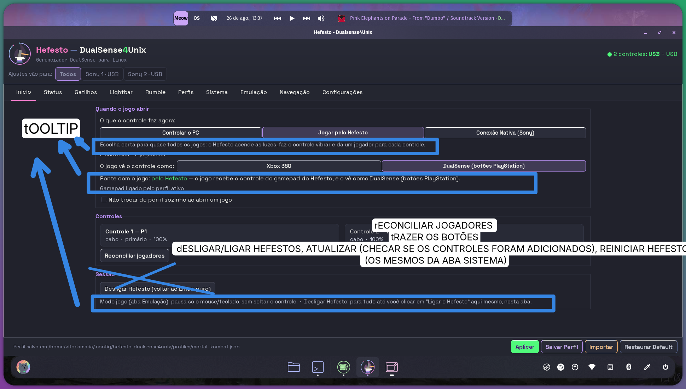

| # | O que ela escreveu | O que significa | Onde vive hoje | Tam. |
|---|---|---|---|---|
| **INICIO-1** **SAI** | "tOOLTIP" | O parágrafo "Escolha certa para quase todos os jogos…" sai da tela e vira tooltip do botão de modo. | `home_actions.py:169-198` (`_MODE_DESCRIPTIONS`), `:2038` (o rótulo); `segmented_selector.py:97` já tem `set_tooltips` | pequena |
| **INICIO-2** **SAI** ? | "tOOLTIP" | A caixa cobre **duas** linhas: "Ponte com o jogo: pelo Hefesto…" e "Gamepad ligado pelo perfil ativo". As duas saem. | `home_actions.py:1121-1247` (`texto_da_ponte`), `:2124`, `:2178` | pequena |
| **INICIO-3** **SAI** | "tOOLTIP" | O rodapé da Sessão ("Modo jogo (aba Emulação): pausa só o mouse/teclado… · Desligar Hefesto: para tudo…") sai. | `home_actions.py:242-252` (`_GLOSSARY`), `:2294` | pequena |
| **INICIO-4** **SAI** | *(X riscando o frame "Sessão" e "Desligar Hefesto")* | O frame **Sessão inteiro** sai da Início; o ligar/desligar chega pelos botões da Sistema. | `home_actions.py:2269-2301`, `:3170-3230` | pequena |
| **INICIO-5** | "dESLIGAR/LIGAR HEFESTOS, ATUALIZAR…, REINICIAR HEFESTO (OS MESMOS DA ABA SISTEMA)" | Trazer para a Início a **mesma** fileira da Sistema — os mesmos gestos, não cópias novas. | `main.glade:2764-2811`; `daemon_actions.py:2201/2207/2240/2250` | média |
| **INICIO-6** ? | "rECONCILIAR JOGADORES tRAZER OS BOTÕES" | Junto do "Reconciliar jogadores", trazer os botões do Sistema. O X **não** cai sobre ele (ampliado, cai sobre o frame Sessão). | `home_actions.py:2239-2265`, `:3112-3169` | pequena |
| **INICIO-7** | "ATUALIZAR (CHECAR SE OS CONTROLES FORAM ADICIONADOS)" | O "Atualizar" tem de reler os **controles desta aba** — "plugei mais um, cadê?". | `daemon_actions.py:2240-2249` (hoje não toca nada da Início) | pequena |

**Quem executar precisa saber:**
- Trocar o botão da Início pelo `daemon_stop_button` da Sistema **some com o diálogo de confirmação**: `_on_home_shutdown_clicked` pergunta "Desligar o Hefesto?" antes de agir; `on_daemon_stop` desliga no clique. E os dois armam `_user_stopped_daemon` em momentos diferentes.
- `_sync_restart_daemon_button_sensitivity` acha o botão de reiniciar **por id**. Um segundo botão na Início nasce sempre sensível, mesmo sem unit systemd — cinza numa aba, clicável na outra, para o mesmo gesto.

**Decisões pendentes:** D3 (linha da ponte), D17 (Reconciliar).

---

### 3.2 Status

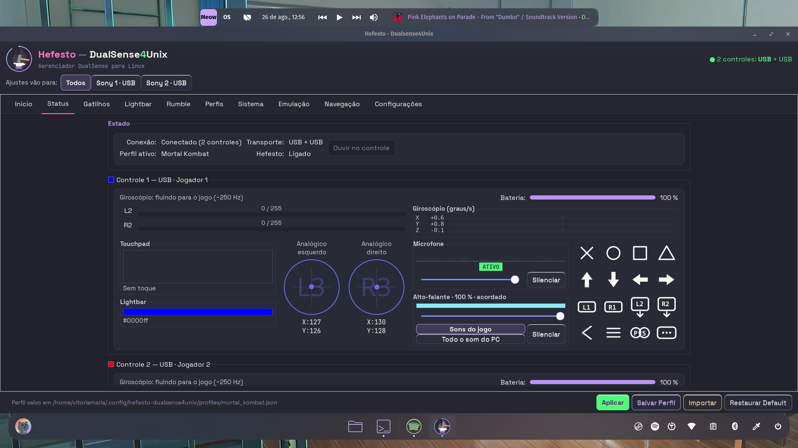
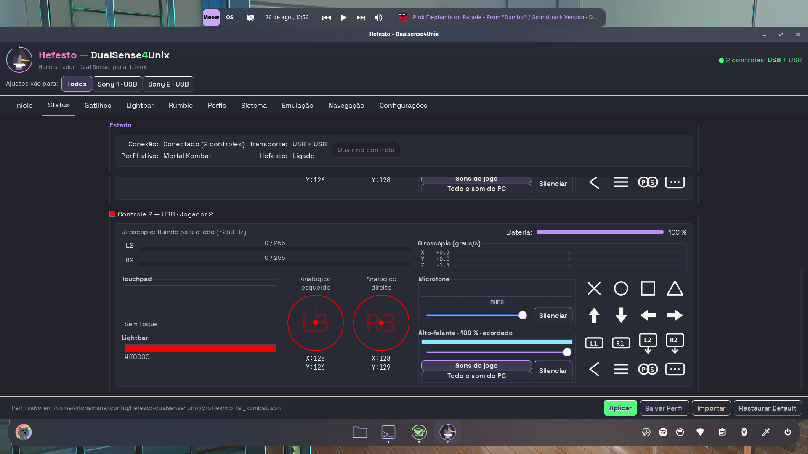

> **As duas fotos não têm uma única anotação.** Conferido a olho na resolução cheia e em recortes a 200%: sem seta, sem caixa, sem rabisco. O único vermelho da imagem 02 é a lightbar `#ff0000` e os círculos L3/R3 — pintura do próprio produto. **As fotos são a PROVA do estado; o pedido veio no texto por fora.** O que elas provam: 2 controles no cabo, perfil "Mortal Kombat", Controle 1 com mic ATIVO e alto-falante 100% em "Sons do jogo"; Controle 2 com mic MUDO e o mesmo alto-falante.

| # | O que ela escreveu | O que significa | Onde vive hoje | Tam. |
|---|---|---|---|---|
| **STATUS-1** | "Por default, áudio do microfone ativado e no máximo. Áudio do alto-falante dos sons do jogo ativado e no máximo." | Todo perfil nasce com mic ativo no máximo e alto-falante no máximo em "Sons do jogo", sem ela configurar nada. | `profiles/schema.py:982` e `:990` (o default **é** a ausência de opinião); `manager.py:923-1000` | grande |
| **STATUS-2** | "se eu for na aba status, alterar o meu controle pra colocar o som silenciado ou todo o som do pc ativo. Isso deveria ser respeitado." | O gesto dela vira estado do perfil ativo e sobrevive a trocar de perfil e a reconectar. | `controller_card.py:3398-3431`; `manager.py:958-966` (MIC-GRAVACAO-01); `daemon/connection.py:403-412` | grande |
| **STATUS-3** ? | "alterar o **meu** controle" | Decidir se "o meu controle" é a peça do card ou o que a fita aponta. | `draft_config.py:1715-1766`; `app/alvo_de_edicao.py` | média |
| **STATUS-4** **SAI** | "o botão ouvir no controle não deveria existir, afinal ele nem funciona pra ser clicado e não faz sentido já que temos a área do microfone e do alto-falante." | Tirar "Ouvir no controle" do cartão Estado. | `main.glade:537-576` (nasce `sensitive=False`); `status_actions.py:483-485`, `:1018-1048`, `:1419-1470`; `audio_saida.py:717-760`; `po/*.po` | média |
| **STATUS-5** ? | "Talvez no local de 'ouvir no controle' poderíamos colocar dois botões pra ativar giroscópio e acelerômetro e calibrar Sensores… obviamente tudo ativo por default em todos os perfis até que eu mude." | No vão que o botão deixa entram controles de sensor: ligar/desligar giro, ligar/desligar accel, e "Calibrar sensores". Tudo nasce ativo. | **Não existe.** Nenhum dos 40 métodos do IPC é `gyro.*`/`accel.*`/`sensor.*`; o `Profile` não tem campo de sensor; `controller_card.py:3066-3093` é leitura pura | grande |

**Quem executar precisa saber:**
- **Ela tem razão sobre o botão:** não é bug de fiação — o handler existe e está conectado. `status_actions.py:1018-1048` devolve alvo vazio assim que há dois sinks distintos, e `audio_saida.py` traduz alvo vazio em insensível. É a regra "com dois controles a janela não escolhe por ela".
- **O mudo do mic não sobrevive a reconectar o controle.** `MIC-GRAVACAO-01` só deixa `muted` passar em `origin="manual"`; reconexão e boot vão com `origin="system"`. O alto-falante tem gancho de reconexão próprio (`manager.py:1020-1049`); **o microfone não tem nenhum.** O "MUDO" da foto 02 morre no próximo replug.
- **O acelerômetro não existe do lado dela** em ponto nenhum: nem tela, nem perfil, nem IPC. Só como bytes 21-26 do report físico.
- **Não existe calibração de sensores.** O único `calibrar` do produto é `calibrar_entradas.py`, sobre entradas USB do gabinete. O que ela pediu é código novo do zero, incluindo decidir para onde a correção vai.

**Decisões pendentes:** D1, D9.

---

### 3.3 No jogo

**Sem desenho.** Nenhuma das doze fotos é desta aba. Nada a fazer nesta leva.

---

### 3.4 Gatilhos

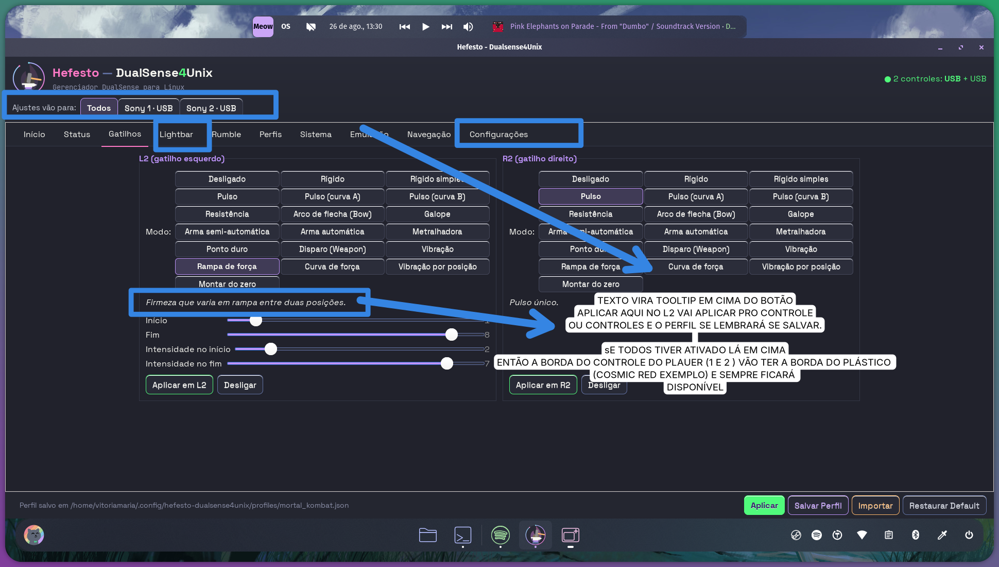
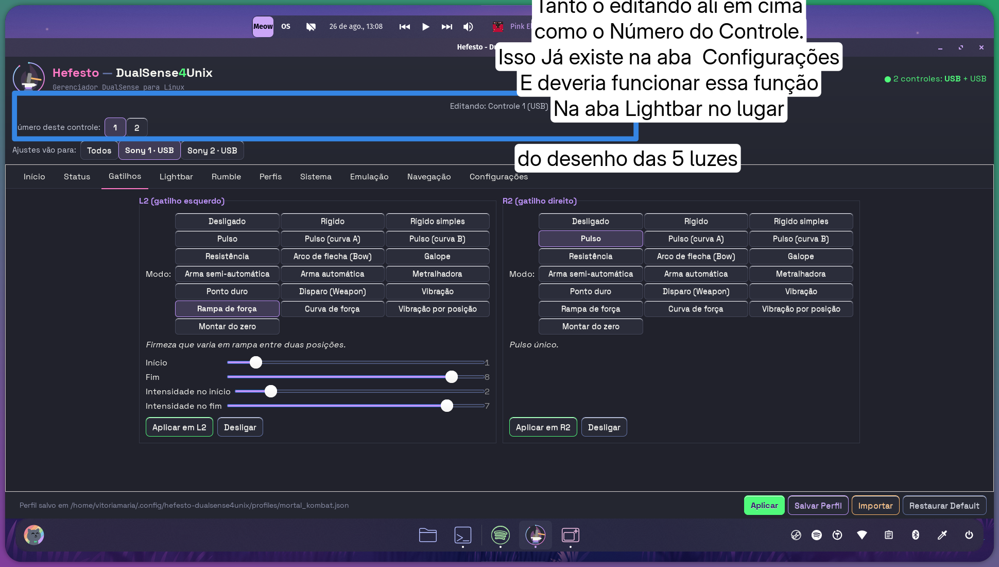

*(A imagem 06 é uma foto da aba Gatilhos, mas a anotação dela fala da Lightbar — aparece nas duas seções.)*

| # | O que ela escreveu | O que significa | Onde vive hoje | Tam. |
|---|---|---|---|---|
| **GATILHOS-1** **SAI** | "TEXTO VIRA TOOLTIP EM CIMA DO BOTÃO" | A frase de descrição do modo ("Firmeza que varia em rampa entre duas posições.") sai da tela. | `main.glade:873-880` e `:1033-1040`; `triggers_actions.py:524` | pequena |
| **GATILHOS-2** **FEITO** | "APLICAR AQUI NO L2 VAI APLICAR PRO CONTROLE OU CONTROLES E O PERFIL SE LEMBRARÁ SE SALVAR." | O "Aplicar em L2" obedece à fita e o valor fica no perfil ao salvar. | **Já feito:** `triggers_actions.py:580-621` e `:342-391`; `alvo_de_edicao.py` | ja-feito |
| **GATILHOS-3** ? | "sE TODOS TIVER ATIVADO LÁ EM CIMA ENTÃO A BORDA DO CONTROLE DO PLAUER (1 E 2) VÃO TER A BORDA DO PLÁSTICO (COSMIC RED EXEMPLO) E SEMPRE FICARÁ DISPONÍVEL" | Os chips "Sony 1"/"Sony 2" ganham borda na cor do plástico real, e continuam clicáveis. | `status_actions.py:1755-1780`; `cor_do_plastico.py:240` (`tom_para_a_borda`); o precedente já pinta borda em `secao_controles.py:916-953` | média |
| **GATILHOS-4** ? | *(caixas azuis em volta das abas "Lightbar" e "Configurações", sem texto)* | Não dá para dizer. Não há anotação escrita ligada a estas duas caixas. | `main.glade:1132`, `:1176` | pequena |

**Quem executar precisa saber:**
- **O item mais barato das duas abas é o GATILHOS-1:** a dica já é montada do `PRESETS` desde 25/08. O rótulo visível é duplicação — tirá-lo não perde uma palavra. Só ajustar a régua T8 junto.

**Decisões pendentes:** D14, D15.

---

### 3.5 Lightbar

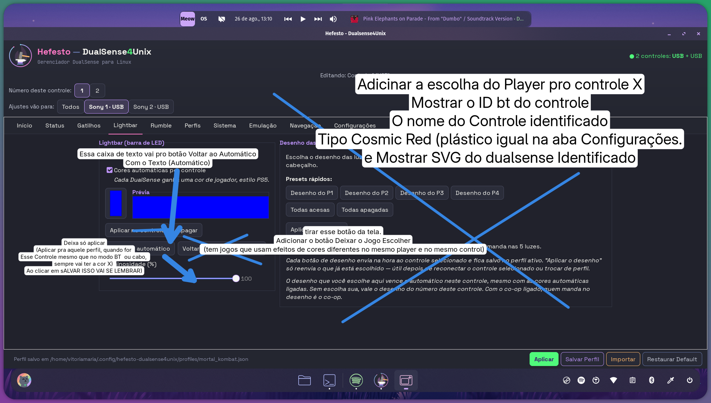

**É a aba mais redesenhada das oito.** Doze itens; um X gigante cobre o painel inteiro das cinco luzes.

| # | O que ela escreveu | O que significa | Onde vive hoje | Tam. |
|---|---|---|---|---|
| **LIGHTBAR-1** **SAI** | *(X gigante sobre "Desenho das 5 luzes")* | A moldura inteira sai: legenda, cinco checkboxes, seis presets, "Aplicar o desenho", estado e dois parágrafos. O desenho passa a ser só automático. | `main.glade:1398-1683` (**285 linhas**); `lightbar_actions.py:265-375`, `:1229-1575` (**~400 linhas**); 11 arquivos de teste | grande |
| **LIGHTBAR-2** | "Adicionar a escolha do Player pro controle X" | No lugar do painel entra o seletor de número do jogador — o mesmo gesto da Configurações, o mesmo `identity.number.set`. | `status_actions.py:1900-2055`; `external_card.py:503-511`; `ipc_bridge.py:712-733` | média |
| **LIGHTBAR-3** ? | "Mostrar o ID bt do controle" | A aba exibe o MAC do controle editado. Hoje é só **dica sob o cursor**, por decisão de 13/08 (endereço é diagnóstico, não vocabulário). Mostrá-lo reverte essa escolha — e ela é dona dela. | `controller_card.py:1063-1105` (QUEM-É-QUEM-01); `lightbar_actions.py:402-414` (já tem o uniq em mãos) | pequena |
| **LIGHTBAR-4** ? | "O nome do Controle identificado" | Mostrar o nome ao lado do ID e da cor. Três leituras possíveis, e a diferença muda o tamanho. | `external_controllers.py:693-705` (`marca_e_via` → "Sony · cabo"); `backend_pydualsense.py:68` (`is_edge` — `grep` devolve **zero** fora do backend) | média |
| **LIGHTBAR-5** | "Tipo Cosmic Red (plástico igual na aba Configurações." | Mostrar o nome da cor do plástico, lida do aparelho, como a Configurações faz. | `cor_do_plastico.py:95-142`, `:521+`; `secao_controles.py:915-955` (cache privado, só USB, não persiste) | média |
| **LIGHTBAR-6** | "e Mostrar SVG do dualsense Identificado" | Desenhar o DualSense colorido conforme o plástico. | `assets/control-svg/dualsense.svg` (32 ids, 5 colorways); **`grep -rn 'control-svg' src/` = zero** | média |
| **LIGHTBAR-7** **SAI** ? | "Essa caixa de texto vai pro botão Voltar ao Automático Com o Texto (Automático)" | A legenda "Cada DualSense ganha uma cor de jogador, estilo PS5." vira a dica do botão, que passa a se chamar "(Automático)". | `main.glade:1201-1222`, `:1340-1350`; `lightbar_actions.py:1141-1172` | pequena |
| **LIGHTBAR-8** **SAI** | "Deixa só aplicar (Aplicar pra aquele perfil, quando for Esse Controle mesmo que no modo BT ou cabo, sempre vai ter a cor X) Ao clicar em sALVAR ISSO VAI SE LEMBRAR)" | O botão "Apagar" sai. **A semântica entre parênteses já é o que o produto faz** — o perfil guarda overrides por MAC, e o MAC é o mesmo nos dois transportes. | `main.glade:1312-1324`; `lightbar_actions.py:1023-1105`; já feito em `schema.py:1008` e `backend_pydualsense.py:1377` | pequena |
| **LIGHTBAR-9** **SAI** | "tirar esse botão da tela." | O X cobre "Voltar todos ao automático" (confirmado no recorte: é o **segundo** botão). | `main.glade:1351-1363`; `lightbar_actions.py:1175-1197` | pequena |
| **LIGHTBAR-10** | "Adicionar o botão Deixar o Jogo Escolher (tem jogos que usam efeitos de cores diferentes no mesmo player e no mesmo control)" | O Hefesto não tem opinião sobre a barra daquele controle: nem cor, nem paleta, nem repintura por evento. **Não existe em camada nenhuma.** | `schema.py:277-296` (`lightbar` é tupla obrigatória com default `(0,0,0)` = "apagada", não "sem opinião"); `connection.py:831-895` (GATILHO-DA-COR-01, escolha dela de 12/08 — este botão é o **desligamento por controle** dela, não a derrubada) | grande |
| **LIGHTBAR-11** ? | "Tanto o editando ali em cima como o Número do Controle. Isso Já existe na aba Configurações E deveria funcionar essa função Na aba Lightbar no lugar do desenho das 5 luzes" | Mesma entrega do LIGHTBAR-2, vista do outro lado. O que não está dito é se a faixa do cabeçalho some. | `status_actions.py:2061-2075`, `:1900-2055` (o cabeçalho vale para as **onze** abas) | média |
| **LIGHTBAR-12** ? | *(seta grossa sem caixa de texto, apontando para a barra de "Luminosidade (%)")* | Não dá para dizer. É a única seta do desenho sem legenda. Não vou inventar a intenção. | `main.glade:1367-1394`; `lightbar_actions.py:995-1021` | pequena |

**Quem executar precisa saber:**
- **Tirando o checkbox e o "Voltar todos" juntos, não sobra caminho para religar a paleta.** Ver D5 — o conserto é barato e cabe no mesmo item.
- **A frase do "Voltar ao automático" aponta para um widget que vai sumir:** o toast manda "ligue *Cores automáticas por controle*". Mandar clicar num checkbox que saiu da tela é a forma de defeito que a casa já catalogou. Sai junto, ou vira outra frase.
- Quatro dicas do painel riscado (`main.glade:1404`, `:1520`, `:1527`, `:1534`, `:1541`) apontam para o cabeçalho — **saem com ele**.
- O campo `player_leds` do perfil **não precisa morrer** para o painel sair da tela: ele continua sendo a camada do co-op.

**Decisões pendentes:** D5, D10, D11, D12, D13, D23.

---

### 3.6 Rumble

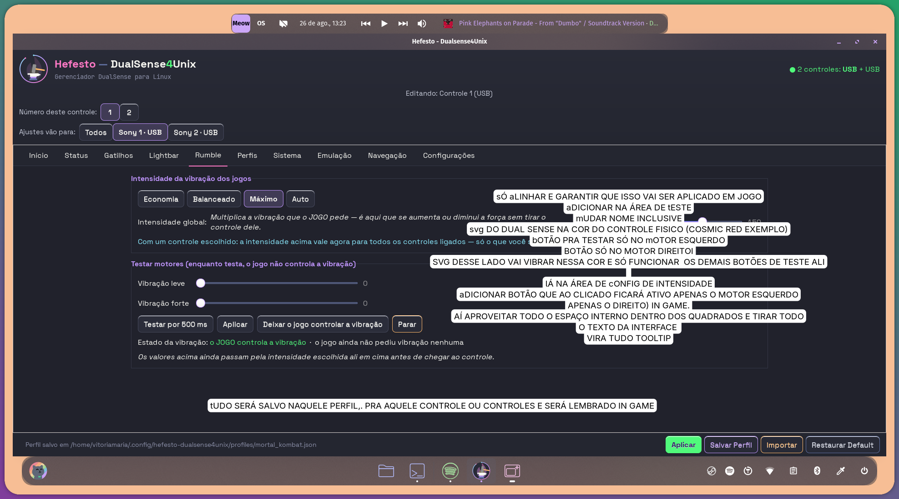

| # | O que ela escreveu | O que significa | Onde vive hoje | Tam. |
|---|---|---|---|---|
| **RUMBLE-1** ? | "sÓ aLINHAR E GARANTIR QUE ISSO VAI SER APLICADO EM JOGO" | Alinhar a linha da intensidade global e garantir que a escolha chega à vibração do jogo. | `main.glade:1789-1856`; `rumble_actions.py:291-368`; `core/rumble.py:373-403` | pequena |
| **RUMBLE-2** ? | "aDICIONAR NA ÁREA DE tESTE" | Acrescentar algo no card "Testar motores". Não está dito o quê nesta caixa. | `main.glade:1932-2095` | pequena |
| **RUMBLE-3** ? | "mUDAR NOME INCLUSIVE" | Trocar um nome. A caixa não diz qual. | `main.glade:1935`, `:1721`, `:1949`, `:2103` | pequena |
| **RUMBLE-4** | "svg DO DUAL SENSE NA COR DO CONTROLE FISICO (COSMIC RED EXEMPLO)" | O DualSense desenhado dentro do card de teste, na cor do plástico real. | `dualsense.svg:53-65` (o `<style>` **já tem** `svg[data-colorway="cosmic-red"] .corpo { fill: #b11f54 }`); `button_glyph.py:113-118` (o precedente de tingir SVG) | média |
| **RUMBLE-5** | "bOTÃO PRA TESTAR SÓ NO mOTOR ESQUERDO / BOTÃO SÓ NO MOTOR DIREITOI" | Dois botões: vibrar só o esquerdo, só o direito. | `rumble_actions.py:1008-1027` (hoje um botão só); `core/rumble.py:293-296` (**os dois motores já são independentes até o fio**) | pequena |
| **RUMBLE-6** ? | "SVG DESSE LADO VAI VIBRAR NESSA COR E SÓ FUNCIONAR OS DEMAIS BOTÕES DE TESTE ALI" | O lado correspondente do desenho se anima/acende quando o motor é testado. | `dualsense.svg:203-212` (`feat-rumble-esquerdo`/`-direito` **já existem**, com `.oculta`/`.acesa` prontos) | média |
| **RUMBLE-7** | "lÁ NA ÁREA DE cONFIG DE iNTENSIDADE aDICIONAR BOTÃO QUE AO CLICADO FICARÁ ATIVO APENAS O MOTOR ESQUERDO APENAS O DIREITO) IN GAME." | Estado fixo, não teste: só um motor ativo durante o jogo. | **Não existe em ponto nenhum da pilha** — ver defeito abaixo | grande |
| **RUMBLE-8** **SAI** ? | "AÍ APROVEITAR TODO O ESPAÇO INTERNO DENTRO DOS QUADRADOS E TIRAR TODO O TEXTO DA INTERFACE VIRA TUDO TOOLTIP" | Os dois quadrados usam o espaço inteiro; **sete** textos de apoio saem. | `main.glade:1801`, `:1861-1891`, `:1916-1924`, `:2075-2081`, `:2085-2091`; `rumble_actions.py:482-511`, `:553-600`. **As dicas já existem** nos widgets | média |
| **RUMBLE-9** | "tUDO SERÁ SALVO NAQUELE PERFIL, PRA AQUELE CONTROLE OU CONTROLES E SERÁ LEMBRADO IN GAME" | Intensidade, valores de teste e escolha de motor ficam no perfil, por controle, e voltam no jogo. | **Metade feita:** `rumble_actions.py:890-953` (a intensidade já grava por controle). **Não feita:** `draft_config.py:105-128` | grande |

**Quem executar precisa saber:**
- **Não existe granularidade por motor em ponto nenhum.** A escala por peça é **um float** que multiplica weak e strong juntos (`backend_pydualsense.py:3736-3782`, `Mapping[uniq, float]`). Por isso o RUMBLE-7 é grande e não um botão: o par precisa nascer no esquema, atravessar o applier e virar par no backend.
- O `hexpand=True` da barra está lá **de propósito** (LARGURA-01/E1, `main.glade:1810-1841`): ele existe para a coluna do grid seguir expandindo. Quem "só alinhar" precisa saber disso antes de arrancá-lo.
- O código já confessa por escrito o buraco: *"o `rumble.policy_set` que sai logo depois deste registro é GLOBAL — não há IPC de política por unidade"* (`rumble_actions.py:908-918`).

**Decisões pendentes:** D1, D3, D16.

---

### 3.7 Perfis

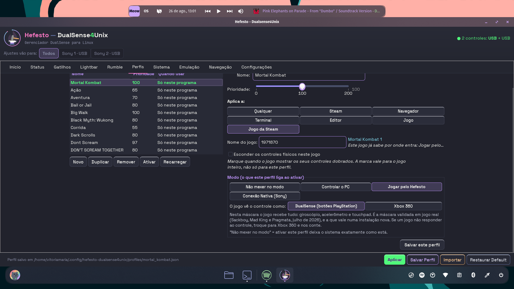
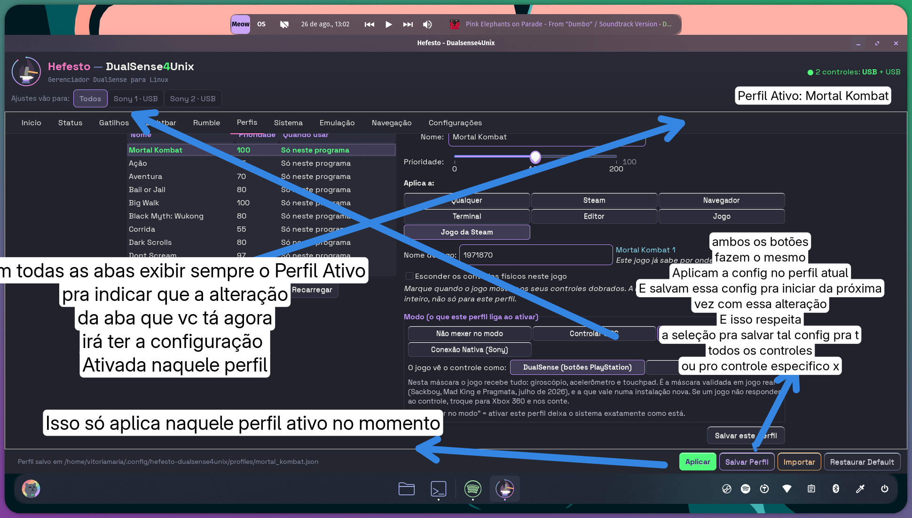
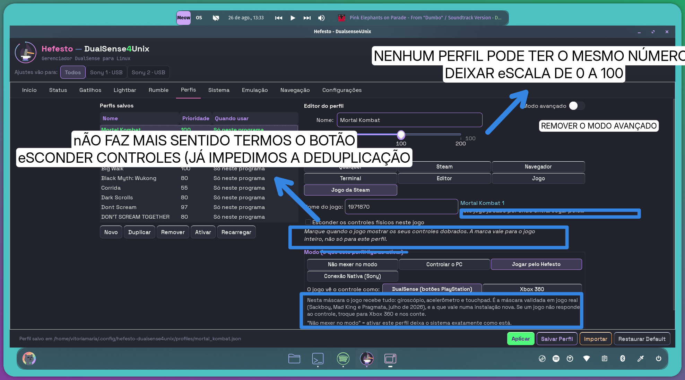

| # | O que ela escreveu | O que significa | Onde vive hoje | Tam. |
|---|---|---|---|---|
| **PERFIS-1** | "[em] todas as abas exibir sempre o Perfil Ativo pra indicar que a alteração da aba que vc tá agora irá ter a configuração Ativada naquele perfil" | O nome do perfil ativo num lugar fixo do cabeçalho, visível nas onze abas. | `main.glade:142` (`header_bar`, já hospeda a fita); hoje só dois lugares publicam: `main.glade:468-478` (dentro do frame Estado) e a linha verde da lista | pequena |
| **PERFIS-2** | "ambos os botões fazem o mesmo. Aplicam a config no perfil atual E salvam essa config pra iniciar da próxima vez… E isso respeita a seleção pra salvar tal config pra todos os controles ou pro controle especifico x" | "Aplicar" e "Salvar Perfil" viram um gesto só, honrando a fita. | `footer_actions.py:223` (aplica, **não grava**), `:835` (grava, mas **pede nome num diálogo**); `profile_writer.py` (o funil por onde tudo passa) | média |
| **PERFIS-3** ? | "Isso só aplica naquele perfil ativo no momento" | Grava no perfil ativo agora, sem diálogo pedindo nome. | `footer_actions.py:880-915` — a docstring diz, com medição, que **as duas respostas divergem** (`_active_profile_name` vs. `draft.source_name`) | pequena |
| **PERFIS-4** | "NENHUM PERFIL PODE TER O MESMO NÚMERO / DEIXAR eSCALA DE 0 A 100" | Escala 0–100, e empate **impedido**, não avisado. | `schema.py:938-939` (`PRIORIDADE_MAXIMA = 200`); `main.glade:71-76`, `:2342-2346`; `loader.py:580` (a fábrica de empates); `sanidade.py:258-310` (hoje só aviso) | grande |
| **PERFIS-5** **SAI** ? | "REMOVER O MODO AVANÇADO" | Tirar o toggle do editor. | `main.glade:2274-2292`, `:2357-2637` (o `GtkStack` com as duas páginas); `profiles_actions.py:2004-2046`, `:3995-4034`, `:4284`; `simple_match.py:251-301` | grande |
| **PERFIS-6** **SAI** | "nÃO FAZ MAIS SENTIDO TERMOS O BOTÃO eSCONDER CONTROLES (JÁ IMPEDIMOS A DEDUPLICAÇÃO" | A caixinha "Esconder os controles físicos neste jogo" e o texto saem. | `main.glade:2462-2530`; `profiles_actions.py:1020`, `:2172-2810`; `steam_launch_options.py:1349`, `:1409` | média |
| **PERFIS-7** **SAI** | *(caixa azul)* "Este jogo já sabe por onde entra: Jogar pelo perfil…" | O carimbo da ponte sai da linha visível e fica só no tooltip. | `profiles_actions.py:981-1018`, `:2655-2692`. **Meio caminho andado:** `:2679-2690` já põe o mesmo texto no tooltip | pequena |
| **PERFIS-8** **SAI** | *(caixa azul)* "Marque quando o jogo mostrar os seus controles dobrados…" | O parágrafo em itálico vira tooltip. | `main.glade:2481-2491`. **Já existe tooltip** com a versão longa em `:2469` | pequena |
| **PERFIS-9** **SAI** | *(caixa azul)* "Nesta máscara o jogo recebe tudo…" + "Não mexer no modo" = … | Os dois parágrafos das máscaras viram tooltip dos botões. | `profiles_actions.py:235-250`, `:1545-1571`; `main.glade:2640-2656` | pequena |
| **PERFIS-10** **SAI** ? | *(traço riscando)* Modo ~~(o que este perfil liga ao ativar)~~ | O título perde o parêntese. É **risco**, não caixa. | `main.glade:2641` | pequena |

**Quem executar precisa saber:**
- **O portão do teto não alcança o que a tela mostra.** `test_teto_da_prioridade_tem_uma_fonte_so.py` trava três cópias do teto mas **não** olha as marcas `<mark value="200">` nem o tooltip "(0-200)". Trocar para 100 deixa esses dois textos mentindo com o portão verde. E o próprio teste crava `assert schema.PRIORIDADE_MAXIMA == 200` — **ele reprova a melhora em vez do defeito.**
- **A instalação nova já nasce violando a regra:** em `assets/profiles_default/`, `corrida` e `esportes` shipam ambos em 55; `fps` e `point_and_click`, ambos em 60. No disco dela esses quatro estão em 55/57/60/66 — **ela renumerou à mão**, que é a prova de uso de que o empate incomoda.
- **Medido no disco dela:** 22 dos 29 perfis estão empatados (15 em 80, quatro em 97, três em 100). E **`Duskfade` está em 102**, acima da escala pedida — o clamp da janela o puxaria para 100, onde já há três. A migração precisa decidir o destino dele; o clamp não pode decidir.
- **A justificativa escrita no doctor caducou:** `sanidade.py:258` ainda chama o empate de sorteio ("quem vence depende da ordem de leitura do diretório"), e desde 27/07 o incumbente vence. O pedido dela é legítimo como simplificação, mas o fato velho sai junto.
- **`PERFIS-6` decide a D-D da sprint ESCONDE-SO-O-HIDRAW-01** — e `PERFIS-8` sai **junto** com ele. Fazer os dois separados paga duas vezes o mesmo preço.
- A preferência `"advanced_editor": true` do `gui_preferences.json` dela e a tela **divergem agora**, de propósito (`_populate_editor` força `False` sob supressão e não persiste). Se o Modo avançado sair, essa chave fica órfã no arquivo dela.

**Decisões pendentes:** D2, D7, D8, D22.

---

### 3.8 Sistema

**Sem desenho.** Mas a aba **cede seus quatro botões** à Início (`INICIO-5`), e é onde vive o cartão "Saúde do sistema" que recebe o Steam Input quando a linha da Emulação sair (`EMU-6`). Ver os defeitos listados em 3.1 e 3.9.

---

### 3.9 Emulação

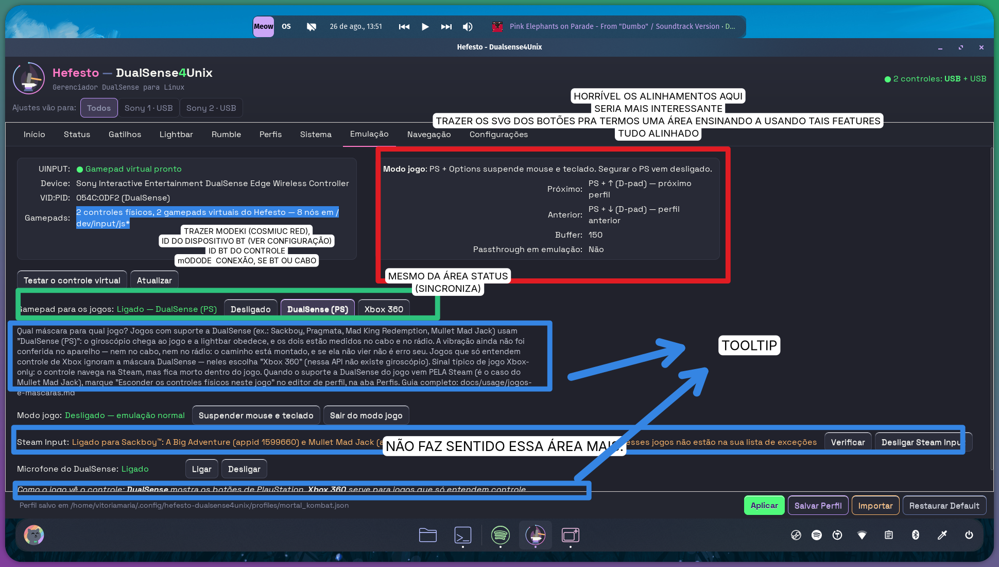

| # | O que ela escreveu | O que significa | Onde vive hoje | Tam. |
|---|---|---|---|---|
| **EMU-1** | "HORRÍVEL OS ALINHAMENTOS AQUI… TUDO ALINHADO" | As quatro fileiras "rótulo : status : botões" alinham em colunas. Hoje cada uma é uma `GtkBox` independente, sem `GtkSizeGroup`. | `main.glade:3380`, `:3465`, `:3543`, `:3586`. Medido no PNG: os botões começam em **x≈321, 259, 331 e 351** | média |
| **EMU-2** ? | "SERIA MAIS INTERESSANTE TRAZER OS SVG DOS BOTÕES PRA TERMOS UMA ÁREA ENSINANDO A USANDO TAIS FEATURES" | Área nova que ensina os combos desenhando os botões, em vez de descrevê-los. | `gui/widgets/button_glyph.py` (**widget pronto**, com tint e cache); `assets/glyphs/` (ps, options, dpad_up/down + pares `_active`, todos existem) | grande |
| **EMU-3** ? | "TRAZER MODEKI (COSMIUC RED), ID DO DISPOSITIVO BT (VER CONFIGURAÇÃO) ID BT DO CONTROLE mODODE CONEXÃO, SE BT OU CABO" | O cartão de diagnóstico ganha quatro linhas: cor do plástico, ID do adaptador, ID do controle, e por onde ele está conectado. | `main.glade:3147-3207`; `cor_do_plastico.py:99`; `hidraw_broker.py:213-217` (`HID_UNIQ`=controle, `HID_PHYS`=adaptador, sem sudo); `home_actions.py:1338` (`palavra_do_transporte`) | média |
| **EMU-4** ? | "MESMO DA ÁREA STATUS (SINCRONIZA)" | Essa área e a Status mostram a mesma coisa, da mesma fonte. | `main.glade:3211-3323` vs. `:330-500`; `emulation_actions.py:960-989` | média |
| **EMU-5** **SAI** | "TOOLTIP" *(duas setas)* | O "Qual máscara para qual jogo?…" (nove linhas) e o "Como o jogo vê o controle:…" saem. | `main.glade:3438-3464`, `:3629-3652`. **Os dois botões já têm tooltip** que repete quase tudo (`:3418-3430`) | pequena |
| **EMU-6** **SAI** | "NÃO FAZ SENTIDO ESSA ÁREA MAIS." | A linha "Steam Input: … [Verificar] [Desligar Steam Input]" sai. | `main.glade:3543-3585`; `emulation_actions.py:328-469` e `:1764-2065`; 7 arquivos de teste | grande |

**Quem executar precisa saber:**
- **`EMU-6` já era decisão dela, e a linha ficou lá.** D-VIGIA-DO-STEAM-INPUT (15/08, colhida 25/08): *"o guarda morto entra como achado do cartão 'Saúde do sistema'… em vez de uma linha permanente dizendo 'tudo bem' 99% do tempo"*. A segunda metade da razão é ESCONDER-EM-VEZ-DE-SAIR-01 (09/08): o Steam Input deixou de ser conflito global e virou ajuste por jogo. **O botão global "Desligar Steam Input" é sobra do mecanismo antigo.**
- **A tela afirma um gesto que pode estar desligado:** "Próximo: PS + ↑" e "Anterior: PS + ↓" são strings fixas escritas uma vez (`emulation_actions.py:899-903`), mas os combos são configuráveis e "tupla vazia desliga o combo". É o BUG-EMULATION-HOTKEY-CARD-FIXO-01, já curado para o buffer e o passthrough **no mesmo grid**, e de pé nestas duas linhas.
- **Há um terceiro combo que o quadro nunca menciona:** `next_bridge` (a ponte), em `hotkey_daemon.py:158`. O cartão que se propõe a ensinar os combos ensina dois de três.
- O cartão **pisca dado errado no boot**: `emulation_vidpid_label` nasce com a constante do Xbox 360 antes do primeiro refresh, mesmo com máscara DualSense viva.

**Decisões pendentes:** D11, D18, D19.

---

### 3.10 Navegação

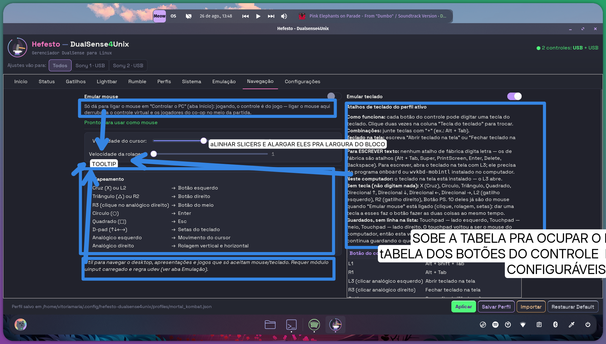

| # | O que ela escreveu | O que significa | Onde vive hoje | Tam. |
|---|---|---|---|---|
| **NAVEG-1** | "aLINHAR SLICERS E ALARGAR ELES PRA LARGURA DO BLOCO" | As duas barras começam e terminam no mesmo x, e esticam até a largura do cartão em vez de parar em 400px. | `main.glade:3776`, `:3788-3802`, `:3813-3827` | pequena |
| **NAVEG-2** **SAI** ? | "TOOLTIP" | O parágrafo "Só dá para ligar o mouse em 'Controlar o PC' (aba Início)…" sai. | `main.glade:3751-3759`; `mouse_actions.py:33-37` e `:50-60` (**duas** frases pintam o mesmo rótulo) | pequena |
| **NAVEG-3** **SAI** ? | "TOOLTIP" | A tabela "Mapeamento" inteira (8 linhas) sai. | `main.glade:3840-3975` (**136 linhas**); `uinput_mouse.py:93-115` (a fonte real) | pequena |
| **NAVEG-4** **SAI** | "TOOLTIP" | "Útil para navegar o desktop… Requer módulo uinput carregado e regra udev." sai. | `main.glade:3976-3995` | pequena |
| **NAVEG-5** **SAI** ? | "TOOLTIP" | O bloco de sete parágrafos sob "Atalhos de teclado do perfil ativo" sai. | `main.glade:4066-4073`; `input_actions.py:55-67`, `:249`, `:289-293`, `:333`, `:430-449` | média |
| **NAVEG-6** | "SOBE A TABELA PRA OCUPAR O E[cortado]" | Com os textos fora, a tabela sobe e ocupa o vão, em vez de nascer no pé e sumir atrás do rodapé. | `main.glade:4074-4104` (o `expand=False` da cura VÃO-01 é o que hoje impede a lista de crescer) | pequena |
| **NAVEG-7** ? | "tABELA DOS BOTÕES DO CONTROLE [cortado] CONFIGURÁVEIS" | A tabela de botões tem de ser configurável. | `input_actions.py:363-391` (**só** a coluna "Tecla" é editável), `:481-503` (o "Adicionar" escolhe o botão sozinho) | média |

**Quem executar precisa saber:**
- **O portão de altura é cego a esta aba** — e é por isso que a foto dela mostra a tabela sumindo atrás do rodapé com todos os portões verdes. Teto por aba: **654px** (escala padrão) / **644px** (escala 6 dela). O `test_layout_orcamento_altura.py` mede a Navegação em **553px** e aprova — mas ele mede o **glade**, e o glade traz um texto-fantasma que o produto nunca mostra. Com o texto que sai na tela, a aba pede **908px** (padrão) e **1074px** na escala dela — 254px e **430px acima do teto**. A régua confunde o arquivo com o produto.
- **O texto do glade em `key_bindings_legend` é letra morta:** "Formato: KEY_* …" é apagado por `set_markup` toda vez que a aba monta. Quem lê o glade — pessoa ou portão — acredita nele. É o defeito anterior na origem, e sai junto com a correção.
- **Os dois slicers desalinham por construção.** Os dois têm 400px, mas a calha de um mede 358px e a do outro 367px. A causa é `draw-value=True` + `value-pos=right`: o GTK reserva a largura pelo **maior valor da faixa** — "12" no cursor contra "5" na rolagem. Enquanto o número morar dentro da barra, alinhar é impossível; o conserto é o número virar coluna própria do grid.
- Medido: tirar a tabela "Mapeamento" devolve **277px** (padrão) / **314px** (escala dela); o bloco de sete parágrafos ocupa **418px / 624px** — é ele o principal culpado.

**Decisões pendentes:** D3, D4, D20, D21.

---

### 3.11 Configurações

**Sem desenho** — mas é citada em três anotações como **a referência do que já funciona**: a cor do plástico (`LIGHTBAR-5`, `GATILHOS-3`, `RUMBLE-4`), o seletor de jogador por card (`LIGHTBAR-2`, `LIGHTBAR-11`) e o ID do adaptador (`EMU-3`). É de lá que a identidade do controle tem de sair para o resto do produto (P5). Foi também uma das duas abas que ela circulou de azul sem escrever nada — **D15**.

---

## 4. O que SAI da tela

Ela pediu simplificação. Esta é a entrega mais direta desse pedido: **23 blocos saem** — 20 marcados sem ambiguidade, 3 dependentes de decisão.

| O que sai | Aba | Onde vive | O que fica no lugar |
|---|---|---|---|
| Botão "Ouvir no controle" | Status | `main.glade:537-576` + `status_actions.py:483-485`, `:1018-1048`, `:1419-1470` + 3 `.po` | O seletor "Sons do jogo / Todo o som do PC", que já está no card |
| Frame "Sessão" inteiro | Início | `home_actions.py:2269-2301`, `:3170-3230` | A fileira de botões da aba Sistema (`INICIO-5`) |
| Parágrafo "Escolha certa para quase todos os jogos…" | Início | `home_actions.py:169-198` | Tooltip do botão de modo |
| Linha da ponte + "Gamepad ligado pelo perfil ativo" **(D3)** | Início | `home_actions.py:1121-1247`, `:2178` | Tooltip, ou linha curta com o veredito colorido |
| Rodapé "Modo jogo (aba Emulação)… · Desligar Hefesto…" | Início | `home_actions.py:242-252` | Tooltip |
| Rótulos de descrição do modo (L2 e R2) | Gatilhos | `main.glade:873-880`, `:1033-1040` | **A dica já existe** desde 25/08 — zero palavras perdidas |
| Moldura "Desenho das 5 luzes" inteira | Lightbar | `main.glade:1398-1683` (**285 linhas**) + `lightbar_actions.py` (**~400 linhas**) | Seletor de número do jogador + SVG do DualSense |
| Botão "Apagar" | Lightbar | `main.glade:1312-1324` + `lightbar_actions.py:1023-1105` | Só "Aplicar no controle" |
| Botão "Voltar todos ao automático" | Lightbar | `main.glade:1351-1363` + `lightbar_actions.py:1175-1197` | — |
| Legenda "Cada DualSense ganha uma cor de jogador, estilo PS5." **(D5)** | Lightbar | `main.glade:1214-1222` | Dica do botão "(Automático)" |
| Sete textos de apoio do Rumble **(D3)** | Rumble | `main.glade:1801`, `:1861-1891`, `:1916-1924`, `:2085-2091` + `rumble_actions.py:482-511`, `:553-600` | Tooltips — **que já existem nos widgets** |
| Toggle "Modo avançado" **(D2)** | Perfis | `main.glade:2274-2292`, `:2357-2637` | A definir: campos sempre visíveis, ou nada |
| Caixinha "Esconder os controles físicos neste jogo" | Perfis | `main.glade:2462-2530` + `profiles_actions.py:2172-2810` | Nada — o produto já entrega o efeito em todo jogo |
| Parágrafo "Marque quando o jogo mostrar os seus controles dobrados…" | Perfis | `main.glade:2481-2491` | **Sai junto com o de cima** — não paguem duas vezes |
| Linha "Este jogo já sabe por onde entra:…" | Perfis | `profiles_actions.py:2655-2692` | Só o nome do jogo; o resto no tooltip que **já está lá** |
| Os dois parágrafos das máscaras | Perfis | `profiles_actions.py:1545-1571` | Tooltip dos botões de máscara |
| "(o que este perfil liga ao ativar)" **(D8)** | Perfis | `main.glade:2641` | Só "Modo" |
| Parágrafo "Qual máscara para qual jogo?" (9 linhas) | Emulação | `main.glade:3438-3464` | Os botões **já têm** tooltip que repete quase tudo |
| Parágrafo "Como o jogo vê o controle:…" | Emulação | `main.glade:3629-3652` | Tooltip |
| Linha "Steam Input" + [Verificar] + [Desligar Steam Input] | Emulação | `main.glade:3543-3585` + `emulation_actions.py:328-469`, `:1764-2065` | O cartão "Saúde do sistema" da Sistema, **por decisão dela de 15/08** |
| Parágrafo "Só dá para ligar o mouse em 'Controlar o PC'…" **(D4)** | Navegação | `main.glade:3751-3759` | Ícone "?" — tooltip no interruptor cinza **não aparece** |
| Tabela "Mapeamento" (8 linhas) **(D20)** | Navegação | `main.glade:3840-3975` (**136 linhas**) | Devolve **277px / 314px** de altura |
| Parágrafo "Útil para navegar o desktop…" | Navegação | `main.glade:3976-3995` | Tooltip |
| Bloco de sete parágrafos dos atalhos **(D3)** | Navegação | `input_actions.py:55-67`, `:430-449` | Devolve **418px / 624px** — o principal culpado pela tabela cortada |

---

## 5. As sprints que saem

**Universo medido:** 158 documentos vivos (140 na §3 do `SPRINT_ORDER.md` + 10 donas de aba + 8 frentes Z0–Z7). **85 têm dono numa das oito abas desenhadas.**

### Substituídas pelo desenho — 12 saem da §3 (140 → 128)

| Sprint | Por quê |
|---|---|
| `sprints/2026-08-16-TRES-MODOS-DO-SOM-01-o-que-sai-onde-e-quem-escolhe.md` | O que restava eram as cinco decisões P-1 a P-5. `STATUS-1/2/3` decidem as cinco. |
| `sprints/2026-08-13-MESA-CHEIA-01-a-fita-do-alvo-ganha-a-cor-de-cada-um.md` | Pedia a cor nos chips das onze abas. `GATILHOS-3` pede o mesmo numa aba — mesma entrega, um décimo do escopo. |
| `sprints/2026-08-13-MESA-CHEIA-02-a-marca-de-quem-escolheu-na-aba-gatilhos.md` | Era ela que "dá o formato da marca". `GATILHOS-3` dá: borda na cor do plástico. |
| `sprints/2026-08-13-MESA-CHEIA-03-a-mesma-marca-na-aba-lightbar.md` | Pedia a marca "nos seis presets". `LIGHTBAR-1` apaga os seis presets — o alvo deixa de existir. |
| `sprints/2026-08-13-MESA-CHEIA-04-a-marca-vira-gesto.md` | `GATILHOS-3` diz literalmente "e continuam clicáveis". |
| `sprints/2026-07-27-LIGHTBAR-JOGADOR-01-a-cor-e-consequencia-do-jogador.md` | Aberta há 25 dias (E0–E4). `LIGHTBAR-1+2` entregam apagando o painel e pondo o número no lugar. |
| `sprints/2026-08-15-ONDE-A-COR-MORA-01-a-borda-diz-quem-e-e-o-anel-diz-o-que-esta-escolhido.md` | Era proposta para o olho dela. O desenho é a resposta: SVG, não borda+anel. **Sujeita a D23.** |
| `sprints/2026-07-29-LARGURA-01-a-mesma-largura-em-todas-as-abas.md` | O que restava é o wrap quebrando parágrafos longos. Vinte e poucos parágrafos saem da tela — o defeito perde o corpo. |
| `sprints/2026-07-25-LEGIBILIDADE-01-texto-legivel-alvo-clicavel.md` | Idem: medir a largura agora é medir uma tela que vai deixar de existir. |
| `sprints/2026-07-29-PERFIL-SALVA-TUDO-01-salvei-todas-as-abas-e-so-parte-ficou.md` | `PERFIS-2/3` + `RUMBLE-9` + `STATUS-2` dão o desenho final e mais simples. |
| `sprints/2026-07-31-CARD-OCUPA-01-o-desenho-ocupa-o-vao-que-o-teto-devolveu.md` | Faltava só a E4, que **é a palavra dela**. As fotos 01/02 são a aba maximizada, e ela não pediu nada dos vãos. |
| `sprints/2026-08-01-JANELA-QUE-RESPIRA-01-os-consertos-de-largura-que-a-casa-ja-tinha-decidido.md` | Faltava o aceite dela. `NAVEG-1` é o aceite, com a correção junto. |

### Já fechadas — 9 ganham nota datada e param de parecer abertas

Todas dizem "ENTREGUE EM CÓDIGO — AGUARDANDO A PALAVRA DELA". **Só fecham se a resposta a D6 for "aceito".**

`sprints/2026-07-26-STATUS-SIMETRIA-01-a-aba-que-era-pra-mexer.md` · `sprints/2026-07-27-STATUS-SIMETRIA-02-distanciar-nao-e-organizar.md` · `sprints/2026-08-01-ALINHA-DUAS-LINHAS-01-a-aba-status-que-ela-chamou-de-feia.md` · `sprints/2026-08-01-PAINEL-DA-VERDADE-01-a-aba-status-diz-o-que-chega-ao-jogo.md` · `sprints/2026-08-01-CARD-UNICO-01-o-estado-entra-no-card-e-o-l3-vira-marca-dagua.md` · `sprints/2026-07-27-VAO-01-a-tela-sobra-e-o-conteudo-aperta.md` · `sprints/2026-07-27-EMPATE-01-tres-perfis-empatados-e-quem-ganha-e-o-alfabeto.md` *(atenção: `PERFIS-4` **reabre** o tema com pedido novo — é trabalho novo, não esta sprint)* · `sprints/2026-08-10-PERFIL-ATUAL-01-a-linha-dela-tem-cor-e-o-primeiro-lugar.md` · `sprints/2026-07-25-PLAYER-01-um-numero-de-jogador.md`

### As oito donas de aba sobrevivem reduzidas

Viram o plano de execução dos itens dela. `RUMBLE-POR-JOGADOR-01` **cresce** (`RUMBLE-4/5/6/7` são pedidos novos); `NAVEGACAO-UM-CONTROLE-SO-01` também (`NAVEG-7` é entrega nova e grande).

### Oito sprints que os desenhos **exigem** — não substituem, dependem

- `QUATRO-MICROFONES-01` — o interruptor que `bt_mic_enabled` nunca teve. **Sem ele, `STATUS-1` não existe.**
- `SOM-DE-CADA-JOGADOR-01` — a E2 nunca ligada no botão. É o que `STATUS-2/3` precisam.
- `UNIDADE-COR-01` — a cor do plástico chegar ao produto fora da Configurações. **Pré-requisito de `LIGHTBAR-5/6` e `RUMBLE-4`.**
- `MESA-CHEIA-05` — `rumble_active` virar mapa por uniq. **Pré-requisito de `RUMBLE-9`.**
- `ONDA0-Z4-O-PERFIL-GUARDA-TUDO-01` — reforçada por `STATUS-2`, `PERFIS-2/3` e `RUMBLE-9` ao mesmo tempo.
- `ONDA0-Z2-O-ALVO-GANHA-DONO-01` — `GATILHOS-2` e `STATUS-3` são casos dela.
- `ESCRITOR-CRU-01` — `LIGHTBAR-10` pede o desligamento **por controle** da reafirmação de cor. Não sai; ganha requisito.
- `ESCONDE-SO-O-HIDRAW-01` — `PERFIS-6` decide a D-D; o mecanismo continua.

### A conta honesta

**Somem 21 de 158 — 13%.** E quase todas de uma família só: layout e texto de tela, que é onde o desenho substitui a discussão. **As 129 que ficam não são fila de tela: são mecanismo, aparelho e rádio.** Se o alvo é cortar "boa parte mesmo", o corte tem de vir de outra régua — a candidata medida é a §0.6 (Onda 12, nove baldes) mais as 35 da Faixa 5 que só destrancam com o controle na mão dela e a bancada montada, que ela mesma mandou preservar.

---

## 6. A ordem de execução

Sete ondas. A razão de cada uma, e o que destrava o quê.

### Onda 0 — as réguas, antes de tudo

Sem isto a leva fica vermelha por motivo que não é defeito, ou vaza dado dela.

1. **A régua T8** (`test_t8_as_dezenove_frases_sem_aplicar_nada.py:131-136`) passa a comparar a dica direto com o `PRESETS`, em vez de exigir o rótulo visível. **Destrava `GATILHOS-1`.**
2. **O portão de altura** passa a medir o produto, não o glade — e o texto-fantasma do `key_bindings_legend` sai do `main.glade`. **Destrava toda a Onda 2**; sem ele não há régua para o alinhamento.
3. **O portão do teto da prioridade** passa a cobrir as marcas e o tooltip do `main.glade`, e larga o `assert == 200`. **Destrava `PERFIS-4`.**
4. **Máscara de MAC na captura** (`retratar_abas.py` zera os octetos 4 e 5 na hora de fotografar). **Destrava `LIGHTBAR-3` e `EMU-3`** — sem ela, o endereço dela sai renderizado num PNG de repo público com os dois portões verdes.
5. **`assets/control-svg/` entra no `install.sh`** e no `check_packaging_parity.sh`. **Destrava a Onda 4** — sem isso o card nasce vazio na máquina instalada, com zero erro no log.

### Onda 1 — o que sai da tela

As 23 remoções. É o pedido dela de simplificação, é a onda mais barata, e encolhe a tela **antes** de alguém medir alinhamento.

Comece pelos gratuitos: `GATILHOS-1` (a dica já existe), `PERFIS-7/8/9` (os tooltips já existem), `EMU-5` (idem). Depois as remoções por redundância: `STATUS-4`, `PERFIS-6`+`8` **juntos**, `EMU-6`, `LIGHTBAR-8`, `LIGHTBAR-9`.

Fora desta onda: `INICIO-4` (depende de `INICIO-5`, senão some o gesto de desligar **e** o diálogo de confirmação), `PERFIS-5` (grande e travado em D2), `LIGHTBAR-1` (só sai junto com o que entra no lugar).

### Onda 2 — o alinhamento, remedido

`NAVEG-1`, `NAVEG-6`, `EMU-1`, `RUMBLE-1`. **Depois** da Onda 1, porque medir uma tela que vai encolher é medir duas vezes — é isso que aposenta LEGIBILIDADE-01 e LARGURA-01.

O slicer da Navegação exige tirar o número de dentro da barra (`draw-value`); a linha do Rumble exige saber que o `hexpand` está lá de propósito.

### Onda 3 — a identidade do controle vira dado do produto

A cor do plástico é **gravada no disco** quando o controle passa pelo cabo, e sai do cache privado da aba Configurações. O nome, o ID BT e o transporte ganham um dono único.

**Destrava de uma vez:** `LIGHTBAR-3/4/5`, `GATILHOS-3`, `EMU-3`, `RUMBLE-4` — e resolve o controle no rádio nascer sem cor, que é o que ela pediu com todas as letras (*"mesmo que no modo BT ou cabo"*).

### Onda 4 — a Lightbar redesenhada, e o SVG nas outras abas

`LIGHTBAR-1` (o painel sai) + `LIGHTBAR-2` (o número entra) + `LIGHTBAR-6` (o SVG ocupa o vão) **andam juntos** — apagar sem pôr deixa um buraco na aba. Depois `RUMBLE-4`, `RUMBLE-6`, `EMU-2`.

O SVG já tem os 32 ids e as 5 colorways: `#corpo` pela cor do plástico, `#lightbar` pela cor aplicada, `led-jogador-1..5` pelo número, `feat-rumble-*` acendendo no teste. **Um desenho substitui o painel inteiro que sai.**

### Onda 5 — o perfil ativo manda

`PERFIS-1` (o chip no cabeçalho, uma mudança, onze abas) · `PERFIS-2`+`3` (Aplicar e Salvar viram um gesto, no perfil ativo) · o rumble passa a mandar `uniq` (fecha a divergência com os Gatilhos) · `RUMBLE-9` · `STATUS-2`+`3` (`mic` entra em `ControllerOverrides`, e o microfone ganha o gancho de reconexão que só o alto-falante tem).

É aqui que "será lembrado in game" deixa de ser promessa. E é aqui que a chave `controllers` finalmente é gravada uma primeira vez no disco dela.

### Onda 6 — nasce ligado

`STATUS-1` — a D-AUDIO-E-GIRO-NASCEM-LIGADOS, decidida por ela em 25/08 e nunca implementada — **com migração dos 29 perfis dela** (25 com `mic: null`, 22 com `speaker: null`).

`PERFIS-4` — escala 0–100, a constante `PRIORIDADE_DO_PERFIL_DE_JOGO = 80` vira alocador, os 9 perfis semeados deixam de shipar empatados, e a migração decide o destino do `Duskfade` (102) em vez de deixar o clamp decidir. A frase caduca do doctor ("sorteio") sai junto.

### Onda 7 — o que não existe em camada nenhuma

O mais caro, por último, e cada um é código novo do esquema ao backend:

- `STATUS-5` — giroscópio, acelerômetro e calibração. Nenhum dos 40 métodos do IPC toca sensor; o `Profile` não tem os campos; o acelerômetro não existe do lado dela.
- `RUMBLE-7` — motor único in-game. O par tem de nascer no esquema, atravessar o applier e virar par no backend, onde hoje há **um float** para os dois motores.
- `LIGHTBAR-10` — "Deixar o jogo escolher". Exige tri-estado no `LedsConfig` e o desligamento por controle do GATILHO-DA-COR-01.
- `NAVEG-7` — tabela configurável (média ou grande, conforme D21).
- `PERFIS-5` — remover o Modo avançado (conforme D2; seis perfis dela dependem da resposta).
- `INICIO-5/6/7` — os botões do Sistema na Início, com o diálogo de confirmação preservado e o `coop.sync` sem dono resolvido.

---

**Um lembrete de processo:** interface só fecha com o olho dela. `scripts/gui-captura/retratar_abas.py` roda **antes e depois** de cada onda — e, a partir da Onda 0, com a máscara de MAC na captura.
