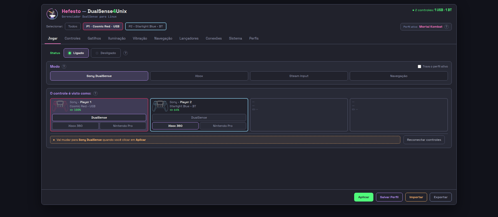
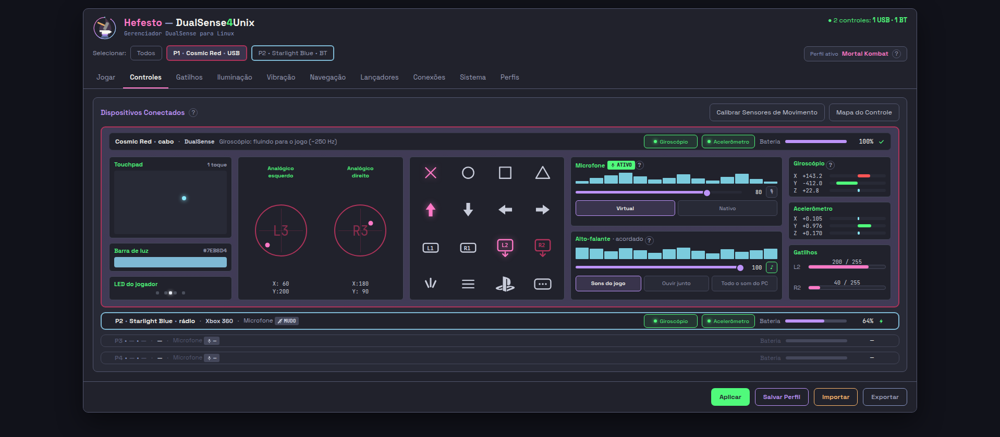
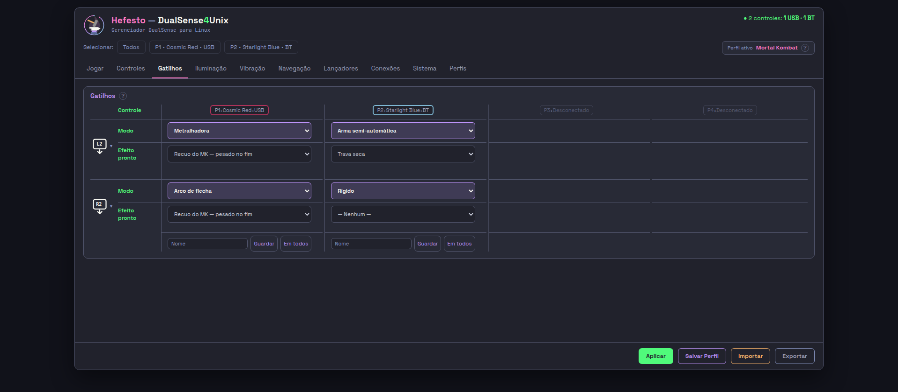
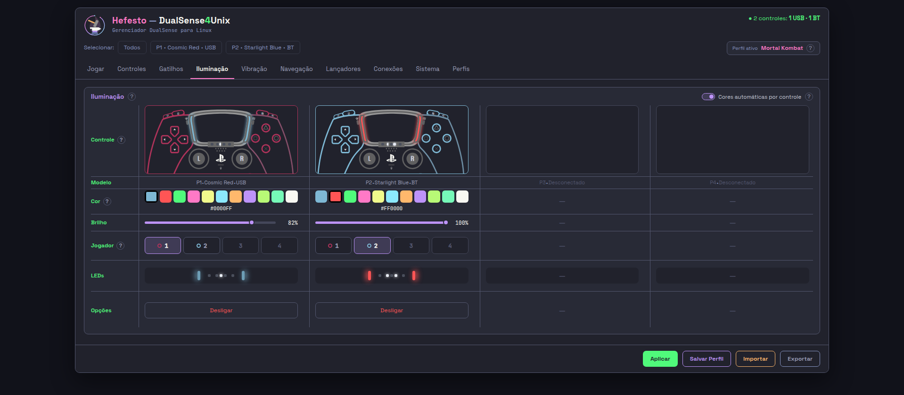
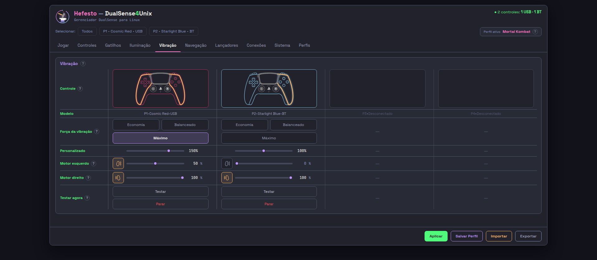
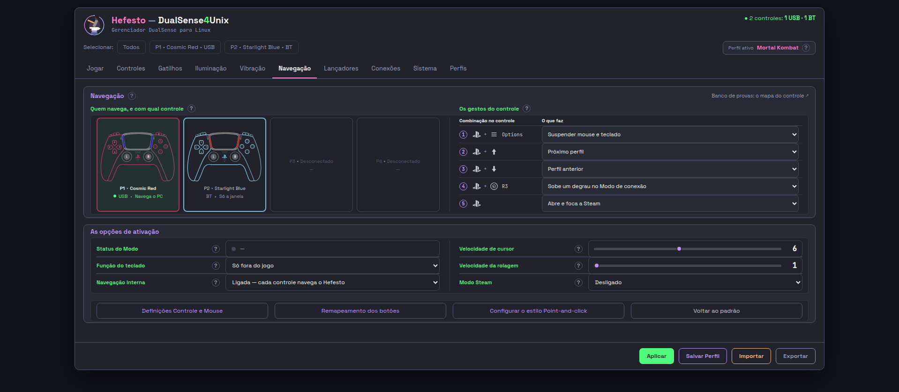
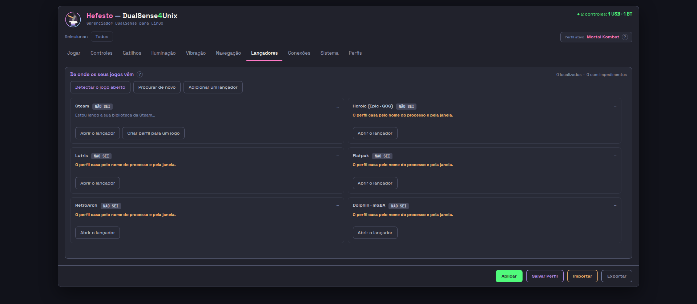
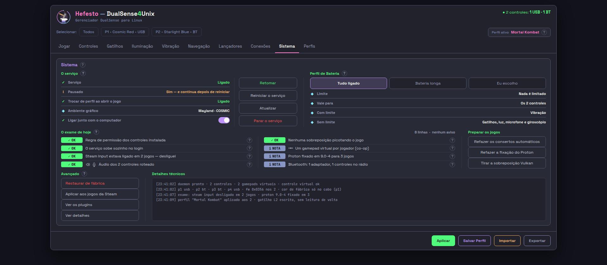
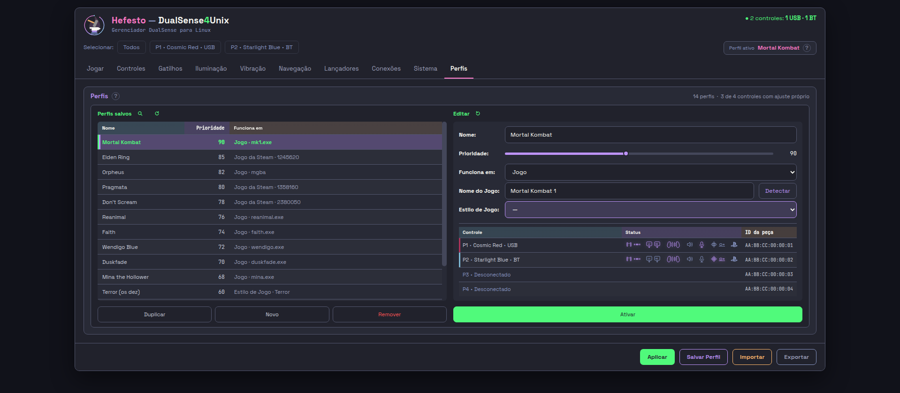

# AS DEZ ABAS MAXIMIZADAS — o que a foto acusa

> *"quero que vc maximize as telas e tire prints de todas as abas e valide se*  <!-- noqa-acento: citação literal dela -->
> *houve problemas."*  <!-- noqa-acento: citação literal dela -->
>
> — 11/09/2026, item 10 da lista dela

As dez fotos estão em **`docs/usage/assets/maximizada/`**, com o recibo ao lado
(`PROVA-DA-FOTO.txt`), e foram tiradas na vista da §1. Nenhuma janela nasceu na
tela dela: Chrome headless, o retratista de sempre.

---

## §1 — A VISTA, e por que é ESTA

**As dez saíram em `1918 x 840`.** É a vista da `WebView` com a janela do
Hefesto **maximizada na TV dela**, e cada parcela tem origem:

| banda | quanto | de onde vem |
| --- | ---: | --- |
| a TV | 1920 x 1080 | `cosmic-randr`, saída `DP-1`, 100 % — medido hoje |
| painel do COSMIC (zona exclusiva, em cima) | 82 | `ALTURA-DA-VISTA-01` §1, foto dela lida pixel a pixel |
| doca do COSMIC (zona exclusiva, embaixo) | 110 | idem |
| `Gtk.HeaderBar` | 46 | idem, e confere com `ponte_da_tela.ALTURA_DA_BARRA` |
| borda da janela | 1 de cada lado | idem (medida em cima e embaixo) |

```
altura:  1080 − 82 − 1 − 46 − 1 − 110 = 840
largura: 1920 − 1 − 1              = 1918
```

**A altura é medida; a largura é derivada** — o painel e a doca do COSMIC são de
cima e de baixo, não há zona exclusiva lateral, e sobra a mesma borda de 1 px
que a foto dela mostra nas outras duas pontas. Não foi lida pixel a pixel, e
está dito de novo na §5.

### O que «maximizar» NÃO mudava, e é por isso que o retratista precisou de argumento

O `--doc` recortava na `.janela`, e a `.janela` é
`width:min(100%,1600px)` por `height:var(--alt-janela)` com
`--alt-janela:777px` **fixo**. Medido nas dez, nas duas vistas:

```
1920x1080 → .janela 1600x777   (as dez)
1918x840  → .janela 1600x777   (as dez)
```

*O recorte é o mesmo pixel em qualquer vista acima de 1632x809.* Fotografar
maximizado não mudava a foto — a ordem dela era impossível de atender com o
instrumento como estava. O `--vista` da §5 é o conserto: com ele a foto é a
**vista inteira**, que é o que ela vê.

---

## §2 — O VEREDITO, uma linha por aba — E A FOTO DE CADA UMA

**O placar:** limpas **04, 05, 06, 07** · defeito de **forma** em **01, 03, 08**
· defeito de **conteúdo** em **01, 02, 09, 10**.

As dez estão abaixo, cada uma sob o seu veredito. Elas são o arquivo que está
em `docs/usage/assets/maximizada/`, com o recibo ao lado — **e não custam um
clique**, que é a regra de 07/09: *o que a pessoa precisa para executar não
pode custar um clique.* O que cada foto pode e não pode provar está na §2.1,
logo depois delas.

### 01-jogar — **defeito de forma + de conteúdo**

160 px de faixa vazia, e os dois lugares vazios não dizem quem são: saem
`— — —`, sem nem o número do lugar.



### 02-controles — **defeito de conteúdo**

A forma fecha (18 px de sobra); o P3 e o P4 saem `P3 • — • —`. Os três botões
do som e o `[mic]` da leva de ontem estão na imagem.



### 03-gatilhos — **defeito de forma**

179 px de faixa vazia; o resto está limpo. O `P3 • Desconectado` e o glifo do
L2/R2 inteiro — as duas curas de ontem — estão na imagem.



### 04-iluminação — **limpa**

22 px de sobra, os onze tons na fileira, nenhuma casa hachurada.



### 05-vibração — **limpa**

42 px de sobra.



### 06-navegação — **limpa**

41 px de sobra.



### 07-lançadores — **limpa na forma**

18 px de sobra. A foto mostra os seis cartões no selo cinza `NÃO SEI` e o
cabeçalho «0 localizados», que é o **estado de partida** — ver a §2.1 e a §3.5.



### 08-conexões — **defeito de forma**

181 px de faixa vazia, a maior das dez.


### 09-sistema — **defeito de conteúdo**

A forma fecha; a tela diz «1 controles».



### 10-perfis — **defeito de conteúdo**

A forma fecha e as quatro linhas cabem — o quadro «Modo» saiu do editor, que é
a cura de ontem. O cabeçalho conta 3 e a tabela mostra 2.



---

## §2.1 — O QUE A FOTO ESTÁTICA PODE E NÃO PODE PROVAR

**Esta seção nasceu de um erro deste próprio laudo, apanhado pelo conferente em
11/09/2026.** A §2 listava, entre as curas de ontem que "as fotos mostram", **o
selo da 07** — e a foto da 07 mostra seis pílulas cinza `NÃO SEI`. A afirmação
era falsa, e a causa não é da cura: é de que **a foto estática não alcança
aquela classe de cura**, e o laudo inteiro não dizia isso em lugar nenhum.

### O que se mediu na 07

| o que | quanto |
| --- | ---: |
| `class="lanc-selo nao_sei"` na página publicada | **6** |
| `class="lanc-selo localizado"` na página publicada | **1**, e ela está dentro de um comentário CSS (`07-lancadores.html:956`) |
| a regra que a cura de ontem escreveu — `.lanc-selo.ok,.lanc-selo.localizado{background:var(--green)}` | **presente**, `07-lancadores.html:969` |

**A cura chegou; o que não chega é o gatilho dela.** A regra verde está na
página, e nenhum elemento da página carrega a classe `localizado` que a
dispara. Quem escreve essa classe é o PILOTO, com o daemon vivo:
`desenho_dos_lancadores.valores_do_cartao` emite `{chave}-selo` com
`selo_html(lanc.selo)`, que devolve
`<span class="lanc-selo localizado">LOCALIZADO</span>` — e os seis endereços da
página são `data-campo="…-selo" data-hef-alvo="html"`, isto é, pontos que o
piloto sobrescreve. **A página publicada é o primeiro instante, antes de o
censo responder.** Não há achado de produto aqui: há um limite do instrumento.

### A regra que isto deixa, e ela vale para o laudo todo

> **A foto estática prova FORMA e prova TEXTO DE PARTIDA. Ela não prova nada
> que o piloto escreva por tique.**

E o tamanho do ponto cego é medido: as dez páginas publicadas carregam
**1.114 endereços `data-campo`**, do `data-campo="lanc-conta"` que diz «0
localizados» aos 513 da 02-controles. Todos eles são valores de partida que o
produto vivo pode trocar — e nenhum deles é conferível numa foto tirada com o
Chrome sobre o arquivo.

**Como se prova o outro lado**, e é o que esta sprint NÃO fez (`bancada:
false`): o piloto no `WebKit2.WebView`, com o daemon vivo, dirigido por
`run_javascript`. É o instrumento que o `CLAUDE.md` cobra de quem mexe na
interface, e ele é o único que responde pelas 1.114.

**O que sobrevive a isso na lista de ontem:** as curas de FORMA e de TEXTO DE
PARTIDA, que estão nas imagens e foram conferidas nelas — os três botões do som
e o `[mic]` na 02, o `P3 • Desconectado` e o glifo do L2/R2 na 03, os onze tons
na 04, e o quadro «Modo» fora do editor com as quatro linhas cabendo na 10. **A
cura do selo na 07 sai dessa lista**: ela é real, está no fonte e na folha, e
**esta foto não é a régua dela**.

---

## §3 — OS PROBLEMAS, um a um

| # | aba | o que se vê | onde no fonte | custo | de quem é a cura |
| --- | --- | --- | --- | --- | --- |
| 1 | 01, 02 | o lugar vazio não diz `PN • Desconectado` | `aba01.py:1332` · `aba02.py:1521` | **alto** | quem escrever `aba01.py` / `aba02.py` — **sprint a abrir** |
| 2 | 01, 03, 08 | faixa vazia de 160 · 179 · 181 px | `topo.html:352` (`.quadro.estica`) | **alto** | `VAO-DO-ESQUELETO-01` (aberta) |
| 3 | as dez | 47 px mortos fora da `.janela` | `topo.html:712` (`--alt-janela`) | médio | `ALTURA-DA-VISTA-01` (aberta) |
| 4 | 10 | «3 de 4 controles com ajuste próprio» com 2 na tela | `aba10.py:1276` | médio | quem escrever `aba10.py` — **sprint a abrir** |
| 5 | 09 | «Bluetooth: 1 adaptador, **1 controles** no rádio» | `aba09.py:1029` | médio | quem escrever `aba09.py` — **sprint a abrir** |
| 6 | 08 | o lugar vazio diz `Player 3`, e as outras dizem `P3` | `aba08.py:2213` | baixo | quem escrever `aba08.py` |
| 7 | as dez | a página salta 2 px ao trocar de aba | `topo.html:247` | baixo | `VAO-DO-ESQUELETO-01` (mesmo arquivo) |

### 3.1 — O lugar vazio fala QUATRO línguas, e a cura de ontem cobriu uma aba só

A queixa 9 da lista dela de hoje é literal: *"o P2 sai `—` em vez de*  <!-- noqa-acento: citação literal dela -->
*`P2 • Desconectado`"*. A `GATILHOS-VAO-01` curou **a 03**. Medido agora nas dez  <!-- noqa-acento: citação literal dela -->
páginas publicadas, na vista dela, lendo o texto que o produto renderiza:

| aba | o que o lugar vazio DIZ |
| --- | --- |
| **01-jogar** | `— — —` — **nem o número do lugar** |
| **02-controles** | `P3 • — • —` |
| 03, 04, 05, 06, 10 | `P3 • Desconectado` [OK] |
| **08-conexões** | `Player 3 • Desconectado` |

E a regra está escrita **na folha das dez**, dentro das próprias páginas
(`topo.html`, o comentário «O LUGAR VAZIO NÃO DESENHA CONTROLE», decisão dela de
04/09/2026):

> «O lugar CONTINUA na tela — a moldura, o rótulo `P3 · Desconectado` e o
> travessão ficam, e é isso que segue ensinando que ali cabe um.»

O comentário nomeia `aba01/04/05/06/10` como as cinco que a regra cobre. **A 01
é a que menos a cumpre, e é a aba que abre.** Dois cartões com três travessões
não dizem que ali cabe um controle — que é exatamente o que a decisão dela quis
impedir.

**A causa é a de sempre nesta casa:** a palavra não tem dono. Ela está digitada
em pelo menos dois lugares — `aba04.py:1180` (`SEM_NINGUEM_AQUI = "Desconectado"`)
e `aba08.py:2213` (`f'Player {c["jogador"]} • Desconectado'`) — e cada aba que a
escreveu criou a sua própria régua (`aba04.py:1844`, `aba08.py:4109`). As duas
que não escreveram não têm régua nenhuma, e por isso atravessaram a cura de
ontem em verde. *Quando a cura conhece a causa, ela cobre todos os chamadores* —
aqui cobriu um.

### 3.2 — A faixa vazia: a medição confirma a `VAO-DO-ESQUELETO-01`, e acrescenta a vista

Medido pelos filhos diretos do `.miolo`, na vista dela:

| aba | caixa | usa | **vão** |
| --- | ---: | ---: | ---: |
| **08-conexões** | 562 | 382 | **181** |
| **03-gatilhos** | 564 | 385 | **179** |
| **01-jogar** | 562 | 402 | **160** |
| 05-vibração | 564 | 522 | 42 |
| 06-navegação | 564 | 523 | 41 |
| 04-iluminação | 564 | 542 | 22 |
| 07, 09, 10 | 564 | 546 | 18 |
| 02-controles | 562 | 544 | 18 |

**São as MESMAS três páginas** que a `VAO-DO-ESQUELETO-01` §2 já mediu (163 ·
161 · 142, noutra vista e descontando o recuo de outro jeito), e na mesma ordem.
Esta sprint não reabre o assunto: ele tem dono, e a §4 daquela espera a palavra
dela.

**O que esta medição ACRESCENTA é a vista.** As dez carregam ainda **47 px
mortos fora da `.janela`** — o número da `ALTURA-DA-VISTA-01` §4.3, agora
confirmado por um segundo instrumento, na vista real e nas dez. Somados:

```
08-conexões:  181 dentro + 47 fora = 228 px de 840  →  27 % da tela maximizada dela
```

Nenhuma régua via os 47 antes desta leva, porque todas paravam na borda da
`.janela`. O `olhar.py` passa a medir `morto_abaixo` e `vao_dos_lados` em toda
execução.

### 3.3 — A aba 10 conta 3 e mostra 2

O cabeçalho diz «14 perfis · **3 de 4 controles com ajuste próprio neste
perfil**». A tabela abaixo mostra ícone de ajuste em **duas** linhas — P1 e P2 —
e as duas de baixo dizem `Desconectado` com a coluna «Ajuste próprio» vazia.

Medido no gerador:

```
aba10.py:1276   COM_AJUSTE = sum(1 for c in MESA if GUARDA[c["pref"]])

  Cosmic Red        conectado=True   guarda=True
  Starlight Blue    conectado=True   guarda=True
  Galactic Purple   conectado=False  guarda=True   ← conta, e não aparece
  White             conectado=False  guarda=False
```

*A conta soma os quatro lugares; a coluna só pinta quem está conectado.* Ela
conta dois e lê três, e não há nada na tela que explique a diferença. É a régua
de forma nº 5 — frase que afirma o que a tela não mostra — e **não está entre as
102 acusações de pé** de `2026-09-10-AS-FRASES-QUE-MENTEM-a-tela-medida-contra-o-produto.md`.

### 3.4 — A aba 09 diz «1 controles»

```
aba09.py:1029   saude("NOTA", "i", f"Bluetooth: 1 adaptador, {len(BT)} controles no rádio", …)
```

**Dois defeitos numa linha.** O `1 adaptador` é literal digitado — não sai de
leitura nenhuma, e a tela afirmaria «1 adaptador» com dois espetados. E o
`{len(BT)} controles` não tem singular: com um controle no rádio, que é o caso
mais comum dela, a tela escreve **«1 controles no rádio»**. A foto mostra
exatamente essa linha.

### 3.5 — A aba 07 promete um botão que o estado de partida não tem

A legenda da própria aba diz: *"Todo cartão que não localizou oferece*
*`Localizar este Lançador` — os seis, a Steam inclusive"*. Na página publicada a
frase `Localizar este Lançador` aparece **uma vez, e é a própria legenda** — que
o produto esconde. Os seis cartões nascem no selo `NÃO SEI` (antes do censo) e
carregam só «Abrir o lançador»; `acao_de_localizar` é chamada nos ramos `off` e
`localizado`, não neste.

**Custo baixo, e por uma razão honesta:** é o estado do primeiro instante, antes
de o censo responder — a mesma razão pela qual a foto mostra os seis selos em
`NÃO SEI`. **Não medi com o piloto vivo**, e a §2.1 diz por que nenhuma foto
estática poderia: os seis cartões são endereços que o piloto sobrescreve.

### 3.6 — A página salta 2 px ao trocar de aba

```
topo.html:247   .fita.inerte .chip.plastico{border-color:…;border-width:1px}
```

A fita que ESCOLHE (01, 02, 08) tem `border-width:2px` no chip de plástico e
mede **52 px**; nas outras sete ela nasce `inerte`, o chip fica com 1 px e a
fita mede **50**. Tudo o que vem abaixo — a barra de abas, a moldura, o quadro —
desce 2 px. Medido nas dez; o `y` do `.miolo` é 171 em três abas e 169 em sete.

---

## §4 — O que a foto NÃO prova

- **Não é o motor dela.** São as páginas de `interface/paginas/` num Chrome
  headless. Quem prova o produto é o piloto, no `WebKit2.WebView`, com o daemon
  vivo — e nenhum dado desta medição saiu de aparelho nenhum. **O tamanho desse
  ponto cego está medido na §2.1: 1.114 endereços `data-campo` nas dez
  páginas**, e a foto estática não confere nenhum deles.
- **O dado é o dublê do gerador.** «2 controles: 1 USB · 1 BT», os nomes de
  plástico e as porcentagens de bateria são o desenho, não a mesa dela. Os
  defeitos acima são de FORMA e de TEXTO, que sobrevivem a qualquer dado — os
  três que dependem de contagem (§3.3, §3.4) foram medidos no gerador, não lidos
  da imagem.
- **Não alcança o que abre por clique.** Os acordeões fechados da 08, os
  cartões abertos da 02 e as telas de `:target` não estão na foto. O achado 6
  (`Player 3`) foi medido no DOM, dentro do acordeão fechado — não está na
  imagem.

---

## §5 — O INSTRUMENTO, e o que ele passou a medir

`src/hefesto_dualsense4unix/interface/olhar.py` ganhou `--vista`:

```bash
interface/olhar.py --todas --publicado --doc --vista dela   # 1918x840, a maximizada
interface/olhar.py --todas --publicado --doc                # o recorte de sempre
```

A palavra `dela` resolve para `olhar.py:VISTA_DELA`, com a conta da §1 escrita
ao lado — para que o número não precise ser redigitado, que é como um número com
dono envelhece.

**As duas famílias de foto moram em pastas separadas, e é medido:** o
`CLAUDE.md` manda todo mundo rodar `--todas --publicado --doc` antes de
commitar, e se a foto da vista tivesse o mesmo nome a execução seguinte a
apagaria calada. Cada pasta tem o seu recibo, e o recibo agora declara a
`vista:`.

**E uma régua caiu junto:** o `passa_da_dobra` comparava com `1080` **digitado**.
Na vista de 840 ele diria «passa 0 da dobra» sobre uma página que passa 240 — o
instrumento respondendo sobre o viewport de ontem. Agora pergunta a
`window.innerHeight`.

### O que o reparo de 11/09 acrescentou ao instrumento

**Nada do que nasceu nesta sprint tinha régua**, e o conferente cobrou com a
frase que o `CLAUDE.md` usa: *instrumento que sabe do próprio risco RESOLVE,
não avisa.* As três mordidas estavam no texto de uma entrega, que é onde régua
nenhuma vive. Agora estão em
`tests/unit/test_o_retratista_fotografa_a_vista_pedida.py`, 22 casos, e são
QUATRO:

| a mordida | o que ela pega |
| --- | --- |
| `1080` de volta no `passa_da_dobra` | «passa 0» sobre uma página que passa 200 |
| o `Math.max(0, …)` fora do `morto_abaixo` | **−200 px mortos embaixo** — sobra negativa |
| `destino_das_fotos` ignorando a vista | as duas famílias de foto na mesma pasta |
| `_vista_pedida` aceitando `1918` | uma vista inventada, fotografada calada |

**E o `morto_abaixo` ganhou PISO** — é o quinto achado do conferente, e ele o
mediu: em 1918x500 a medida saía **−293**, e o `--todas` imprimia «−293 px
mortos embaixo». Ali não sobra: ali FALTA, e o que falta já tem instrumento
próprio (o `passa_da_dobra` na altura, o `rolagem_lateral` na largura). O irmão
`vao_dos_lados` ganhou o mesmo piso pela mesma razão. O JavaScript da medida
saiu de dentro do `_retratar` e virou `olhar.MEDIDA_NA_VISTA` — enquanto era
literal enfiada numa função, a única porta para medi-la era abrir o Chrome pelo
`main`.

**E A PASTA NOVA ABRIA BURACO EM DOIS PORTÕES QUE JÁ EXISTIAM.**
`scripts/check_fotos_da_tela.py` e
`tests/unit/test_as_fotos_acompanham_a_versao.py` casavam `docs/usage/assets`
por PREFIXO, e `maximizada/` cai dentro: gravar só na pasta nova **quitava a
dívida das dez do README**, que podiam apodrecer caladas — o defeito que esta
sprint ACHOU, reaberto numa segunda família. Os dois passaram a medir **por
família**: a topologia, o perdão da foto suja e a mensagem, que agora nomeia a
pasta devedora e traz o comando daquela pasta. Uma família atrasada reprova por
todas.

### O que ficou dito e não verificado

- **A largura de 1918 é derivada, não lida** (§1). A altura de 840 é medida.
- **O §3.5 não foi medido no piloto vivo** — só na página publicada, e a §2.1
  diz por que a foto estática não poderia medi-lo.
- **Nenhum aparelho foi tocado.** Esta sprint é `bancada: false` e não pediu a
  bancada.
