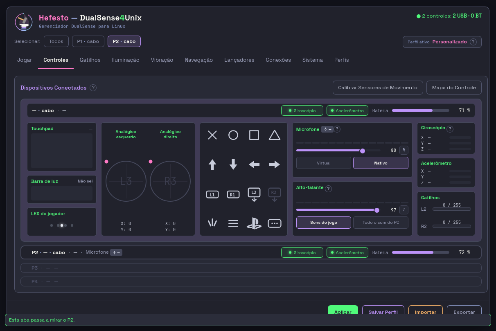
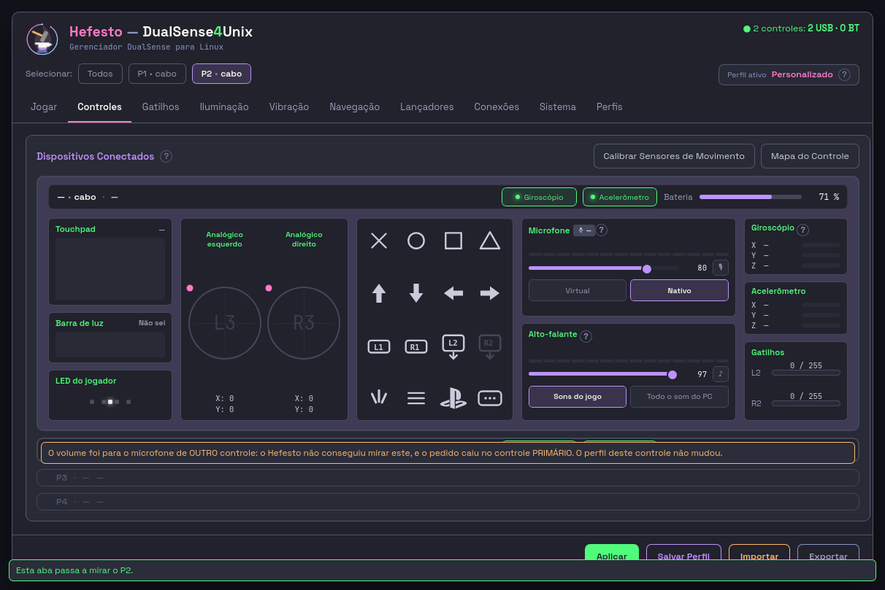

# A-CONFISSAO-NO-BOTAO-01 — o mudo confessa o alvo, e o alto-falante volta a confirmar

**Agente F-CONFISSAO · 06/09/2026 · branch `voo/A-CONFISSAO-NO-BOTAO-01-F-CONFISSAO`**
Base conferida: `3399773e` (`onda/atual-0609`), sem adiantar — nasceu na ponta.

---

## Em uma linha

As duas linhas fecharam: o 🎙 passou a perguntar **de quem era o microfone** ao
mesmo dono que o deslizante já pergunta, e o som de confirmação do alto-falante
voltou nos **três** gestos que esta aba tem — numa linha própria, medido: o
desfecho do clique chega aos **182 ms** com o tocador segurado em **1000 ms**.

**E duas coisas caíram no caminho, as duas de prosa:** a frase que o dono tem
para a confissão fala de **volume** (nasceu para o deslizante) e o daemon desta
árvore **não diz** `por_uniq` no ato do microfone — então a confissão do mudo é,
hoje, uma trava armada e calada, com régua-estopim para o dia em que falar.

---

## O que mudou

### Passo 1 — o `mudo` do microfone confessa o alvo

`src/hefesto_dualsense4unix/interface/pacotes/a02_controles.py`, gesto `mudo`,
ramo `microfone`, depois de `frase_do_ato_do_microfone` e **antes** de
`_lembrar_do_som`:

```python
        confissao = frase_do_alvo_do_mic(alvo_honrado(corpo))
        if confissao:
            raise RuntimeError(confissao)
```

São **duas perguntas diferentes**, e o gesto agora faz as duas:
`frase_do_ato_do_microfone` responde *qual metade do ato faltou*;
`frase_do_alvo_do_mic` responde *em qual controle o daemon mexeu*. Zero texto de
tela novo — as duas frases são do dono, e a régua cobra a identidade com o que
ele devolve em vez de repetir o texto.

**A ordem não é livre**, e a régua a mede lendo os BYTES do perfil no disco:
gravar antes da confissão poria no `controllers[este]` um estado que este
controle nunca teve.

**O QUE MEDI E A SPRINT NÃO SABIA — o campo não existe neste caminho.** O corpo
de `mic.canal.set` é montado por `AtoDoMicrofone.como_corpo`
(`src/hefesto_dualsense4unix/daemon/subsystems/hotkey.py:1385`) e **não traz
`por_uniq`**; quem o traz é o `mic.volume.set`
(`src/hefesto_dualsense4unix/daemon/ipc_handlers.py:6058`). Logo `alvo_honrado`
devolve `None` aqui e a confissão fica calada contra o daemon de hoje — **e o
silêncio é o certo**: *"não sei" não é "não honrei"*. Quem cobre o alvo errado
neste caminho hoje é a metade do CANAL, que já recusa dizendo quando a eleição
não é deste controle (`hotkey._eleger_ou_devolver`), e essa recusa sobe na outra
frase. A linha nova é a trava do dia em que o campo existir — o mesmo papel que
o `por_uniq` cumpre no volume contra um daemon instalado mais velho que a janela.

**A ARMADILHA DE PROSA DESTE DIA, e ela é do texto:** a única frase que o dono
tem para este estado (`TEXTO_MIC_ALVO_NAO_HONRADO`) começa com *"O volume foi
para o microfone de OUTRO controle"* — ela nasceu para o deslizante e já veio
marcada `PROVISÓRIO — decisão dela` no próprio dono
(`src/hefesto_dualsense4unix/app/widgets/controller_card.py:613`). Dita depois de
um clique no 🎙, ela nomeia um gesto que ela não fez. Escrever outra aqui é o que
esta casa proíbe (texto de tela é dela), e o dono é `app/`, que é `nao_toca`.
Enquanto o daemon não disser `por_uniq`, ninguém lê a frase errada; o dia em que
disser, **a palavra é dela** — e há régua-estopim cobrando isso antes de a frase
chegar à tela.

### Passo 2 — o som de confirmação voltou, nos três gestos do alto-falante

O motor é o do produto e não foi reescrito:
`src/hefesto_dualsense4unix/app/audio_saida.py:505` (`tocar_confirmacao`), com os
sete degraus de recusa, a trava de um som por vez, a guarda-mãe do sink e o
acordar do nó suspenso. O que nasceu foi **o caminho até ele**, em três peças
dentro do pacote da aba 02:

| peça | o que responde |
| --- | --- |
| `sink_do_cache` | o sink daquele controle **sem ler o sistema** — serve ao tique |
| `_sink_para_o_som` | o cache primeiro; no caso frio, o MESMO dono (`audio_saida.sink_do_controle`). Bloqueante, e por isso só roda fora do gesto |
| `_fora_do_voo` | a linha própria do som, e o ponto de injeção das réguas |
| `_confirmar_com_som` | o escritor único: resolve `saida_muda` no dono (`saida_muda_do_entry`) e chama o motor |

Os chamadores são os **três** gestos que esta aba tem: `volume` (alto-falante),
`mudo` (alto-falante) e `rota`. A janela GTK toca em quatro
(`src/hefesto_dualsense4unix/app/widgets/controller_card.py:4599`); o quarto é a
devolução da posse, que esta tela não oferece por decisão dela de 30/08. Cobrir
só o deslizante deixaria a próxima pessoa remedindo o mesmo defeito nos outros
dois — *quando a cura conhece a causa, ela cobre todos os chamadores* —, e a
frase dela sobre este som é justamente *"ao clicar em cada botão ele emite o
som"*.

**A CONDIÇÃO DE PARADA DA SPRINT FOI MEDIDA, E ELA NÃO SE APLICAVA.** A sprint
mandava parar se não houvesse caminho fora do tique de 100 ms. **O gesto já não
roda no tique**: o piloto despacha cada um numa thread
(`src/hefesto_dualsense4unix/interface/hefesto_vivo.py:2239`), porque
*"`daemon.reload` leva 9,5 segundos"*. Logo a tela não congelaria nem com a
chamada direta.

**O que a linha própria evita é outra coisa, e ela é visível:** o `finally` do
piloto só devolve o botão do voo — e só faz o campo piscar verde (03-Q4) —
quando o gesto retorna, e `tocar_confirmacao` custa 0,35 s medidos com teto de
5 s. **A confirmação sonora não pode pagar-se com a confirmação visual.** Medido
dentro do piloto, com um tocador que dorme 1 s: o desfecho do clique é anotado
aos **182 ms** e o som só volta aos **1000 ms**.

**A chave dela é respeitada e não ganhou irmã:** quem lê `som_ligado()` é o
motor, no primeiro dos sete degraus. O gesto chama sem opinião sobre `ligado`.

### A guarda da máquina dela — e o defeito que ela cura era MEU

`src/hefesto_dualsense4unix/interface/pacotes/ponte.py:dentro_da_janela`, e ela
nasceu de uma medição que quase passou batida.

**O que eu achei, depois de a cura já estar escrita e verde:** a régua irmã
`test_a02_som_e_sensor_falam_quando_recusam.py` **dubla o `pactl`** e devolve
uma lista com um sink de DualSense. Nesse cenário o veto por dispositivo USB não
existe (não há `pactl list sinks` longa para casar), o `escolher_sink` casa pela
regra do **um-para-um** — uma fonte, um controle na mesa — e o motor encontra o
sink *"na lista viva"*. Só que a lista viva é de mentira e o `paplay` **não
está dublado**. Medido, com o tocador espionado:

```
['paplay', '--device=alsa_output.usb-…DualSense_Wireless_Controller-00.analog-surround-40',
 '/usr/share/sounds/freedesktop/stereo/audio-volume-change.oga']
```

Esse nome é o sink **real** do DualSense que está no cabo dela agora. **A suíte
tocaria som no controle dela**, e eu rodei aquele arquivo algumas vezes hoje
antes de medir isto — é possível que tenha tocado. Está dito porque aconteceu.

**A guarda-mãe do `audio_saida` não alcança este caso de propósito:** ela confere
o sink contra a lista viva, e numa régua a lista viva é de mentira. Quem sabe que
ninguém clicou é a camada de cima — e o fato já existia sem eu inventar nada: **o
piloto SUBSTITUI `ponte.escolher_arquivo` ao subir a janela**
(`src/hefesto_dualsense4unix/interface/hefesto_vivo.py:2096`). Enquanto o ponto
de extensão for o declarado na ponte, não há janela: quem chama o gesto é uma
régua, um script ou um driver. `_fora_do_voo` passou a perguntar isso antes de
abrir a linha do som.

**É o mesmo desenho que o medidor de ondas já usa** (*"o piloto é o produto; é
ele quem autoriza"*), com a diferença de que aqui não foi preciso tocar no
piloto — que está no `nao_toca`.

**A pergunta vai ao MÓDULO `ponte`, e não ao `p` que o gesto recebe:** o `p` é
dublado nas réguas, e um dublê responde `True` a todo nome que não conhece —
perguntar a ele receberia sempre *"sim"*, que é o instrumento respondendo por si
mesmo.

### `docs/data/donos-de-comportamento.csv`, linha 44 — reclassificada pelo portão

`audio.selos_de_saida` era `SO-GTK` ("só a janela lê este dono"). Ligar o
`saida_muda_do_entry` na tela nova deixou a linha mentindo *para menos*, e o
portão `donos-de-comportamento` reprovou nomeando — que é exatamente o desenho
dele. Virou `CURADO`, com `onde_html` apontando para `_confirmar_com_som` e a
razão datada. **É a única linha de arquivo compartilhado que toquei**, e ela é
consequência direta da cura, não escopo novo.

---

## Qual mordida prova

Doze mordidas, todas executadas: arranquei a cura, vi reprovar, devolvi. As
saídas inteiras estão no scratchpad (`mordidas.txt`, `mordidas2.txt`).

| o que arranquei | o que reprovou |
| --- | --- |
| as duas linhas da confissão | `test_o_mudo_confessa_...` · `test_a_frase_da_confissao_e_a_do_dono` (2) |
| acusar sem ler o valor (`is not True`) | as 3 acima **+** os dois casos de "não sei" (4) |
| gravar antes de confessar | `test_o_mudo_confessa_...`, pelos bytes do perfil |
| `_confirmar_com_som` do `volume` | `...confirmam_com_som[volume]` · `test_o_som_nao_segura_o_botao_em_voo` |
| `_confirmar_com_som` do `mudo` | `...confirmam_com_som[mudo]` |
| `_confirmar_com_som` da `rota` | `...confirmam_com_som[rota]` |
| chamar o som no corpo do gesto | `test_o_som_nao_segura_o_botao_em_voo` |
| o `try` de dentro de `tocar` | `test_o_som_que_falha_nao_derruba_o_volume` |
| passar `ligado=True` (a segunda chave) | `test_a_chave_dela_desliga_o_som_e_o_gesto_nao_recusa` |
| o `dentro_da_janela` de `_fora_do_voo` | as duas da `TestAGuardaDaMaquinaDela` — e a segunda **imprime o `paplay` que sairia** |

**A MORDIDA QUE SEPARA A CURA DA SUPERSTIÇÃO** é a segunda, e ela é
parametrizada em três: alvo honrado, alvo desconhecido (`None`) e **o daemon que
não disse nada** — que é o desta árvore. Nos três o gesto **não** pode recusar.

**E A MORDIDA DO MEU PRÓPRIO INSTRUMENTO, que custou uma volta:** a primeira
tentativa de arrancar `_confirmar_com_som` substituiu a linha do COMENTÁRIO e
deixou a chamada de pé — três mordidas passaram **verdes** sobre uma cura que
continuava lá. Quem estava errado era a mordida, não a régua. *Uma mordida que
não arranca nada dá verde igual à cura arrancada.*

---

## A prova de tela

**Três travas, e nenhuma delas é zelo:** `--oculta` (ela tem UMA tela), o daemon
de **mentira** (`mesa_viva.estado_do_daemon` dublado com dois controles
sintéticos — o serviço dela não foi lido nem escrito) e a ponte de **mentira**
(`bancada: false`; um clique de verdade calaria o microfone dela). Os drivers
estão no scratchpad, fora do repositório.

### O clique, e em qual cartão a recusa pousou

Com o daemon respondendo `por_uniq: false`, o clique no 🎙 do **P2**:




Lido no DOM depois do clique, e é a resposta que a sprint pedia:

```json
{"achados":[{"pref":"p2","classe":"hef-recado",
             "texto":"O volume foi para o microfone de OUTRO controle: …"}],
 "cards":7}
```

O depósito do piloto confirma o endereço: `recados["aabbcc000002"]`, tom
`recusa`. **A frase pousou no cartão do P2 — não no do P1**, que é o ponto
inteiro da mesa cheia.

### A mordida, na tela

Mesma execução com `por_uniq: true`: desfecho `aplicou`, `recados` **vazio**,
`achados` **vazio** — e a foto do depois é **byte-idêntica** à foto do antes
(`md5 e4ac805df75fdf9c6919f666f8785c87` nas duas). Não a guardei por isso: uma
cópia do mesmo PNG não prova mais que o md5.

### O som, dentro do piloto

Clique no deslizante do alto-falante do P2, com `tocar_confirmacao` trocado por
um tocador que **dorme 1 s** e anota:

```json
{"sink":"alsa_output.usb-…DualSense_Wireless_Controller-01.analog-surround-40",
 "saida_muda":null, "thread":"hefesto-som-de-confirmacao",
 "em_ms":0, "voltou_em_ms":1000}
desfecho_do_volume_em_ms: 182
```

O som sai **no sink daquele controle**, numa linha própria, e o gesto não o
espera. **A mordida:** com `_confirmar_com_som` arrancado, `tocou: []`.

---

## O que MEDI no mapa de canais, por `chave`

Pedido de quem coordena, e o fluxo que faltava: **o que se mede volta para o
mapa**. Não editei `docs/data/mapa-controles.csv` (não é minha posse); o que
segue é para quem remedir as células.

| `chave` (@dualsense) | o que a célula diz | o que esta cura EXERCE |
| --- | --- | --- |
| `audio.alto_falante` | `cabo_aciona=parcial` · `radio_aciona=não` (`divida`) | o som de confirmação passa a sair pelo sink do controle nos **dois** transportes — quem decide se há sink é `escolher_sink`, e não o transporte escrito aqui |
| `audio.alto_falante.volume` | aciona nos dois | o arrasto agora **confirma**: era o único gesto do bloco sem recibo nenhum |
| `audio.microfone.mudo` | `cabo_aciona=sim` · `radio_aciona=parcial` (`divida`) | o gesto ganhou a segunda pergunta (de quem era), mas ela **não cobre** a ressalva desta linha — ver abaixo |
| `audio.leitura_de_volta` | `existe=desconhecido`, as duas colunas **esperando a palavra dela** | **a afirmação forte caiu**: onde se dizia *"o registrador não tem leitura"*, o código e este relatório dizem **"não há leitura de volta hoje"** |

**A `radio_ressalva` de `audio.microfone.mudo` descreve OUTRO caso, e ele
continua aberto:** *"um `mic unmute` evapora no próximo handle novo, em
silêncio, e o firmware volta a mudo — como reconexão é rotina no rádio, o defeito
é muito mais visível por BT"* (MIC-BT-DONO-01, proposta). Isso **não** é o alvo
não honrado: ali o pedido foi para o controle certo e o efeito some depois. A
confissão que construí não o alcança, e nenhuma frase nova nasceu para ele —
`MIC-BT-DONO-01` tem três recusas medidas registradas na `nota` da mesma linha, e
repropor sem derrubá-las é o que aquela nota proíbe.

---

## Os portões

Rodados com a árvore inteira no índice (`git add -A` antes — portão é cego a
arquivo novo). Saída inteira no scratchpad.

**44 verdes · 1 vermelho, e o vermelho é uma linha que está no meu `nao_toca`:**

```
paridade-gtk-html  VERMELHO
  divida-fechada: paridade-gtk-html.csv:88  [02-controles] Alto-falante — o som de confirmação
    o sinal 'tocar_confirmacao' APARECEU em …/interface/pacotes/a02_controles.py.
```

O portão está **certo** — a dívida fechou e o CSV precisa ser remedido. O
frontmatter da sprint põe `docs/data/paridade-gtk-html.csv` no `nao_toca` com
todas as letras (*"as linhas 58 e 88 são de quem remede"*), e o despacho manda
relatar em vez de tocar. O texto pronto está na seção seguinte.

O `donos-de-comportamento` também reprovou e **esse eu fechei**: a diferença é
que a linha 44 não está em `nao_toca` nenhum, e o próprio portão manda
reclassificar.

---

## O que NÃO verifiquei

1. **Não cliquei com o daemon REAL, nem com controle na mesa.** `bancada: false`.
   Todo clique foi contra um daemon de mentira, dentro do piloto oculto — e o
   som, contra um tocador de mentira. **Mas não afirmo que nenhum som saiu:**
   entre escrever a cura e achar a guarda, rodei três vezes a régua irmã que
   dubla o `pactl`, e é exatamente ela que alcançava o `paplay`. Se saiu, saiu
   pelo alto-falante do controle, com 67 ms. Está dito porque aconteceu.
2. **Não medi o som chegando ao ouvido.** O que provei é o caminho: qual sink,
   em que linha, em que instante. Se o `paplay` produz som naquele sink é do
   motor, e ele tem régua própria.
3. **Não medi o rádio.** Não há controle no rádio nesta bancada agora, e o
   caminho do sink é o mesmo código nos dois transportes: quem responde `""` é
   `escolher_sink`, não uma condição de transporte que eu tenha escrito. **Não
   escrevi ressalva de transporte nenhuma.**
4. **Não medi o caso frio do sink com a tela viva.** `_sink_para_o_som` cai no
   dono quando o cache da camada 1 está vazio; provei as duas pernas por régua,
   não com a aba recém-aberta e o cronômetro.
5. **Não rodei a suíte inteira.** Rodei o meu escopo e os seis arquivos vizinhos
   que exercitam os gestos de som e o mudo (141 testes, verdes).
6. **Não toquei no desenho, não publiquei e não mexi no CSV da paridade.**

**A medição que eu tomei por suficiente, e NÃO era:** com `uniq` sintético,
`audio_saida.sink_do_controle` devolve `""` — o casamento por dispositivo USB
veta o sink real da máquina. Verdade, e insuficiente: **numa régua que dubla o
`pactl` esse veto não existe**, e foi assim que o `paplay` apareceu. A cura é a
`ponte.dentro_da_janela`, na seção "a guarda da máquina dela". *Uma medição que
cobre o caminho que eu imaginei não cobre o caminho que a régua do vizinho
constrói.*

---

## O que sobrou para o próximo

### `docs/data/paridade-gtk-html.csv`, linha 88 — o texto pronto

Fora da minha posse. Veredito de `FALTA_NO_HTML` para **`DIFERENTE`**, com
`sinal_espera` de `AUSENTE` para `PRESENTE`, e:

* `html_onde`:
  `src/hefesto_dualsense4unix/interface/pacotes/a02_controles.py:_confirmar_com_som`
* `html_faz`: *"Toca `audio_saida.tocar_confirmacao` no sink DAQUELE controle
  nos três gestos do bloco (deslizante, ♪ e rota), fora do voo do botão
  (`_fora_do_voo`), com `saida_muda` lido do dono. O motor é o mesmo da janela."*
* acrescentar ao `porque`: *"FECHADA em 06/09/2026 pela
  A-CONFISSAO-NO-BOTAO-01. DIFERENTE e não IGUAL por um motivo declarado: a
  janela toca em QUATRO gestos e esta tela tem TRÊS — o quarto é a devolução da
  posse, que ela mandou tirar em 30/08. E a razão desta linha muda de palavra:
  onde se dizia 'o registrador não tem leitura', o mapa diz
  `audio.leitura_de_volta` = `existe=desconhecido` — o que se sabe é que **não
  há leitura de volta hoje**."*

### `docs/data/paridade-gtk-html.csv`, linha 58 — meia frase envelheceu

Mesma posse alheia, e o portão **não** a acusa (o sinal já aparecia no arquivo).
O `porque` fecha com *"a cobertura é PARCIAL — só o volume do microfone confessa;
o botão de mudo ainda não lê `alvo_honrado`"*. **O botão passou a ler.**
Acrescentar: *"06/09/2026 — o gesto `mudo` passou a perguntar
`frase_do_alvo_do_mic(alvo_honrado(corpo))` antes de gravar. A cobertura deixou
de ser parcial no CÓDIGO e continua inerte no APARELHO: o corpo de
`mic.canal.set` não traz `por_uniq` (`hotkey.AtoDoMicrofone.como_corpo`), e a
régua-estopim de `test_a02_o_botao_confessa_o_alvo_e_o_som_confirma.py` reprova
no dia em que trouxer."*

### A frase da confissão precisa da palavra dela antes de valer no 🎙

`TEXTO_MIC_ALVO_NAO_HONRADO` fala de **volume**. O dia em que `mic.canal.set`
disser `por_uniq`, ela passa a ser dita depois de um clique no botão de MUDO. São
duas saídas possíveis, e as duas são dela: uma frase que sirva aos dois gestos,
ou uma segunda frase para o mudo. **A régua-estopim já reprova nesse dia**,
nomeando este relatório.

### O daemon podia dizer de quem foi o mudo

`AtoDoMicrofone.como_corpo` (`daemon/subsystems/hotkey.py:1385`) tem `uniq` e as
duas metades, e não tem `por_uniq`. Acrescentá-lo é uma chave no dicionário —
mas ele só vale acompanhado da decisão de texto acima, senão a tela ganha a
frase errada no mesmo dia. **Não é da minha posse** (`daemon/`), e a ordem certa
é: primeiro a palavra dela, depois o campo.

### A armadilha que me custou uma volta, e ela pega quem dirigir o piloto

O mesmo arquivo `a02_controles.py` vive sob **dois nomes de módulo**:
`pacotes.a02_controles` (pelo `sys.path` de `interface/`, que é o que as réguas
usam) e `hefesto_dualsense4unix.interface.pacotes.a02_controles` (o que o piloto
importa). São **objetos diferentes**: um `monkeypatch` num não alcança o outro.
Substituir `_sink_para_o_som` no módulo curto não mudou nada dentro do piloto — e
o sintoma foi um sink vazio que eu quase li como defeito do produto. Quem
escrever driver de tela: dubla pelo caminho **longo**.
