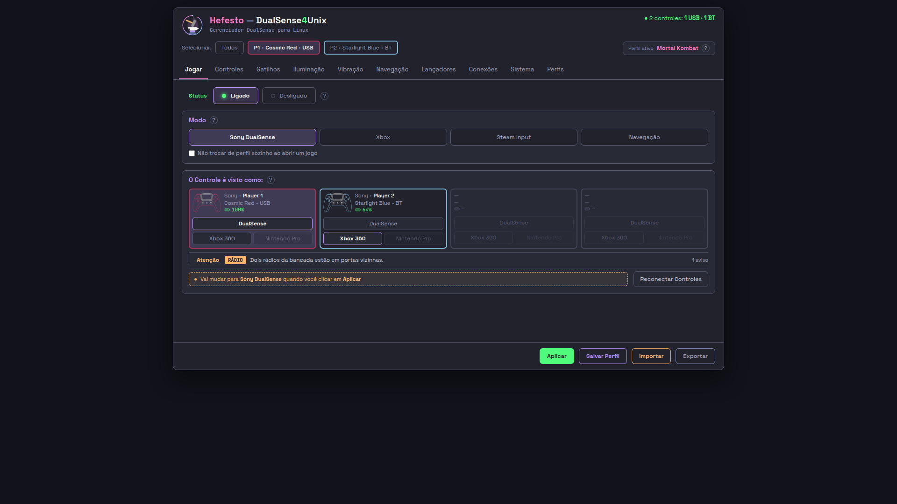

# A-REGUA-DA-PALAVRA-VE-O-PRODUTO-01 — a régua dizia "o produto" e respondia sobre o arquivo

**06/09/2026** · branch `voo/A-REGUA-DA-PALAVRA-VE-O-PRODUTO-01-opus`, nascida de
`83a9405c` · **45 portões verdes**.

O instrumento acusava **34 ocorrências visíveis de "mesa" em o produto** e a
janela não mostrava **nenhuma**. As 34 moram dentro de `.nota` — o bilhete de
projeto que o mockup carrega —, e o piloto injeta
`.nota{display:none !important}` antes de a página aparecer. A régua lia o
ARQUIVO e escrevia "o produto": é a assinatura que esta casa persegue desde
04/09, *o instrumento respondia sobre outra coisa que não o produto*.

---

## O que mudou

### O número, medido nos dois modos e conferido no motor

```bash
interface/olhar.py --palavra mesa --publicado     # o que o produto renderiza
interface/olhar.py --palavra mesa                 # a bancada, que ela abre crua
```

| | antes | depois | Chrome de verdade |
| --- | --- | --- | --- |
| **o produto** (`interface/paginas/`) | **34** | **0** | **0** com a folha posta · 43 sem ela |
| **a bancada** (`mockup/`) | 0 | 0 | 9, todas dentro de `<code>` |

O Chrome é `/usr/bin/google-chrome` por Playwright, `file://` sobre as vinte
páginas, viewport 1180x777, contando `document.body.innerText` por borda de
palavra. **O produto com a folha do piloto posta mostra zero `mesa` nas dez
páginas** — que é o número que a régua passa a dar.

As duas diferenças de denominador entre a régua e o `innerText` são as duas que
a régua declara desde que nasceu, e nenhuma delas é "mesa" na tela: ela ignora
`<code>` (nome interno escrito de propósito — são as 9 da bancada) e lê
`title=`/`placeholder`/`aria-label`, que o `innerText` não vê e a pessoa lê.

### A cura, em três peças

**1. A folha ganhou dono próprio, e ele não importa GTK** —
`src/hefesto_dualsense4unix/interface/folha_da_casa.py`.

`FOLHA_DA_CASA` morava em `gui/ponte_da_tela.py`, que importa `gi`, `Gtk` e
`WebKit2` na primeira linha. Uma régua que roda sem tela não pode exigir
PyGObject para perguntar o que o produto esconde; e uma régua que lesse o TEXTO
daquele módulo com `ast` voltaria a responder sobre o fonte em vez de sobre o
valor. **Escolhi mover a folha** — dos dois caminhos que a tarefa oferecia, é o
único em que a régua importa o VALOR que a janela usa.

`ponte_da_tela.FOLHA_DA_CASA` continua valendo: a ponte reexporta o nome, e os
dois usos (`JanelaDaAba(folha=…)` nos dois construtores) não mudaram de forma.
`docs/` e `test_a_janela_estreita_nao_engole_o_desenho.py` citam aquele
endereço, e mudar o endereço de um valor do produto por causa de uma régua seria
a régua mandando no produto.

**E ela nasceu em `gui/` — o portão recusou, com razão.** A primeira escrita
desta sprint pôs `folha_da_casa.py` dentro de `gui/`, e
`nada-aponta-para-a-janela` reprovou com seis linhas: a janela está sendo
aposentada (`D-0609-GTK-LEVA-INTEIRA`) e o inventário já dá a `ponte_da_tela`
como `MOTOR-MUDA-DE-CASA` — ela sobrevive, mas sai de `gui/`. Nascer ali seria
dar à folha um endereço com data de validade. Ela é da INTERFACE NOVA, e é onde
está.

**2. `seletores_escondidos()` — a régua PERGUNTA, e `.nota` não se digita.**

Ela lê o `display:none` da própria folha. Uma segunda regra de esconder amanhã
passa a valer para a régua **sozinha**.

A propriedade é LIDA, nunca procurada por substring, e a armadilha está na folha
de hoje: `select{appearance:none}` contém a palavra `none` e não esconde coisa
nenhuma — um `"none" in regra` apagaria os 117 `<select>` das dez abas. Um
`"display:none" in folha` erraria no outro sentido, porque `display : none` com
espaço é o mesmo CSS.

**O que ela não sabe honrar, RECUSA em voz alta.** `.nota > p`, `.rodape .nota`,
`div.nota`, `*`, `[hidden]` levantam `ValueError` nomeando o seletor. Ignorar em
silêncio um seletor novo seria voltar ao defeito de origem — verde contando o
que o produto esconde.

**3. Duas leituras, e a diferença é o ponto inteiro** —
`interface/frases_que_ela_baniu.py`.

| | lê | conta a `.nota`? |
| --- | --- | --- |
| `texto_visivel` | a BANCADA, que ela abre CRUA no navegador | **sim, e tem de contar** |
| `texto_visivel_no_produto` | a JANELA, com a folha do piloto aplicada | não |

**Função nova, e não parâmetro** — a tarefa deixava a escolha, e o motivo é o
chamador que não é meu: `texto_visivel` é chamada pelo portão das frases banidas
(`test_a_palavra_mesa_nao_chega_a_tela.py`) e pelo instrumento
(`olhar.py --palavra`). Um parâmetro com padrão convida o dia em que alguém
inverte o padrão e afrouxa o portão da bancada sem tocar nele. As duas funções
dividem o motor (`_ler`), então a decisão sobre `<code>`, `<style>` e `title=`
continua com um dono só.

**A BANCADA NÃO MUDOU UM BYTE, e isto foi medido, não afirmado:** a leitura
antiga (`git show HEAD:…frases_que_ela_baniu.py`, executada lado a lado com a
nova) devolve string idêntica para as **vinte** páginas — as dez da bancada e as
dez do produto.

### O portão que faltava: o produto passou a ter régua

`interface/paginas/` era ponto cego DECLARADO no portão da palavra, com a razão
"só muda quando ELA publica". A razão continua verdadeira e não bastava — foi
justamente lá que o instrumento mentiu. Agora há
`test_a_palavra_nao_e_lida_em_nenhuma_das_dez_paginas_do_produto`, lendo pelo
`texto_visivel_no_produto`, e a prosa do módulo que chamava aquilo de ponto cego
foi substituída em vez de ganhar um parágrafo ao lado.

Ele **não substitui** a régua da bancada: o desenho é o que vira produto no
próximo `--publicar`, e se só o produto tivesse régua a palavra voltaria pelo
desenho e só apareceria depois de publicada.

### O retratista também deixou de digitar

`olhar.py` `_retratar` injetava `.nota{display:none}` **escrito à mão** — a
segunda cópia de um valor com dono. A foto mostrava o que o produto esconde
HOJE, e continuaria mostrando no dia em que a folha ganhasse a segunda regra.
Agora ela pergunta ao mesmo dono. A foto de `01-jogar.html --publicado` saiu
1180x777, zero rolagem, e é a prova de tela desta entrega: a página do produto,
sem uma palavra "mesa" nela.



### Dois portões acusaram efeito colateral, e os dois tinham razão

`casa-sabe` cobrou a classificação de `texto_visivel_no_produto` como promessa
pública sem caminho — ela é irmã de `texto_visivel` e não é promessa pela mesma
razão (o produto escreve a página, nunca a lê), e a razão está declarada com a
evidência ao lado.

`citacoes-no-codigo` reprovou por um endereço que **eu envelheci sem tocar
nele**: `interface/aba08.py` citava
`portao_a_casa_sabe_e_o_produto_nao_faz.py:1162`, e as dezesseis linhas da
classificação acima empurraram a lápide para baixo. O número foi remedido
(`:1883`, a linha da frase que ele cita) em vez de a régua ser afrouxada — e o
endereço já apontava para dentro do comentário errado antes disto; só não estava
em linha em branco.

---

## Qual mordida prova

**Mordida 1 — devolvo a régua ao estado de contar a `.nota` no modo publicado**
(`texto_visivel_no_produto` passa a chamar `_ler(pagina)` sem os seletores):

```
'mesa': 34 ocorrência(s) visível(eis) em o produto        ← o defeito, de volta
4 failed, 12 passed
  test_a_palavra_nao_e_lida_em_nenhuma_das_dez_paginas_do_produto
      E   AssertionError: palavra banida LIDA na tela do PRODUTO (mesa):
      E       01-jogar.html:3339: Quatro controles na mesa, um cartão cada …
  test_o_produto_esconde_o_bilhete_e_a_bancada_o_conta
  test_a_bancada_continua_lendo_o_que_o_produto_esconde
  test_o_bilhete_nao_fecha_e_a_regua_diz_em_vez_de_chutar
```

A terceira reprovação é a que guarda o terceiro requisito: com a cura arrancada
as **duas leituras viram uma só**, e a régua que prova que a bancada continua
vendo o bilhete cai junto.

**Mordida 2 — a régua deixa de PERGUNTAR e adivinha** (`esconde = "none" in
regra`, a armadilha do `appearance:none`):

```
2 failed, 7 passed
  test_a_folha_diz_o_que_esconde_e_a_regua_le_dela
  test_uma_segunda_regra_de_esconder_vale_para_a_regua_sozinha
```

**E a guarda contra a cura preguiçosa**, que é a mordida ao contrário: uma
leitura que devolvesse espaço zeraria a contagem e deixaria o portão verde para
sempre sobre nada. `test_a_leitura_do_produto_nao_apaga_a_tela` exige que as dez
páginas publicadas continuem com mais de 200 palavras lidas e com "Hefesto"
entre elas.

Depois das duas mordidas, os arquivos foram restaurados byte a byte e os 16
testes voltaram ao verde.

---

## O que NÃO verifiquei

- **A janela de verdade.** Medi a folha aplicada num Chrome por Playwright, que
  é o motor errado por desenho: quem renderiza para ela é o `WebKit2.WebView`.
  A `UserContentManager` aplica a mesma folha, e o
  `test_a_janela_estreita_nao_engole_o_desenho` já a põe à mão no WebKitGTK —
  mas não abri a janela nesta sprint (`WAYLAND_DISPLAY` é a tela dela).
- **O `<title>` continua contando como texto lido.** Não é regressão nem cura
  desta sprint: `--palavra mockup --publicado` acusa 10 ocorrências, e as dez
  são `Hefesto — aba X (mockup 26/08/2026)`, o título da janela. Não toquei
  nisso porque o título **é** lido — aparece na barra —, e decidir o contrário é
  mudar o contrato da régua sem medida que peça.
- **`app/`**, o motor, continua fora do alcance destas duas réguas; quem o
  alcança é o funil `hefesto_vivo._json` com o produto rodando.
- **A suíte inteira.** Rodei os módulos tocados e os 45 portões; a suíte em oito
  lotes é de quem coordena, com a máquina livre.

---

## O que sobrou para o próximo

- **A foto das dez abas ainda esconde só o que a folha esconde HOJE, mas o
  resto da folha não entra nela.** O `_retratar` aplica os seletores de
  `display:none` e nada mais; a `select{appearance:none}` — a cura sem a qual o
  WebKitGTK desenha a caixa branca — não vale na foto, que sai de um Chrome.
  Aplicar a folha inteira mudaria as dez imagens de `docs/usage/assets/`, e isso
  é decisão com foto antes e depois, não efeito colateral desta.
- **A `ponte_da_tela` continua em `gui/`** e o inventário a marca
  `MOTOR-MUDA-DE-CASA`. Quando ela mudar, a linha
  `from hefesto_dualsense4unix.interface.folha_da_casa import FOLHA_DA_CASA`
  viaja junto e não precisa de nada.
- **A lista de palavras banidas tem UMA palavra.** O caminho para a segunda já
  está pago: entra em `PALAVRAS_BANIDAS` e as quatro réguas (bancada, produto,
  pacotes, funil de execução) passam a vê-la sem uma linha nova.
