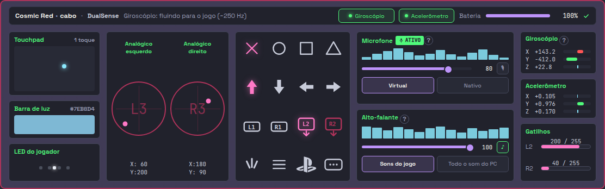
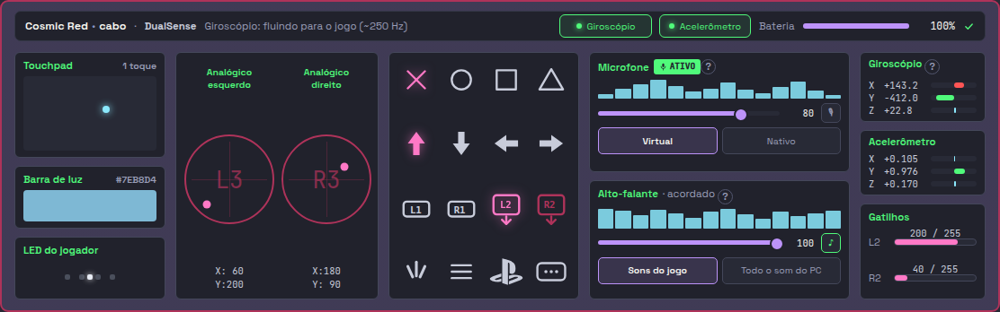
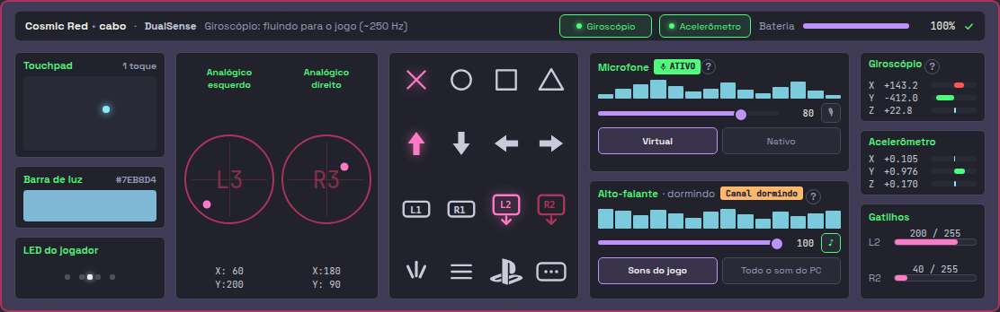
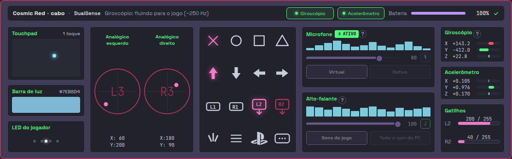

# CONTROLES-OS-TRES-SELOS-01 — o cartão diz se o som tem para onde ir

**06/09/2026** · árvore `hefesto-voo/CONTROLES-OS-TRES-SELOS-01-opus`, branch
`voo/CONTROLES-OS-TRES-SELOS-01-opus`, nascida de `c15d2e3e` — o mesmo `git
rev-parse --short onda/atual-0609`, conferido antes de tocar em código.

---

## Em uma linha

As quatro linhas do CSV fecharam **sem uma regra reescrita**: as quatro são
LEITURA de dono que já existe, e o QUARTO selo — o transporte — **lê a célula do
mapa em vez de digitar a frase**, com a régua que prova isso trocando a célula
num dublê e vendo a frase sumir.

**E as três coisas que a medição no motor decidiu:** o rótulo da moldura aguenta
o selo com **ZERO altura** (19 px nas cinco cenas), a guarda **não podia** usar
`.moldura[title]` solto — a moldura do LED do jogador tem `title` fixo e sumiria
em todo cartão —, e o cinza da guarda **não podia** reusar o campo `alto-porque`,
porque aquele campo também acende no estado SEM POSSE, onde o deslizante é
justamente a única saída dela.

---

## O que mudou

### Linha 90 — `acordado` / `dormindo` no rótulo da moldura

A leitura é a **terceira da mesma volta**, e não uma thread nova: o `renovar` da
`_camada_1` já paga um `pactl` a cada dois segundos, e o sono entra ali. Uma
thread própria para a mesma família de pergunta seria o segundo leitor de
PipeWire desta aba — a classe de defeito que a `_camada_1` inteira existe para
não cometer, e a mesma disciplina que a `status_actions` aplica do lado da GTK.

| peça nova | o que responde |
| --- | --- |
| `_ler_o_sono` | UM `pactl list sinks short` para a mesa inteira; quem traduz a coluna é `audio_saida.estado_do_canal`, o dono |
| `_SONO` · `sono_do_canal` | o cache por controle, e o ponto de injeção das réguas |
| `_REGRA_DO_SONO` · `regra_do_sono` | o drop-in 54 do WirePlumber está no lugar? |
| `sufixo_do_canal` | `· acordado` / `· dormindo` / `""` |
| `dica_do_canal` | as quatro frases do dono, com a do PADRÃO condicionada à REGRA |

**São DOIS fatos, e a diferença é a metade que importa:** o estado diz se o nó
está acordado AGORA; a regra diz se ele está acordado POR PADRÃO. Um nó pode
estar acordado por acaso — alguém acabou de tocar algo — com a cura fora do
lugar, e chamar isso de "é o padrão" seria a tela dando por curado o que só está
momentaneamente de pé. `None` não afirma nem um nem outro.

**`""` É "NÃO SEI", E NÃO "ACORDADO".** Sem placa de som — o caso do rádio,
medido em 15/08/2026 — a tela não tem o que afirmar. Sem sink não entra chave no
cache: um `""` gravado seria indistinguível de "li a coluna e não reconheci".

### Linha 89 — o selo `Saída muda`

`selo_do_som(saida_muda, sono)` reusa a prioridade de `_aplicar_selo_do_som` da
GTK, e ela **não é arbitrária**: ganha o fato que explica o silêncio ANTES do
outro. Uma saída muda cala o som venha o canal de onde vier; um canal dormindo só
come o começo. Dizer as duas na mesma linha trocaria um alarme por dois avisos.

A camada 1 chega pelo dono que esta aba já importava — `saida_muda_do_entry`,
que lê `speaker.saida_muda`/`audio.saida_muda` do payload. **Só `True` acende:**
`False` (a saída está aberta) e `None` (não sabemos) mostram a mesma coisa, nada,
porque um selo "saída viva" seria ruído em cima do que a barra já diz.

### Linha 57 — a guarda "sem endereço", nas DUAS metades

**A razão** (`porques_do_som`): sem endereço, os dois `?` passam a dizer a frase
do dono (`DICA_AUDIO_SEM_ENDERECO`). Quem decide o que é "sem endereço" é
`uniq_do_entry`, o dono da regra de identidade na GTK — `""` e `"   "` valem
`None` de propósito, porque um endereço em branco viaja no IPC como "sem alvo" e
o daemon cai no PRIMÁRIO.

**E ela GANHA da razão da posse.** Sem endereço, a frase da posse manda arrastar
um deslizante que aplicaria no controle ERRADO: dizer "arraste o volume ao lado"
nesse estado é mandar alguém fazer o estrago.

**O cinza** (`som-sem-endereco`): um campo, os DOIS blocos, alvo `atributo` no
`title` da moldura. A folha apaga as peças por `[title]`, e o piloto REMOVE o
atributo quando o endereço aparece — **a volta acontece sozinha**, sem a guarda
ter de lembrar quem ela apagou.

**A LEITURA FICA LIGADA de propósito**, como na GTK: a onda, os rótulos e o selo
do microfone contam o que o daemon publicou sobre ESTE controle e continuam
verdadeiros sem endereço nenhum. Quem mente sem endereço é o COMANDO.

### Linha 45 — a dica do título

`dica_do_titulo(entry, state_global)` é função pura da GTK e a frase é dela
inteira — inclusive o "ainda não alimenta gamepad virtual nenhum" e o nome REAL
do gamepad virtual quando ele diverge do número da fila. O pacote só a leva ao
endereço `card-vpad`, no `title` do nome do cartão.

É DICA e não linha pela mesma razão que na GTK: o cabeçalho desta aba é o mais
cheio da tela, e uma linha nova empurraria os quatro cartões da mesa dela.

### O QUARTO SELO — o transporte, e a resposta vem do MAPA

É a **T6 da `STATUS-DIZ-O-QUE-VE-01`**, viva desde 25/08 e nunca executada. A
guarda perguntava UMA coisa (há endereço?) e o bloco tem DUAS: **o som deste
controle sai por este transporte?**

| peça | o que faz |
| --- | --- |
| `lado_do_mapa` | `cabo`/`radio`/`""` — classifica pelo dono (`palavra_do_transporte`) e só tira o acento |
| `RESSALVA_DO_ALTO_NO_RADIO` | a `Fala`: de que célula fala, de que lado, e o que afirma |
| `ressalva_do_transporte` | LÊ `FATOS`, e o parâmetro `fatos=` é o ponto de injeção da régua |

**A frase é `AFIRMA_NADA` com `porque=`, e isso é o portão funcionando.** A
célula `audio.alto_falante@dualsense` diz, no rádio, `aciona=não` com causa
`divida` — e `divida` é NOSSA. `fala_do_mapa.CAUSA_DE_FORA` só admite
`nada-a-acionar` e `o-aparelho-recusa`, justamente para a tela não poder culpar o
aparelho pelo que é nosso. A frase diz **"o Hefesto ainda não faz"**, nunca "o
controle não faz".

**OS GESTOS NÃO APAGAM.** `audio.alto_falante.rota@dualsense` é `aciona=sim` nos
dois lados e o mudo do microfone é `parcial` — apagar quatro gestos por uma
dívida nossa é empurrá-la para a mão dela. O que a tela faz é DIZER.

**A ressalva tem dois informantes e uma linha só**, com a mesma regra do selo: o
desacordo das duas camadas vem primeiro porque é um fato de AGORA, que um clique
dela desfaz; a dívida do transporte nenhum clique resolve.

### O desenho

| endereço | onde | alvo |
| --- | --- | --- |
| `card-vpad` | `.card-nome` | `atributo` → `title` |
| `som-sem-endereco` | as duas `.moldura[data-bloco]` de som | `atributo` → `title` |
| `alto-canal` | o `<span>` de dentro, no `.rot` | `html` |
| `alto-canal-porque` | o `<span class="canal">` de fora | `atributo` → `title` |
| `alto-selo` | `<span class="selo-som">` no `.rot` | `html` |

O sufixo é **dois elementos**, a forma que o `giro-no-jogo` desta mesma aba já
usa: o de fora veste o `title` (o porquê inteiro), o de dentro recebe o texto
curto. Um elemento aceita UM alvo, e aqui há duas coisas a escrever sobre o mesmo
fato.

**A CENA É O CASO NORMAL:** o P1, que está no cabo, mostra `Alto-falante ·
acordado`. **O do rádio não mostra nada** — um desenho em que o controle do rádio
dissesse "acordado" ensinaria de volta a mentira que `sufixo_do_canal("")` existe
para não contar. **O selo nasce apagado**, e o `title` do nome do cartão também:
alarme cravado no desenho é alarme sobre um controle que ninguém mediu.

**E a palavra do sufixo não é digitada no gerador:** `aba02.py` importa
`sufixo_do_canal` do pacote. Se digitasse, a cena e a tela viva divergiriam
CALADAS na primeira troca de palavra do `audio_saida` — um texto que não casa não
dá erro nenhum.

**Não publiquei.** `--publicar` é ato dela, e aqui nasce PALAVRA nova na tela.
A declaração está em `mockup/DIVERGENCIAS.md`, na seção `## 02-controles.html`.

---

## Qual mordida prova

**DOZE mordidas, todas arrancadas, vistas reprovar e devolvidas.** A régua é
`tests/unit/test_o_cartao_diz_se_o_som_tem_para_onde_ir.py` — **44 casos,
verdes**. Saída inteira em `/tmp/mordidas-saida.txt`.

| # | o que arranquei | quem reprovou |
| --- | --- | --- |
| 1 | a guarda de endereço em `porques_do_som` | `test_a_razao_dos_dois_botoes_e_a_do_endereco` |
| 2 | a prioridade de `selo_do_som`, invertida | `test_a_saida_muda_ganha_do_canal_dormindo` |
| 3 | `sufixo_do_canal` caindo no acordado | `test_sem_leitura_o_rotulo_nao_afirma_nada` |
| 4 | o `card-vpad` do pacote | `test_o_par_fisico_e_virtual_chega_ao_cartao` |
| 5 | **a leitura da célula em `ressalva_do_transporte`** | `test_a_celula_que_vira_apaga_a_ressalva` |
| 6 | os três selos do pacote | `test_o_canal_dormindo_pinta_os_tres_campos` |
| 7 | o `som-sem-endereco` do pacote | `test_o_cartao_apaga_as_pecas_que_mandam_som` |
| 8 | o `if sink:` de `_ler_o_sono` | `test_sem_sink_nao_entra_chave` |
| 9 | `dica_do_canal` sempre dizendo "é o padrão" | `test_a_cura_arrancada_e_denunciada` |
| 10 | o `[data-bloco]` do seletor da guarda | `test_a_guarda_nao_alcanca_a_moldura_do_led` |
| 11 | a cena: o rádio passou a dizer acordado | `test_o_cabo_mostra_acordado_e_o_radio_nao_mostra_nada` |
| 12 | o gerador digitando `· acordado` | `test_a_palavra_do_sufixo_vem_do_produto` |

**A MORDIDA QUE SEPARA A CURA DA SUPERSTIÇÃO é a 5**, e ela é a régua inteira do
QUARTO selo: com a célula do rádio virada para `aciona=sim` num dublê do mapa, a
frase **some**. É o que prova que o selo LÊ o mapa em vez de digitar a frase — no
dia em que a `SOM-QUE-SAI-01` virar a célula de verdade, ele muda sozinho e a
régua continua verde.

**A 10 nasceu de uma medição que quase passou batida.** A primeira redação do
seletor era `.moldura[title]`, e ela estava errada: **a moldura do LED do jogador
tem um `title` FIXO no desenho**, então o bloco das cinco lâmpadas ficaria
esmaecido em todo cartão, para sempre. Achei olhando os `class="moldura…"` da
página, não o CSS. A régua guarda os dois lados — ela reprova se o seletor
afrouxar E se o LED perder o `title` que a torna necessária.

### A prova no motor, headless

`prova_dos_selos.py` (no scratchpad, fora do repositório) abre a bancada no
Chrome do sistema — `launch()` sem `headless=False`, **nenhuma janela nasceu na
tela dela** — e mede as cinco cenas. Saída inteira em `/tmp/prova-selos.txt`:

| cena | rótulo | moldura | sufixo | selo | `.vol`/`.rota` do som | moldura do LED |
| --- | --- | --- | --- | --- | --- | --- |
| repouso | 270 × **19** | 290 × 133,5 | visível | **none** | 1 | 1 |
| saída muda | 270 × **19** | 290 × 133,5 | visível | visível | 1 | 1 |
| canal dormindo | 270 × **19** | 290 × 133,5 | visível | visível | 1 | 1 |
| sem placa (rádio) | 270 × **19** | 290 × 133,5 | **none** | **none** | 1 | 1 |
| sem endereço | 270 × **19** | 290 × 133,5 | none | none | **0,45** | **1** |

**`scrollWidth == clientWidth == 270` nas cinco** — o selo não estoura o rótulo,
e o custo de altura é ZERO. É a mesma conta que a `SOM-ACORDADO-01` fez do lado
da GTK, e ela não mudou de lado.

E a última coluna é a mordida 10 medida: **a moldura do LED continua em 1** com a
guarda acesa nas duas de som.

### As fotos






O "antes" é o `HEAD` desta branch; as três de "depois" são a bancada, com as duas
últimas dirigidas por dentro para acender o estado. Na do sem-endereço vê-se o
que a guarda apaga e o que ela deixa: os dois volumes, o `♪`, o `🎙`, a rota e o
modo do mic esmaecem; a onda, os rótulos e o selo `ATIVO` do microfone ficam.

---

## O PONTO CEGO QUE UM IMPORT REVELOU — e o portão ficou vermelho por si mesmo

`casa-sabe` reprovou, e o achado vale mais que a cura:

```
há 1 lápide(s) declarando símbolo como sem caminho enquanto ALGO em produção
já o alcança:
  - _SEM_CAMINHO_HOJE: interface/pacotes/mapa.py::canal
```

**NINGUÉM PASSOU A CHAMAR `mapa.canal`.** Medido, isolando o commit numa árvore
descartável em `c15d2e3e`: a lápide fica verde com o meu `a02_controles.py`
inteiro, **menos** a linha `from hefesto_dualsense4unix.app.fatos_do_mapa import
FATOS`. Com ela, vermelho.

**A causa é o preço declarado no cabeçalho do próprio portão:** literal de texto
conta como referência PLANA, e referência plana casa com QUALQUER símbolo de
mesmo nome. `app/fatos_do_mapa.py` é a tabela GERADA do mesmo CSV — 308 entradas,
e **cada uma tem a chave `'canal'`** (`'canal': 'hidraw'`). Uma basta.

**O que fiz:** retirei a entrada e pus no lugar uma NOTA DATADA que diz o que
acabo de escrever — que a lacuna continua aberta, que ninguém chama a função, e
em que dia ela volta para a lista. A alternativa era pior nos dois lados: deixar
a lápide reprovando desligaria as outras quarenta medições do portão, e mudar o
código para não importar `fatos_do_mapa` seria contorcer o produto para agradar
uma régua — o import é exatamente o que a sprint manda (*"ele LÊ
`fatos_do_mapa.py`, não digita a frase"*), e `FATOS` é a tabela certa: ela é
chaveada por `chave@controle` e carrega o `parcial`, que é o que distingue as
duas células deste bloco.

**O que NÃO fiz, e por quê:** trocar `FATOS` por `pacotes/mapa.py::canal` — que
FECHARIA a lápide de verdade, com uma chamada. Medido: `canal("audio.alto_falante",
"bt")` devolve hoje a linha certa, mas **por ordem de arquivo** — ela casa só por
`chave`, e o CSV tem TRÊS linhas com essa chave (uma por controle). Um controle
novo inserido antes muda a resposta em silêncio, e a função devolve `aciona` como
`bool`, perdendo o `parcial`. `pacotes/mapa.py` não está na minha posse; **fica
relatado**: quem lhe der um `por_id(chave@controle)` fecha a lápide honestamente
e destrava a Vibração e os Gatilhos, que é a condição que ela escrevia.

---

## Os portões

`git add -A && bash scripts/portoes.sh` → **TODOS VERDES — 45 portões**
(`/tmp/portoes-CONTROLES-OS-TRES-SELOS-01.txt`). A primeira volta trouxe o
`casa-sabe` vermelho — a seção acima; a segunda fechou os 45.

---

## O que MEDI no mapa de canais, por `chave`

Não editei `docs/data/mapa-controles.csv` — está no `nao_toca`. O que segue é
para a `SPECS-A-PROCEDENCIA-01`.

| `chave` (@dualsense) | transporte | o que a célula diz | até onde foi · o que vi |
| --- | --- | --- | --- |
| `audio.alto_falante` | rádio | `aciona=não`, causa `divida` | **MONTOU (dublê).** A célula passou a TER LEITOR na tela: `ressalva_do_transporte` a lê a cada tique e escreve a frase honesta. **Não medi no aparelho** — não há DualSense nesta árvore. O que provei é que a tela troca a frase quando a célula troca |
| `audio.alto_falante` | cabo | `aciona=parcial`, `ate_onde_foi=O APARELHO OBEDECEU` | **MONTOU (dublê).** Nenhuma ressalva é escrita no cabo, e a assimetria é a do mapa — a `A-CONFISSAO-NO-BOTAO-01` mediu o sink e o `paplay` ali ontem |
| `audio.alto_falante.rota` | cabo e rádio | `aciona=sim` nos dois | **MONTOU (dublê).** É a célula que DECIDE que os quatro gestos NÃO apagam por causa da dívida do alto-falante. Régua: `test_os_gestos_nao_apagam_por_uma_divida_nossa` |
| `audio.microfone.mudo` | rádio | `aciona=parcial`, causa `divida` | **MONTOU (dublê).** O `🎙` fica sensível — a dívida não o apaga. Só a guarda de ENDEREÇO o apaga |
| `audio.saida_dedicada` | cabo | `aciona=parcial` · `canal=alsa-pipewire` | **MONTOU (dublê).** O sono do canal é lido por este caminho (`pactl list sinks short` + o sink que `sink_do_controle` casa por dispositivo USB). No rádio não há placa ALSA e a leitura não entra — o que a tela mostra é silêncio, não "acordado" |

**A afirmação que NÃO fiz:** nenhuma frase nova promete alcance por transporte
além do que a célula sustenta. A única que fala de transporte é a `Fala`
declarada, e ela passa pelo portão `fala-de-tela`.

---

## O que NÃO verifiquei

1. **Não medi no APARELHO.** `bancada: false`, e não há DualSense nesta árvore.
   Tudo acima é dublê, HTML no disco e motor headless. **O que fica para a
   `MESA-DE-QUATRO-01`:** um DualSense no cabo com o sink SUSPENSO de verdade
   (`pactl suspend-sink 1`) e o cartão mostrando `· dormindo` + o selo; e o
   mesmo controle no rádio, com a ressalva do transporte na linha de baixo.
2. **Não vi o piloto vivo pintar nenhum dos cinco endereços.** O
   `hefesto_vivo.py` abre a página **PUBLICADA**, e ela não tem os endereços —
   publicar é ato dela. O que provei foi o pacote + o motor; o elo que falta é o
   `escrever()` do piloto visitando estes elementos, e ele é o mesmo alvo
   `atributo`/`html` que a aba já usa para o `giro-no-jogo`, o `alto-ressalva` e
   o `data-colorway`.
3. **Não medi o `pactl` real desta máquina.** `_ler_o_sono` foi exercitado com a
   lista curta dublada. A gramática da coluna é a de `estados_crus_dos_sinks`, o
   parser único, e ele tem régua própria — mas a lista de HOJE, da máquina dela,
   com um controle na mesa, não passou por aqui.
4. **Não medi o custo do `pactl` a mais no relógio de dois segundos.** Ele entra
   na volta que já existia, então não há thread nova nem cadência nova; o que não
   cronometrei é quanto o `list sinks short` acrescenta ao tempo daquela volta.
5. **Não rodei a suíte inteira.** Rodei o meu escopo (44 casos) e os vizinhos que
   tocam os mesmos gestos.
6. **Não toquei em `docs/data/`, em `app/` nem em `interface/paginas/`** — os
   três estão no `nao_toca`. Não publiquei.

---

## O que sobrou para o próximo

### `docs/data/paridade-gtk-html.csv` — o texto pronto das QUATRO linhas

Fora da minha posse (`docs/data/` é `nao_toca`). O portão `paridade-gtk-html`
**não** acusa nenhuma delas: os quatro `sinal` continuam ausentes do lado HTML de
propósito — a cura chama os donos, não copia os símbolos.

**Linha 45** — de `FALTA_NO_HTML` para **`IGUAL`**, `sinal` de `vpad_uniq` para
**`card-vpad`** (endereço de tela), `sinal_espera` `PRESENTE`, `sinal_escopo`
`LADO-HTML`:

* `html_onde`:
  `src/hefesto_dualsense4unix/interface/pacotes/a02_controles.py` (a emissão de
  `card-vpad`) · `src/hefesto_dualsense4unix/interface/aba02.py` (`identidade`)
* `html_faz`: *"O `title` do nome do cartão traz o par físico↔gamepad virtual,
  com a frase inteira do dono (`controller_card.dica_do_titulo`) — inclusive o
  «ainda não alimenta gamepad virtual nenhum» e o nome real quando ele diverge
  do número da fila. `None` remove o atributo."*
* ao `porque`: *"FECHADA em 06/09/2026 pela CONTROLES-OS-TRES-SELOS-01. A
  frase é a MESMA da janela porque é a mesma função. Só chega à tela dela depois
  do `--publicar 02`."*

**Linha 57** — para **`DIFERENTE`**, `sinal` de `_pecas_que_escrevem_som` para
**`som-sem-endereco`**, `sinal_espera` `PRESENTE`:

* `html_onde`: o mesmo par de arquivos (a emissão e o bloco de CSS
  `A GUARDA SEM ENDEREÇO`)
* `html_faz`: *"Sem `uniq`, o `title` das duas molduras recebe a frase do dono e
  a folha esmaece as peças que MANDAM som (os dois volumes, o `♪`, o `🎙`, a rota
  e o modo do mic). Os dois `?` passam a dizer a razão. A leitura fica ligada."*
* ao `porque`: *"DIFERENTE e não IGUAL por dois motivos declarados: (a) esta tela
  não tem o botão de devolução do alto-falante, que ela mandou tirar em 30/08,
  logo são CINCO peças na janela e QUATRO aqui; (b) a janela acende um rótulo de
  aviso visível e esta tela usa a D-03 dela — apaga a peça e diz por quê no `?` e
  no ponteiro."*

**Linha 89** — para **`IGUAL`**, `sinal` de `LeituraMic.saida_muda` para
**`alto-selo`**, `sinal_espera` `PRESENTE`:

* `html_faz`: *"O selo do rótulo da moldura, com a prioridade do dono: a saída
  muda da camada 1 primeiro, o canal dormindo depois, nada por fim. Só `True`
  acende. A leitura vem de `controller_card.saida_muda_do_entry`."*
* ao `porque`: *"FECHADA em 06/09/2026. O segundo informante (o `MicMonitor`)
  continua não existindo neste piloto; o que acende aqui é a posição 1, o
  `speaker.saida_muda`/`audio.saida_muda` do payload."*

**Linha 90** — para **`IGUAL`**, `sinal` de `definir_estado_do_canal` para
**`alto-canal`**, `sinal_espera` `PRESENTE`:

* `html_faz`: *"`· acordado` / `· dormindo` no rótulo da moldura, do sono lido
  na mesma volta da camada 1 (`audio_saida.estado_do_canal`). `""` é «não sei» e
  não entra sufixo nenhum. O porquê — inclusive a denúncia do drop-in 54
  ausente — vai no `title` do mesmo elemento."*

### O selo do alarme não tem razão própria

`Saída muda` e `Canal dormindo` acendem sem `?` ao lado. Na GTK o porquê dos dois
mora na dica do BLOCO, que aqui está ocupada pela guarda de endereço — um
elemento aceita um alvo. **Não inventei um terceiro `?`** porque isso é desenho,
e desenho é dela. Se ela pedir, o lugar já existe: o `<span class="selo-som">`
pode ganhar um irmão com a mesma gramática do `.ajuda.porque`.

### O `pactl` a mais quer um cronômetro

A volta da camada 1 ganhou uma terceira leitura. Ela não roda no tique e não
abriu thread nova, mas ninguém mediu quanto ela custa àquela volta com quatro
controles na mesa. É medição de bancada, e cabe na `MESA-DE-QUATRO-01`.

### `regra_nunca_dorme_instalada` lê o `HOME` do processo

O drop-in 54 é procurado em `~/.config/wireplumber/wireplumber.conf.d/`. Na
suíte o `conftest` desvia o `HOME`, então a resposta é sempre `False` ali — o que
está certo para a régua e **não** é o que a tela dela verá. Na máquina dela a
regra está instalada e a dica dirá "é o padrão". Vale saber ao ler um teste que
mostra a frase da cura arrancada.

### `pacotes/mapa.py` precisa de um `por_id`

`canal(chave, transporte)` casa só por `chave`, e o CSV tem uma linha por
controle — TRÊS com `audio.alto_falante`. A resposta certa de hoje é sorte de
ordenação, e `aciona` volta como `bool`, perdendo o `parcial`. **Não é minha
posse.** Quem lhe der um `por_id("chave@controle")` que devolva a célula CRUA
fecha, com uma chamada de verdade, a lápide que esta leva teve de retirar — e
destrava a condição que ela escrevia: a Vibração e os Gatilhos apagando o que o
transporte de agora não aciona.

### O QUARTO selo abre a porta para os outros nove

Esta é a **segunda `Fala` da casa** (a primeira é a da cor por rádio, no
`external_card`), e a primeira em `interface/`. O portão `fala-de-tela` passou a
varrer `interface/` em 06/09 e conta 123 frases de transporte ali sem declaração.
A forma agora existe e está exercitada: `Fala` + `ressalva_do_transporte` +
régua que troca a célula. Promover a aba Controles em
`ABAS_COM_FALA_DECLARADA` é a sprint que isso destrava — e ela vai precisar de
`FRASES_SEM_FALA` para as frases que não afirmam alcance.
