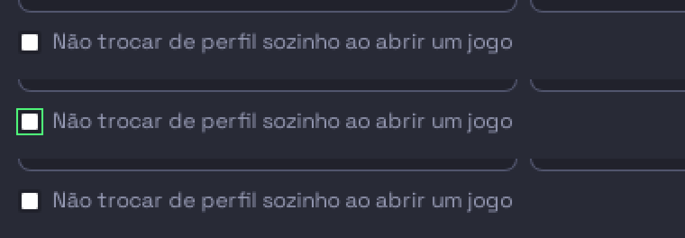
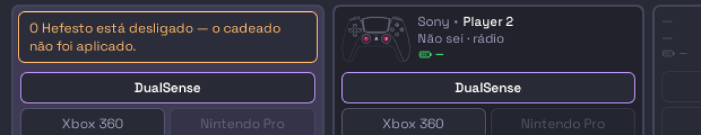

# ONDA5-01-03 — o verde que acendia sobre uma escrita que não aconteceu

**Agente F-ONDA5-01-03 · 06/09/2026 · branch `voo/ONDA5-01-03-F-ONDA5-01-03`**
Base conferida: `72690101` (`onda/atual-0609`), sem adiantar — nasceu na ponta.

---

## Em uma linha

O cadeado passou a piscar VERDE quando o serviço confirma, e **a sprint mediu
menos do que havia**: o gesto ignorava a resposta da ponte, então com o serviço
parado a caixa **já piscava verde** — e desmarcava 100 ms depois, pelo tique. O
verde não faltava; ele **mentia**.

---

## O que mudou

### O verde do cadeado passou a ser recibo do SERVIÇO, e não do clique

`src/hefesto_dualsense4unix/interface/pacotes/a01_jogar.py`, gesto `cadeado`:

```python
    pedido = _cadeado(ctx.state) != "sim"
    if p.autoswitch_lock_set(locked=pedido) is None:
        raise RuntimeError(CADEADO_RECUSA)
```

**A sprint dizia que o passo 3 esperava a `ONDA5-03-01` construir o pisca.** Ela
está `feita`, e ao medir o encaixe apareceu o resto: **o pisca já alcançava esta
caixa sozinho** — quem o acende é o pouso do piloto (`hefesto_vivo._gesto` anota
`"aplicou"` no ramo sem exceção, o `finally` leva o desfecho a `_pousou`, e o
`voltouDoVoo` veste `hef-deu-certo` por `MS_DA_PISCADA` **no elemento clicado**).
Não havia campo novo a endereçar, e a sprint já previa isso ("zero campo novo").

**E O ENDEREÇO QUE ELA NOMEOU É O MESMO ELEMENTO.** A sprint mandava pedir o
verde "pelo endereço que a caixa já tem" — `data-campo="cadeado"`. O piloto
endereça o pouso pelo **número do voo** que o ouvinte carimbou no nó clicado, e
esse nó é exatamente o `<input>` que carrega o `data-campo` e o `data-gesto`
(`paginas/01-jogar.html:1841-1842`). Não havia nada a passar: seguir o mecanismo
da casa, em vez de inventar um segundo, é o que faz a piscada cair no lugar certo
sem uma linha nova de endereço.

**O que faltava não era pedir o verde: era ter o DIREITO de pedi-lo.**
`ipc_bridge.autoswitch_lock_set` devolve o estado que ficou valendo, e `None`
quando não houve resposta — e a linha antiga jogava esse retorno fora. Com o
serviço parado, o gesto voltava calado, o piloto anotava "aplicou" e a tela dizia
**guardei**; no tique seguinte `_cadeado` não achava `autoswitch_locked` e a
caixa **desmarcava**. Duas afirmações opostas com 100 ms entre elas.

**A guarda é `is None` e não uma comparação**, e a razão está medida no dono:
`_handle_autoswitch_lock` (`daemon/ipc_handlers.py`) responde `novo = bool(pedido)`
quando o `locked` vem no pedido — o toggle é só para quem não manda valor, e este
gesto sempre manda. Um bool que discordasse do pedido é ramo que este daemon não
tem como produzir; escrevê-lo seria inventar um desfecho para poder tratá-lo.

### A frase da recusa tem DONO, e ele é a janela antiga

`CADEADO_RECUSA = "O Hefesto está desligado — o cadeado não foi aplicado."`

É palavra por palavra a que `home_actions._on_home_autoswitch_lock_toggled` já
põe na tela dela no ramo `resultado is None`. **Nenhum texto de tela novo
nasceu** (§8 do protocolo: texto novo é decisão dela), e a régua da palavra —
que já conferia rótulo e dica contra o fonte da GTK — passou a conferir **as
três**.

### O fato caduco do fonte, SUBSTITUÍDO — e a régua que o impede de voltar

O fecho do gesto mandava procurar a caixa na bancada e dizia que o piloto abre o
publicado. **A metade que caducou:** a caixa está em
`interface/paginas/01-jogar.html:1841`, que é o que `onde.PUBLICADO` aponta.
**A metade que fica de pé, e agora está escrita com a razão certa:** o
`--prova-gesto` não clica esta caixa porque o gesto está em `PERIGOSOS`
(derivada do `grava=` do próprio decorador desde a `ONDA3-GESTO-DECLARA-01`) —
clicá-la GRAVA preferência dela no disco.

**A régua lê o ARQUIVO, nunca o docstring** (`test_o_cadeado_esta_publicado`): o
caminho sai de `onde.pagina(…, publicado=True)`, o número da linha sai da
leitura, e só então ela cobra a prosa. E o sentinela é a PALAVRA, não a frase —
pela lição de 05/09, em que citar literalmente o padrão vigiado transformou o
aviso no defeito que ele descrevia. Qualquer reformulação da afirmação morta
reprova igual.

### O dublê desta régua era mais frouxo que o serviço

`_PonteDeMentira.__getattr__` devolvia `True` para qualquer nome. O
`autoswitch_lock_set` do produto devolve **o estado que ficou valendo** — logo o
dublê afirmava `True` sobre um pedido de DESTRAVAR, e um dublê assim não tem como
revelar um gesto que ignora a resposta. Ele ganhou resposta própria, que **ecoa o
pedido como o daemon ecoa**, com `cadeado=` para as duas metades ruins do
desfecho. É a forma que esta casa já nomeou em 04/09 (*"o dublê do teste era
mais frouxo que a ponte real"*) e em 05/09 (*"três dublês eram mais frouxos que
o daemon vivo"*).

---

## Qual mordida prova

Cinco. Cada cura arrancada, a saída da reprovação, e a árvore devolvida
byte-idêntica (conferida com `diff -q` depois de cada uma). Saídas cruas em
`<scratchpad>/F-mordida-{A,B,C2,D,E}.txt`.

| # | a cura arrancada | quem reprovou, e com o quê |
| --- | --- | --- |
| **A** | a frase velha de volta no fecho do gesto | `test_o_cadeado_esta_publicado` — *"o fonte do gesto `cadeado` ainda manda quem lê procurar a caixa na bancada — e ela está PUBLICADA, em `…/paginas/01-jogar.html:1841`"* |
| **B** | o `is None` fora: `p.autoswitch_lock_set(...)` cru | `test_o_cadeado_confirma_em_verde` (*DID NOT RAISE RuntimeError*) **e**, no WebKit, `test_o_cadeado_nao_pisca_sobre_o_que_nao_foi_guardado` — *"a caixa piscou VERDE com o serviço sem responder"* |
| **C** | a exceção da ponte engolida por um `try/except` | a mesma régua do WebKit, na outra metade — *"a ponte levantou e a caixa piscou VERDE mesmo assim"* |
| **D** | o dublê frouxo de volta (`__getattr__` respondendo `True`) | `test_o_cadeado_confirma_em_verde` — *DID NOT RAISE*: com o dublê largo, a régua não alcança o caminho do `None` |
| **E** | `CADEADO_RECUSA` trocada por frase minha | `test_a_palavra_do_cadeado_e_a_que_ela_ja_leu` — a frase não está no fonte da GTK |

**A MORDIDA QUE IMPORTA É A B, e ela é a que a sprint pediu**: *o verde não pode
acender quando o produto não confirmou*. Ela reprova **no DOM**, não no desfecho
— a asserção que caiu é a da classe `hef-deu-certo` na caixa, depois de um clique
de verdade.

---

## A prova de tela

**No WebKit vivo, com o piloto do produto e a página PUBLICADA** — a régua
`no_webkit` (fixture de módulo, `test_a_aba_01_jogar_fecha_as_linhas.py`) abre
`01-jogar.html`, espera o `BOOTSTRAP` instalar, clica a caixa com `el.click()` e
lê o CSSOM.

| a ponte responde | a caixa |
| --- | --- |
| o estado que ficou valendo | **pisca**, `outline` `rgb(80, 250, 123)`, e apaga sozinha em 1500 ms |
| `None` (serviço parado) | **não pisca** — e a frase vai para a tela |
| levanta | **não pisca** |



*A tira, recortada das três fotos da janela OCULTA: antes · no verde · na
recusa.* Fotos inteiras em `<scratchpad>/ONDA5-01-03-{antes,verde,recusa}.png`.

**E NADA DISSO TOCOU O DISCO DELA.** O dublê entra em `hefesto_vivo.ponte`, um
degrau ANTES do socket: nenhum `autoswitch.lock` saiu, nenhum
`save_autoswitch_locked` rodou. É o que torna medível um gesto que está em
`PERIGOSOS` — e a régua de clique do piloto continua, e deve continuar, sem
clicar esta caixa. **A bancada não foi exigida porque nenhum caminho meu para o
daemon, escreve no aparelho ou chama `systemctl`;** ela ficou LIVRE a sessão
inteira.

---

## O que NÃO verifiquei

1. **Não rodei a suíte inteira** — é de quem coordena e roda no fim. Rodei a
   minha posse e seis vizinhos: **159 verdes** (`test_a_aba_01_jogar_fecha_as_linhas`,
   `test_os_botoes_tem_dono`, `test_todo_gesto_que_grava_esta_protegido`,
   `test_a01_a_coluna_atencao_acende_o_mais_grave`, `test_a01_a_mesa_vazia_fala`,
   `test_a01_a_ponte_entra_na_coluna`, `test_o_recado_de_sucesso_pousa_no_cartao`).
2. **Não cliquei o cadeado com o daemon REAL.** É o gesto em `PERIGOSOS`, e
   clicá-lo gravaria a preferência dela. O caminho do sucesso está provado com
   dublê no WebKit; o caminho do `None` é, aliás, exatamente o que ela veria com
   o serviço parado.
3. **Não medi a piscada no tempo longo.** O número (`MS_DA_PISCADA`) é da
   `ONDA5-03-01` e a régua dela o guarda; eu medi o acendeu/apagou.
4. **Não abri o Playwright.** Ele não alcança o WebKitGTK, e o que muda aqui é
   comportamento de gesto, não geometria.
5. **Não mexi no desenho nem publiquei nada.** `aba01.py`, `interface/paginas/` e
   a bancada são `nao_toca`, e não havia o que mudar: o desenho e o publicado já
   batem.
6. **Não conferi as outras nove abas.** A guarda é local a este gesto — mas o
   achado do desfecho, logo abaixo, é sobre todas.

---

## O que sobrou para o próximo

### O DESFECHO É UMA CHAVE SÓ, e os dois eventos do mesmo clique disputam

**Achado ao medir, e é do piloto (`nao_toca`).** Um clique num `<input
type="checkbox">` chega DUAS vezes ao ouvinte (`click` e `change`), o piloto
despacha **uma thread por evento**, e as duas escrevem em
`self.desfechos["01-jogar.html:cadeado"]` — a MESMA chave. O `finally` de cada
uma lê essa chave para decidir se o pouso pisca.

Medido no log desta sessão, um clique com o serviço parado: `[gesto] → aplicado`
(o `click`, que sai pelo filtro de evento) **e** `[gesto falhou]` (o `change`).
Os dois desfechos existem ao mesmo tempo, e quem lê por último decide a cor.

**Hoje não vira verde falso**, e a razão é do JS: o `em_voo` do `change`
sobrescreve o `data-hef-voo` do `click` no mesmo nó, então o pouso do `click`
casa **zero** elementos. Mas é uma corrida, e a proteção é acidental. A cura mora
no `hefesto_vivo`: a chave do desfecho podia levar o número do voo.

**Não é do meu escopo curar, e nem do escopo o filtro:** o `return` calado no
evento que não grava é o padrão desta casa, escrito em três pacotes
(`a02_controles`, `a04_iluminacao`, `a10_perfis`) com a razão — *recusar dizendo
poria uma frase de erro na tela dela por um gesto que ela fez uma vez só*.

### A recusa de um controle de PÁGINA pousa no cartão de um controle

**Medido, com foto.** A caixa não mora em coluna de controle nenhuma, então o
ouvinte cai no `window.__hef.alvoPadrao` — e a `01` o preenche, porque a fita
dela ESCOLHE. Resultado: a frase do cadeado pousa no cartão do P1.



Ela **cobre o nome do controle** — a mesma medição que a `ONDA5-03-02` publicou
em 06/09 pela aba 03. Aqui há um agravante: o assunto não é daquele controle. Um
canal de rodapé para recado de página é decisão de tela (dela), e o endereço é do
piloto — os dois fora desta posse.

### `docs/data/paridade-gtk-html.csv`, linha 30 — duas metades mortas

**Fora da minha posse; o texto pronto é este.** O `porque` da linha do cadeado
fecha com:

> *"O QUE FICA ABERTO, e é de outra posse: `hefesto_vivo.PERIGOSOS` precisa de
> (`01-jogar.html`, `cadeado`) … Contido por acidente hoje (a caixa só existe na
> bancada), e quem PUBLICAR a 01 fecha isto antes."*

**As duas metades caíram, em dias diferentes:** `PERIGOSOS` deixou de ser lista
digitada e passou a ser DERIVADA do `grava=` (`pacotes.perigosos()`,
`ONDA3-GESTO-DECLARA-01`, 06/09) — conferido em execução, o par está lá; e a
caixa **está publicada** (`interface/paginas/01-jogar.html:1841`), então não há
contenção acidental nenhuma. Acrescentar, sem apagar a medição de 04/09:

> *"FECHADO em 06/09/2026: `PERIGOSOS` é derivada do `grava=` do decorador desde
> a `ONDA3-GESTO-DECLARA-01`, e o par (`01-jogar.html`, `cadeado`) sai dela
> sozinho. A caixa está publicada. E o desfecho ganhou sinal: o sucesso pisca
> verde 1,5 s (`03-Q4`) e o `None` da ponte recusa com a frase da janela antiga
> — ONDA5-01-03."*

O veredito `IGUAL` **não muda** — o que muda é o que continua aberto, que passou
a ser nada.

### O que a sprint previa e não era mais verdade

A seção 3 da sprint dizia *"esta aqui espera pela `ONDA5-03-01`: enquanto o pisca não
existir, o passo 3 fica parado"*. O pisca existe desde 05/09 **e já alcançava
esta caixa** — o que faltava era outra coisa, e maior. Fica o registro para quem
ler a sprint depois: a espera acabou, e o trabalho que sobrou não era o descrito.

---

## O estado da branch e dos portões

Um commit, tocando exatamente a posse (`a01_jogar.py`,
`test_a_aba_01_jogar_fecha_as_linhas.py`), mais o frontmatter da própria sprint e
esta entrega com as duas imagens.

**Os 45 portões: TODOS VERDES**, com a árvore inteira no índice (`git add -A`
antes, que é a regra — portão é cego a arquivo novo). Saída inteira em
`<scratchpad>/F-portoes.txt`.

Nenhum `install.sh`, nenhum `sudo`, nenhuma janela na tela dela — todas as
execuções do piloto foram OCULTAS, e a guarda anunciou o Xvfb em cada uma.
**Não rodei `scripts/costurar.sh`:** o despacho manda commitar só na branch e
deixar a costura para quem coordena.
