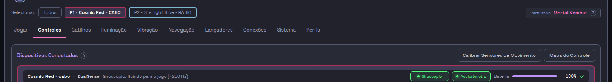

# ESQUELETO-C2 — o nome da janela, o centro e a maiúscula decorativa

**11/09/2026.** Árvore `../hefesto-voo/ESQUELETO-C2-opus`, branch
`voo/ESQUELETO-C2-opus`, nascida no `dev` de hoje (`f04f4a0b`).
Sprint: `docs/process/sprints/2026-09-11-ESQUELETO-C2-o-nome-da-janela-o-centro-e-a-maiuscula.md`.

**Três queixas dela. Uma virou cura + régua, uma virou proposta de uma linha, e
a terceira o que ela pediu já era: está certa, e o número prova.**

---

## §1 — A MAIÚSCULA DECORATIVA · CURADA, E COM RÉGUA

> *"Leia o cabo e acordado (ambos minusculo sem iniciar de forma capitular).*  <!-- noqa-acento: citação literal dela -->
> *Esse tipo de coisa não pode se repetir na interface."*  <!-- noqa-acento: citação literal dela -->

### O defeito, reproduzido com os valores do produto VIVO

A página publicada trazia `USB`/`BT` — as siglas do desenho. Quem escreve
`cabo`/`rádio` é o produto com o daemon no ar (`a02_controles.py:2791` no
endereço da fita, `:2620` no do cabeçalho do card). Com esses dois valores
postos, a tela dela é esta:

| | o que a tela dizia |
| --- | --- |
| fita | `P1 • Cosmic Red • CABO` · `P2 • Starlight Blue • RÁDIO` |
| card, 150 px abaixo | `Cosmic Red • cabo` · `P2 • Starlight Blue • rádio` |



### O `CABO` NÃO ESTAVA ESCRITO EM LUGAR NENHUM

O HTML dizia `cabo`. Quem gritava era **uma linha de folha de estilo** —
`.fita .chip .via{text-transform:uppercase}`, no `topo.html`, e por isso nas
**dez** páginas de uma vez.

Isso é o achado que decide o desenho da régua: *uma régua que lesse só o texto
das dez páginas daria verde sobre a tela que ela fotografou.*

### A cura é uma REVOGAÇÃO, e ela tem data dos dois lados

A regra nasceu em 08/09 de um pedido dela (TELA-TRES-01 §3): *"cabo e rádio
coloca maiúsculo."* Foi lida como CAIXA ALTA. **A leitura certa era a primeira
letra**, e quem diz isso é ela, em 30/08/2026:

> *"a maiúscula a regra é sobre a primeira letra a ser capitalizada, é o padrão*  <!-- noqa-acento: citação literal dela -->
> *do projeto"*  <!-- noqa-acento: citação literal dela -->

Foi por essa mesma regra que a caixa alta saiu dos rótulos de seção (`.sec-rot`)
em 30/08. A de 08/09 durou três dias e a tela cobrou o preço.

A regra saiu do `topo.html`; **o `<span class="via">` ficou** — ele é o
ENDEREÇO da via no rótulo do chip (`monta.rotulo_do_chip`), não um gancho de
estilo, e é por ele que a régua nova sabe onde olhar.


    fita   P1 • Cosmic Red • cabo   ·   P2 • Starlight Blue • rádio
    card   Cosmic Red • cabo        ·   P2 • Starlight Blue • rádio

As dez abas foram regeradas (`interface/regerar.py`) e publicadas
(`check_o_desenho_aprovado.py --publicar`): 10 de 10 mudaram.

### A RÉGUA — `scripts/check_a_maiuscula_decorativa.py`

Duas peneiras, e **uma sozinha daria verde sobre o defeito da outra**:

| | o que mede | hoje |
| --- | --- | --- |
| **§1 A FOLHA** | toda regra das dez páginas que sobe a caixa (`uppercase`, `capitalize`), com os comentários apagados | **zero** |
| **§2 O TEXTO** | toda palavra em caixa alta que a pessoa LÊ no produto, contra as declarações | **33 declaradas, zero sem declaração** |

Quem decide o que é "lido no produto" **não é a régua**: é
`interface.frases_que_ela_baniu.texto_visivel_no_produto`, que já é o dono
dessa leitura — inclusive do que a folha do piloto esconde. Duas cópias dessa
lógica seria o mesmo valor com dois donos.

**Fora de escopo, declarado:** o `<title>` do documento (nesta janela ninguém o
lê — mesma razão do `check_a_janela_nao_confessa`) e o conteúdo dos SELOS. A
peneira dos selos é **estrutural** (a classe do elemento), nunca uma lista de
palavras: um selo novo nasce coberto, e ênfase colada num selo continua pega.

**Portão:** `rapido|maiuscula-decorativa` e `rapido|maiuscula-decorativa-morde`
no `scripts/portoes.sh`, e a linha irmã no `.github/workflows/ci.yml` — o
portão-do-portão exige os dois.

### A LISTA DO QUE A RÉGUA ACHOU — 33 palavras, e NENHUMA é desta frente

Todas saem impressas a cada corrida, com o dono. **Não reprovam** (reprovar de
saída dezoito frases de outras frentes seria um portão desligado na
segunda-feira); o que a tabela impede é a dívida CRESCER calada.

**A. Rótulo de grupo do desenho do DualSense — 14, dono `interface/exportar.py:74-84`**

`CHASSI` · `BOTÕES DA FACE` · `DIRECIONAL` · `OMBROS E GATILHOS` ·
`ANALÓGICOS` · `CENTRO` · `ÁUDIO` · `SENSORES E MOTORES` · `GLIFOS` · `LUZES`

São `<title>` de grupo dentro do SVG — o nome acessível de cada pedaço. Pela
regra dela de 30/08 seriam «Chassi», «Botões da face».

**B. Ênfase decorativa dentro da prosa das dicas — 17**

| palavra | onde | dono |
| --- | --- | --- |
| `INTEIRO` | *"mede a rotação do controle INTEIRO"* | `exportar.py` · aba01 |
| `ESTE` | *"Ignora ESTE conselho"* | aba08 |
| `FICA` | *"O hub de bancada FICA"* | aba08 |
| `TEM` | *"uma entrada que TEM aparelho"* | aba08 |
| `TOTAL` | *"diminui o TOTAL do contador"* | aba08 |
| `MÁQUINA` | *"um ajuste da MÁQUINA"* | aba08 |
| `GABINETE` | *"os números são do GABINETE"* | aba08 |
| `OCUPAÇÃO` | *"falam só de OCUPAÇÃO"* | aba08 |
| `TODOS` | *"em TODOS os jogos instalados"* | aba09 |
| `UM` (2×) | *"cada punho tem UM motor e cada um recebe UM valor"* | aba05 |
| `MULTIPLICA` | *"Ela MULTIPLICA o degrau da coluna"* | aba05 |
| `TROCA` | *"Escolher uma curva pronta TROCA o modo"* | aba03 |
| `DERIVADO` | *"É DERIVADO do número do jogador"* | aba02 |
| `FONTE` | *"É o ganho da FONTE no sistema"* | aba02 |
| `JOGADOR` | *"o código da cor do JOGADOR"* | aba02 |
| `TAMBÉM` | *"passa a sair TAMBÉM no alto-falante"* | aba02 |
| `LIGADO` / `DESLIGADO` | *"só aparece com o Hefesto LIGADO."* | aba01 |

**C. A casa falando a língua de dentro — 2, e é assunto de outra régua**

`LINHAS_DO_TETO` e `RUMBLE_POLICY_MULT`, nomes de constante do produto citados
na dica da aba Sistema. Não é caixa alta: é `check_a_tela_nao_confessa`.

**Legítimas, e por isso não entram:** sigla e marca (`USB`, `BT`, `PC`, `LED`,
`FPS`, `SDL`, `GTK`, `IPC`, `HID`, `A2DP`, `HFP`, `GOG`, `GBA`, `COSMIC`…),
nome de botão do aparelho (`PS`, `L1`…`R3`, `ZL`, `ZR`), modelo (`AX211`,
`UB500`), cor em hexa e endereço de rádio mascarado, e os selos
(`LOCALIZADO`, `MUDO`, `ATIVO`, `OK`, `CERTO`, `AJUSTAR`, `NOTA`, `NÃO SEI`).

### A MORDIDA — as duas, feitas

1. **A cura arrancada.** Devolvi a regra ao `topo.html`, regerei as dez e
   publiquei: a régua reprovou **10 vezes**, uma por página, nomeando
   `01-jogar.html:312 .fita .chip .via{text-transform:uppercase}`. Devolvida a
   cura, verde.
2. **Cada peneira, no `tests/unit/test_portao_a_maiuscula_decorativa_morde.py`**
   — 17 funções, cada uma com a própria mordida escrita.

### A CICATRIZ QUE ESTA RÉGUA DEIXA, e ela é do dia em que nasceu

A primeira corrida acusou **306** caixas altas, quase todas prosa de comentário
de CSS. A causa: um comentário do `<style>` que CITA
`<span class="lanc-selo localizado">` — escrito para explicar por que a folha
não conhecia a classe nova — foi lido como abertura de selo de verdade. O
varredor saiu dali procurando o fechamento, atravessou o `</style>` e o apagou
junto: **a folha de estilo inteira virou "texto visível"**.

*O comentário que descreve o padrão vira a primeira ocorrência dele* — pela
sétima vez nesta casa, e desta vez dentro do instrumento feito para medi-la.

E a **segunda** cicatriz veio do próprio teste: a régua tratava qualquer par
`[0-9A-F]{2}` como código de máquina, para cobrir os octetos de
`AA:BB:CC:00:00:01`. Com isso o **`DA`** de «BOTÕES DA FACE» saía calado — uma
preposição do português perdida porque as duas letras dela também são dígitos
hexadecimais. Quem pega o endereço é a FORMA INTEIRA dele, nunca o pedaço.

---

## §2 — O CENTRO · MEDIDO, E A CONTA ESTÁ CERTA

> *"Não conseguimos centralizar a interfcace? tipo o bloco que contém todos os*  <!-- noqa-acento: citação literal dela -->
> *demais elementos?"*  <!-- noqa-acento: citação literal dela -->

**OS DOIS NÚMEROS, na vista dela (1918x840), nas DEZ abas publicadas:**

```
sobra da ESQUERDA   159 px
sobra da DIREITA    159 px
```

Iguais ao pixel, nas dez, **nos dois motores**:

| motor | como | esq · dir |
| --- | --- | --- |
| Chrome (Playwright, `--vista dela`) | as dez páginas publicadas | **159 · 159** |
| **WebKitGTK 2.52 — o motor DELA** | `JanelaDaAba` oculta, com a `FOLHA_DA_CASA` do produto, sem daemon | **159 · 159** |

A conta: vista 1918 − recuo de 16 do `body` de cada lado = 1886 de caixa; a
`.janela` para em `min(100%,1600px)` = 1600; `(1886 − 1600) / 2 = 143`, mais os
16 do recuo = **159**. Sem barra de rolagem vertical (`innerWidth −
clientWidth = 0`) e sem rolagem lateral em nenhuma das dez.

**E o conteúdo DENTRO da moldura também está centrado:** 19 px de folga de cada
lado, nas dez. As páginas avulsas idem — `mapa-do-controle` 59 · 59,
`calibrar-sensores` e `mapa-das-portas` 369 · 369.

### Então o que ela viu não é a horizontal — é a VERTICAL, e já tem dono

Na mesma vista, a altura não fecha simétrica:

```
acima da .janela    16 px   (o recuo do body)
a .janela          777 px   (--alt-janela, o mesmo pixel nas dez)
abaixo dela         47 px   (16 de recuo + 31 que ninguém usa)
```

O bloco senta **31 px acima do centro**. É a faixa escura entre o rodapé
«Aplicar · Salvar Perfil» e a moldura da janela.

**NÃO MEXI, e é decisão, não omissão.** Esses 31 px são a
**ALTURA-DA-VISTA-01**, que mediu a tela dela pixel a pixel em 09/09 e já tem a
palavra dela: *"«1 + rodapé»"* — a altura passa a SEGUIR a vista, com o
cabeçalho e o rodapé encolhendo. **Essa cura faz a sobra desaparecer**;
centralizar verticalmente agora seria repartir um vão que a sprint seguinte vai
eliminar — e ela também toca o `topo.html`, com `depois_de: ESQUELETO-C2` no
frontmatter.

*Um "centralizei" aqui seria um centímetro de CSS por cima de uma decisão dela
que já existe.*

---

## §3 — O NOME DA JANELA · A PROPOSTA, com a linha exata

> *"no nome da janela não conseguimos deixar Hefesto - DualSense4Unix ao invés*  <!-- noqa-acento: citação literal dela -->
> *de só hefesto?"*  <!-- noqa-acento: citação literal dela -->

### O ENDEREÇO DA SPRINT NÃO É O DO PRODUTO — medido

A sprint aponta `interface/ver.py:158`. **Aquele é o VISOR**, não o que ela
abre. O produto é `interface/hefesto_vivo.py`, e ele constrói a janela em
`hefesto_vivo.py:2392` **sem passar `titulo=`** — logo o título dela sai do
PADRÃO do parâmetro:

```
src/hefesto_dualsense4unix/gui/ponte_da_tela.py:422        titulo: str = "Hefesto",
```

Esse valor vai para os dois lugares que ela lê: `Gtk.Window(title=…)` (:492) e
`barra.set_title(titulo)` (:517).

### A LINHA EXATA — e o nome já existe no produto, escrito por ela

O `<h1>` das dez páginas (`topo.html:781`) já diz **`Hefesto — DualSense4Unix`**,
com o travessão e o «S» maiúsculo. A moldura tem de dizer o que a página diz.

```diff
 src/hefesto_dualsense4unix/gui/ponte_da_tela.py:422
-        titulo: str = "Hefesto",
+        titulo: str = "Hefesto — DualSense4Unix",
```

E a mesma no visor, para as duas janelas não divergirem:

```diff
 src/hefesto_dualsense4unix/interface/ver.py:158
-    barra.set_title("Hefesto")
+    barra.set_title("Hefesto — DualSense4Unix")
```

**Não apliquei:** `ponte_da_tela.py` é posse da ALTURA-DA-VISTA-01 e `ver.py` da
TOOLTIP-C1, as duas em voo.

**ENSAIADO NESTA ÁRVORE e desfeito** (`git status` limpo dos três arquivos): com
a mudança posta, `JanelaDaAba.__init__` passa a nascer com o nome longo e
`scripts/check_a_janela_nao_confessa.py` fecha **rc=0** — a moldura não passa a
falar a língua de dentro.

### A DÍVIDA QUE ISSO REVELA, e ela é de outra frente

`utils/identidade.py:96` — o dono único de como o produto se chama — diz
`nome_longo="Hefesto - Dualsense4Unix"`, com **`s` minúsculo**, enquanto a tela
dela diz `DualSense4Unix`. São **306 ocorrências** da grafia com `s` minúsculo
em 110 arquivos (CLI, TUI, empacotamento, docstrings).

Por isso a proposta acima **digita** o nome em vez de lê-lo do dono: ler do dono
hoje poria `Dualsense4Unix` na barra, que não é o que ela pediu nem o que a
página mostra. O caminho limpo — a janela lendo de `identidade` — só existe
depois de alguém decidir a grafia nos 306 lugares, e isso é sprint própria.

---

## O QUE FICOU NA ÁRVORE

| arquivo | o quê |
| --- | --- |
| `src/…/interface/topo.html` | a regra de caixa alta da via SAIU, com a revogação datada |
| `src/…/interface/monta.py` | `rotulo_do_chip`: o `<span class="via">` passa a ser o ENDEREÇO da via, não o gancho do estilo |
| `mockup/NN-*.html` · `src/…/interface/paginas/NN-*.html` | as dez regeradas e publicadas |
| `scripts/check_a_maiuscula_decorativa.py` | **novo** — a régua das duas peneiras |
| `tests/unit/test_portao_a_maiuscula_decorativa_morde.py` | **novo** — 17 mordidas |
| `scripts/portoes.sh` · `.github/workflows/ci.yml` | os dois portões novos |
| `tests/unit/test_tela_tres_a_altura_e_a_caixa_alta.py` | a régua de 08/09 media o contrário; reescrita para o inverso |
| `tests/unit/test_a_fita_diz_o_controle_que_esta_na_mesa.py` | uma nota: a decisão que a docstring citava caiu |

## OS PORTÕES — 56 de 58, e os DOIS vermelhos não são desta frente

`git add -A && bash scripts/portoes.sh`, depois do `git add`:

```
desenho-aprovado ok · colisao-de-sprints ok · tela-nao-confessa ok
janela-nao-confessa ok · maiuscula-decorativa ok · maiuscula-decorativa-morde ok
ruff ok · mypy ok · shellcheck ok · anonimato ok
REPROVOU: 2 vermelho(s) de 58 -> referencias-docs acentuacao
```

**Os dois já estavam vermelhos no `dev` de hoje**, e nenhum arquivo deles foi
tocado por mim (`git diff --name-only HEAD` devolve zero para os dois):

| portão | o quê | de quem |
| --- | --- | --- |
| `referencias-docs` | 5 referências mortas: `docs/process/agentes/2026-09-11/LINGUA-A{1..5}-opus.md`, os relatórios que as cinco frentes da onda A ainda não escreveram | fecham sozinhas quando elas entregarem |
| `acentuacao` | 3 violações no ÍNDICE da onda, e as três são **citação literal dela** sem o marcador: `…INDICE.md:89` («paginas») e `:94` («codigo», 2×) | `posse: COORDENA` |

**A cura do segundo é o marcador, não a palavra dela** (*a citação dela não se
limpa*): pôr ` <!-- noqa-acento: citação literal dela -->` no fim das linhas 89
e 94 do `2026-09-11-A-SEGUNDA-LISTA-DELA-…-INDICE.md`. Não apliquei porque o
arquivo é posse de quem coordena — mas ele barra qualquer agente desta onda que
rode o portão completo.

**Suíte, os lotes que tocam esta frente:** 130 testes de fita/topo/tela verdes,
mais 39 de palavra-de-tela, ponte e retratista. A suíte inteira é de quem
coordena.

**Nenhuma janela nasceu na tela dela:** Chrome headless e `Gtk.OffscreenWindow`
sob o Xvfb da `tela_de_mentira`; `HEFESTO_SEM_JANELA=1` em toda corrida.
