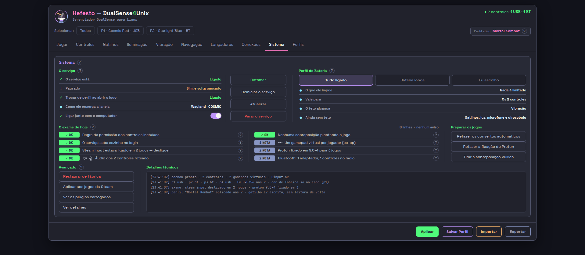
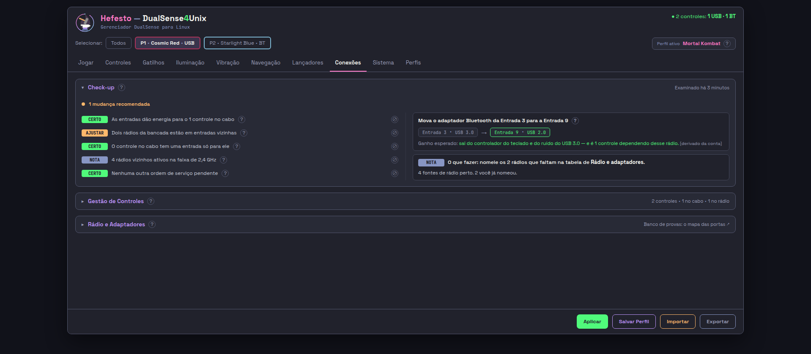

# LINGUA-A1 — a língua da aba Sistema (09) e da aba Conexões (08)

**11/09/2026.** Proposta de texto, não commit de tela. Ordem dela:
*"Pra apresentarem as propostas tá bom?"* <!-- noqa-acento: citação literal dela -->

**Nenhuma frase foi trocada no gerador.** Nada foi publicado. Nada saiu da
posse da sprint.

---

## §0 — O RESUMO EM SETE LINHAS

| | |
| --- | --- |
| **textos vistoriados** | **291 blocos de texto na tela** (79 na 09 + 212 na 08) **+ 68 frases de recado/recusa** que os dois pacotes emitem = **359** |
| **propostas** | **78** — 41 na Sistema, 37 na Conexões |
| **a conta, na tela** | **16.677 → 9.824 caracteres** (**−6.853, −41%**) nas frases tocadas |
| **a conta, por aba** | Sistema **8.624 → 6.157** (−29%) · Conexões **15.324 → 10.938** (−29%, sem o SVG do desenho, que não é desta posse) |
| **a maior** | o `?` do **Desempenho**: 1.061 → 297 caracteres |
| **o que achei e não é língua** | 10 defeitos medidos, na §4 — três deles são **decisão desta casa que a tela não cumpriu** |
| **o que NÃO propus** | 14 itens, na §5, com a razão de cada um |

---

## §1 — A FOTO DO ANTES, na vista dela (1918x840)

Tiradas com o retratista, sem abrir janela nenhuma na tela dela:

```
PYTHONPATH=$PWD/src .venv/bin/python \
  src/hefesto_dualsense4unix/interface/olhar.py 09-sistema.html --publicado --vista dela
  → {"caixa":"janela","larg":1600,"alt":777,"vista":"1918x840","passa_da_dobra":0,"rolagem_lateral":false}
  → interface/paginas/09-sistema.html

  … 08-conexoes.html --publicado --vista dela
  → {"caixa":"janela","larg":1600,"alt":777,"vista":"1918x840","passa_da_dobra":0,"rolagem_lateral":false}
  → interface/paginas/08-conexoes.html
```





**O que a foto do 08 NÃO mostra, e é metade da aba:** os quadros *Gestão de
Controles* e *Rádio e Adaptadores* nascem fechados (decisão dela, 30/08:
*"inicia as demais abas de gestão e rádio minimizadas"*). <!-- noqa-acento: citação literal dela -->
O texto dos dois foi vistoriado no HTML publicado, que traz tudo, e é de lá
que saem os endereços da §3.

---

## §2 — COMO A VISTORIA FOI FEITA

O texto não foi lido no gerador: foi extraído **da página publicada**
(`interface/paginas/NN-*.html`), que é o que o `WebKit2.WebView` renderiza, e
depois reconduzido ao arquivo que o escreve. O extrator pega **todo nó de
texto mais os atributos `title`, `placeholder`, `aria-label` e `alt`**, e só
o miolo da aba — o cabeçalho, a tira e o rodapé são do esqueleto, que não é
desta posse.

O que isso mediu:

| | Sistema (09) | Conexões (08) |
| --- | --- | --- |
| itens de texto no miolo | 203 | 732 |
| strings distintas | 156 | 319 |
| — das quais o SVG do controle | 3 | **77** (o desenho inteiro, ×4 cartões) |
| **blocos de texto fora do SVG** | **79** | **212** |
| caracteres na tela | 8.624 | 21.812 (**15.324** sem o SVG) |
| — em `title` (as dicas) | 2.840 (33%) | 6.503 (30%) |

**Um terço do texto das duas abas mora em dica.** É exatamente onde ela
mandou cortar, e é onde as propostas mais pesam.

---

## §3 — A TABELA

Uma linha por texto. `×N` na coluna do endereço quer dizer que a frase aparece
N vezes na tela (uma por cartão de controle, uma por linha do exame, uma por
adaptador) — a conta da §6 usa esse número.

### §3.1 — Aba 09 · Sistema

#### As cinco dicas de faixa (`?`)

| onde | o que a tela diz hoje | proposta | por quê |
| --- | --- | --- | --- |
| `aba09.py:1180` | *"Esta aba é sobre a **máquina**, não sobre um controle: o serviço que fala com os 2, os gamepads virtuais que ele cria para os jogos, o exame do que costuma brigar com controle nesta máquina, e os gestos raros.<br><br>Por isso a fita lá em cima está apagada — nada aqui muda de controle para controle."* | **"Esta aba é sobre o computador, não sobre um controle. Por isso a fita de controles está apagada aqui."** | A lista de quatro itens repete os quatro títulos que já estão na tela abaixo dela (pergunta 4). *"lá em cima"* é referência de lugar: muda com o layout e obriga o tradutor a olhar a tela. **289 → 101** |
| `aba09.py:1081` | *"O serviço é o Hefesto rodando em segundo plano. (…) **Reiniciar** resolve a maioria dos travamentos e não perde nenhum ajuste seu, em nenhum dos 2.<br><br>**Retomar** só acende quando o serviço está pausado. A pausa fica gravada em disco e **sobrevive a desligar o computador**: sem este botão, ele renasce pausado."* | **"O Hefesto rodando por trás. Sem ele, o Linux vê 2 gamepads comuns e nada mais. Parar aqui não é o mesmo que desligar o Hefesto na aba Jogar: lá ele só sai do meio do jogo."** | Os parágrafos de *Reiniciar* e de *Retomar* repetem, quase palavra por palavra, o `title` dos próprios botões, a três centímetros (pergunta 4). Sobra o que não está em nenhum outro lugar. **508 → 171** |
| `aba09.py:1105` | *"O que fica ligado em todos os controles (…) **Tudo ligado** — nada é limitado (…) **Bateria longa** — põe teto na vibração: 30% da força. **Eu escolho** — você decide item a item (…) É o perfil **geral**: vale para os 2 controles. Cada um pode sobrepô-lo na linha dele."* | **"Quanto os controles podem gastar de bateria. Vale para os 2, e cada um pode ter o seu na aba Conexões. Nenhum ajuste seu é apagado."** | As três linhas do meio são derivadas de `ROTULOS_DOS_PERFIS` e saem **idênticas** no `title` dos três botões logo abaixo. E *"na linha dele"* não diz onde: a aba Conexões diz. **394 → 131** |
| `aba09.py:1113` | *"(…) o **?** ao lado dela diz o que foi visto, por que importa e o que fazer.<br><br>O selo carrega **símbolo e cor** juntos, para quem não distingue verde de laranja ler o estado pelo desenho.<br><br>Os três botões à direita **já rodaram sozinhos neste exame** — é por isso que os achados falam no passado (…)"* | **"O que costuma brigar com os controles neste computador. Passe o mouse numa linha para ler o que foi visto e o que fazer. Os consertos já rodaram; os botões ao lado servem para repetir."** | **A frase promete um `?` que o produto não tem** — ver §4.1. O parágrafo do selo explica uma escolha de desenho nossa, e o último explica por que ESCREVEMOS no pretérito: é a casa falando com a casa. **493 → 184** |
| `aba09.py:1125` | *"Gestos raros. **Restaurar de fábrica** devolve o perfil de fábrica e pergunta antes (…) **Aplicar aos jogos da Steam** põe a linha de inicialização (…) por uns 20 segundos (…) O painel ao lado é a saída crua do Hefesto (…)"* | **"Gestos raros. O painel ao lado é a saída crua do Hefesto: copie daqui para relatar um problema."** | Os dois primeiros parágrafos são o `title` dos dois primeiros botões, reescritos. **443 → 95** |

#### As linhas de estado

| onde | hoje | proposta | por quê |
| --- | --- | --- | --- |
| `aba09.py:1197` | rótulo **"O serviço está"** | **"Serviço"** | Rótulo + valor formam frase partida em duas colunas (*"O serviço está │ Ligado"*). É a construção que mais quebra na tradução: em muitas línguas o verbo concorda com o valor, que a tela não conhece. As outras três linhas do bloco já são rótulo puro. |
| `aba09.py:1198` | valor **"Sim, e volta pausado"** | **"Sim — e continua depois de reiniciar"** | *"volta pausado"* exige saber que *voltar* quer dizer *ligar o computador de novo*. A dica da mesma linha gasta 144 caracteres explicando isso; dito no valor, a dica encolhe. |
| `aba09.py:1198` | `title`: *"A pausa fica gravada em disco e sobrevive a desligar o computador. O botão Retomar, ao lado, é a saída — até 27/08/2026 só o terminal saía dela."* | **"O botão Retomar, ao lado, tira o serviço da pausa."** | *"até 27/08/2026 só o terminal saía dela"* é a nossa história de obra na tela dela. *"gravada em disco"* é como fazemos; o efeito já está no valor. **144 → 50** |
| `aba09.py:1200` | rótulo **"Como ele enxerga a janela"** | **"Ambiente gráfico"** | O rótulo descreve a mecânica interna, e *"ele"* não tem antecedente na linha. O valor é `Wayland · COSMIC` — um ambiente gráfico, não um modo de enxergar. |
| `aba09.py:1200` | `title` = o próprio valor (`Wayland · COSMIC`) | **"É por ele que o Hefesto descobre qual janela está na frente."** | A dica repete o valor que está ao lado (pergunta 4) e some com a única coisa que o rótulo novo não diz: por que isto importa. |

#### Os botões do serviço

| onde | hoje | proposta | por quê |
| --- | --- | --- | --- |
| `aba09.py:1206` | `title` do **Retomar**: *"Tira o serviço da pausa agora. Só acende com a pausa ativa — e ela sobrevive a desligar o computador."* | **"Tira o serviço da pausa."** | *"Só acende com a pausa ativa"* descreve o botão para quem já o está vendo aceso — é a única forma de ler esta dica. O resto repete a linha *Pausado*, acima. **101 → 24** |
| `aba09.py:1207` | rótulo **"Corrigir modo de execução"** | **"Corrigir o serviço"** | *"modo de execução"* é vocabulário de quem construiu. O que acontece no clique é: o serviço sai e sobe do jeito certo. |
| `aba09.py:1207` | `title`: *"Aparece no lugar do «Reiniciar o serviço» quando o serviço está de pé por fora do sistema: ali reiniciar não funciona (…)"* | **"O serviço está de pé por fora do sistema, e ali reiniciar não funciona. Este botão o faz sair e subir do jeito certo. Nada do que você ajustou se perde."** | A dica começa explicando **onde o botão aparece** — e ela só é lida quando ele já apareceu. **250 → 152** |
| `aba09.py:1208` | `title` do **Reiniciar**: *"(…) não perde nenhum ajuste seu."* | **"Para e liga de novo. Resolve a maioria dos travamentos, e nenhum ajuste seu se perde."** | *"não perde nenhum ajuste seu"* põe o programa como sujeito de uma perda; a voz passiva diz a mesma coisa sem sugerir que ele poderia perder. |
| `aba09.py:1210` | `title` do **Parar o serviço**: *"(…) Não é o interruptor Hefesto da aba Jogar, que só o tira do meio do jogo. Pergunta antes (…)"* | **"O Hefesto deixa de rodar e os 2 viram gamepads comuns do Linux. Pergunta antes, dizendo o que se perde."** | A frase do meio é o `?` da faixa, a três centímetros, dita de novo. **176 → 103** |

#### O Perfil de Bateria

| onde | hoje | proposta | por quê |
| --- | --- | --- | --- |
| `aba09.py:1236` | rótulo **"O que ele impõe"** | **"Limite"** | *Impor* é verbo de autoridade, não de limite, e *"ele"* de novo sem antecedente. O valor (`Nada é limitado`) já traz o verbo. |
| `aba09.py:1236` | `title`: *"(…) O degrau vem de **RUMBLE_POLICY_MULT**, no daemon — nenhum número escrito nesta tela."* | **"O que este perfil limita hoje, em todos os controles."** | `RUMBLE_POLICY_MULT` é identificador de código na tela dela, e a frase em volta (*"nenhum número escrito nesta tela"*) é um recado de quem desenvolve para quem desenvolve. **135 → 53** |
| `aba09.py:1237` | `title` do **Vale para**: *"É o teto geral. Cada controle pode sobrepô-lo na linha dele (…)"* | **"É o limite geral. Cada controle pode ter o seu na aba Conexões, e o campo de lá diz qual está valendo."** | *"na linha dele"* não diz onde; e *teto* sai junto com as outras três (abaixo). |
| `aba09.py:1238` | rótulo **"O teto alcança"** | **"Com limite"** | **"Teto" é metáfora de bancada.** A tradução literal não diz limite de força em língua nenhuma, e a §0 dela manda o oposto: *linguagem universal*. Com *Com limite* / *Sem limite* o par se lê numa passada. |
| `aba09.py:1238` | `title`: *"(…) Sai de **LINHAS_DO_TETO**, no produto — nenhum nome escrito nesta tela."* | **"Onde o limite do perfil age hoje."** | Mesmo caso do `RUMBLE_POLICY_MULT`. **110 → 33** |
| `aba09.py:1239` | rótulo **"Ainda sem teto"** | **"Sem limite"** | *"Ainda"* promete que um dia terá — promessa sobre trabalho nosso, na tela. |
| `aba09.py:1239` | `title`: *"Estes ficam livres do teto do perfil. Quando um ganhar limite próprio, ele sai desta lista sozinho."* | **"Estes ficam livres do limite do perfil."** | A segunda frase descreve o comportamento do nosso código, não o do aparelho. **99 → 39** |

> **A troca `teto` → `limite` vale nas DUAS abas desta frente** (ver a 08,
> abaixo). Feita só numa, a tela passa a ter duas palavras para a mesma coisa,
> que é o defeito que a §0 nomeia.

#### O exame e os botões de conserto

| onde | hoje | proposta | por quê |
| --- | --- | --- | --- |
| `aba09.py:1287` | `title` do **Refazer os consertos automáticos**: *"Sem senha e sem fechar nada: arruma o áudio (…) O exame já rodou isto — o botão refaz."* | **"Arruma o áudio dos 2 controles, desliga o Steam Input onde ele atrapalha e põe a linha de inicialização nos jogos. Sem senha e sem fechar nada, e com cópia de segurança."** | *"O exame já rodou isto — o botão refaz"* é o `?` da faixa, que já diz isso **para os três botões**. **217 → 169** |
| `aba09.py:1288` | `title` do **Refazer a fixação do Proton**: *"(…) e diz o motivo **em português** quando não dá."* | **"Trava de novo o Proton que você validou nos jogos escolhidos. Quando não dá, diz o motivo."** | **"em português" é a frase menos traduzível do produto** — num produto traduzido ela vira falsa por construção. É o caso exato que a §0 dela descreve. |
| `aba09.py:1289` | `title` do **Tirar a sobreposição Vulkan**: *"(…) **Já medimos** tirar no jogo que engasgava e o engasgo continuou — não prometo que resolve."* | **"Mostra, jogo por jogo, a sobreposição Vulkan pendurada por dentro, e só então tira. Guarda cópia do arquivo. Tirar pode não resolver o engasgo."** | O aviso honesto **fica** — é fato do mundo. O que sai é a nossa bancada (*"já medimos"*), que põe o laboratório na tela dela. **217 → 143** |
| `aba09.py:1300` | `title` do **Restaurar de fábrica**: *"(…) os seus perfis salvos continuam onde estão."* | **"(…) os seus perfis salvos ficam onde estão."** | *"continuam onde estão"* insinua movimento possível; *ficam* é o fato. |
| `aba09.py:1301` | `title` do **Aplicar aos jogos da Steam**: *"(…) em **TODOS** os jogos instalados, preservando as opções que você já tem e deixando cópia de segurança ao lado de cada arquivo (…)"* | **"Põe a linha de inicialização do Hefesto em todos os jogos instalados, sem perder as opções que você já tem e com cópia de segurança. Pergunta antes: precisa fechar a Steam por uns 20 segundos."** | *TODOS* em versal grita uma palavra que o resto da frase já garante; dois gerúndios encadeados (*preservando… deixando…*) são a construção que pior sobrevive à tradução. **224 → 192** |
| `aba09.py:1302` | rótulo **"Ver os plugins carregados"** | **"Ver os plugins"** | *"carregados"* distingue de um estado que a tela não oferece. |
| `aba09.py:1302` | `title`: *"Lista os plugins do **daemon** e relê. **Hoje só o terminal alcança isso.**"* | **"Lista os plugins do serviço e relê."** | *daemon* é palavra da casa (a aba inteira já diz **serviço** desde 31/08 — e esta linha ficou para trás). E a última frase **manda a pessoa para o terminal**, que a régua da casa proíbe. **67 → 35** |
| `aba09.py:1303` | `title` do **Ver detalhes**: *"**Joga** as últimas 80 linhas (…)"* | **"Põe as últimas 80 linhas do registro técnico no painel ao lado."** | *Jogar* é figura de linguagem; o verbo neutro é o que o tradutor acerta sem contexto. |
| `aba09.py:994` | *"(…) gatilho, luz e vibração ficam mudos **nos quatro**."* | **"(…) gatilho, luz e vibração ficam mudos."** | **O "quatro" é digitado** numa aba onde tudo o mais é contado (§4.4). Com dois controles na mesa, a frase mente. Aqui o número não acrescenta nada: a regra vale para todos. |
| `aba09.py:1021` | *"É também por isso que `/dev/input/js*` tem 6 nós para 4 aparelhos."* | **(sai)** | Caminho de kernel na tela. Está na mesma família de `uinput` e `hidraw`, que o glossário proíbe, e a frase acima já explicou o co-op inteiro. **64 → 0** |

#### Os recados que o pacote emite

| onde | hoje | proposta | por quê |
| --- | --- | --- | --- |
| `a09_sistema.py:1980` | *"Não consegui falar com o **systemd**"* | **"Não consegui falar com o sistema."** | `systemd` é nome de programa do Linux, não da tela. |
| `a09_sistema.py:2019` | *"Não consegui perguntar ao systemd se o serviço liga sozinho — e sem saber o estado de agora, o interruptor não adivinha."* | **"Não consegui saber se o serviço liga sozinho, então o interruptor não se mexe."** | *"o interruptor não adivinha"* é personificação; e a explicação do porquê é duas vezes a mesma. **120 → 78** |
| `a09_sistema.py:2359` | *"Não liguei o serviço, e o **systemd** nem chegou a ser chamado: ou esta máquina não tem a **unit** instalada (o instalador nunca rodou aqui), ou já há um Hefesto vivo fora do systemd — e nesse caso subir a unit criaria um segundo."* | **"Não liguei o serviço. Ou esta máquina não tem o Hefesto instalado pelo sistema, ou já há um Hefesto rodando por fora — e subir outro criaria um segundo."** | Três ocorrências de vocabulário de administração de sistema num recado que ela lê quando **nada funcionou**. **222 → 152** |
| `a09_sistema.py:2516` | *"O serviço não está em **modo improvisado** — não há modo a corrigir agora."* | **"O serviço já sobe pelo sistema — não há o que corrigir."** | *"modo improvisado"* só existe no vocabulário desta casa; e a frase diz duas vezes *modo*. |
| `a09_sistema.py:2521` | *"O Hefesto **improvisado** não saiu quando pedi (…)"* | **"O Hefesto que roda por fora não saiu quando pedi (…)"** | Mesma palavra, mesmo motivo. |
| `a09_sistema.py:2802` | *"Vou rodar 3 **conserto(s) automático(s)**, sem pedir senha e sem fechar nada."* | **"Vou rodar 3 consertos automáticos, sem pedir senha e sem fechar nada."** | **O plural entre parênteses não existe em língua nenhuma além da nossa** e não tem como ser traduzido: em inglês são duas formas, em russo são três. O número já está na frase; a casa já tem `_plural()` (`aba08.py`) para isto. |
| `a09_sistema.py:2811` | *"Steam Input ligado em 2 **jogo(s)**: …"* | **"Steam Input ligado em 2 jogos: …"** | idem |
| `a09_sistema.py:3007` | *"4 **plugin(s) carregado(s)**"* | **"4 plugins carregados"** | idem |
| `a09_sistema.py:2707` | *"A Steam está aberta — feche-a e clique de novo. **Não travo** o Proton com a Steam viva **porque ela regrava o arquivo ao sair** e a mudança seria perdida."* | **"A Steam está aberta — feche-a e clique de novo. Com ela aberta a mudança seria perdida ao sair."** | A primeira pessoa (*"não travo"*) e a causa mecânica ocupam a linha sem mudar o que ela tem de fazer, que a primeira frase já disse. **147 → 95** |

### §3.2 — Aba 08 · Conexões

#### As quatro dicas de quadro (`?`)

| onde | o que a tela diz hoje | proposta | por quê |
| --- | --- | --- | --- |
| `aba08.py:3398` | *"Um exame da **sala** (…)<br><br>É a resposta para 'por que o controle no rádio engasga **aqui** e não engasga na casa de outra pessoa'.<br><br>O exame **não muda nada sozinho** (…)<br><br>As duas perguntas que **só você** pode responder — a altura do dongle e se tem gente entre ele e o sofá — **mudaram de lugar em 28/08**: elas moram no **Mapear Entradas** (…)"* | **"Um exame da sala: em que entradas os aparelhos estão, quanta energia elas dão e quem mais está falando no rádio perto do seu adaptador. Ele não muda nada sozinho: quando acha algo, aparece ao lado uma ordem de serviço dizendo o que mover para onde."** | O 2º parágrafo é propaganda: não diz o que fazer. O 4º **conta a nossa mudança de 28/08** — data de obra nossa na tela dela — e manda procurar perguntas noutra janela, que o botão «Mapear Entradas» já abre. **561 → 248** |
| `aba08.py:3550` | *"Uma linha por controle **ligado** (…) clicar em outro abre ele e fecha os demais (…) **A borda** é a cor do plástico (…) porque uma borda colorida seria uma cor que ninguém leu (…) **A barra de luz** (…) é a cor canônica do jogador (`core/led_control.player_slot_color`).<br><br>**O microfone segue o transporte** (…) As 16,3 turnos que ele custa no rádio são **consequência** (…)"* | **"Uma linha por controle ligado. A linha fechada diz o que o jogo vê como, o microfone e a bateria — as três são leitura aqui; quem as governa é outra aba. A borda e o desenho usam a cor lida do aparelho; sem leitura, ficam neutros. A barra de luz não é essa cor: é a cor do jogador."** | **A maior dica da aba, e a que menos ajuda.** O parágrafo do acordeão descreve o clique que a pessoa acabou de dar; `core/led_control.player_slot_color` é código-fonte na tela; e o parágrafo do microfone é o `?` do bloco do microfone, dentro do mesmo cartão, dito de novo. **1.080 → 281** |
| `aba08.py:3641` | *"**Mapear Entradas** abre o desenho (…) É lá que ficam, **desde 28/08**, as duas perguntas (…) Enquanto isso corre, o que você aperta não vaza para o jogo aberto (…) O sistema entrega o **nome cru**; quem sabe o que é, é você."* | **"«Mapear Entradas» numera as entradas do seu gabinete — depois disso a tela diz «Entrada 9» em vez de «porta 3-2.1». «Mapear Entrada a Entrada» é um toque por aparelho: você pluga, ele aprende. Os rádios vizinhos são tudo que fala em 2,4 GHz perto do seu adaptador; o sistema não sabe o que são, e você sabe."** | *"desde 28/08"* de novo. *"nome cru"* é vocabulário de quem lê `lsusb`. E *"o Hefesto para de dizer"* fala do programa quando quem diz é a tela. **586 → 307** |
| `aba08.py:3743` | *"(…) **De onde vêm os números:** os 1.600 turnos são especificação do Bluetooth Classic (625 µs cada) e **nunca foram medidas aqui**; os 260,4 e os 276,7 são o A/B **desta bancada de 25/07/2026**, com **um** controle — a soma de 4 é derivada, e **o maior ensaio de rádio desta casa foi de dois**. Os quatro moram em `integrations/radio_da_mesa.py` (…)<br><br>**O teto da vibração não mora mais aqui:** o dropdown dos três perfis mudou-se para a aba Sistema (…)"* | **"O rádio de cada adaptador tem 1.600 turnos de tempo para dividir entre tudo que fala nele. Cada controle come 260,4; com o microfone pelo rádio, 276,7. Hoje 1 dos 4 está no rádio: 276,7. As vagas tracejadas são os que estão no cabo — se os 4 viessem para o mesmo adaptador, seriam 553,4 das 1.600."** | **A maior peça de texto das duas abas, e dois terços dela é a casa falando com a casa.** O parágrafo *"De onde vêm os números"* conta a procedência das nossas medições — inclusive que não foram feitas e que o maior ensaio foi de dois — e cita um arquivo do motor. O último explica uma **mudança nossa**: quem abre a aba hoje nunca viu o dropdown que saiu. **1.061 → 297** |

#### O vocabulário que a própria aba contradiz

| onde | hoje | proposta | por quê |
| --- | --- | --- | --- |
| `aba08.py:1763` | rótulo do botão **"Examinar Portas"** | **"Examinar Entradas"** | **A mesma seção ensina que o Hefesto deixou de dizer *porta* e passou a dizer *Entrada*** — e o botão ao lado continua dizendo Portas. Medido no texto visível: **35 ocorrências de "entrada" contra 4 de "porta"**, e as 4 são estas duas peças e a frase que as condena. |
| `aba08.py:3651` | rótulo do link **"Banco de provas: o mapa das portas ↗"** | **"O mapa das entradas ↗"** | *"Banco de provas"* só quer dizer algo para quem construiu o produto; e *portas* de novo. |
| `aba08.py:3651` | `title` do mesmo link: *"(…) e a conta das 1.600 **fatias** por adaptador. É o desenho do motor que já roda em `integrations/arranjo_da_mesa.py`."* | **"Abre o mapa das entradas do seu gabinete: os arranjos possíveis, com o porquê de cada um, e a conta dos 1.600 turnos por adaptador."** | **"fatias" contradiz a decisão dela** (`D-A-FATIA-DO-RADIO-VIRA-TURNO`, 28/08: *"turnos funciona também"*). Medido: **9 "turnos" e 2 "fatias" na mesma aba**. E o caminho do motor está na tela. **243 → 131** |
| `aba08.py:3701` | `title` do **Examinar Portas**: *"(…) e repinta os selos, as linhas e as ordens de serviço do Check-up."* | **"Refaz o exame das entradas — energia e rádio — e repinta o Check-up."** | A lista das três peças que repintam é o nosso mapa de elementos; quem lê vê o Check-up inteiro repintar. **112 → 68** |
| `aba08.py:2445` ×4 | rótulo **"Teto da vibração"** | **"Limite da vibração"** | A mesma troca da 09 — uma palavra nas duas abas. |
| `aba08.py:2447` ×4 | `title`: *"O teto da vibração deste controle. **O global manda e o do controle sobrepõe** — o “?” ao lado diz qual dos dois está valendo agora."* | **"O limite deste controle. Ele vence o limite geral — o ? ao lado diz qual está valendo."** | Duas regras numa frase, e *sobrepõe* sem objeto. *global* é palavra de programador (aparece **14 vezes** no texto visível desta aba); a 09 já diz *geral*. **128 → 86, ×4** |

#### O bloco do microfone (uma vez por cartão — ×4 na tela)

| onde | hoje | proposta | por quê |
| --- | --- | --- | --- |
| `aba08.py:2042` ×4 | *"**Se o microfone deste controle existe.** Desligado, nenhum programa o **enxerga** — nem o jogo, nem a chamada de voz. **Por onde** ele chega não é escolha: quem decide é **o transporte**, e a linha ao lado diz qual é."* | **"Liga o microfone deste controle. Desligado, nenhum programa o ouve — nem o jogo, nem a chamada. Por onde ele chega quem decide é o cabo ou o rádio; a linha ao lado diz qual."** | *"Se o microfone existe"* é o nome do campo interno (`mic-existe`) virado frase: o `<select>` diz Ligado/Desligado, e *existe* faz a pessoa achar que a tela pergunta se o aparelho **tem** microfone. Som se **ouve**, não se enxerga. E *transporte* é palavra da casa — a tela já diz *cabo* e *rádio*. |
| `aba08.py:2441` ×4 | `title` do `<select>`: mesma primeira frase | **"Liga o microfone deste controle. Desligado, nenhum programa o ouve."** | A dica do `?` a três pixels já diz o resto. **110 → 67, ×4** |
| `aba08.py:2057` ×4 | *"(…) O que ele cala é **um ajuste da máquina**, não deste controle — a linha ao lado diz qual está valendo."* | **"(…) O que ele cala vale para o computador todo, não só para este controle."** | *"um ajuste da máquina"* nomeia a coisa em vez de dizer o efeito; e a última oração manda olhar a linha ao lado, que está ao lado. |
| `aba08.py:2064` ×4 | `title` da leitura: *"(…) É um ajuste da **MÁQUINA**, um só para todos os controles — o Hefesto o lê do serviço **a cada tique**."* | **"O que o botão físico do microfone cala. É um ajuste do computador, um só para todos os controles."** | **"tique" é palavra da casa**, listada no glossário como *"não aparece na tela"* — e aparece **4 vezes** nesta aba. A versal em MÁQUINA grita a palavra errada. **135 → 97, ×4** |
| `a08_conexoes.py:2347` | `title` do resumo, no rádio: *"(…) o DualSense não tem **A2DP** nem **HFP**, então o áudio vem em **Opus** dentro do **relatório HID** e o Hefesto publica uma fonte de captura do **PipeWire** com ele."* | **"O microfone deste controle chega pelo rádio, pela ponte do Hefesto — o DualSense não tem canal de áudio Bluetooth próprio."** | **Cinco siglas de protocolo numa dica de hover.** O fato que importa — *não há canal de áudio Bluetooth, então o Hefesto faz a ponte* — cabe em uma linha. **190 → 122** |
| `a08_conexoes.py:2352` | `title` do resumo, no cabo: *"(…) pela placa de áudio **USB** do próprio aparelho — o **PipeWire** a publica sozinho (**medido em 15/08/2026**)."* | **"O microfone deste controle chega pelo cabo, pela placa de áudio do próprio aparelho."** | A data da nossa medição na tela dela. **142 → 84** |

#### A régua do rádio e a lista de adaptadores

| onde | hoje | proposta | por quê |
| --- | --- | --- | --- |
| `a08_conexoes.py:3309` ×2 | `title` do trilho: *"Folgada — 276,7 das 1.600 turnos (17%). **As três palavras são do produto (`integrations/radio_da_mesa.py`) e falam só de OCUPAÇÃO:** rádio cheio tem volta, basta tirar um controle daqui."* | **"Folgada — 276,7 dos 1.600 turnos (17%). Rádio cheio tem volta: basta tirar um controle daqui."** | A frase explica **de onde vem a palavra**, não o que ela significa. É recado de manutenção. (E `das` → `dos`: *turno* é masculino.) **181 → 93, ×2** |
| `a08_conexoes.py:3300` | `title` da vaga: *"Se o Cosmic Red do Player 1 — hoje no cabo — **viesse** para este rádio (…)"* | **"Se o Player 1 (Cosmic Red, hoje no cabo) vier para este rádio com o microfone ligado: +276,7 turnos."** | Imperfeito do subjuntivo mais aposto entre travessões: duas construções que o tradutor automático erra e a leitora relê. |
| `a08_conexoes.py:3333` | legenda: *"Cada controle do cabo, **se viesse** — +276,7"* | **"Cada controle que vier do cabo — +276,7"** | idem, e a legenda é onde o olho passa mais rápido. |
| `aba08.py:3734` | subtítulo **"O rádio de cada adaptador, em turnos"** | **"Quanto do rádio de cada adaptador está em uso"** | *"em turnos"* nomeia a unidade antes de a pessoa saber o que está sendo medido. A régua já traz os números. |
| `a08_conexoes.py:2066` ×2 | `title`: *"**Dê** um duplo clique para dar um nome seu a este adaptador — “Sala”, “Extra”. **É por ele que** o resto da tela passa a chamá-lo."* | **"Duplo clique para dar um nome a este adaptador — «Sala», «Extra». O resto da tela passa a usá-lo."** | *"dar um nome seu"* e *"É por ele que… chamá-lo"* são duas voltas de sintaxe onde cabe uma. **123 → 97, ×2** |
| `aba08.py:1956` ×2 | `title` do vizinho por nomear: *"O sistema entrega o **nome cru** e não sabe o que é. Com o nome, o Hefesto sabe o que dá para desligar **e o que não dá**. “Outro” abre um campo (…)"* | **"O sistema não sabe o que é este rádio. Com o nome, o Hefesto sabe o que dá para desligar. «Outro» abre um campo para você escrever."** | *"nome cru"*; e *"o que dá… e o que não dá"* é a mesma informação duas vezes. **156 → 131, ×2** |
| `aba08.py:1959` ×2 | `title` do vizinho nomeado: *"(…) Mudar a resposta aqui já é **corrigi-la** (…)"* | **"O que é este rádio. Mudar aqui já corrige. «Outro» abre um campo para você escrever o nome."** | Ênclise com pronome oblíquo é a forma que mais se perde fora do português escrito. |
| `aba08.py:3700` | `title` do **Mapear Entradas**: *"(…) É lá que ficam as duas perguntas que só você pode responder: a altura do dongle e se tem gente entre ele e o sofá."* | **"Abre o desenho do seu gabinete e numera as entradas. É lá que você responde a altura do dongle e se tem gente entre ele e o sofá."** | *"as duas perguntas que só você pode responder"* gasta 42 caracteres para dizer *você responde*. **167 → 129** |

#### Os cartões e o botão Ignorar

| onde | hoje | proposta | por quê |
| --- | --- | --- | --- |
| `a08_conexoes.py:154` ×5 | `title` do ⊘: *"Ignora **ESTE** conselho **enquanto os cabos estiverem assim**. A recomendação fica em cinza nesta lista e **volta sozinha se o arranjo dos cabos mudar**."* | **"Ignora este conselho. Ele fica em cinza na lista e volta sozinho se você mudar os cabos."** | **A mesma regra dita duas vezes na mesma dica** — *enquanto os cabos estiverem assim* e *se o arranjo dos cabos mudar* são a mesma condição. A versal em ESTE grita. Aparece **5 vezes na tela**: 142 → 88, ×5 = **710 → 440**. **E ATENÇÃO:** o trecho final (`ORDEM_IGNORADA_VOLTA`, `a08_conexoes.py:140`) é lido também pela 5ª linha do Check-up (`aba08.py:3459`) — a troca alcança as duas. |
| `aba08.py:2010` | `title` do **A luz não acende**, no cabo: *"Só funciona com o controle no rádio: **a cura é derrubar** a conexão Bluetooth para você apertar PS. Este controle está no cabo, onde a barra de luz não depende de reconexão nenhuma."* | **"Só funciona com o controle no rádio. Este está no cabo, onde a barra de luz não depende de reconexão."** | *"a cura é"* é vocabulário desta casa; e a frase descreve o que o botão faria **noutro estado**, que a pessoa não está vendo. **178 → 101** |
| `aba08.py:2013` | `title`, no rádio: *"**Derruba** este controle do rádio (…) Enquanto ele espera o PS, **o mesmo botão vira “Cancelar”**."* | **"Desliga este controle do rádio. Aperte PS para ele voltar, e a barra de luz volta a obedecer."** | *Derrubar* é violento e ambíguo (derrubar o controle?). A segunda frase descreve o botão mudando — e quem lê a dica ainda não clicou; quando clicar, o rótulo já terá mudado sozinho. **144 → 93** |
| `aba08.py:2073` ×4 | *"Deixa só este controle aberto **—** os outros fecham."* | **"Deixa só este controle aberto; os outros fecham."** | Um travessão que separa duas orações independentes lê-se como pausa longa; aqui são duas consequências do mesmo clique. |
| `aba08.py:2434` ×4 | *"Fecha **—** a fita volta para “Todos”, e os 2 controles abrem juntos."* | **"Fecha. A fita volta para «Todos» e os 2 abrem juntos."** | idem, e **as aspas**: medido, a aba 08 usa `“ ”` em **15 frases** e a aba 09 usa `« »`. Duas famílias de aspas no mesmo produto. **65 → 53, ×4** |
| `aba08.py:2424` | *"A borda **deste controle** é a cor lida **do aparelho**."* | **"A borda é a cor lida deste aparelho."** | *deste controle* e *do aparelho* são o mesmo objeto, na mesma frase. **48 → 36** |

#### Os recados que o pacote emite

| onde | hoje | proposta | por quê |
| --- | --- | --- | --- |
| `a08_conexoes.py:5125` | *"ignorar: esta linha é uma **CONFERÊNCIA**, não uma ordem de serviço — ela responde 'está certo?' e não há o que dispensar. Só as linhas 'Mudança recomendada' se calam, e elas aparecem depois de 'Examinar Portas'."* | **"Esta linha é uma conferência, não um conselho — não há o que dispensar. Só as mudanças recomendadas se calam."** | 212 caracteres de doutrina num recado de recusa. O prefixo `ignorar:` é o nome do gesto vazando para a tela. **208 → 109** |
| `a08_conexoes.py:4765` | *"este controle não tem **endereço fixo de doze hexa**, e sem ele não há **chave no perfil** para guardar a força só dele. Um controle sem endereço estável muda de nome a cada conexão, e a escolha cairia num aparelho diferente do que você está vendo."* | **"Este controle não tem endereço fixo, e sem ele a força só dele não tem onde ser guardada — a escolha cairia noutro aparelho."** | *"doze hexa"* descreve o formato do endereço, que o glossário mantém fora da tela (`uniq`, `MAC`); e as duas frases dizem a mesma consequência. **240 → 124** |
| `a08_conexoes.py:4551` | *"mic-existe: este controle não tem endereço de doze hexa, e sem ele não há chave no **maquina.json** para guardar a ponte"* | **"Este controle não tem endereço fixo, e sem ele não há onde guardar a ponte do microfone."** | Nome de arquivo interno na tela, e o prefixo do gesto de novo. |
| `a08_conexoes.py:5206` | *"o clique não disse qual aparelho — sem o **caminho do kernel**, dois adaptadores iguais seriam o mesmo botão."* | **"O clique não disse qual aparelho — dois adaptadores iguais seriam o mesmo botão."** | *caminho do kernel* é a nossa explicação do mecanismo; a consequência já está dita. |
| `a08_conexoes.py:4437` | *"alvo: este controle não está na lista do **daemon** — sem posição, mirar o **0** trocaria o controle debaixo da mão dela"* | **"Este controle não está na lista do serviço — sem ele, o alvo cairia noutro controle."** | *daemon*, o índice `0` e **"a mão dela"** — a frase fala da usuária na terceira pessoa, escrita para nós. |
| `a08_conexoes.py:4886` | *"renomear-adaptador: o clique não disse em qual adaptador — sem o **caminho de barramento** eu daria o seu nome ao rádio errado"* | **"O clique não disse em qual adaptador — o nome iria para o rádio errado."** | idem. |
| `a08_conexoes.py:5372` | *"este controle está no cabo, e no cabo a barra de luz não depende de reconexão nenhuma. **A cura é do rádio:** derrubar a conexão para você apertar PS."* | **"Este controle está no cabo, e no cabo a barra de luz não depende de reconexão."** | A segunda frase descreve o que aconteceria noutro estado. **146 → 78** |

---

## §4 — DEZ COISAS QUE ACHEI E NÃO SÃO ESCOLHA DE PALAVRA

Nenhuma foi executada — a frente é de proposta. Estão aqui porque a próxima
pessoa vai reencontrá-las.

### 4.1 — A dica promete um `?` que o produto não emite

`aba09.py:1113` diz: *"Cada linha diz o que está; **o `?` ao lado dela** diz o
que foi visto, por que importa e o que fazer."*

**Medido em `a09_sistema.py:_linha_do_exame` (:1511-1517):** a linha que o
produto pinta é

```html
<div class="saude"><span class="selo …">…</span>
  <span class="txt" title="«o texto inteiro»"><span>«o resumo»</span></span></div>
```

— **não há `?` nenhum.** O docstring de `_html_do_exame` diz por quê: *"O que
fica de fora é o `?` do desenho — as explicações longas do mockup foram
escritas à mão para os achados DE BANCADA, e `storm_report` não devolve
nenhuma."* O texto inteiro vai para o `title` da própria linha.

Ou seja: **na tela dela, os oito `?` que a dica manda procurar não existem**; o
que existe é hover na linha. A proposta da §3.1 troca *"o ? ao lado"* por
*"Passe o mouse numa linha"*, que é o gesto que funciona.

### 4.2 — «Portas» × «Entradas»: a decisão da casa não chegou a dois controles

`D-MAPEAR-ENTRADAS-E-NAO-PORTAS` (28/08) trocou a palavra, e a própria aba
ensina a troca — *"o Hefesto para de dizer 'porta 3-2.1' e passa a dizer
'Entrada 9'"*. Medido no texto visível da 08: **35 "entrada" contra 4
"porta"**, e as quatro são o botão **Examinar Portas**, o link **o mapa das
portas** e a frase que as condena.

### 4.3 — «fatias» × «turnos»: idem

`D-A-FATIA-DO-RADIO-VIRA-TURNO` (28/08), com a palavra dela: *"turnos funciona
também"*. <!-- noqa-acento: citação literal dela --> Medido: **9 "turnos" e 2
"fatias"** no texto visível, as duas no `title` do link do mapa das portas.

### 4.4 — Um «quatro» digitado numa aba que conta tudo

`aba09.py:994`: *"gatilho, luz e vibração ficam mudos **nos quatro**"* — com
dois controles na mesa. O cabeçalho do próprio arquivo diz: *"Nada aqui digita
'quatro'."* Esta linha digita.

### 4.5 — Sete identificadores de código na tela

`RUMBLE_POLICY_MULT` · `LINHAS_DO_TETO` · `core/led_control.player_slot_color`
· `integrations/radio_da_mesa.py` · `integrations/arranjo_da_mesa.py` ·
`/dev/input/js*` · `maquina.json`.

Os dois primeiros vêm acompanhados de *"nenhum número escrito nesta tela"* —
uma frase escrita para quem desenvolve, na tela de quem usa.

### 4.6 — Seis datas de obra nossa na tela dela

*"mudaram de lugar em 28/08"* · *"É lá que ficam, desde 28/08"* · *"até
27/08/2026 só o terminal saía dela"* · *"medido em 15/08/2026"* · *"o A/B desta
bancada de 25/07/2026"* · *"Já medimos tirar no jogo que engasgava"*.

### 4.7 — «tique» na tela, quatro vezes

O glossário (`docs/A-LINGUA-DESTA-CASA`, §4) lista **tique** como palavra da
casa, que *"não aparece na tela"*. Ela aparece, em `aba08.py:2064`, uma vez por
cartão de controle.

### 4.8 — O plural entre parênteses, três vezes

`conserto(s) automático(s)` · `jogo(s)` · `plugin(s) carregado(s)`. Nenhum
tradutor resolve isto: em inglês são duas formas, em russo três. A casa já tem
`_plural()` em `aba08.py`, e a 08 já o usa (*"uma coisa / duas coisas"*).

### 4.9 — Duas famílias de aspas

A aba 08 usa `“ ”` em 15 frases; a aba 09 usa `« »`. O mesmo produto, duas
convenções. A proposta unifica em `« »`, que é o que a 09 já faz.

### 4.10 — «em português», prometido num `title`

`aba09.py:1288`. Num produto traduzido a frase vira falsa por construção — é o
caso literal da §0 dela.

---

## §5 — O QUE NÃO PROPUS, E POR QUÊ

| o que | por que fica |
| --- | --- |
| **«Check-up»** | Palavra **dela**, 30/08: *"a parte 'Está tudo certo' aparece como primeiro bloco na página e mudamos o nome pra Check-up"*. <!-- noqa-acento: citação literal dela --> É estrangeirismo, e eu não o proporia — mas quem o escolheu foi ela. |
| **«AJUSTAR» no selo** | `aba08.py:832` registra que a palavra do quarto selo **ela ainda não disse**. Propor agora atropelaria a espera. |
| **«[derivado da conta]»** | Decisão **[04]** dela, 04/09: *"Só nas frases que NÃO foram medidas aqui."* <!-- noqa-acento: citação literal dela --> Parece ruído e não é: é a marca que diz quando a recomendação muda a decisão dela. Dono: `ordens_da_mesa.TEXTO_DO_SELO`, fora desta posse. |
| **«turno»** | Palavra validada por ela em 28/08, contra a colisão com *"faixa de 2,4 GHz"* que está medida a poucos centímetros na mesma aba. |
| **«Mapear Entradas» / «Mapear Entrada a Entrada»** | Os dois nomes são dela (`aba08.py:1746`). |
| **«Desempenho»** | Já foi proposto *"Rádio em uso"* e a medição derrubou (`aba08.py:3862`): o subtítulo é frase dela, e o par ficaria *"Rádio em uso • O rádio de cada adaptador"* — "rádio" duas vezes em oito palavras. |
| **«Tudo ligado / Bateria longa / Eu escolho»** | Saem de `secao_orcamento.ROTULOS_DOS_PERFIS`, fora desta posse, e são o dono único dos três nomes nas duas telas. |
| **«O que eu vi: / Por que importa: / O que fazer:»** | A estrutura de três partes é do produto (`app/actions/config/secao_exame`), fora desta posse. É longa, mas é a mesma em toda a casa — mudá-la numa aba criaria duas gramáticas. |
| **As 8 linhas do exame da 09 e as 5 do Check-up da 08** | As que ela LÊ vêm de `integrations/storm_doctor.storm_report` e de `secao_exame`, fora desta posse. O que está no gerador é texto de bancada, pintado por cima no primeiro tique. Mexer nele muda o mockup e não muda a tela dela. |
| **A ordem de serviço («Mova o adaptador…», «Ganho esperado»)** | `integrations/ordens_da_mesa`, fora desta posse. |
| **Os 77 `<title>` do desenho do DualSense** (*Triângulo*, *Glifo — Círculo*, *Alto-falante — furo 3 da linha de cima*…) | `interface/desenho_do_controle.py`, fora desta posse — e são **6.488 dos 21.812 caracteres da aba 08**, quase um terço. Alguém tem de olhar para eles; não sou eu. |
| **«A luz não acende» / «Cancelar»** | `secao_controles.TEXTO_DO_BOTAO`, fora desta posse. Só o `title` é meu, e está proposto. |
| **A dica longa do teto por controle (`teto-explica`)** | `gui/aba_conexoes.dica_do_teto`, fora desta posse. Ela é quem escreve *"segue o global"* — e se a §3 trocar *teto* por *limite*, **esta frase tem de ir junto**, senão a tela fica com as duas palavras. |
| **«Ligar junto com o computador»** | Parece longo e não é: é a única formulação que não confunde *ligar o serviço* com *ligar o computador*. |
| **«Examinado há 3 minutos», «Sem nome», «Nenhum controle neste rádio», «Não consegui ler os adaptadores agora.»** | Curtas, literais, traduzíveis. Passam nas cinco perguntas. |

---

## §6 — A CONTA

### Nas frases tocadas

| | propostas | caracteres no fonte | na tela (com repetição) |
| --- | ---: | --- | --- |
| **09 Sistema** | 41 | 5.462 → 2.995 (**−45%**) | 5.462 → 2.995 (**−2.467**) |
| **08 Conexões** | 37 | 7.398 → 3.956 (**−47%**) | 11.215 → 6.829 (**−4.386**) |
| **total** | **78** | 12.860 → 6.951 | **16.677 → 9.824 (−6.853, −41%)** |

A coluna *"na tela"* multiplica pela repetição: o `title` do ⊘ aparece 5 vezes,
os do bloco do microfone e da vibração 4 vezes (uma por cartão), os da régua 2.

**E SEIS PROPOSTAS CRESCEM, de propósito.** *"Ambiente gráfico"* ganha uma dica
que não existia (16 → 60); *"Sim — e continua depois de reiniciar"* engorda o
valor para a dica encolher 94 (20 → 36, e 144 → 50 ao lado); *"Examinar
Entradas"* e *"Limite da vibração"* custam 2 letras cada para a aba passar a
ter uma palavra só; o subtítulo do Desempenho troca a unidade pela pergunta (36
→ 45); e o recado do Hefesto por fora troca *improvisado* por seis caracteres
de português (84 → 90). **Menos texto é o critério, não a regra** — quando o
corte custa o fato, o fato ganha, e é o que a sprint manda.

### Na aba inteira

| | hoje | com a proposta | |
| --- | ---: | ---: | --- |
| **09 Sistema** | 8.624 | **6.157** | **−29%** |
| **08 Conexões**, sem o SVG do desenho | 15.324 | **10.938** | **−29%** |
| **08 Conexões**, texto total | 21.812 | 17.426 | −20% |

O SVG do desenho do controle (6.488 caracteres, 77 rótulos ×4 cartões) fica
fora da conta útil porque não é desta posse — mas ele é **30% do texto da aba
08**, e enquanto ninguém olhar para ele nenhuma conta de aba vai abaixo de 20%.

### O que a proposta faz com a maior peça de cada aba

| | hoje | proposta |
| --- | ---: | ---: |
| `?` do **Desempenho** (08) | 1.061 | **297** |
| `?` da **Gestão de Controles** (08) | 1.080 | **281** |
| `?` do **Check-up** (08) | 561 | **248** |
| `?` do **Rádio e Adaptadores** (08) | 586 | **307** |
| `?` de **O serviço** (09) | 508 | **171** |
| `?` do **exame de hoje** (09) | 493 | **184** |

---

## §7 — SE ELA APROVAR: por onde entra

1. **`teto` → `limite` é uma troca só, e atravessa duas posses.** As linhas
   `aba09.py:1236-1239` e `aba08.py:2445-2447` são minhas; a frase de
   `gui/aba_conexoes.dica_do_teto` **não é**, e é ela que pinta o `?` do teto
   por controle. Aprovada a palavra, a segunda metade precisa de quem tenha
   aquele arquivo — ou a tela fica com as duas.
2. **`ORDEM_IGNORADA_VOLTA` (`a08_conexoes.py:140`) tem dois leitores**: o
   `title` do ⊘ e a 5ª linha do Check-up (`aba08.py:3459`). Uma troca, dois
   lugares.
3. **Nada entra sem regerar e publicar.** `src/hefesto_dualsense4unix/interface/abaNN.py` escreve
   `mockup/`; sem `scripts/check_o_desenho_aprovado.py --publicar NN` a tela
   dela não muda — e publicar é ato dela.
4. **A foto do DEPOIS é entrega**, na mesma vista de 1918x840, para o par ficar
   comparável.

---

## §8 — O QUE FOI RODADO

```
git status --short                     → limpo antes; só este relatório e as 2 fotos depois
git rev-list --count HEAD..dev         → 0   (a árvore nasceu no dev de agora)
olhar.py 09-sistema.html --publicado --vista dela   → 1918x840, passa_da_dobra 0
olhar.py 08-conexoes.html --publicado --vista dela  → 1918x840, passa_da_dobra 0
scripts/check_a_tela_nao_confessa.py   → OK (10 frases legítimas, 0 dívidas)
olhar.py --palavra mesa --publicado    → 0 ocorrências nas dez abas
bash scripts/portoes.sh                → 54 verdes de 56; os 2 vermelhos são da base, §9
```

Nenhuma janela nasceu na tela dela: o retratista roda num Chrome headless.


---

## §9 — DOIS PORTÕES VERMELHOS QUE NÃO SÃO MEUS, e o conserto de cada um

`bash scripts/portoes.sh` depois do `git add -A`: **54 verdes de 56.** Os dois
vermelhos **já estavam no `f04f4a0b`**, que é a base desta árvore, e os dois
moram fora desta posse — provado com `git show HEAD:<arquivo>`.

Dois outros (`glifos` e `saida-de-agente`) eram **meus** e fecharam: este
relatório nasceu com dois `U+FE0F` (o seletor de apresentação emoji do [!]), que
o ADR-011 proíbe. Saíram.

### `acentuacao` — 3 violações, e as três são citação DELA

```
docs/.../2026-09-11-A-SEGUNDA-LISTA-DELA-…-INDICE.md:89: paginas -> páginas
docs/.../2026-09-11-A-SEGUNDA-LISTA-DELA-…-INDICE.md:94: codigo  -> código  (×2)
```

As três estão **dentro de aspas dela**: *"em todas as paginas isso ocorre"* e
*"aqui deveria aparecer o nome e o codigo não só o codigo"*. <!-- noqa-acento: citação literal dela -->
A regra da casa é que **a digitação dela não se limpa** — o conserto é o
marcador na mesma linha, não o acento:

```
<!-- noqa-acento: citação literal dela -->
```

O arquivo é `posse: COORDENA`. Não o toquei.

### `referencias-docs` — 4 mortas, e as quatro são os relatórios que ainda não nasceram

```
2026-09-11-LINGUA-A2-os-lancadores.md:38  → docs/process/agentes/2026-09-11/LINGUA-A2-opus.md
2026-09-11-LINGUA-A3-…:51                 → …/LINGUA-A3-opus.md
2026-09-11-LINGUA-A4-…:44                 → …/LINGUA-A4-opus.md
2026-09-11-LINGUA-A5-…:42                 → …/LINGUA-A5-opus.md
```

Cada sprint da onda A cita o relatório que o seu agente vai escrever. **A quinta
era a minha** (`LINGUA-A1-o-sistema-e-as-conexoes.md:40`) e fechou quando este
arquivo nasceu no caminho certo — o que é, de passagem, a prova de que o
endereço está certo. As outras quatro fecham sozinhas quando A2…A5 entregarem.
