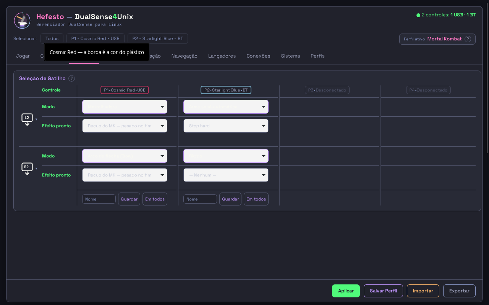
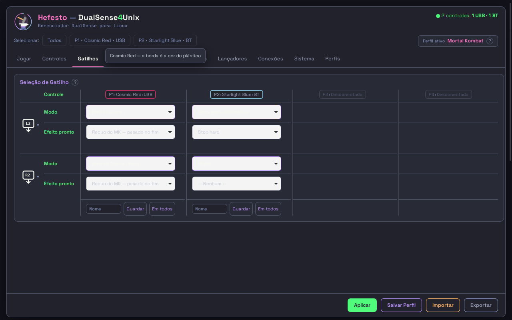

# TOOLTIP-C1 — a dica que não abre

**11/09/2026.** Frente C1 da [A SEGUNDA LISTA DELA](../../sprints/2026-09-11-A-SEGUNDA-LISTA-DELA-a-lingua-da-tela-e-a-paridade-INDICE.md).
Sprint: [2026-09-11-TOOLTIP-C1-a-dica-que-nao-abre.md](../../sprints/2026-09-11-TOOLTIP-C1-a-dica-que-nao-abre.md).
Branch `voo/TOOLTIP-C1-opus`, árvore própria.

> *"em todos os tooltips somem os textos e eles não mostram ou mostram e saem*  <!-- noqa-acento: citação literal dela -->
> *direto. em todas as paginas isso ocorre."*  <!-- noqa-acento: citação literal dela -->

---

## §0 — Em uma linha

**A dica nunca foi da casa: quem a desenhava era o compositor DELA.** As três
hipóteses que apontavam para o nosso código morreram medidas; a que sobrou é a
mesma família de defeito que esta casa já pagou duas vezes nesta sessão (o menu
que quebra no Wayland nativo, o `<select>` que nascia branco). A cura é tirar a
dica do popup do sistema e desenhá-la DENTRO da página, com a `.dica` que ela já
aprovou.

| | antes | depois |
| --- | --- | --- |
| quem desenha | `cosmic-comp`, via GTK/WebKit | a página, dentro do `WebView` |
| a mão TREMENDO | **0 de 200 amostras em 80 s** | **4 de 4 chegadas** |
| a mão parada | 8 de 8 chegadas (aqui) | 4 de 4 chegadas |
| régua que a mede | nenhuma — todas liam o DOM | `tests/unit/test_a_dica_da_casa_abre_com_o_ponteiro.py` |

---

## §1 — O INSTRUMENTO, porque sem ele não havia laudo

**Nenhuma régua desta casa media uma dica.** Todas mediam o `title` no DOM — e
o `title` sempre esteve lá. É exatamente por isso que o defeito atravessou
tudo: *a pergunta certa não era «o atributo existe?», era «a dica abre?»*.

Uma dica abrindo exige três coisas que nenhum instrumento daqui fazia:

1. **janela de verdade** — `Gtk.OffscreenWindow` não tem ponteiro, e sem
   ponteiro não há dica;
2. **ponteiro dirigido** até o elemento, como a mão dela;
3. **tempo passando** — meio segundo é o piso de qualquer dica.

O que foi construído (bancada, em `Xvfb` próprio, sem tocar a tela dela): o
piloto de verdade numa janela de verdade, o ponteiro levado ao elemento por
`Gdk.Device.warp`, e a dica contada **aberta** a cada 50-100 ms — o detector é o
toplevel `GtkTooltipWindow` mapeado (para a nativa) e
`window.__hefDica.aberta()` (para a da casa).

**A LIÇÃO DE INSTRUMENTO DESTE DIA, e ela custou duas medições falsas:**

* **a posição de cada dica tem de ser relida na hora.** A primeira varredura
  media 38 elementos com os retângulos colhidos no começo; o layout andou, o
  ponteiro caiu no vizinho e a régua acusou *"1 de 25"* em três dicas sadias;
* **o meu próprio marcador quebrou o produto.** Marcar cada dica com um
  atributo (`data-espia`) fez a `.fita` divergir do texto emitido pelo Python e
  ser reconstruída a cada tique — a dica *sumia* porque o instrumento a matava.
  O censo definitivo usa um **expando de JS**, que não entra no `innerHTML`.

---

## §2 — AS QUATRO HIPÓTESES, medidas uma a uma

Bancada: esta árvore, daemon vivo, um DualSense no cabo, `Xvfb` em X11 (o mesmo
transporte que o `.desktop` dela força — `env GDK_BACKEND=x11`).

### 1. «o tique reescreve o nó sob o ponteiro» — MORTA

Censo de destruição nas **dez** abas, 12 s cada, com um expando que o produto
não vê:

```
01-jogar      26 dicas ·  0 destruídas      06-navegacao  41 ·  0
02-controles  69 dicas ·  0 destruídas      07-lancadores  7 ·  0
03-gatilhos  190 dicas ·  0 destruídas      08-conexoes   89 ·  0
04-iluminacao 40 dicas ·  0 destruídas      09-sistema    41 ·  0
05-vibracao   30 dicas ·  0 destruídas      10-perfis     51 ·  0
```

**Zero de 584.** A cura da A-TELA-SAMBA-01 (06/09) segurou.

### 2. «o `title` é reescrito com o MESMO valor» — MORTA

Observador filtrado no atributo `title`, 12 s por aba, `attributeOldValue`
ligado: **uma só** reescrita em dez abas — `giro-no-jogo`, na `02-controles`,
3,1/s, e **nenhuma** com o mesmo texto (`~249 Hz` → `~250 Hz` → `~246 Hz`). O
`--conta-mutacoes` confirma do outro lado: **0 mutações em 100 tiques** na
`03-gatilhos` com a mesa parada.

### 4. «o CSS come o evento» — MORTA

A dica nativa abre e FICA. Medido com a mão chegando (sai, volta em três
passos, para 3 s), oito chegadas seguidas:

```
com o tique vivo                 8 de 8 · 40/40 amostras
com o tique CONGELADO            (a mordida) — não melhora: o tique não é a causa
com 6 processos comendo CPU      8 de 8
com o processo WEB 85% ocupado   6 de 6  (a dica arma 70 ms mais tarde, e só)
com o laço da JANELA bloqueado   6 de 6  (90 ms de cada 100)
na vista dela, 1918x840          193 de 200 amostras
nas dicas do DESENHO (SVG)       14 de 14
```

Nenhum `pointer-events`, nenhum elemento por cima, nenhuma `:hover` que mova o
alvo (as regras de `topo.html` só trocam cor e borda).

### 3. «o popup nativo não se desenha NESTA configuração» — DE PÉ

É a única que sobra, e é a única diferença que a bancada **não alcança**: aqui o
servidor X é um `Xvfb` sem compositor; na máquina dela é **XWayland dentro do
`cosmic-comp`**. A dica do GTK é uma janela `override-redirect` — o produto não
a desenha, não a posiciona e não a pinta.

**E ISSO NÃO É SUSPEITA NOVA — é o TERCEIRO popup desta casa a quebrar na sessão
dela, e os dois primeiros estão medidos e fotografados:**

| quando | o popup | o que aconteceu |
| --- | --- | --- |
| — | `GtkMenu` | `run.sh:80-86` força XWayland porque *"os popups de GtkMenu quebram no Wayland nativo"* |
| 04/09/2026 | o do `<select>` | nascia **branco** no meio da interface escura; ela fotografou (`gui/ponte_da_tela.JanelaDaAba`) |
| 11/09/2026 | a **dica** | *"não mostram ou mostram e saem direto"* |

A foto do ANTES mostra o padrão: a dica nativa sai numa caixa **clara**, com
tipografia de sistema, por cima da tira de abas — visivelmente de fora do
desenho.

**E A MEDIÇÃO ACHOU O MECANISMO QUE FALTAVA DO LADO DO GTK**, que vale em
qualquer sessão: *o GTK reinicia a contagem de meio segundo a cada evento de
movimento do ponteiro.* Com o ponteiro tremendo 1 px a cada 150 ms — uma mão
sobre o rato — a dica nativa abriu **0 de 200 amostras em 80 s**, com
`has-tooltip` ARMADO o tempo todo. *A dica nativa não é para quem segura o rato:
é para quem o solta.*

---

## §3 — A CURA

`interface/hefesto_vivo.DICA_DA_CASA` — uma camada de JS instalada **a cada
carga de página** pelo piloto, e por `UserScript` no visor do desenho
(`interface/ver.py`).

**O que ela faz:**

* **colhe** todo `title` para `data-hef-dica` e esvazia todo `<title>` de SVG
  (guardando o texto no mesmo atributo) assim que a página carrega — 150 a 433
  por aba. Sem `title` no DOM vivo, o popup do compositor **não tem de que
  nascer**;
* desenha a dica num `<div id="hef-dica">` com a **cara da `.dica` da casa**
  (`topo.html:397-402`): mesma cor, mesma borda, mesma sombra, mesmo tamanho de
  letra. Nada de desenho novo — o que muda é quem desenha;
* conta meio segundo **a partir da entrada no elemento**, e só zera quando o
  elemento muda: a dica abre com a mão em cima, não só com a mão parada;
* mantém a dica dentro da janela, fecha no clique, na rolagem, na tecla e ao
  sair da janela.

**As três costuras que a colheita obrigou, e cada uma é um defeito evitado:**

1. **`escrever()`** — o alvo `atributo`/`title` escreve em `data-hef-dica`
   quando o texto já foi colhido, e avisa a camada para a dica aberta trocar de
   frase. Sem isso o produto ressuscitaria o `title` — e o popup do compositor
   com ele, por cima da dica da casa;
2. **`LER_CAMPOS`** — a leitura de volta consulta `data-hef-dica` quando o
   `title` não está lá. Sem isso a régua do mockup leria `''` de um endereço
   recém-pintado e **acusaria a pintura certa**;
3. **a memória da `.fita` e a dos blocos** — a colheita muda o `outerHTML`
   (atributo com outro nome e em outra posição), e a comparação por string
   nunca mais casaria: **a fita passaria a ser reconstruída dez vezes por
   segundo**, que é o defeito de 03/09 de volta com outra causa. A fita ganhou
   `window.__hef.fitaEscrita` (a memória não pode morar no nó, porque
   `outerHTML =` mata o nó), e os blocos passaram a gravar `__hefBloco` também
   quando nada precisou mudar.

**Medido depois da cura:** `--conta-mutacoes 60` = **0 mutações** nas abas 03,
04, 08 e 10, com a mesa parada. Custo do tique inalterado (mediana 2,5 a
10,4 ms, teto 100).

### A foto

| antes | depois |
| --- | --- |
|  |  |

---

## §4 — A RÉGUA, e a mordida

`tests/unit/test_a_dica_da_casa_abre_com_o_ponteiro.py` — **nove medidas, 12 s**,
e ela mede a dica **abrindo**, com janela de verdade e ponteiro de verdade,
dentro do `Xvfb` da suíte (TELA-DELA-01; a régua RECUSA correr se enxergar o
Wayland dela).

| o que mede | por quê |
| --- | --- |
| abre com a mão parada | o piso |
| mostra o TEXTO do elemento | *"somem os textos"* |
| não atravessa a janela | dica meio fora é dica que não abriu |
| o popup do sistema não aparece junto | zero `title` no DOM vivo |
| **abre com a mão TREMENDO** | é a metade que a dica nativa nunca entregou |
| o produto pinta a dica sem ressuscitar o `title` | a costura 1 |
| o piloto instala a camada a cada carga | *"em todas as paginas"* |
| o visor do desenho recebe a mesma camada | o que ela olha é o que o produto faz |
| **A MORDIDA** — sem a camada, não há dica da casa | senão a régua mede outra coisa |

**A MORDIDA FOI DADA, e está medida:** com um `return` no topo da camada,

```
5 failed, 1 passed in 10.68s     ← o que passa é o próprio teste da ausência
```

e com a cura devolvida, `9 passed`.

---

## §4b — A VARREDURA FINAL: sobrou alguma dica que não abre?

Com a cura no lugar, o ponteiro foi levado a **189 dicas nas dez abas**, uma a
uma, com a chegada em três passos e a leitura no fim:

```
01-jogar      18 de 18      06-navegacao    9 de  9
02-controles  30 de 30      07-lancadores   6 de  6
03-gatilhos   27 de 27      08-conexoes    12 de 12
04-iluminacao 29 de 30      09-sistema     30 de 30
05-vibracao   12 de 12      10-perfis      26 de 30
                            ------------------------
                            184 de 189
```

**As CINCO que faltaram foram remedidas uma a uma, e as cinco abrem** — o
`hex` da Iluminação, 3 de 3; as quatro linhas `perfis.linha.quando` da Perfis,
4 de 4. A diferença é o TEMPO que a varredura dá: **1,03 s de parada** contra os
2,6 s da medida individual. Nas duas abas em que faltou, o tique repinta a linha
sob o ponteiro, e a dica recomeça a contagem de meio segundo.

**Isso é fato sobre a régua, não sobre o produto, e fica escrito:** uma
varredura de dica precisa dar pelo menos 1,5 s de parada por elemento, ou ela
mede o próprio orçamento. A régua da suíte dá 2,2 s.

---

## §5 — O QUE FICA EM ABERTO, declarado

1. **A prova final é dela.** A causa 3 é a única que a bancada não alcança: aqui
   a dica nativa funciona. A cura remove a dependência inteira, mas quem diz que
   fechou é ela, abrindo o produto e passando o rato — PROVA-DE-TELA-01.
2. **O `title` sai do DOM VIVO.** Nas páginas publicadas ele continua onde
   sempre esteve, e as réguas que leem ARQUIVO não mudam. As que leem o DOM vivo
   sem instalar a camada (`test_a_palavra_de_tela_da_interface_nova.py`,
   `scripts/validar-palavra-de-tela.py`) continuam medindo o `title` e continuam
   certas. **Uma régua nova que instale a camada tem de ler `data-hef-dica`.**
3. **Acessibilidade, e é dívida honesta:** o `title` também servia de nome
   acessível a quem usa leitor de tela. A camada não escreve `aria-label` no
   lugar — seria centenas de atributos novos e texto novo na conta da régua da
   palavra. Fica declarado como frente própria.
4. **A dica ainda é a frase de hoje.** Esta frente não encurtou uma linha de
   texto: a §0 da onda (*"toda mensagem de tooltip (…) deveria ser reduzida e
   ficar intuitiva e direta ao ponto"*) continua com as frentes A1-A5. O que
   mudou é que agora **há onde a frase aparecer** — e ela é do produto, medível
   e um dia traduzível, o que um popup do toolkit nunca seria.
5. **Nenhuma dica ficou de fora, e as do desenho entraram junto:** 584 `title`
   de atributo e os `<title>` de SVG das dez abas passam pela mesma camada.
6. **DOIS PORTÕES CHEGARAM VERMELHOS NESTA ÁRVORE, e nenhum é desta frente**
   (medido contra a base `f04f4a0b`, sem uma linha minha nos arquivos):
   * `referencias-docs` — 5 referências mortas, e as cinco são as **promessas
     das frentes A1-A5**: cada sprint da língua cita o laudo
     `docs/process/agentes/2026-09-11/LINGUA-AN-opus.md` que aquela frente ainda
     vai escrever. Fecha sozinho quando elas entregarem;
   * `acentuacao` — eram 3 violações, as três no
     `2026-09-11-A-SEGUNDA-LISTA-DELA-…-INDICE.md` (citações literais dela,
     `paginas` e `codigo`, sem o marcador). **JÁ FECHOU no `dev`** —
     `210c0828`, e esta branch foi adiantada nele: hoje o portão está verde.

   Os outros **55 portões estão verdes**, inclusive `citacoes-no-codigo`,
   `palavra-de-tela`, `paridade-gtk-html`, `mypy`, `ruff` e `a-tela-dela`.

   **E AS SEIS CITAÇÕES DE LINHA QUE ESTA LEVA DESLOCOU FORAM REAPONTADAS POR
   SÍMBOLO**, com o portão `citacoes-no-codigo` de oráculo — mais as demais
   `hefesto_vivo.py:NNN` de `src/`, `tests/` e `scripts/`, mapeadas pelo
   CONTEÚDO da linha velha e só quando a correspondência era única. O arquivo
   cresceu ~350 linhas; nenhum endereço ficou apontando para o vizinho.
