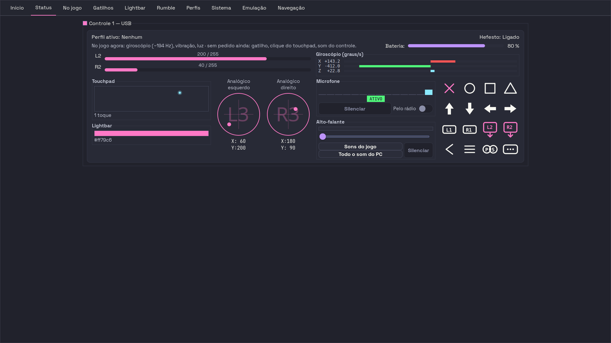
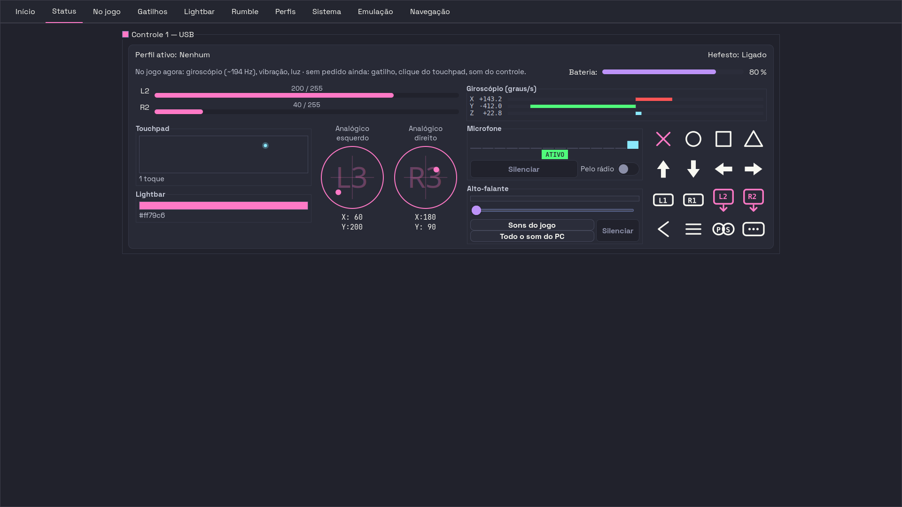
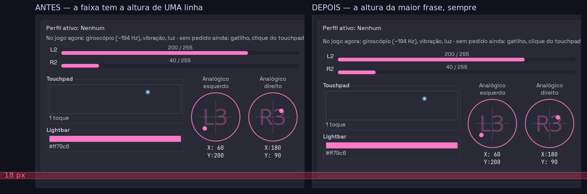
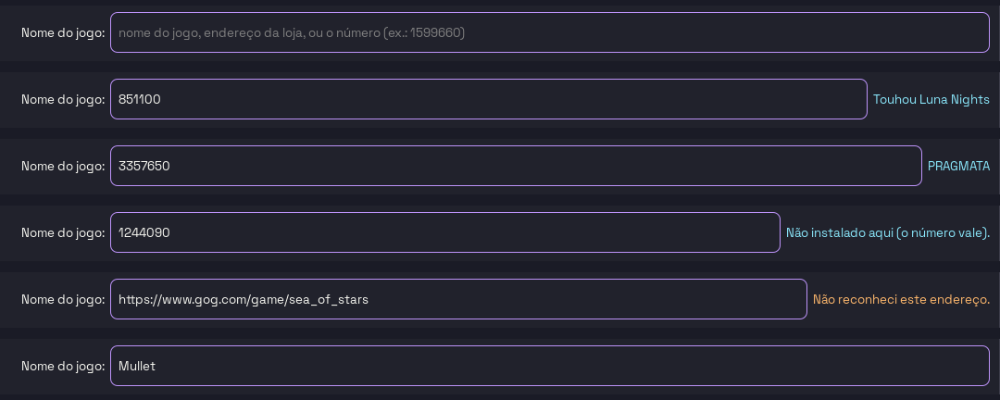

# O par de fotos que prova a cura do samba

- **Data:** 13/08/2026, no fim do dia em que a cura entrou (commit `874fdda`)
- **O que este arquivo é:** o lugar onde as fotos moram. A cura em si está
  escrita no código e nos testes, e não se repete aqui — este documento
  apresenta as **imagens**, diz como elas foram feitas e o que elas não provam
- **Estado:** **EXECUTADA, MENOS a palavra final dela.** Medida, curada,
  fotografada e coberta por teste que morde. Falta o olho dela
  ([PROVA-DE-TELA-01](../sprints/2026-07-27-PROVA-DE-TELA-01-dez-minutos-de-olho-antes-de-qualquer-leva.md))
- **Aviso de execução:** a máquina dela estava **viva e em uso**. O daemon
  **não** foi tocado. Tudo aqui é render `Gtk.OffscreenWindow` e leitura de
  arquivo

**Grau de cada afirmação:** **MEDIDO** = há pixel contado ou teste que reprova
com a cura arrancada. **LIDO NO CÓDIGO** = o caminho foi aberto na árvore de
hoje. **INFERIDO** = fecha, e ninguém observou.

---

## O que ela viu

> *"não sei se dá pra ver mas o layout fica sambando aqui na interface"*

Três capturas da aba Status, do mesmo controle, com segundos entre elas —
`(~160 Hz)`, `(~193 Hz)`, `(~190 Hz)`. Na do meio a frase "No jogo agora…" cabe
em uma linha, a `Bateria:` sobe para a linha dela, e tudo o que vem abaixo sobe
junto. Nas outras duas, desce.

## A causa, em uma frase

**MEDIDO.** Com o card na largura da tela dela (1920 → card de 1400 px), a
frase **recebe 904 px e pede 905** de largura natural: um pixel de folga
negativa. Nessa lâmina, um único dígito do `(~N Hz)` decide se a frase quebra —
e a altura dela governa a faixa que empurra o resto do card. **18 px, duas vezes
por segundo.**

**LIDO NO CÓDIGO**, na árvore de hoje:

- o mecanismo inteiro, com as duas saídas recusadas e o porquê de ser uma
  subclasse, em `RotuloDeAlturaReservada`
  (`src/hefesto_dualsense4unix/app/widgets/controller_card.py:4537`; os 904/905
  estão em `:4549`);
- a régua que reserva a altura, `frase_mais_longa_do_que_chega_ao_jogo`
  (`src/hefesto_dualsense4unix/app/widgets/controller_card.py:1399`), montada a
  partir de `_HZ_MAIS_LARGO` (`:1028`) e `_MOTOR_MAIS_LARGO` (`:1032`);
- o ponto onde a cura entra na tela, em `_montar_estado_global`
  (`src/hefesto_dualsense4unix/app/widgets/controller_card.py:2331`);
- os testes que mordem, com as duas armadilhas de medição já pagas no
  docstring, em `tests/unit/test_o_status_nao_samba_no_ritmo_do_giroscopio.py`
  (`test_as_tres_frases_das_fotos_dela_nao_movem_nada` em `:354`).

## O par

Aba Status inteira, a mesma cena (`~194 Hz`), antes e depois da cura:





Lado a lado, com a faixa vermelha marcando o que se deslocou:



**MEDIDO, aqui, nas próprias imagens.** A borda interna do card está em
`y = 511` no antes e em `y = 529` no depois — **18 px exatos**. E o deslocamento
é rígido: recortando 1400×300 px do antes a partir de `y = 240` e do depois a
partir de `y = 258`, o `compare -metric AE` devolve **0** — nem um pixel
diferente. O card não mudou de conteúdo; ele inteiro desceu.

```bash
# a borda do card, no antes e no depois (a linha em que a cor muda)
convert antes-aba-status.png -crop 1x140+700+460 +repage txt:- | \
  awk 'NR>1{split($1,a,","); sub(":","",a[2]); print a[2]+460, $3}' | \
  awk 'prev!=$2{print "  y="$1" -> "$2} {prev=$2}'

# o deslocamento é rígido: AE = 0 com 18 px de defasagem
convert antes-aba-status.png  -crop 1400x300+260+240 +repage /tmp/a.png
convert depois-aba-status.png -crop 1400x300+260+258 +repage /tmp/b.png
compare -metric AE /tmp/a.png /tmp/b.png null:
```

E a montagem lado a lado, para quem quiser refazê-la (ImageMagick 6.9.12, o que
há nesta máquina; Pillow **não** está instalado nem no `.venv`):

```bash
convert antes-aba-status.png  -crop 734x475+258+80 +repage pa.png
convert depois-aba-status.png -crop 734x475+258+80 +repage pb.png
convert pa.png pb.png +append -background '#11111b' -splice 20x0+734+0 \
  -splice 96x0+0+0 -splice 0x40+0+0 -splice 16x0+1584+0 -splice 0x16+0+515 \
  -fill 'rgba(255,45,85,0.30)' -stroke none -draw 'rectangle 0,471 1599,489' \
  -stroke '#ff2d55' -strokewidth 1 -fill none \
  -draw 'line 0,471 1599,471' -draw 'line 0,489 1599,489' \
  -stroke none -fill '#ff5c8a' \
  -font /usr/share/fonts/truetype/dejavu/DejaVuSans.ttf -pointsize 20 \
  -annotate +12+486 '18 px' \
  -fill '#cdd6f4' -pointsize 21 \
  -annotate +96+28 'ANTES — a faixa tem a altura de UMA linha' \
  -annotate +850+28 'DEPOIS — a altura da maior frase, sempre' \
  antes-depois-os-18px.png
```

## O que estas fotos provam, e o que não provam

**Provam** que a cura mudou o layout exatamente no lugar previsto e exatamente
na medida prevista: a faixa da frase passou a ter uma linha a mais de altura, e
o card inteiro desceu 18 px de uma vez por todas.

**INFERIDO** — a faixa vermelha é a amplitude do samba. Os 18 px entre as duas
fotos são um espaço de linha nesta fonte, que é o mesmo salto que ela via
quando a frase trocava de uma para duas linhas. A cura congela o card na
posição **baixa** — a que ele já assumia sempre que a frase quebrava.

**Não provam** o samba em si, e isto tem de ficar escrito. As duas fotos são a
**mesma** cena (`~194 Hz`), e nenhuma delas mostra a frase quebrada em duas
linhas. **MEDIDO:** renderizadas antes da cura no arnês de 1920
(`scripts/gui-captura/retratar_abas.py`, `LARGURA, ALTURA = 1920, 1080` em
`:123`), as três frases dela — `~160`, `~190` e `~193 Hz` — dão a borda do card
no mesmo `y = 511`, e a única diferença entre as capturas é um retângulo de
**694×16 px** onde o texto muda. Nessa janela a frase cabe sempre em uma linha;
a lâmina de 1 px que decide a quebra é a da tela dela.

Ou seja: o que estas fotos mostram da dança é a **consequência**. A dança foi
medida offscreen, na largura em que ela acontece, e está travada pelos testes
citados acima — não por estas imagens.

## O que falta

**A palavra dela.** Foto não fecha a
[PROVA-DE-TELA-01](../sprints/2026-07-27-PROVA-DE-TELA-01-dez-minutos-de-olho-antes-de-qualquer-leva.md)
sozinha: a interface só fecha com o olho dela. O defeito foi ela quem viu, e a
medição saiu das capturas dela — quem diz que parou de sambar é ela, na tela
dela, não este documento.

---

## A outra coisa que a tela ganhou no mesmo dia

Guardada aqui porque é a **única** foto que existe dessa mudança, e porque ela
nasceu na mesma leva. O campo "Nome do jogo" do editor de perfil, nos seis
estados que a mudança de 13/08 criou:



De cima para baixo: vazio; o **endereço da loja** colado, já normalizado para o
número, com o nome que a máquina dela conhece ao lado; um número cru que também
vira nome; um número de jogo que não está instalado aqui; um endereço de outra
loja, que reclama; e o nome sendo digitado, em silêncio.

**LIDO NO CÓDIGO:** as quatro respostas e o porquê de cada uma em
`frase_do_campo_do_jogo`
(`src/hefesto_dualsense4unix/integrations/jogos_locais.py:294`), com
`MSG_NAO_RECONHECI` em `:287` e `MSG_FORA_DA_MAQUINA` em `:291`; a ordem dos dois
trabalhos no mesmo sinal — primeiro o endereço vira número, depois a frase lê um
campo já normalizado — em `_on_campo_do_jogo_mudou`
(`src/hefesto_dualsense4unix/app/actions/profiles_actions.py:1660`); e o texto de
ajuda que passou a dizer as três formas em
`src/hefesto_dualsense4unix/app/actions/profiles_actions.py:112`.

**Ressalva sobre esta imagem:** o endereço da segunda linha foi montado à mão
para o ensaio, e o nome que aparece ao lado é o que os `.acf` **desta máquina**
dizem do número `851100` — o nome no endereço colado não bate com ele. O campo
está certo; o endereço de ensaio é que era inventado. Quem for refazer o ensaio,
cole um endereço real.
