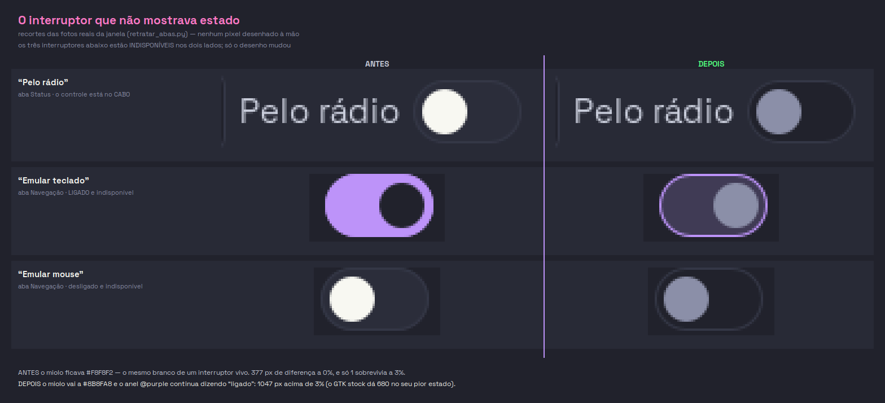
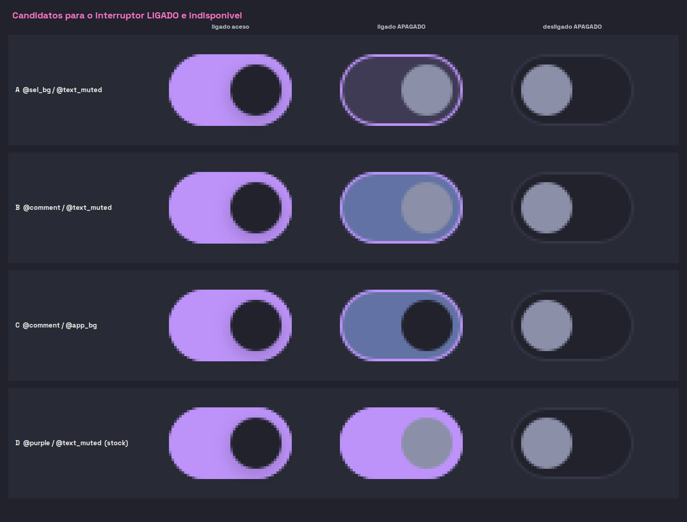
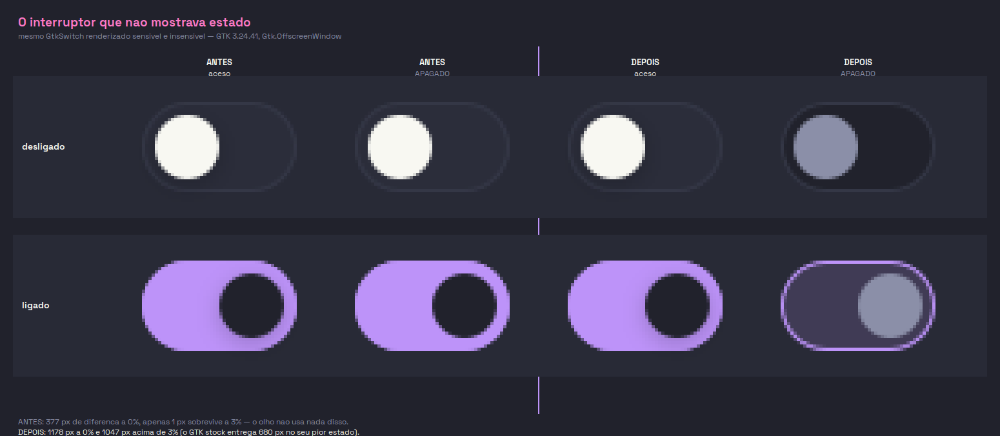

# ESTADO-VISÍVEL-01 — o interruptor que não mostrava se podia ser tocado

- **Achado em:** 07/08/2026, medindo o `theme.css` contra o GTK stock. O defeito
  é antigo; o que o tornou urgente foi o interruptor **"Pelo rádio"**, que
  nasceu no card do controle **neste mesmo dia**
- **Estado:** **EXECUTADA em 07/08/2026, MENOS a palavra final dela.** Cura
  escrita, medida, fotografada e coberta por teste que morde. Falta o olho dela
  ([PROVA-DE-TELA-01](2026-07-27-PROVA-DE-TELA-01-dez-minutos-de-olho-antes-de-qualquer-leva.md)),
  e é isso que a mantém aberta
- **Gravidade:** **ALTA na leitura da tela.** Nada quebra e nada deixa de
  responder — mas ela ganhou um interruptor no mesmo dia em que perdeu a
  capacidade de ver se podia mexer nele
- **Causa-raiz:** **MEDIDA, e é NOSSA.** O `theme.css` pinta o `switch` com cor
  chapada em todos os estados e nunca escreveu a variante `:disabled`. Cor
  chapada sobrepõe o rebaixamento que o tema do sistema aplicaria sozinho: o
  tema da casa **apagou uma distinção que o GTK entregava de graça**
- **Parentes, e distintas:**
  - [PROVA-DE-TELA-01](2026-07-27-PROVA-DE-TELA-01-dez-minutos-de-olho-antes-de-qualquer-leva.md)
    — o regime de validação desta sprint. Isto é interface: foto antes e depois,
    e a palavra final é dela;
  - [LEGIBILIDADE-01](2026-07-25-LEGIBILIDADE-01-texto-legivel-alvo-clicavel.md)
    — mesma família: informação de estado do controle que ela não conseguia ler.
    Lá era tamanho de texto; aqui é contraste de widget.

**Grau de cada afirmação**, como manda a casa: **MEDIDO** = há comando
reproduzível, pixel contado ou teste que reprova com a cura arrancada;
**SUSPEITA COM MECANISMO** = o caminho foi lido inteiro e fecha, o efeito não
foi observado; **SEM PROVA** = está dito e ninguém verificou; **DECISÃO DELA** =
não se discute, só se registra.

**Aviso de execução:** a máquina dela estava **viva e em uso**. O daemon **não**
foi reiniciado. Tudo aqui é render `Gtk.OffscreenWindow` e leitura de arquivo.

---

## O que ela via

**MEDIDO.** Na aba Status, com o controle no **cabo**, o bloco Microfone mostra
a linha "Pelo rádio". O controle nasce **insensível** ali — não há rádio para
usar (`app/widgets/controller_card.py`, `_aplicar_acao_ponte_bt`). O rótulo ao
lado mudava de cor e dizia "indisponível". O interruptor, não:

Os três recortes acima saíram de `scripts/gui-captura/retratar_abas.py` — são a
janela de verdade, não desenho. Nos **dois** lados da imagem os três
interruptores estão **indisponíveis**; só o desenho mudou.

O mesmo vale para `keyboard_emulation_toggle` e `mouse_emulation_toggle`
(`app/actions/emulation_actions.py`), na aba Navegação, enquanto o daemon não
responde — e ali o caso é pior, porque o "Emular teclado" está **ligado**: antes
da cura ele desenhava roxo cheio, idêntico a um interruptor vivo e clicável.

## A medição

**MEDIDO.** Mesmo `Gtk.Switch`, renderizado sensível e insensível, contando
pixels diferentes. Instrumento: **PyGObject 3.48.2** (`/usr/lib/python3/dist-packages/gi`),
**GTK 3.24.41**, `Gtk.OffscreenWindow` — sob Xvfb não há gerenciador de janelas
e uma `Gtk.Window` ficaria 1x1 para sempre.

| estado | tema | a 0% | acima de 3% | miolo (aceso → apagado) |
|---|---|---:|---:|---|
| desligado | casa, **ANTES** | 377 px | **1 px** | #F8F8F2 → #F8F8F2 |
| ligado | casa, **ANTES** | 455 px | 214 px | #21222C → #21222C |
| desligado | **GTK stock** | 1264 px | 1264 px | #D2D2D2 → #787878 |
| ligado | **GTK stock** | 1270 px | 680 px | #FFFFFF → #787878 |
| desligado | casa, **DEPOIS** | 1178 px | **1047 px** | #F8F8F2 → #8B8FA8 |
| ligado | casa, **DEPOIS** | 1195 px | 1170 px | #21222C → #8B8FA8 |

A coluna que acusa é a de **3%**. Contar a 0% aprova qualquer coisa: 377 pixels
parecem muito até se ver que **um** deles sobrevive à primeira tolerância. Os
outros 376 eram franja de antisserrilhado de uma borda — nada que o olho use.

**O critério é o do stock**, não um número escolhido para caber na cura: a
diferença tem de **sobreviver à tolerância**. Depois, o pior dos dois estados
entrega 1047 px acima de 3%, contra os 680 px do pior estado do stock.

## A cura

Três blocos em `src/hefesto_dualsense4unix/gui/theme.css`, depois das regras
`:checked`. As cores saem dos tokens que a casa **já usa** para dizer
"indisponível", pelo mesmo desenho do `button:disabled` que existia desde
sempre — superfície recuada (`@app_bg`), divisória apagada (`@border_soft`),
miolo em `@text_muted`.

**Os dois eixos, e por que são dois portadores diferentes.** Um interruptor
responde duas perguntas ao mesmo tempo, e elas puxam para lados opostos:

| pergunta | quem carrega | como |
|---|---|---|
| **posso mexer nisto?** | o **miolo** | vai a `@text_muted` nos dois estados |
| **está ligado?** | o **anel** | fica `@purple` quando ligado |

## O erro de medição que quase trocou a cura certa por uma pior

**MEDIDO, e é a lição desta sprint.** A primeira régua do segundo eixo mediu o
**trilho** — e condenou a cura:

| onde se mede | ligado x desligado, ambos apagados |
|---|---:|
| trilho (preenchimento) | 1,48:1 |
| **borda (o anel)** | **4,89:1** |
| GTK stock, no trilho | 3,07:1 |

Medindo o trilho, a cura parecia ter **piorado** a leitura de ligado/desligado
(de 5,66:1 para 1,48:1), e o conserto "óbvio" era clarear o trilho. Os
candidatos foram desenhados e olhados:

Os dois que subiam o número (`@comment` no trilho) **reintroduziam AZUL na
interface** — exatamente o que o `BUG-GUI-ACENTO-AZUL-VAZANDO-01` tinha
removido. O que copiava o stock (`@purple` no trilho) deixava o indisponível
parecendo vivo, que é o defeito original.

A saída não foi mudar a cura: foi **medir no lugar certo**. A marca de "ligado"
de um interruptor indisponível é o **anel**, e ali a cura entrega 4,89:1 —
acima do stock e acima do piso de 3,0:1 do WCAG 1.4.11 para elemento
não-textual. **Regra que fica:** contraste é propriedade de um PAR *e de um
lugar*; a régua tem de mirar onde a informação mora.

## O teste, e a mordida

Novo arquivo: `tests/unit/test_contraste_de_widget_desabilitado.py` — **o
primeiro teste de contraste de WIDGET da casa**. O que havia lia texto
(`test_contraste_css.py` monta pares texto x fundo lendo o CSS;
`test_color_contrast.py` afere um auxiliar de runtime) e **nenhum dos dois
renderiza widget** — este defeito era invisível para ambos, porque `@fg` e
`@text_muted` são as duas da paleta e passam em qualquer par de texto.

Ele **mede pixel, não texto**: procurar a string `switch:disabled` no CSS
passaria com a regra escrita num seletor que não casa com nada.

`distancia_ao_desabilitar` recebe uma **fábrica** de widget, e `ADORMECIDOS` é a
lista dos cobertos — **cobrir o próximo é acrescentar uma linha lá**. O `button`
está na lista como **controle do instrumento**: ele já tinha `:disabled` antes
desta sprint, e reprovar nele significaria que a régua está errada, não o tema.

**As três mordidas, todas executadas:**

| o que foi arrancado | o que reprovou |
|---|---|
| o bloco `:disabled` inteiro | 5 de 7 — área e miolo nos dois estados. Sobraram de pé o `button` (o controle) e a âncora do stock |
| **só** a regra do `slider` | **só** os 2 do miolo — a área continuou passando com o trilho curado |
| **só** o `:checked:disabled` | **só** o do anel — os 6 outros passaram |

A segunda e a terceira linhas são o que justifica haver três asserções em vez de
uma: **cada uma pega um buraco que as outras não veem.** Sem a do anel, o bloco
`:checked:disabled` pareceria redundante e sairia na primeira limpeza — e o
"Emular teclado" voltaria a mentir.

A âncora `test_o_gtk_stock_ja_entregava_a_distincao_que_o_tema_apagou` **pula**
em vez de reprovar quando o ambiente não rebaixa sozinho: o tema do sistema é da
máquina, não do projeto. É o mesmo desenho — e a mesma razão — de
`test_switch_sem_icone_quebrado.py`, cujo guarda já segurou uma release inteira.

## O que não se apaga

Nada foi apagado. A grade dos quatro estados, com o tema da casa dos dois lados,
fica registrada aqui:

## O que fica aberto

1. **A palavra final é dela.** Esta sprint não fecha sem o olho dela nas fotos.
   Regra da casa, e ela vale aqui como em toda mudança de interface;
2. **SUSPEITA COM MECANISMO — os outros widgets de estado nunca foram medidos.**
   `check`, `radio`, `scale` e `progressbar` também recebem cor chapada neste
   `theme.css` e também não têm `:disabled`. O mecanismo é idêntico ao que foi
   medido aqui, mas **nenhum deles foi renderizado**. `ADORMECIDOS` está pronto
   para recebê-los — é uma linha por widget;
3. **`readme_inicio.png` tem ruído de execução.** MEDIDO: duas capturas
   consecutivas com o **mesmo** CSS produzem PNGs diferentes nessa aba (as
   outras oito são estáveis). Não é desta sprint e não foi investigado — fica
   anotado porque atrapalha qualquer comparação de foto por diferença de bytes.
