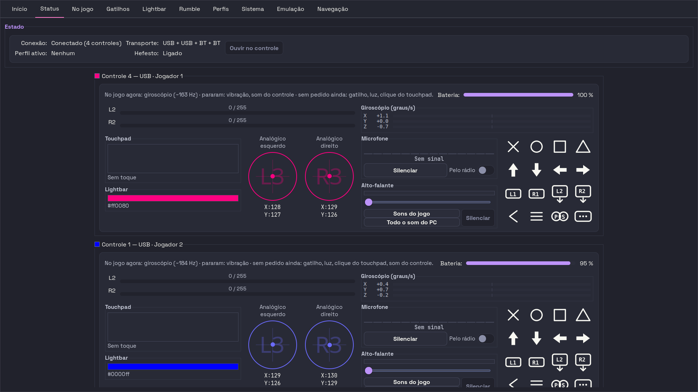
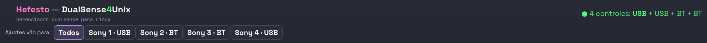
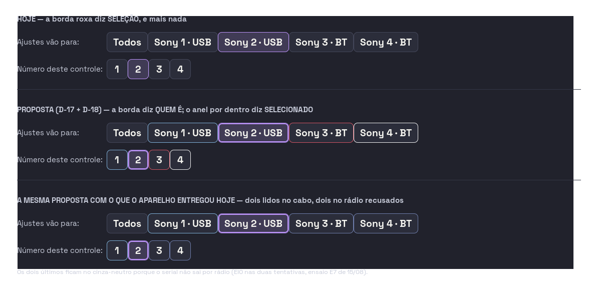
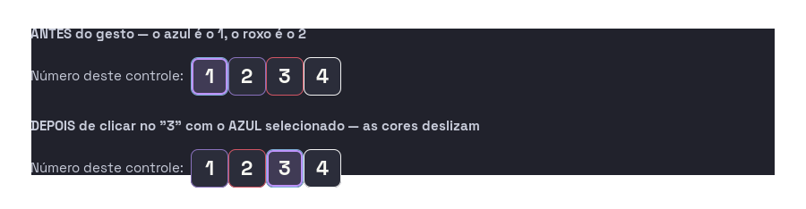
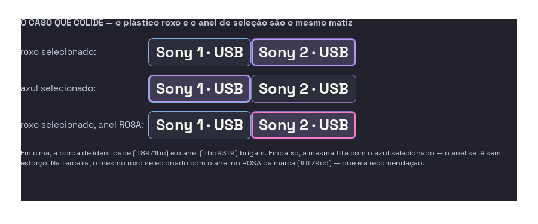
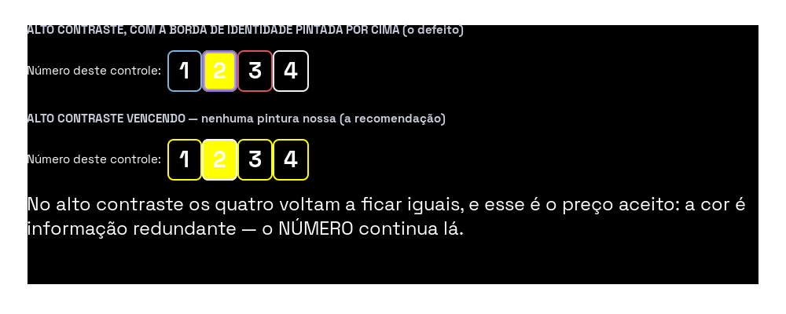

# ONDE A COR MORA — a borda diz quem é, e o anel diz o que está escolhido

- **Escrito em:** 15/08/2026, sobre a árvore da sessão de restauro.
- **O que esta página é:** uma **proposta para o olho dela**, não uma entrega.
  A [PROVA-DE-TELA-01](2026-07-27-PROVA-DE-TELA-01-dez-minutos-de-olho-antes-de-qualquer-leva.md)
  governa esta fase: interface só fecha com ela olhando. Então o que está aqui
  é o **estado de hoje fotografado**, o **desenho do que ela decidiu**, o
  **custo em arquivos**, e as **três perguntas que sobraram**.
- **Grau:** **MEDIDO** no que fotografa e no que mede (contraste, tamanho do
  anel, o que o fixture esconde); **PROPOSTA** no desenho; **ESTIMATIVA**
  declarada no custo.
- **Decisões que mandam:** **D-16** (*"da PEÇA, porque a cor mora no APARELHO.
  Sem arquivo por endereço"*), **D-17** (*"os botões 1-2-3-4 com a cor de quem
  ocupa"*) e **D-18** (*"anel por dentro para a seleção, borda = identidade"*),
  em [AS-DECISÕES-RESPONDIDAS](../2026-08-15-AS-DECISOES-RESPONDIDAS.md).
- **O que torna a D-16 possível, e é de hoje:** o ensaio **E7** provou que o
  controle **sabe de que cor ele é** — o código da cor está no firmware, nos
  caracteres 5 e 6 do serial de fábrica, e saiu **por cabo** nos dois que
  estavam no cabo. Saída bruta:
  [`2026-08-15-E7-cor-do-plastico.txt`](../../data/ensaios-brutos/2026-08-15-E7-cor-do-plastico.txt)
  e [o CSV](../../data/ensaios-brutos/2026-08-15-E7-cor-do-plastico.csv).

---

## 1. O estado de hoje, fotografado

As duas fotos abaixo são as do repositório, tiradas com
`scripts/gui-captura/retratar_abas.py --mesa-cheia` em **14/08**. São as
**únicas** desta casa que mostram o cabeçalho e os quatro controles — as dez
fotos de aba (as de **hoje, 15/08 às 03:12**, em `docs/usage/assets/`) recortam
o `main_notebook` e **deixam o cabeçalho de fora**, que é justamente onde as duas
fitas desta frente moram.

A captura de tela é recurso disputado nesta sessão (várias frentes rodando ao
mesmo tempo): nada foi refotografado, porque as imagens existentes respondem a
pergunta desta página e são de ontem e de hoje.

### 1.1 Onde a cor aparece HOJE: em um lugar só



O **card da aba Status** é o único lugar da janela onde identidade tem cor. E a
cor é a da **lightbar**, não a do plástico:

| onde, dentro do card | o que pinta | fonte |
|---|---|---|
| o **quadradinho** antes do título | a cor **CRUA** da lightbar (decisão D8) | `entry.lightbar_rgb` |
| os **traços** — barras L2/R2, L3/R3, os 16 glifos | a mesma cor, passada por `ensure_min_contrast` | idem |
| o bloco **"Lightbar"** e o hex | a mesma cor, crua | idem |

Dois controles com a **mesma luz acesa** ficam com o card **da mesma cor** — é
exatamente o preço que a D-15 tinha na mesa, e é o que a cor do plástico resolve.

### 1.2 Onde a identidade NÃO tem cor: nos quatro lugares que restam



| lugar | como a identidade aparece hoje | tem cor? |
|---|---|---|
| a fita **"Ajustes vão para:"** (cabeçalho) | `Todos`, `Sony 1 · USB`, `Sony 2 · BT`, … | **não** |
| a faixa **"Número deste controle: 1 2 3 4"** (cabeçalho) | quatro botões numerados | **não** — e ver 1.3 |
| a aba **Início**, blocos de controle | `Controle 4 — P1`, `USB · primário · 100%` | **não** |
| a aba **No jogo**, títulos de seção | `Controle 1 — USB · Jogador 1`, em roxo | **não** (o roxo é o acento da casa, igual para todos) |

E em **todos** eles a borda roxa significa uma coisa só: **selecionado**.

### 1.3 A faixa "Número deste controle" está escondida em TODA foto do repositório

**Medido agora**, relendo o dublê que alimenta as fotos
(`tests/fixtures/state_full_quatro_controles.json`):

```
output_target_index = None
```

A faixa dos botões `1 2 3 4` só aparece com um controle **escolhido** no
cabeçalho. Com o alvo nulo, ela nunca é mostrada — e por isso **não existe uma
única foto desta casa** com os botões que a D-17 manda pintar. Isso não é
detalhe de foto: **metade desta frente não tem prova de tela até o dublê ser
corrigido**, e o conserto é um campo num JSON versionado.

O mesmo dublê já traz, de propósito, o `player_slot` **desalinhado** do índice
de enumeração (slots `4, 1, 3, 2` nos índices `0..3`) — e isso é a mordida da
D-17, ver §6.

---

## 2. O que a D-16 muda, e o buraco honesto que ela deixa

A D-16 diz: **a cor mora no aparelho, sem arquivo por endereço.** Em código isso
tem uma consequência limpa e uma consequência incômoda.

**A limpa:** a cor do plástico deixa de ser configuração e vira **estado do
aparelho**, publicado por controle no `daemon.state_full`, exatamente como o
`lightbar_rgb` já é hoje. A interface **nunca guarda** cor nenhuma; ela pinta o
que o daemon diz. Não há arquivo novo, não há chave nova em perfil, não há nada
por MAC.

**A incômoda, e é o resultado do E7:** dos quatro controles dela, **a cor saiu de
dois**. Os dois que estavam no cabo responderam; no rádio o `SET_FEATURE`
voltou **`EIO` imediato**, nas duas tentativas do orçamento — com CRC e sem CRC.
Então, num dia em que dois controles estão no rádio, **dois ficam sem cor** e o
desenho tem de dizer isso sem mentir.

| o que o aparelho entregou no E7 | resultado |
|---|---|
| controle no cabo, código `05` | **Starlight Blue** |
| controle no cabo, código `04` | **Galactic Purple** |
| controle no rádio, com CRC-32 semente `0xA3` | `EIO` imediato — **não saiu** |
| controle no rádio, sem CRC | `EIO` imediato — **não saiu** |
| o quarto controle (rádio, lightbar travada) | **não tentado**, de propósito |

E o E7 fechou a prova de que os controles **continuaram sãos**: feature `0x20`
idêntico byte a byte antes e depois, `hardware_version` idêntico, reports de
entrada continuando a chegar.

**A pergunta que isso cria é de produto, não de protocolo** — está na §7,
pergunta 1.

---

## 3. O desenho: a borda diz quem é, o anel diz o que está escolhido

As imagens abaixo **não são fotos do produto** — o produto ainda não faz isto.
São **maquetes renderizadas offscreen com o `theme.css` de verdade**, com os
mesmos `Gtk.RadioButton` em modo toggle dentro da mesma caixa `linked` que o
`status_actions.py` monta hoje. O que elas provam é **como fica**; o que elas não
provam é que o dado chega — isso é a §5.



Três faixas, de cima para baixo:

1. **HOJE** — a borda roxa marca o selecionado, e os outros quatro têm a mesma
   borda apagada;
2. **A PROPOSTA (D-17 + D-18)** — cada chip com o contorno **fechado nos quatro
   lados** na cor do plástico daquele controle, e o selecionado com um **anel
   roxo por dentro**. Os botões `1 2 3 4` recebem a cor **de quem ocupa** o
   número;
3. **A MESMA PROPOSTA COM O QUE O APARELHO ENTREGOU HOJE** — dois lidos no cabo,
   dois no cinza-neutro porque o serial não saiu por rádio. É esta terceira
   faixa que ela precisa olhar antes de decidir a §7.

### 3.1 O gesto: trocar o número troca as cores de lugar



É a metade da D-17 que a recomendação chamou de *"mais informação pelo mesmo
pixel"*: os quatro botões deixam de ser um seletor e viram **a mesa inteira em
quatro cores**. Clicar no `3` com o azul escolhido **desliza as cores**, e o
gesto se confirma sozinho, sem texto.

---

## 4. O que foi medido para esta proposta, hoje

Nada aqui é opinião. Cada linha traz o instrumento.

| o que | o número | como |
|---|---|---|
| **O anel por dentro não muda um pixel de tamanho** | o mesmo botão, `124x38` **com** borda de identidade + anel e `124x38` **sem** nada | `Gtk.OffscreenWindow` com o `theme.css` da casa, animações desligadas, laço drenado duas vezes; `get_allocation()` dos dois |
| **A borda de hoje é o pior contraste da fita** | `@current_line` (`#44475a`) rende **1,34:1** contra o pior fundo; a moldura do card (`@border_soft`) rende **1,04:1** | `razao_contraste` do `utils/color_contrast.py` contra `PIOR_FUNDO` (`#353535`) |
| **Toda cor de plástico plausível passa do piso depois do `ensure_min_contrast`** | preto `1,42 -> 3,02`; roxo `1,93 -> 3,01`; vermelho `1,95 -> 3,03`; azul cobalto `1,59 -> 3,00`. Branco (`10,96`) e prata (`5,43`) já passam crus | o mesmo módulo, que é o que a casa já usa para os traços do card |
| **A caixa `linked` não funde as bordas** | cada chip mantém o contorno próprio; entre dois vizinhos aparece a costura com **as duas cores** | visível na maquete da §3, renderizada com a caixa `linked` de verdade |
| **A faixa `1 2 3 4` está fora de toda foto** | `output_target_index = None` no dublê dos quatro | leitura direta de `tests/fixtures/state_full_quatro_controles.json` |
| **Os dois seletores não existem no Glade** | nenhum `id` de widget para os chips nem para os botões de número: os dois são montados em Python e pendurados no `header_bar` | `_init_controller_target_combo` e `_montar_numero_selector`, em `status_actions.py` |

> **Uma medição que este documento NÃO tem, e não finge ter:** o **RGB** de cada
> colorway. O firmware entrega o **código** (`05`) e a tabela entrega o **nome**
> (*Starlight Blue*) — nunca uma cor. Os valores usados nas maquetes são
> **escolha de desenho**, não medição, e estão marcados como tal no §7,
> pergunta 3.

---

## 5. Os dois casos que o desenho não resolve sozinho

### 5.1 O plástico roxo e o anel roxo são o mesmo matiz



Com o **Galactic Purple** selecionado, a borda de identidade e o anel de seleção
ficam a um degrau de luminosidade um do outro. Com o azul selecionado, o anel se
lê sem esforço. **É a única colisão de paleta deste desenho**, e ela é real: um
dos quatro controles dela é roxo.

A terceira fita da imagem é a saída recomendada: o **mesmo** roxo selecionado,
com o anel no **rosa da marca**.

Três saídas, e a escolha é dela — vai junto com a pergunta 3 da §7, porque é a
mesma conversa de paleta:

| saída | o que custa | o que entrega |
|---|---|---|
| **o anel muda de cor quando colide** | uma regra a mais, e um teste que a morde | o anel sempre visível |
| **o anel é sempre o rosa da marca** (`#ff79c6`) em vez do roxo | muda o vocabulário de seleção em **um** lugar da janela | nunca colide com plástico nenhum — não há DualSense rosa-marca |
| **aceitar** | zero | o roxo selecionado fica mais difícil de ler que os outros três |

**Recomendação: o rosa da marca.** Uma regra condicional é uma regra que alguém
vai ter de depurar olhando para dois roxos; um anel rosa nunca colide, e o rosa
já é acento desta casa.

### 5.2 No alto contraste, quem vence



**Medido, e é mais grave do que a pergunta original supunha.** Com o modo de
alto contraste do sistema ligado, a pintura de identidade **por widget** vence o
CSS de alto contraste — e não só empata com ele: os botões **perdem a borda
branca** que o alto contraste lhes dava. O `2` selecionado fica amarelo com um
anel roxo em cima, que é justamente o par que o modo existe para evitar.

**A recomendação é a mesma da pergunta original, e agora tem foto:** com a classe
`hefesto-dualsense4unix-high-contrast` presente, **não pintar nada**. Os quatro
voltam a ficar iguais, e o preço é aceitável porque **a cor é informação
redundante — o NÚMERO continua lá**.

---

## 6. O custo, em arquivos

Duas metades independentes. **A metade da tela pode andar sem a metade do
aparelho** — com o dado ausente, ela desenha o cinza-neutro, que é o terceiro
painel da §3.

### 6.1 A metade da TELA (D-17 + D-18)

| arquivo | o que muda | tamanho hoje | estimativa |
|---|---|---|---|
| `app/actions/status_actions.py` | pintar as duas fitas: um provider de CSS por chip e por botão de número, montado a partir da cor de cada controle | 2 862 linhas | ~120 linhas, **em um só lugar** |
| `gui/theme.css` | a borda **neutra** de repouso deixa de ser a marca de seleção; entra a regra do anel e o guarda do alto contraste | 1 249 linhas | ~30 linhas |
| `app/widgets/controller_card.py` | a **moldura** do card passa a carregar a cor do plástico (o quadradinho e os traços continuam com a lightbar — é a proposta da §6 da [UNIDADE-COR-01](2026-08-15-UNIDADE-COR-01-o-controle-sabe-de-que-cor-ele-e.md)) | 5 026 linhas | ~40 linhas |
| `tests/fixtures/state_full_quatro_controles.json` | um `output_target_index` não nulo, para a faixa `1 2 3 4` **existir em foto**; e um quinto caso com a cor **desconhecida** | — | ~10 linhas |
| testes novos | as mordidas da §8 | — | 3 arquivos |

**Risco da metade da tela: baixo, e localizado.** Não há widget novo, não há
mudança de tamanho (medido: `124x38` com e sem), e a fita já é reconstruída pelo
mesmo caminho hoje.

**A armadilha que morde calada, e ela já está escrita no
[índice de 14/08](2026-08-14-INDICE-a-cor-do-controle-e-o-som-de-cada-jogador.md):**
`_refresh_controller_target_combo` tem um **early-return de idempotência** que
dispara no caso comum (mesmos rótulos, mesma posição). **Se a pintura ficar
depois dele, a cor nunca acompanha uma mudança que não seja entrada ou saída de
controle.** A faixa de número já foi posta **antes** do early-return exatamente
por este motivo, com o comentário no lugar — a pintura vai no mesmo bolso.

### 6.2 A metade do APARELHO (D-16)

| arquivo | o que muda | estimativa |
|---|---|---|
| `core/cor_do_plastico.py` (**novo**) <!-- ref-externa: o arquivo não existe, e é justamente o que esta linha propõe criar --> | a tabela código→nome, a decodificação do serial e as **travas** — o payload conferido byte a byte, a recusa dos pares que destroem (`[1,1]` reseta, `[3,2]` destrava a NVS, `[12,1]` grava calibração) e a recusa da família `0xF0`-`0xF7` (D-32) | ~150 linhas, quase todas **levantadas do instrumento do E7** (`scripts/ensaios/cor_do_plastico.py`), que já as tem prontas e exercidas |
| `daemon/ipc_handlers.py` | mais três campos por controle em `_enrich_controllers_per_controller`, ao lado do `lightbar_rgb` que já mora ali: o código, o nome e de que transporte a leitura veio | ~30 linhas |
| o ponto de adoção do controle no daemon | perguntar a cor **uma vez por unidade por processo**, só no cabo, e guardar em memória | ~40 linhas |
| `docs/data/mapa-controles.csv` + `specs.html` | a linha da cor do plástico, com `de_onde_sei = medido` e `ate_onde_foi` conforme o transporte — **território de outra frente hoje**, não tocado aqui | — |

**Risco da metade do aparelho: é o único risco real desta frente, e é dela.** A
leitura exige **uma escrita na família de comandos de fábrica**. O E7 provou que
o nosso `[1, 19]` é leitura pura e que os dois controles do cabo continuaram
sãos — mas o E7 foi **uma medição autorizada**, e o que a D-16 pede é que **o
produto faça isso sozinho, toda vez que um controle chega no cabo**. Essa
diferença tem de estar na mesa antes de virar código, e é a §7, pergunta 1.

---

## 7. As três perguntas que sobraram para ela

Só três. As outras já foram respondidas nas D-16, D-17 e D-18, e este documento
não as reabre.

### Pergunta 1 — o produto pode perguntar a cor sozinho, a cada chegada no cabo?

O E7 rodou **com você presente e autorizando**. Fazer disto produto significa que
o Hefesto manda um comando da **família de fábrica** toda vez que um controle
aparece no cabo, sem ninguém olhando.

| resposta | o que muda | o preço |
|---|---|---|
| **(a) sim, automático no cabo** | a cor aparece sozinha, inclusive de controle comprado depois. É o que a sua regra de 08/08 pede (*"nada à mão, nada opt-in"*) | um comando de fábrica não supervisionado por conexão. Mitigado pelas travas byte a byte, que já existem e já foram exercidas |
| **(b) automático, mas UMA vez por unidade por sessão** | o mesmo de (a), com o número de escritas caindo para uma por controle por vez que o daemon sobe | igual, em menor dose |
| **(c) só quando você mandar** | zero escrita não pedida | contraria a regra de 08/08, e o controle novo nasce sem cor |

**Recomendação: (b).** É (a) com a dose mínima, e a cor não muda — perguntar duas
vezes ao mesmo aparelho não acrescenta informação.

### Pergunta 2 — e o controle que está no rádio, que fica sem cor?

Este é o buraco da §2, e ele é o mais importante dos três, porque **hoje metade
da sua mesa cai nele**.

| resposta | o que muda na tela | o preço |
|---|---|---|
| **(a) sem memória** | quem está no rádio fica no cinza-neutro até ser ligado no cabo. É o terceiro painel da §3 | dois dos seus quatro ficam cinzas na maior parte do tempo |
| **(b) memória só enquanto o daemon vive** | ligou no cabo uma vez nesta sessão, fica colorido até o próximo start — inclusive depois de voltar para o rádio | some no reinício. **Nenhum arquivo é criado**, então a D-16 continua respeitada ao pé da letra |
| **(c) memória em disco** | a cor nunca mais some | é **um arquivo por endereço**, que é literalmente o que a D-16 recusou e o que você vetou em 12/08 |

**Recomendação: (b).** É a única que dá cor aos quatro sem criar arquivo nenhum.

> **O que dissolveria esta pergunta inteira:** uma **terceira** tentativa no
> rádio. O E7 gastou o orçamento de duas e parou, e a hipótese que sobrou está
> escrita: *o `SET_REPORT` de feature é recusado na camada HIDP/L2CAP —
> pelo firmware ou pelo BlueZ — independentemente do conteúdo*. Separar **quem
> recusou** exige instrumentar o canal de controle. Se o rádio abrir, a
> pergunta 2 deixa de existir. **Não estou pedindo autorização para isso aqui** —
> só registrando que é o caminho que a torna desnecessária.

### Pergunta 3 — quem escolhe o RGB de cada nome de cor?

O aparelho entrega `05` e a tabela entrega *Starlight Blue*. **Ninguém entrega um
RGB.** Alguém tem de dizer que tom de azul é *Starlight Blue* na tela.

E aqui você tem uma vantagem que eu não tenho: **os controles estão na sua mão**.
Eu escolhi os tons das maquetes de olho, e eles são chute informado — nada mais.

| resposta | o preço |
|---|---|
| **você aponta cada tom**, olhando o plástico ao lado da tela | o seu tempo, uma vez, para os colorways que você tem |
| **eu proponho a tabela inteira** e você veta o que não gostar | zero do seu tempo agora, e o risco de o azul da tela não ser o azul da mão |

**Recomendação: as duas, nesta ordem** — eu proponho os vinte e um, você corrige
os que tem na mão. Os que ninguém desta casa possui ficam com o meu chute até
alguém aparecer com a peça, e isso fica **escrito na tabela**, colorway a
colorway, para ninguém confundir chute com medição.

**E junto, na mesma olhada: a cor do ANEL** (§5.1). A recomendação é o rosa da
marca, `#ff79c6`, em vez do roxo — porque o roxo colide com um dos seus quatro
controles e o rosa não colide com nenhum DualSense que exista.

---

## 8. As mordidas, se ela aprovar

Teste que passa com a cura arrancada não testa nada. Estas são as quatro que
esta frente precisa, e o que cada uma exige que reprove.

| mordida | arranque isto | e o teste tem de reprovar porque |
|---|---|---|
| **a cor acompanha o estado, não só a mesa** | mova a pintura para **depois** do early-return de `_refresh_controller_target_combo` | mandando dois estados seguidos em que **só a cor muda**, a borda fica velha. É o defeito que nenhuma foto estática mostraria |
| **os botões 1-2-3-4 seguem quem OCUPA, não o índice** | troque o mapa de cor por `index` de enumeração | o dublê já tem `player_slot` desalinhado (`4, 1, 3, 2`) de propósito: as cores saem na ordem errada |
| **o alto contraste vence** | remova o guarda da classe `hefesto-dualsense4unix-high-contrast` | com o modo ligado, os botões perdem a borda branca — medido na §5.2 |
| **a trava do payload** | troque um byte do `[1, 19]` para `[1, 1]` | o par que **reseta o controle** tem de ser recusado **antes** do `ioctl`, e o instrumento do E7 já reprova assim |

E a prova de tela, que não é teste: **rodar `retratar_abas.py` com o dublê
corrigido** e conferir que a faixa `1 2 3 4` finalmente aparece em foto. Sem
isso, metade desta frente continua sem prova — §1.3.

---

## 9. Como as maquetes foram feitas, e como refazer

O script que as desenhou foi de rascunho e não está versionado — de propósito:
`scripts/gui-captura/` tem portão que cruza a pasta com a tabela do
[COMO-OLHAR-A-TELA](../COMO-OLHAR-A-TELA.md), e um sexto script exigiria mexer
naquele documento por causa de uma maquete. O que **é** carga desta página é a
receita, e ela cabe aqui:

- `Gtk.OffscreenWindow` (sob Xvfb uma `Gtk.Window` fica 1x1 para sempre);
- `Gtk.Settings.get_default().set_property("gtk-enable-animations", False)` —
  sem isso a foto pega a transição de `:checked` no meio e sai diferente a cada
  execução;
- `apply_theme(janela)` — o `theme.css` inteiro, com a escala de fonte dela
  (o cabeçalho da execução imprimiu `escala=3`);
- laço drenado **duas** vezes antes de medir ou fotografar;
- a pintura, que é a única linha nova de verdade — um `Gtk.CssProvider` por
  widget, em `Gtk.STYLE_PROVIDER_PRIORITY_USER`:

```css
* {
    border-color: <a cor do plástico daquele controle>;
    box-shadow: inset 0 0 0 2px <a cor do anel>;   /* só no selecionado */
}
```

O `PRIORITY_USER` é o que faz o provider por widget vencer o `:checked` do tema,
que é mais específico — no GTK3 a prioridade do provedor decide antes da
especificidade do seletor. **E é exatamente por isso que o guarda do alto
contraste é obrigatório** (§5.2): a mesma prioridade que vence o tema vence
também o modo de acessibilidade.

---

## 10. O que esta página deliberadamente NÃO fez

- **não tocou** em `docs/data/mapa-controles.csv` nem na
  [UNIDADE-COR-01](2026-08-15-UNIDADE-COR-01-o-controle-sabe-de-que-cor-ele-e.md):
  as duas estão sendo medidas na bancada agora;
- **não escreveu uma linha de código de produto.** A D-18 muda o vocabulário
  visual da janela inteira, e mudar isso antes do olho dela é exatamente o gasto
  que a PROVA-DE-TELA-01 existe para evitar;
- **não mandou nada a aparelho nenhum.** Tudo que esta página mede é tela,
  contraste e arquivo versionado;
- **não inventou o RGB de colorway nenhum** — os tons das maquetes estão
  declarados como chute na §4 e na pergunta 3.
