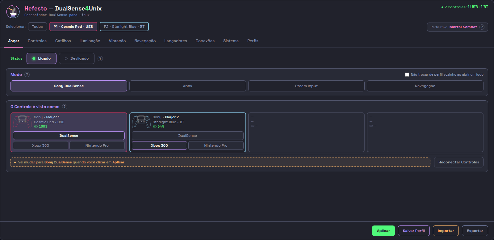
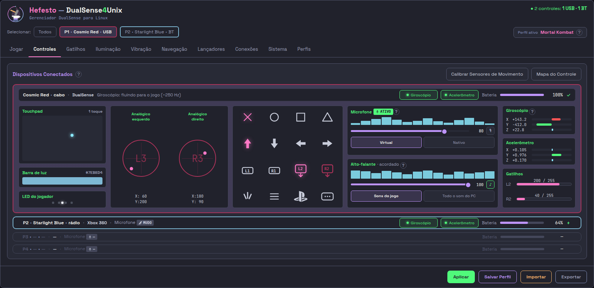
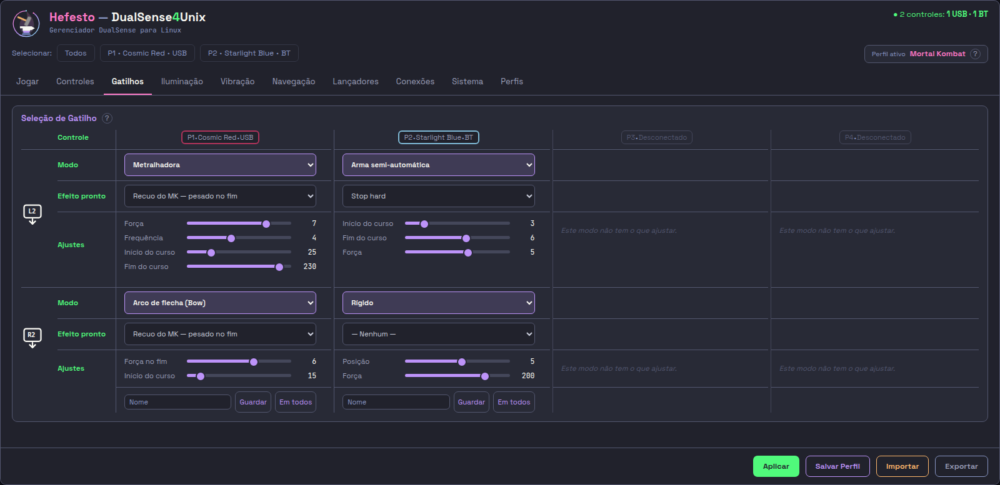
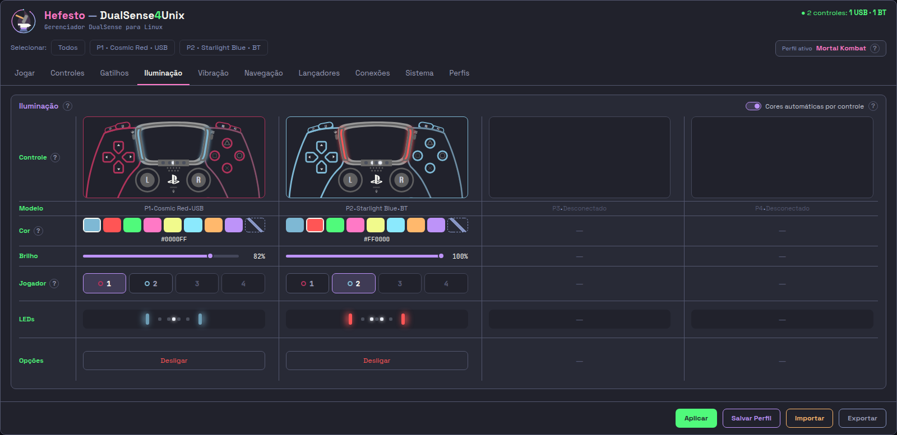
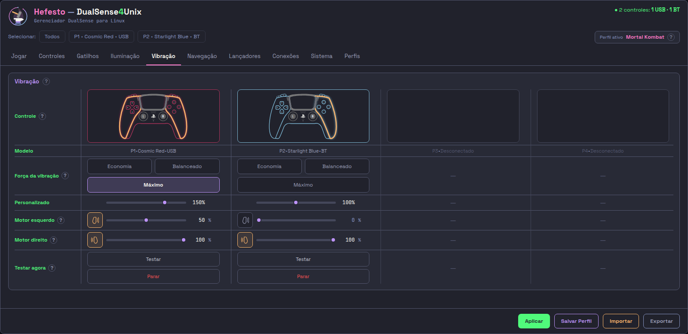
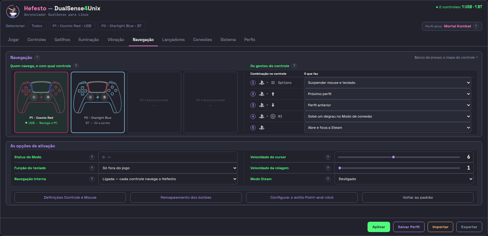
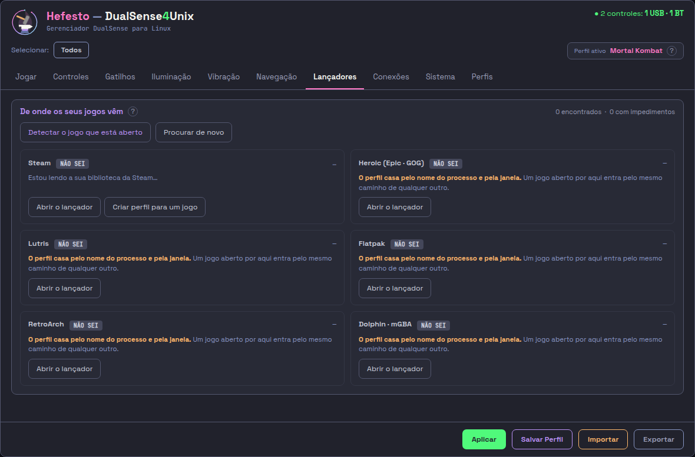
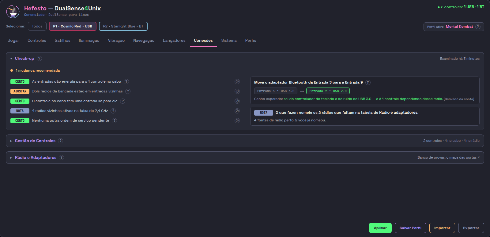
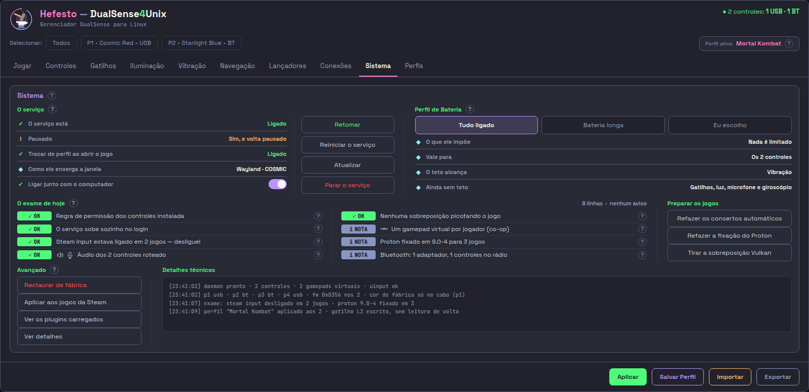
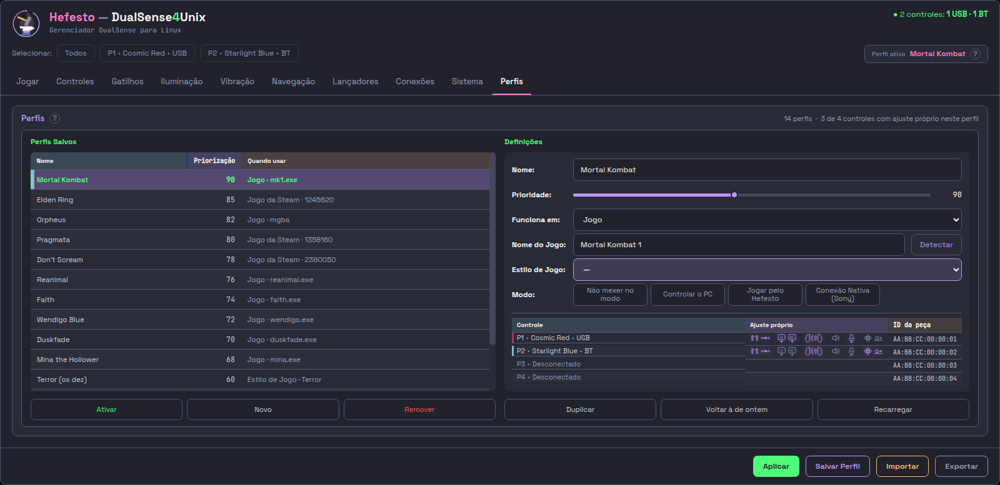

# As dez abas — o que cada uma faz

**05/09/2026.** A janela do Hefesto tem **dez abas**, nesta ordem:

**Jogar · Controles · Gatilhos · Iluminação · Vibração · Navegação · Lançadores
· Conexões · Sistema · Perfis**

A lista viva é `ABAS`, em
`src/hefesto_dualsense4unix/interface/monta.py:137-140`. O que cada aba mostra
foi lido das páginas que a janela renderiza —
`src/hefesto_dualsense4unix/interface/paginas/NN-*.html`, carregadas por
`src/hefesto_dualsense4unix/interface/hefesto_vivo.py:203`.

> **Se você conhece a janela antiga, de onze abas** (Início, Status, No jogo,
> Gatilhos, Lightbar, Rumble, Perfis, Sistema, Emulação, Navegação,
> Configurações), o de‑para está em
> [A janela antiga — o que mudou de lugar](A-JANELA-ANTIGA-o-que-mudou-de-lugar.md).
> A aba **Emulação** não existe mais; o conteúdo dela se espalhou por cinco
> abas, e aquele documento diz para onde cada pedaço foi.

> **As dez imagens estão no disco desde 05/09/2026**, e quem as grava é
> `src/hefesto_dualsense4unix/interface/olhar.py --todas --publicado --doc`.
> Elas retratam o que o produto RENDERIZA, não a bancada — a diferença está
> declarada em `assets/PROVA-DA-FOTO.txt`, que o próprio retratista escreve.

---

## O que vale em todas as dez

**O cabeçalho** traz, sempre nesta ordem: quantos controles estão ligados e por
onde (`2 controles: 1 USB · 1 BT`), a **fita** — `Selecionar:` seguido de
`Todos` e de um chip por controle, com o número, a cor do plástico e o
transporte (`P1 · Cosmic Red · USB`) — e o **Perfil ativo**, com o nome do
perfil que está valendo.

A fita é o **único** lugar que escolhe a quem um ajuste se aplica. Nas abas em
que isso não faz sentido — porque a aba já mostra os quatro controles lado a
lado, ou porque o ajuste é da máquina inteira — ela fica **esmaecida**, à
vista, e a aba diz por quê.

**O rodapé** tem quatro botões, e eles não fazem a mesma coisa:

| botão | o que faz | fica salvo? |
|---|---|---|
| **Aplicar** | manda o que está na tela ao controle **agora** | **não** — nada é escrito em disco |
| **Salvar Perfil** | grava no perfil ativo tudo o que você mudou em qualquer aba | **sim** |
| **Importar** | lê um perfil de fora e copia para a sua pasta | **sim** |
| **Exportar** | escreve o perfil aberto num arquivo, para levar embora | **sim** |

O cabeçalho diz isso com todas as letras: *"Tudo o que você mudar em qualquer
aba cai neste perfil quando clicar em Salvar Perfil. Cada controle guarda a sua
configuração aqui dentro, pelo ID da peça — amanhã, em outra porta ou no rádio,
ele traz de volta o que você deixou hoje."*

---

## 1. Jogar

*A aba de abrir e decidir: o Hefesto está no meio, e como o jogo vai enxergar
cada controle.*

**O que ela mostra**

- O interruptor **Hefesto: Ligado / Desligado**, acima de tudo. Ligado, luz,
  vibração, gatilho e o número do jogador são por conta dele; desligado, ele
  sai do meio e o jogo fala direto com o controle. **Isto não encerra o
  serviço** — para isso, a aba Sistema.
- Um **cartão por controle**, com o número do jogador, a cor do plástico, o
  transporte e a bateria. Clicar num cartão leva a fita do topo para ele.
- A área de **Atenção**, que conta quantos avisos existem em vez de empilhar
  faixas, e a linha **"Vai mudar para … quando você clicar em Aplicar"**, que é
  o recibo de escolha pendente.

**O que ela deixa mudar**

- **Modo** — os cinco degraus de como o Hefesto entrega o controle ao jogo:
  **Sony DualSense · Xbox · Steam Input · Navegação · Modo Nativo**. Vale
  **quando o jogo abrir**: o Hefesto tenta na ordem em que estão na tela e para
  quando acerta; depois não pergunta mais para aquele jogo. **Segurando PS + R3
  você pula para o próximo sem largar o controle.**
- **O Controle é visto como:** — a máscara, e ela é **por controle**:
  **DualSense** (triângulo, círculo, xis, quadrado), **Xbox 360** (Y B A X) ou
  **Nintendo Pro** (X A B Y, com ZL/ZR e menos/mais). O que muda é o desenho dos
  botões que o jogo mostra; luz, gatilho, giroscópio e áudio seguem por conta do
  Hefesto em qualquer uma.
- **Não trocar de perfil sozinho ao abrir um jogo** — congela a troca
  automática.
- **Reconectar Controles** — refaz o cadastro de quem está na mesa e arruma a
  numeração quando um controle não aparece para o jogo.

**De onde veio:** é a antiga aba **Início**. O "O que o controle faz agora" com
três modos virou o **Modo** de cinco degraus; a máscara deixou de ser da mesa
inteira e passou a ser de cada controle, com o **Nintendo Pro** como terceira
opção; e o "Reconciliar jogadores" agora se chama **Reconectar Controles**.

---

## 2. Controles

*O que cada controle é agora, lido do aparelho, dez vezes por segundo.*

**O que ela mostra**

**Dispositivos Conectados**: uma linha por controle. O escolhido abre com a
leitura viva; os outros ficam fechados, dizendo quem são, o que o jogo vê, o
microfone e a bateria. Clicar numa linha abre aquele controle e fecha os
demais — é o mesmo gesto de escolher na fita. O chip **Todos** abre os quatro.

A borda tem a cor do plástico (é como se sabe qual é qual com vários ligados) e
o fundo lilás diz qual está escolhido.

Dentro do controle aberto: **giroscópio** (graus por segundo) e **acelerômetro**
(em g), **bateria**, **touchpad** com os toques, **barra de luz** com o código
da cor, **LED do jogador**, os dois **analógicos** com X e Y, os **gatilhos**
L2 e R2 de 0 a 255, e a grade de botões, que acende o que você aperta.

**O que ela deixa mudar**

- **Microfone** — a barra mostra o som entrando agora; o botão do microfone cala
  no firmware e apaga a luz vermelha do plástico; o **modo** (Virtual · Nativo)
  diz por onde o som chega ao PC, e o número ao lado é o volume da captura.
- **Alto-falante** — o volume e a rota: **Sons do jogo** manda só o áudio do
  jogo ao alto-falante do controle; **Todo o som do PC** manda tudo, inclusive
  notificação.
- O interruptor de **giroscópio** e o de **acelerômetro**, um por controle.
- **Calibrar Sensores de Movimento** — calibra os quatro numa passada; é o único
  botão desta aba que vale para todos de uma vez.
- **Mapa do Controle** — abre o banco de provas do desenho.

**De onde veio:** é a antiga **Status**, e ela **absorveu a aba No jogo** — o
que o jogo recebe deixou de ser uma aba que só existia com um jogo da Steam
aberto e virou parte do cartão de cada controle. O volume e o mudo do
microfone, que moravam na aba **Emulação**, chegaram aqui.

---

## 3. Gatilhos

*A força que o L2 e o R2 fazem na sua mão.*

**O que ela mostra**

Uma **coluna por controle**, e os quatro ao mesmo tempo — cada coluna com o
gatilho esquerdo e o direito. Como cada coluna já é um controle, **a fita do
topo fica esmaecida**: não há o que escolher lá em cima.

**O que ela deixa mudar**

- **Modo**, numa lista de dezenove: Desligado, Rígido, Rígido simples, Pulso,
  Pulso (curva A), Pulso (curva B), Resistência, Arco de flecha (Bow), Galope,
  Arma semi-automática, Arma automática, Metralhadora, Ponto duro, Disparo
  (Weapon), Vibração, Rampa de força, Curva de força, Vibração por posição e
  Montar do zero.
- **Efeito pronto** — as curvas de fábrica (Rampa crescente, Rampa decrescente,
  Plateau central, Stop hard, Stop macio, Linear médio) e, embaixo delas,
  **Meus efeitos**: as curvas que você mesma montou e nomeou.
- **Ajustes** — as barras daquele modo, e só as dele (Força, Frequência, Início
  do curso, Fim do curso, Posição…).
- **Guardar esse efeito** — grava a curva que está na tela com um nome.

Escolher um modo **já manda o efeito** para aquele controle, e quem está com ele
na mão sente na hora — por isso a descrição de cada modo está na lista, para ler
antes de soltar o botão. E a tela mostra o que o Hefesto **escreveu** no
gatilho: a confirmação é o que você sente na mão.

**De onde veio:** é a mesma aba **Gatilhos**. O que mudou de forma: as duas
colunas L2/R2 de um controle viraram uma coluna por controle, os dois botões
"Aplicar em L2 / Aplicar em R2" saíram, e "Meus efeitos" e "Guardar esse
efeito" são novos na tela.

---

## 4. Iluminação

*Que cor é a sua, e qual número você é na mesa.*

**O que ela mostra**

Uma **coluna por controle**, com o desenho do aparelho: a moldura na cor do
**plástico**, a barra de luz acesa na cor escolhida e as cinco luzinhas acima do
touchpad no padrão do **número**. Como cada coluna se ajusta sozinha, a fita do
topo fica esmaecida aqui.

**O que ela deixa mudar**

- **Cor** — oito quadradinhos, uma cor por número de jogador (1 azul, 2
  vermelho, 3 verde, 4 rosa, 5 amarelo, 6 ciano, 7 laranja, 8 roxo), mais o
  **livre**, para uma cor fora dessas. O código embaixo é a cor exata que vai ao
  aparelho. Escolher um tom pinta a barra **daquele** controle e **não muda o
  número dele**.
- **Brilho** — quanto a barra acende.
- **Jogador** — o número deste controle: o do cabeçalho, o dos cartões da aba
  Controles e o das cinco luzinhas. O anelzinho de cada botão tem a cor do
  plástico de quem tem aquele número hoje. Dar a um controle um número que já é
  de outro faz **os dois trocarem de lugar** — nunca fica número repetido, nunca
  fica controle sem número. Um jogo em co-op pode mandar o próprio número por
  cima, e aí quem manda nas luzinhas é o jogo.
- **Automático** — larga a barra daquele controle para o jogo escolher.
- **Desligar** — apaga a barra daquele controle.

**De onde veio:** é a antiga **Lightbar**. O painel "Desenho das 5 luzes", com
os botões de P1 a P4 e o "Todas acesas / Todas apagadas", **saiu**: quem quer
trocar o desenho troca o **número**, ali do lado. E a escolha do número, que
antes brotava no cabeçalho da janela ("Número deste controle:"), mora aqui.

---

## 5. Vibração

*Quanto o controle treme, e quem manda nisso.*

**O que ela mostra**

Uma **coluna por controle**, com o desenho do aparelho e uma linha de estado no
pé dizendo o que o jogo está pedindo agora (*"o jogo ainda não pediu vibração
nenhuma"*).

**O que ela deixa mudar**

- **Força da vibração** — quanto do que o jogo pede chega ao controle:
  **Economia** (30%), **Balanceado** (100%, como o jogo pediu), **Máximo**
  (150%, mais forte do que ele pediu) e **Personalizado**, que é o rótulo de
  quando você sai dos três degraus. O **Perfil de Bateria** da aba Sistema pode
  impor um teto: a sua escolha continua valendo, só não passa dele.
- **Motor esquerdo** e **Motor direito** — cada punho tem **um** motor e recebe
  **um** valor. O da esquerda tem contrapeso maior e soa grosso; o da direita,
  contrapeso menor, soa fino. Desligar um lado faz o jogo parar de tremer
  naquele punho e o outro continua.
- **Testar** — faz aquele controle tremer meio segundo com os valores das barras
  daquela coluna. **Parar** corta a vibração dele agora e devolve a mão ao jogo.

Os valores das barras ainda passam pela força escolhida em cima antes de chegar
ao controle.

**De onde veio:** é a antiga **Rumble**. "Intensidade global" virou **Força da
vibração**; "Vibração leve / Vibração forte" viraram **Motor direito / Motor
esquerdo**, com o lado do punho dito na tela; e o botão "Aplicar" da aba saiu —
quem aplica é o rodapé.

---

## 6. Navegação

*O controle como mouse e teclado do PC, e os gestos que valem sem largar o
controle.*

**O que ela mostra**

- **Quem navega, e com qual controle** — os controles ligados, cada um na cor do
  plástico. O cursor do PC é um só: mouse, teclado e os cinco gestos saem do
  controle do **Player 1**; os outros chegam ao jogo pelo gamepad virtual e não
  mexem no cursor.
- **Os gestos do controle** — as combinações que valem a qualquer momento, mesmo
  com o jogo aberto, desenhadas no controle do Player 1. Apertar os dois botões
  em até **0,15 s** conta como combo; mais devagar, o Hefesto entende como dois
  toques separados. **PS + R3** e **PS + Options** são as duas saídas de
  emergência quando o jogo não responde.

**O que ela deixa mudar**

- **Função do teclado** — **Só dentro do jogo · Só fora do jogo · Desativado**.
  Liga o que o controle digita: os atalhos da tabela, o teclado na tela e as três
  regiões do touchpad. Vale para **este perfil**.
- **Navegação Interna** — navegar a janela do Hefesto com o controle:
  **Ligada — cada controle navega o Hefesto · Só o Player 1 navega ·
  Desligada**. Com quatro ligados, cada jogador anda no próprio cartão.
- **Velocidade de cursor** (1 a 12, padrão 6) e **Velocidade da rolagem** (1 a 5,
  padrão 1). O analógico esquerdo e o toque no touchpad andam pelo mesmo ajuste;
  a rolagem é do analógico direito.
- **Modo Steam** — **Desligado · Ligado · Ligado, e a Steam abre em Modo Jogo na
  próxima vez**. O controle passa a navegar a Steam como num Steam Deck. O
  terceiro degrau vale para a máquina, não só para este perfil.
- **Definições Controle e Mouse** — as **21 linhas**, uma por botão do controle,
  dizendo o que ele faz: clique de mouse, tecla, teclado na tela, abrir a Steam,
  sair do modo jogo, um programa, ou nada. **O botão PS não entra**, e é de
  propósito: ele é a saída de emergência.
- **Configurar o estilo Point-and-click** e **Voltar ao padrão** (que pergunta
  antes de devolver a aba inteira ao de fábrica).

**De onde veio:** é a mesma aba **Navegação**, e ela recebeu da **Emulação** o
quadro que ensina os combos (PS + Options, PS + cima, PS + baixo) e os botões
"Suspender mouse e teclado" e "Sair do modo jogo". O "Buffer: 150" que a
Emulação exibia virou a frase dos 0,15 s. A tabela "Mapeamento", que antes era
só leitura, virou a lista de 21 linhas que se edita.

---

## 7. Lançadores

*De onde os seus jogos vêm — e se o controle chega lá.*

**O que ela mostra**

Um cartão por lançador: **Steam**, **Heroic (Epic · GOG)**, **Lutris**,
**Flatpak**, **RetroArch** e **Dolphin · mGBA**, com um selo de estado e a
contagem de jogos.

A tela é honesta sobre o que ainda não sabe: fora da Steam, o selo diz **NÃO
SEI** e a linha explica — *"Ainda não sei olhar este lançador. O Hefesto casa o
perfil pelo nome do processo e pela janela, então um jogo aberto por aqui pode
funcionar — o que falta é o produto medir."*

**O que ela deixa mudar**

- **Detectar o jogo que está aberto** — o caminho curto: abra o jogo de onde
  for, volte aqui e clique; o perfil nasce com a regra certa, sem digitar nada.
- **Procurar de novo** — revarre a máquina atrás de lançadores instalados.
- **Abrir o lançador** e **Criar perfil para um jogo**, por linha.

**De onde veio:** o **nome** da aba veio da **Emulação**, e só o nome — o
assunto é outro. A Emulação falava de "emulação de gamepad" (o controle virtual
do sistema); esta fala de emuladores de console e lojas de jogo. Nada do
conteúdo antigo ficou aqui: veja o de‑para.

---

## 8. Conexões

*Por que o controle no rádio engasga nesta máquina, e o que fazer a respeito.*

**O que ela mostra**

- **Check-up** — o exame da mesa, com o carimbo de quando foi ("Examinado há 3
  minutos") e uma linha por achado: energia das entradas, rádios vizinhos em
  entradas coladas, se o controle no cabo tem entrada só para ele, quantas
  fontes de rádio disputam os 2,4 GHz. Cada linha traz **o que eu vi** e **por
  que importa**. O exame **não muda nada sozinho**: quando acha algo, aparece
  uma **ordem de serviço** dizendo o que mover para onde — *"Mova o adaptador
  Bluetooth da Entrada 3 para a Entrada 9"* —, com o ganho esperado.
- **Gestão de Controles** — uma linha por controle ligado, com a máscara (que se
  escolhe na aba Jogar), o microfone, a bateria e a borda na cor do plástico
  **lida do aparelho**. Quando a leitura não aconteceu, a borda fica neutra, em
  vez de mostrar uma cor que ninguém leu.
- **Rádio e Adaptadores** — onde cada adaptador está, quanto do rádio já está
  comprometido e quem mais divide a faixa.

**O que ela deixa mudar**

- **Microfone e botões**, por controle — **Ligado · Desligado**, e o que o botão
  físico do microfone cala: só o controle ou **o computador inteiro**. Por onde
  o microfone chega **não é escolha**: quem decide é o transporte (pelo cabo,
  pela placa de áudio do próprio aparelho; pelo rádio, pela ponte do Hefesto), e
  a linha ao lado diz qual é.
- **Teto da vibração**, por controle — **Segue o global · Sem teto · 30% da
  força**. Quem manda no global é o Perfil de Bateria, na aba Sistema.
- **A luz não acende** — derruba aquele controle do rádio para você apertar o PS
  e a barra voltar a obedecer.
- **Examinar Portas** e **Mapear Entradas** — desenhar a sua mesa, numerar as
  entradas e responder as duas perguntas que nenhum sistema mede: a altura do
  dongle e se há gente entre ele e o sofá.

**De onde veio:** é a antiga **Configurações**. Ganhou da **Emulação** o
ligar/desligar do microfone do DualSense para o computador. A escolha do número
do jogador saiu daqui para a **Iluminação**, e a seção "A janela" (tamanho do
texto, ambiente da área de trabalho) não está em nenhuma das dez páginas de hoje.

---

## 9. Sistema

*O Hefesto está bem nesta máquina?*

**O que ela mostra**

- O estado do **serviço** — o Hefesto rodando em segundo plano, que é quem fala
  com os controles. Sem ele, o Linux vê gamepads comuns e nada mais. **Parar o
  serviço não é o mesmo que desligar o Hefesto na aba Jogar**: lá ele continua
  rodando e só sai do meio do jogo; aqui ele deixa de rodar.
- **Trocar de perfil ao abrir o jogo**, **Como ele enxerga a janela**
  (`Wayland · COSMIC`) e **Ligar junto com o computador**.
- **O exame de hoje** — oito linhas sobre o que costuma brigar com os controles:
  a regra de permissão, o serviço no login, o Steam Input, o áudio dos
  controles, sobreposições que picotam o jogo, os gamepads virtuais do co-op, a
  fixação do Proton e o Bluetooth. Cada linha diz **o que eu vi**, **por que
  importa** e **o que fazer**, e o selo carrega **símbolo e cor juntos**, para
  quem não distingue verde de laranja ler o estado pelo desenho. Os consertos
  automáticos **já rodaram** neste exame — é por isso que os achados falam no
  passado ("estava ligado em 2 jogos, desliguei").

**O que ela deixa mudar**

- **Retomar** (só acende com o serviço pausado — a pausa fica gravada em disco e
  sobrevive a desligar o computador), **Reiniciar o serviço** (resolve a maioria
  dos travamentos e não perde ajuste nenhum), **Reaplicar ajustes** e **Parar o
  serviço**.
- **Perfil de Bateria** — **Tudo ligado** (nada é limitado), **Bateria longa**
  (põe teto na vibração: 30% da força) ou **Eu escolho** (item a item, aba por
  aba). Vale para todos os controles; cada um pode sobrepor na linha dele, na
  aba Conexões. Hoje o teto alcança só a **vibração** — gatilhos, luz, microfone
  e giroscópio ainda não têm por onde ser limitados, e a tela diz isso.
- **Refazer os consertos automáticos**, **Refazer a fixação do Proton** e
  **Tirar a sobreposição Vulkan**.
- **Avançado** — os gestos raros: **Restaurar de fábrica** (devolve o perfil de
  fábrica e pergunta antes; os seus perfis salvos continuam onde estão), **Ver
  os plugins carregados** e **Ver detalhes**, que enche o painel **Detalhes
  técnicos** — a saída crua de onde se copia para relatar um problema.

**De onde veio:** é a mesma aba **Sistema**, e ela recebeu o **diagnóstico da
Emulação** (o controle virtual, o aparelho, o código do fabricante, os controles
detectados) e o **Restaurar de fábrica**, que morava no rodapé como "Restaurar
Default". O "Orçamento" da antiga Configurações virou o **Perfil de Bateria**.

---

## 10. Perfis

*Que ajustes valem em qual jogo, e por que este perfil entrou.*

**O que ela mostra**

À esquerda, **Perfis salvos**, com **Nome**, **Priorização** e **Quando usar** —
a coluna que traduz a regra em português (`Jogo · mk1.exe`, `Jogo da Steam ·
1245620`, `Estilo de Jogo · Terror`, `Todos — quando nenhum casa`). À direita, o
editor.

Embaixo do editor, uma tabela **Controle · Ajuste próprio · ID da peça**: quais
controles têm ajuste guardado neste perfil, e por qual peça. É o ID que faz o
controle trazer de volta amanhã o que você deixou hoje, em outra porta ou no
rádio.

**O que ela deixa mudar**

- **Ativar · Novo · Remover · Duplicar · Recarregar**, e **Voltar à de ontem**,
  que desfaz um perfil salvo por engano.
- **Nome** e **Prioridade** — quem ganha quando dois perfis poderiam entrar.
- **Funciona em:** — **Todos · Steam · Estilo de Jogo · Jogo · Jogo da Steam**.
- **Nome do Jogo:** com o botão **Detectar**, que lê o jogo aberto atrás da
  janela e monta a regra.
- **Estilo de Jogo:** — catorze de fábrica (FPS, Corrida, Ação, Aventura,
  Esportes, Point-and-click, Terror, Luta, Co-op local, Maratona, Plataforma,
  Retrô/Emulador, Ritmo/Música, Simulação/Voo) mais **Personalizado**. Escolher
  um estilo já traz gatilho, luz, vibração e som resolvidos, em vez de configurar
  aba por aba.

**De onde veio:** é a mesma aba **Perfis**. O **Modo avançado** e os três campos
crus (`window_class`, `title_regex`, `process_name`) **saíram da tela** — o
motor continua usando-os por baixo, preenchidos pelo campo do jogo e pelo
Detectar. Os perfis de gênero que moravam em disco viraram **Estilo de Jogo**, e
o `fallback` com o `meu_perfil` viraram o **Universal**.

---

## Onde continuar

- **O de‑para da janela antiga:**
  [A-JANELA-ANTIGA-o-que-mudou-de-lugar.md](A-JANELA-ANTIGA-o-que-mudou-de-lugar.md)
- **Os três modos, por dentro:** [modos.md](modos.md)
- **Escrever um perfil à mão:** [creating-profiles.md](creating-profiles.md)
- **Atalhos no próprio controle:** [hotkeys.md](hotkeys.md)
- **Quando dá errado:** [troubleshooting.md](troubleshooting.md)
