# A janela, aba por aba

A janela principal tem dez abas — nove sempre à vista e a **No jogo**, que entra
na tira quando há um jogo da Steam aberto e sai quando ele fecha (10/08/2026).
Esta página diz o que cada uma faz e o que se ajusta nela — e, no fim, o
**cabeçalho** e o **rodapé**, que valem em todas.

> **Sobre as capturas.** Elas são geradas por
> `scripts/gui-captura/retratar_abas.py` — um comando, sem clique nenhum — e
> por isso **acompanham a versão**: quem mexe na interface roda o script antes
> de commitar. As desta página foram conferidas pela última vez em
> **15/08/2026**, e cada conferência fica registrada em
> [`assets/CONFERIDO-EM.md`](assets/CONFERIDO-EM.md). A aba "No jogo" já
> aparece na tira desde 10/08/2026.
>
> **O que estas dez fotos NÃO mostram: o cabeçalho.** O script fotografa o
> `main_notebook`, e a fita "Ajustes vão para:", o seletor "Número deste
> controle:" e o selo "Editando: …" moram no `header_bar`, **fora do
> recorte**. Por isso a seção "O cabeçalho", no fim desta página, foi escrita
> contra o código — não contra a imagem.
>
> **NOTA DATADA — 10/08/2026.** Esta caixa dizia que as capturas eram de
> 25/07/2026, com *"quatro controles conectados por Bluetooth ao mesmo
> tempo"*, e que o bloco "Detalhes técnicos" da aba Sistema aparecia **borrado
> de propósito** porque carregava endereço Bluetooth real. As duas afirmações
> caducaram e a segunda não descreve mais um risco: desde a
> `RETRATO-DAS-ABAS-01` o script **nunca fala com o daemon** — ele monta a
> própria interface do zero e a alimenta com os dublês da suíte de testes, e
> isso é travado por teste (`test_retrato_das_abas_nao_vaza_dado_real.py`).
> Nenhuma imagem desta pasta tem dado real, e nenhuma precisa de borrão. O
> cenário retratado hoje é o de **dois** controles (um USB, um BT), que é o que
> o script monta.

## Início

A aba de decisão, dividida em três quadros.

**"Quando o jogo abrir"** — o seletor **"O que o controle faz agora:"** com os
três modos (Controlar o PC · Jogar pelo Hefesto · Conexão Nativa (Sony)), uma
frase embaixo dizendo o que o modo escolhido faz, o seletor de máscara **"O jogo
vê o controle como:"** (Xbox 360 · DualSense (botões PlayStation)) e o cadeado
**"Não trocar de perfil sozinho ao abrir um jogo"**.

> **A linha "N controles = N jogadores"** aparece entre a frase do modo e a
> máscara, e **só quando ela é verdade**: com um controle só não há pergunta, e
> enquanto o segundo jogador não subiu de fato o jogo ainda vê um gamepad só —
> afirmar dois ali seria mentira. Não há interruptor de co-op: ele está sempre
> ligado, e esta linha é o recibo.

> **O nome do quadro é literal, e é a razão dele existir** (AGORA-E-DEPOIS-01,
> 08/08/2026): o jogo lê modo e máscara **uma vez, na abertura**. Clicar num
> modo com o jogo já aberto não muda nada dentro dele — o clique **marca** a
> escolha, e é o **Aplicar** do rodapé que a aplica. O que muda na hora (cor,
> brilho, gatilho, vibração, microfone) mora nas outras abas. Quando a mudança
> só valeria na próxima abertura e há jogo na frente, a janela **pergunta** em
> vez de aplicar por cima.

**"Controles"** — um card por controle conectado, com transporte, número de
jogador e bateria, mais o botão **"Reconciliar jogadores"** (força um ciclo de
co-op e a renumeração quando um controle não aparece para o jogo).

**"Sessão"** — **"Desligar Hefesto (voltar ao Linux puro)"**, que para tudo; o
**mesmo botão** vira **"Ligar o Hefesto"** ali, nesta aba, e é onde se liga de
volta. Não é preciso ir à aba Sistema. A linha embaixo separa isto do vizinho
que mais se confunde com ele: o **Modo jogo** (aba Emulação) pausa **só** o
mouse e o teclado, sem soltar o controle.

Os avisos de degradação (controle virtual em modo reduzido, jogo aberto sem o
atalho da Steam) aparecem no topo dela. E desde 09/08/2026 há mais um: escolher
**"Controlar o PC"** com o mouse ou o teclado emulado **desligado** faz a aba
dizer isso com todas as letras e apontar onde ligar — antes o modo cujo nome
promete controlar o PC entrava sem fazer nada e nenhuma tela dizia por quê.

Detalhe dos modos em [`modos.md`](modos.md).

## Status

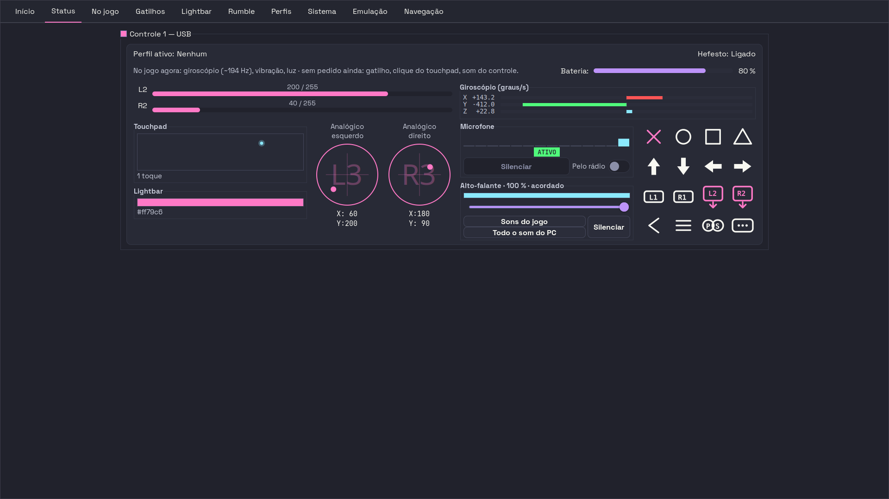

O painel ao vivo, **um cartão por controle**. No alto do cartão: o nome e o
transporte (`Controle 1 — USB`), **Perfil ativo**, **Hefesto** (ligado ou não) e
a **Bateria** em porcentagem. Logo abaixo, a linha **"No jogo agora: …"**, que é
o resumo em uma frase do que a aba **No jogo** detalha por linha — e que diz
"sem pedido ainda" para o que o jogo nunca pediu.

Depois vêm os blocos, sempre nos mesmos lugares:

| bloco | o que mostra |
|---|---|
| **L2** e **R2** | a barra de cada gatilho, de 0 a 255 |
| **Giroscópio (graus/s)** | X, Y e Z, com três barras bidirecionais |
| **Touchpad** | os pontos de toque, e quantos dedos ("1 toque") |
| **Lightbar** | a cor que está valendo, como faixa, com o hex embaixo (`#ff79c6`) |
| **Analógico esquerdo** / **direito** | os dois sticks, com X e Y |
| **Microfone** | o selo **ATIVO** ou **MUDO**, o medidor de nível, **Silenciar** e o interruptor **Pelo rádio** |
| **Alto-falante** | o volume, **Silenciar**, e o seletor de rota com **Sons do jogo** e **Todo o som do PC** |
| a grade de botões | acende o botão que você pressiona |

Os sensores só são lidos enquanto a aba está visível — as threads morrem quando
você sai dela.

Um controle sem nó de movimento (externo, kernel antigo) simplesmente não mostra
o sensor. Nunca aparece um zero fingindo repouso. A mesma disciplina vale para a
Lightbar: cor que o Hefesto não sabe sai como *"Lightbar: cor desconhecida"*, e
nunca como "apagada".

## No jogo

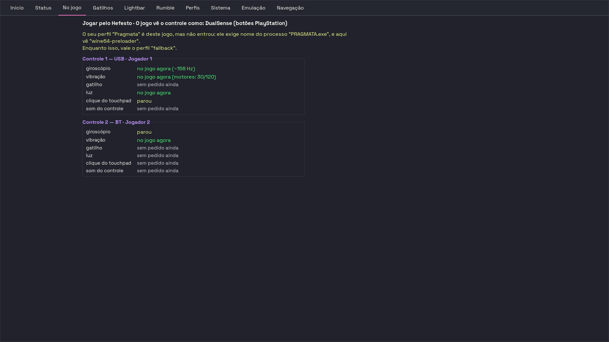

> **Esta aba só aparece com um jogo da Steam aberto** (10/08/2026, pedido dela:
> *"essa aba no jogo só deveria aparecer quando efetivamente eu tivesse com um
> jogo steam aberto"*). Sem jogo, ela sai da tira — e volta sozinha alguns
> segundos depois de o jogo abrir, sem clique nenhum. A captura acima é,
> portanto, o que se vê **jogando**.
>
> Se o jogo fechar com você lendo esta aba, a janela leva você para a **Status**
> antes de a página sumir — é a vizinha, e a outra metade da mesma pergunta.
> Enquanto o daemon não responde (ele acabou de subir, ou está desligado), a aba
> fica **como estava**: não pisca.

**Aba nova em 10/08/2026.** A Status responde pelo controle **físico**; esta
responde pelo que atravessa para o **jogo**. Ela nasceu de um pedido dela, ao
perguntar como validar giroscópio e touchpad: *"eu sei que a aba status é uma
coisa, mas isso converter em input seja via xbox ou dualsense ou nativo é
outra"*. Antes, a única forma de responder era abrir o testador da Steam.

No alto, a linha de contexto diz em que modo e com que máscara a janela está
agora — sem ela, uma foto da tela não diz de qual dos três modos ela é. Abaixo,
um painel por controle, e dentro dele **seis linhas fixas, sempre na mesma
ordem**: giroscópio, vibração, gatilho, luz, clique do touchpad e som do
controle. Trocar a máscara na aba Início e conferir olhando duas vezes para o
mesmo lugar é o gesto que a aba existe para servir — por isso linha fixa, e não
uma frase corrida.

A coluna da direita tem quatro respostas, e a cor é de significado:

| O que diz | Cor | O que significa |
|---|---|---|
| **no jogo agora** | verde | o dado saiu daqui e alguém escreveu de volta, agora (com o número medido ao lado: `(~158 Hz)`, `(motores: 30/120)`) |
| **parou** | amarelo | já esteve chegando e parou — era para estar chegando e não está |
| **sem pedido ainda** | apagado | o jogo nunca pediu. Não é avaria |
| **a máscara Xbox 360 não tem giroscópio** (ou touchpad) | apagado | a API do controle de Xbox não tem aquele recurso. Também não é avaria — por isso não é vermelho |

Onde não há gamepad virtual para medir, a aba **substitui** os painéis por uma
frase, e diz qual dos três casos é: **Conexão Nativa** (não há controle virtual
nenhum — o jogo abre o controle físico e fala direto com ele), **Controlar o
PC** (o controle está movendo mouse e teclado; o Hefesto não entrega controle
nenhum ao jogo) ou **este controle ainda não tem vpad** (acabou de conectar, ou
use "Reconciliar jogadores" na aba Início).

**O aviso do perfil que não entrou.** Se você tem um perfil escrito para o jogo
que está na frente e ele **não** está valendo, uma linha amarela aparece acima
dos painéis dizendo o que o perfil exige e o que a máquina vê, lado a lado — por
exemplo: *"O seu perfil 'Pragmata' é deste jogo, mas não entrou: ele exige nome
do processo 'PRAGMATA.exe', e aqui vê 'wine64-preloader'. Enquanto isso, vale o
perfil 'fallback'."* Ela é factual, nunca prescritiva, e só fala das regras
**daquele** jogo. Sem ela, a aba dizia "vibração: no jogo agora" com toda a
razão — e com a vibração do perfil errado.

> Nenhuma linha desta aba afirma que o **jogo consumiu** o dado: isso depende de
> qual biblioteca o jogo carregou (medido em 01/08: a `libSDL2` do Ubuntu não
> enumerava o gamepad virtual; a SDL3 que a Steam distribui enumerava). O que se
> afirma é o que o daemon pode saber — o dado saiu daqui, e alguém escreveu de
> volta. E onde não há dado, a tela **cala** em vez de escrever zero.

## Gatilhos

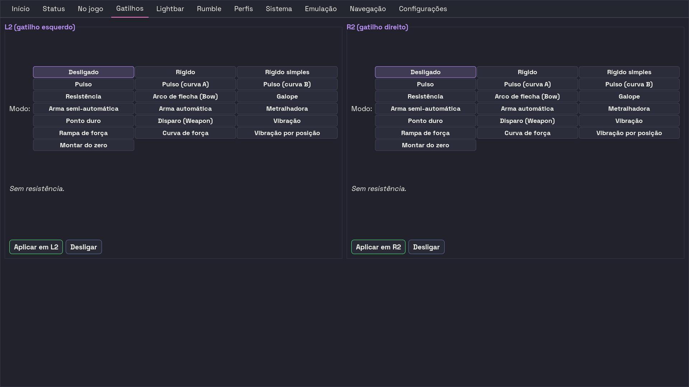

Configura o efeito adaptativo de L2 e R2, cada um do seu lado — duas colunas
iguais, **L2 (gatilho esquerdo)** e **R2 (gatilho direito)**.

**"Modo:"** é uma **grade de dezenove botões**, todos à vista ao mesmo tempo:
não há lista que abre. São botões, e não um menu, porque o cosmic-comp fecha o
popup do menu no clique.

| | | |
|---|---|---|
| Desligado | Rígido | Rígido simples |
| Pulso | Pulso (curva A) | Pulso (curva B) |
| Resistência | Arco de flecha (Bow) | Galope |
| Arma semi-automática | Arma automática | Metralhadora |
| Ponto duro | Disparo (Weapon) | Vibração |
| Rampa de força | Curva de força | Vibração por posição |
| Montar do zero | | |

Escolhido o modo, aparecem embaixo dele **uma frase do que ele faz** e os
**controles deslizantes dos parâmetros daquele modo** — e só deles: "Rígido" tem
Posição e Força; "Galope" tem Início, Fim, Pata 1, Pata 2 e Frequência;
"Desligado" e "Pulso" não têm nenhum. A fonte única dessa lista é
`app/actions/trigger_specs.py`.

**A linha "Efeito pronto:" só existe em dois modos** — **Curva de força** e
**Vibração por posição**, os que têm uma intensidade para cada uma das dez
posições do curso. Nela ficam curvas prontas (Rampa crescente, Rampa
decrescente, Plateau central, Stop hard, Stop macio, Linear médio para a força;
Pulso crescente, Machine gun, Galope, Senoide, Vibração final para a vibração),
mais
**Personalizar**. Mexer num deslizante volta a escolha para
**Personalizar** sozinho. Nos outros dezessete modos a linha nem aparece.

No pé de cada coluna, os dois botões que agem: **Aplicar em L2** (ou **Aplicar
em R2**) manda ao controle selecionado o modo e os ajustes daquela coluna, e
**Desligar** tira a resistência só daquele gatilho.

Referência dos modos e dos parâmetros brutos em
[`../protocol/trigger-modes.md`](../protocol/trigger-modes.md). Os nomes em
inglês (`Rigid`, `Galloping`, `Bow`…) continuam sendo os do perfil em disco e
os do protocolo — o rótulo em português é só a tela; escrever perfil à mão é
[`creating-profiles.md`](creating-profiles.md).

> **Isto foi conferido no aparelho em 12/08/2026** — grau *o aparelho obedeceu*,
> com quatro DualSense na mesa, dois no cabo e dois no rádio, e o olho dela em
> cada um. Um `Rigid` aplicado **só no L2** deixou o L2 duro nos quatro,
> **inclusive nos do Bluetooth**, com o R2 solto nos quatro — o R2 intocado é o
> que separa *"obedeceu"* de *"achei que estava diferente"*. Aplicando **só num
> controle**, só ele endureceu. Ensaios `gatilho-esq-radio-1216`,
> `gatilho-esq-cabo-1216` e `gatilho-dir-radio-isolado-2221`
> ([`../data/ensaios.csv`](../data/ensaios.csv), linhas 63-64 e 67).
>
> **O que ainda não foi medido:** só o modo **Rigid** foi exercitado no plástico,
> com um jogo de parâmetros. Os outros dezoito modos estão lidos no protocolo,
> não sentidos no dedo.
>
> O `Rigid` desta nota é o botão **Rígido** da grade — o nome em inglês é o do
> protocolo e o do perfil em disco.

## Lightbar

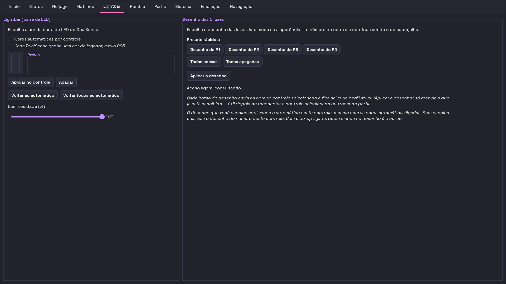

Duas colunas, e elas respondem coisas diferentes: **Lightbar (barra de LED)** é
a **cor**, e **Desenho das 5 luzes** é o **desenho** das luzinhas de jogador.

### Lightbar (barra de LED)

Seletor de cor com **Prévia**, controle deslizante **Luminosidade (%)**,
**Aplicar no controle** e **Apagar**.

Por padrão as **Cores automáticas por controle** estão ligadas: cada DualSense
conectado ganha uma cor de jogador sozinho. Escolher uma cor manualmente desliga
o automático só naquele controle; **Voltar ao automático** (ou **Voltar todos ao
automático**) desfaz.

### Desenho das 5 luzes

Acende e apaga cada uma das cinco luzinhas de jogador. **Isto muda só a
aparência — o número do controle continua sendo o do cabeçalho** (quem muda o
número é o seletor "Número deste controle:", lá em cima).

Os **Presets rápidos** são seis botões: **Desenho do P1**, **Desenho do P2**,
**Desenho do P3**, **Desenho do P4**, **Todas acesas** e **Todas apagadas**.
Cada um envia na hora ao controle selecionado e fica salvo no perfil ativo.
**Aplicar o desenho** só reenvia o que já está escolhido — serve depois de
reconectar o controle ou trocar de perfil. A linha **"Aceso agora:"** diz o que
está aceso neste instante.

Quem manda, quando há mais de uma opinião: o desenho que você escolhe aqui vence
o automático naquele controle, **mesmo com as cores automáticas ligadas**; sem
escolha sua, vale o desenho do número do controle; e **com o co-op ligado, quem
manda no desenho é o co-op**.

Os quatro desenhos de jogador seguem o padrão oficial do PS5 — P1 acende só o
LED central, P2 os dois vizinhos, e assim por diante. Não é bug: é o padrão do
console.

> **Se a barra não pegar a cor por Bluetooth, o problema não é esta aba**
> (medido em 12/08/2026). Com a **Steam aberta** no momento em que o controle
> liga, ela repinta a barra de todos os DualSense, e a sua cor não fica.
> Ligar os controles **antes** de abrir a Steam foi o gesto que funcionou nos
> três de três. O caminho inteiro, com o que fazer e o que não adianta, está em
> [Solução de problemas, seção 20](troubleshooting.md#20-a-barra-de-luz-não-pega-a-cor-por-bluetooth).
>
> **Duas coisas que a bancada da noite de 12/08 mediu e que mudam o que esperar
> desta aba** — grau *o aparelho obedeceu*, ensaios `lightbar-cabo-isolado-2229`
> e `cor-rota-hidraw-sem-steam-2235`
> ([`../data/ensaios.csv`](../data/ensaios.csv), linhas 70-71): **Aplicar no
> controle mira um controle só de verdade** (com quatro na mesa, o verde pintou
> só o escolhido e os outros três ficaram com a cor de antes), e **a cor não
> precisa ser reforçada** — ela ficou de pé **136 s** sem ninguém reescrever
> nada. Barra apagada não é o controle esquecendo; é alguém mandando apagar.

## Rumble

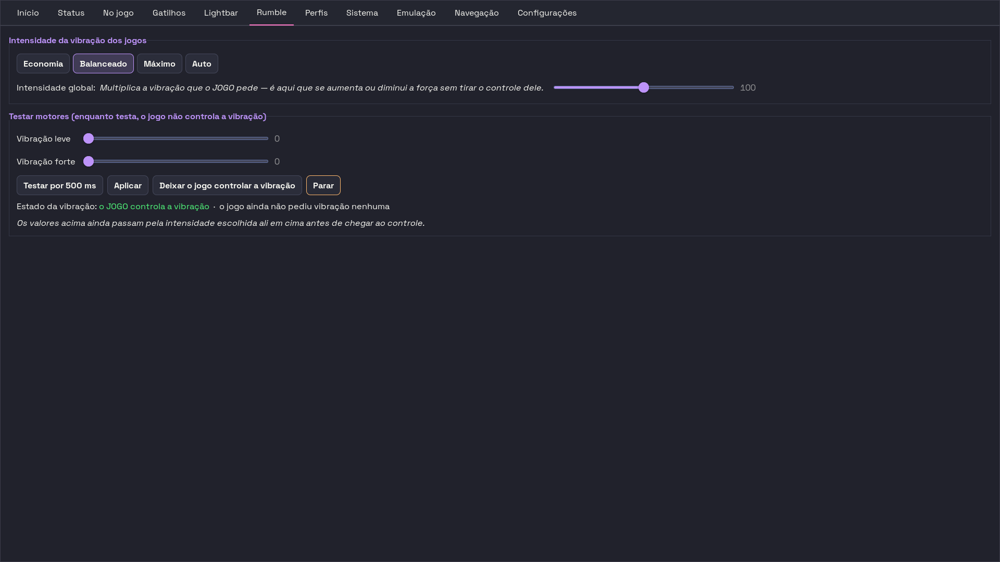

Duas partes: **Intensidade da vibração dos jogos** em cima, e **Testar motores
(enquanto testa, o jogo não controla a vibração)** embaixo.

A intensidade da vibração dos jogos vem em três degraus e um automático:

| botão | quanto sai | o que isso quer dizer |
|---|---|---|
| **Economia** | 30% | vibração fraca em tudo: poupa bateria e faz menos barulho |
| **Balanceado** | 100% | exatamente o que o jogo pediu — é o padrão |
| **Máximo** | 150% | aumenta pela metade o que o jogo pediu; só as cenas mais fortes batem no limite do controle e ficam parecidas entre si |
| **Auto** | 100% / 70% / 30% | escolhe pela bateria (acima de 50%, entre 20% e 50%, abaixo de 20%). **Nunca passa de 100%**: ele existe para poupar bateria |

O controle deslizante **Intensidade global:** vai de 0 a 200 e aceita qualquer
valor entre os degraus; mover para fora deles apaga os quatro botões, e a barra
de estado diz qual porcentagem ficou valendo.

Repare que o deslizador **vai mais longe que o botão Máximo**, e isso é de
propósito: os quatro botões são atalhos seguros, e o deslizador é para quem quer
ir além sabendo o preço. O preço é medido — de **170** para cima o controle
chega ao limite dele em um terço das forças que o jogo pede, e essas cenas
passam a sair todas iguais. É por isso que o **Máximo** para em 150%, e não em
200%: acima disso metade da variação da vibração desaparece.

A intensidade multiplica **as duas** vibrações: a que o jogo pede e a que você
fixa aqui embaixo. Só que a do jogo passa pelo controle virtual — na **Conexão
Nativa (Sony)**, ou sem controle virtual nenhum, ela não alcança o jogo, e a aba
avisa em cima dos botões quando é esse o caso.

**O aviso diz duas coisas diferentes, e a diferença importa:** na Conexão Nativa
ele só explica que o jogo fala direto com o controle — é o modo funcionando como
deve, e não há nada a consertar. Sem controle virtual **nenhum** ele aponta o
gesto: ligar **"Jogar pelo Hefesto"** na aba Início. Nos dois casos a frase
termina lembrando que a intensidade **continua valendo** para a vibração que
você fixa em "Testar motores".

> Esse mesmo estado — sem controle virtual e fora da Conexão Nativa — foi onde a
> vibração dos jogos **morria logo no começo** até 11/08/2026. A causa foi
> medida e corrigida; o relato e como confirmar estão em
> [Solução de problemas, seção 19](troubleshooting.md#19-a-vibração-do-jogo-dura-um-instante-e-morre).
>
> **A cura foi conferida no aparelho em 12/08/2026, com o serviço ligado** —
> grau *o aparelho obedeceu*: **8,26 s** contínuos num controle do cabo e
> **8,28 s** no cabo e no rádio disparados juntos, numa janela de 8 s pedida.
> Foi a **primeira** vez que a vibração por rádio durou a janela inteira com o
> serviço vivo. E com os **quatro** controles vibrando ao mesmo tempo, em duas
> rodadas, a duração ficou **igual** — o que em 11/08 saía *"por duração
> diferente"*. Ensaios `rumble-ff-cura-cabo-so`, `rumble-ff-cura-cabo-par`,
> `rumble-ff-cura-radio-par` e `rumble-quatro-duracao-igual-r1`/`-r2`
> ([`../data/ensaios.csv`](../data/ensaios.csv), linhas 59-61 e 68-69).

Abaixo, o teste dos motores: os deslizantes **Vibração leve** e **Vibração
forte**, e quatro botões. **Testar por 500 ms** dá um pulso e solta; **Aplicar**
fixa aqueles dois valores e os deixa valendo; **Parar** trava o controle em
silêncio — inclusive no jogo; **Deixar o jogo controlar a vibração** devolve o
comando. A linha **"Estado da vibração:"** diz o que está valendo, e os valores
destes deslizantes **ainda passam pela intensidade escolhida ali em cima** antes
de chegar ao controle.

> Enquanto a vibração estiver travada aqui — em silêncio pelo **Parar**, ou fixa
> pelo **Aplicar** —, o cabeçalho da janela diz isso de qualquer aba
> ("Vibração em silêncio" ou "Vibração fixa em X/Y"). Ver
> [O cabeçalho](#o-cabeçalho).

## Perfis

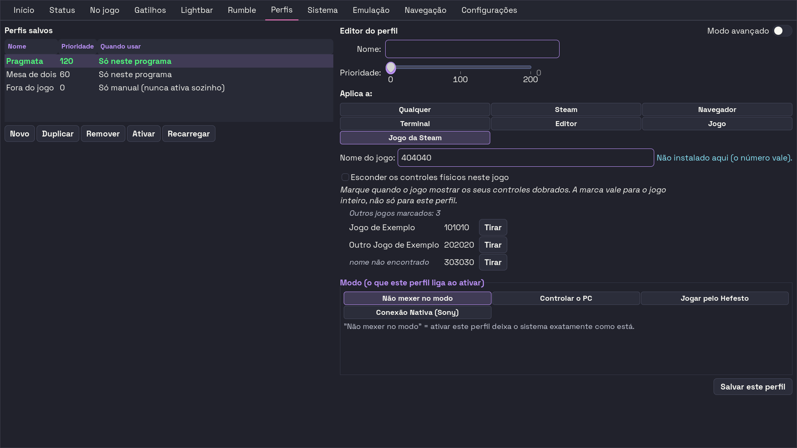

À esquerda, **Perfis salvos** — uma tabela com **Nome**, **Prioridade** e
**Quando usar** (é ela que traduz a regra: "Sempre", "Só neste programa", "Só
manual (nunca ativa sozinho)"). Embaixo dela, **Novo**, **Duplicar**,
**Remover**, **Ativar** e **Recarregar**.

À direita, o **Editor do perfil**, com o interruptor **Modo avançado** no canto
superior. Fora dele, valendo nos dois modos: o campo **Nome:**, o deslizante
**Prioridade:** de 0 a 200, o quadro **Modo (o que este perfil liga ao ativar)**
e o botão **Salvar este perfil**.

**Com o Modo avançado desligado**, o editor mostra **"Aplica a:"** — sete
botões: **Qualquer**, **Steam**, **Navegador**, **Terminal**, **Editor**,
**Jogo** e **Jogo da Steam**. Escolher **Jogo** ou **Jogo da Steam** faz
aparecer o campo **Nome do jogo:** (o executável, no primeiro caso; o número ou
o endereço da loja, no segundo — e o nome do jogo aparece ao lado depois de
reconhecido). Só com **Jogo da Steam** aparece também a caixinha **"Esconder os
controles físicos neste jogo"**, que é onde se **tira** a marca posta pelo botão
"Este jogo não funciona" da aba Sistema. A marca vale para o jogo inteiro, não
só para este perfil.

**Com o Modo avançado ligado**, "Aplica a:" dá lugar aos três campos crus —
`window_class:`, `title_regex:` e `process_name:` — com AND entre os campos
preenchidos e OR dentro de cada lista; campos vazios são ignorados.

O quadro **Modo** tem quatro botões: **Não mexer no modo** (ativar o perfil
deixa o sistema exatamente como está), **Controlar o PC**, **Jogar pelo Hefesto**
e **Conexão Nativa (Sony)**. Escolhido "Jogar pelo Hefesto", aparece embaixo a
linha **"O jogo vê o controle como:"** — **DualSense (botões PlayStation)** ou
**Xbox 360** —, e o preço de cada máscara está no texto que aparece ao parar o
ponteiro sobre ela. Não há campo de co-op aqui: cada controle é um jogador
sempre.

A prioridade é o **segundo** critério, não o primeiro: um perfil com regra de
janela sempre vence um perfil "Sempre", por mais alta que seja a prioridade
deste. A faixa 0–200 tem fonte única em `profiles/schema.py`, e há portão que
reprova se o controle deslizante e o verificador discordarem.

Como escrever um perfil do zero: [`creating-profiles.md`](creating-profiles.md).

## Os avisos que a janela dá antes de estragar um perfil

Três perguntas existem para que um gesto distraído não custe configuração. Em
todas, o botão pré-selecionado é o que **não** mexe em nada — um Enter distraído
nunca destrói.

Salvar um perfil com prioridade menor do que ele tinha:

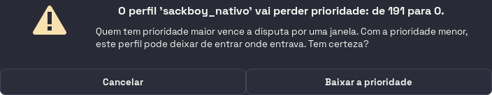

Salvar um perfil que valia só em certos programas de um jeito que o faz valer
para tudo. O texto diz o que o perfil é **hoje**, porque avisar "vale só em
programas específicos" para um perfil que é "Só manual" seria o aviso mentindo:

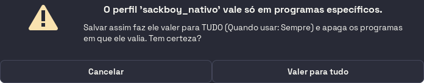

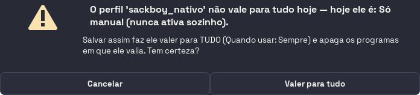

Ativar um perfil com alterações não salvas nas abas. Manter as alterações é o
padrão, e nesse caso as abas seguem mostrando o que você ainda não salvou:

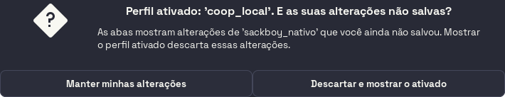

## Sistema

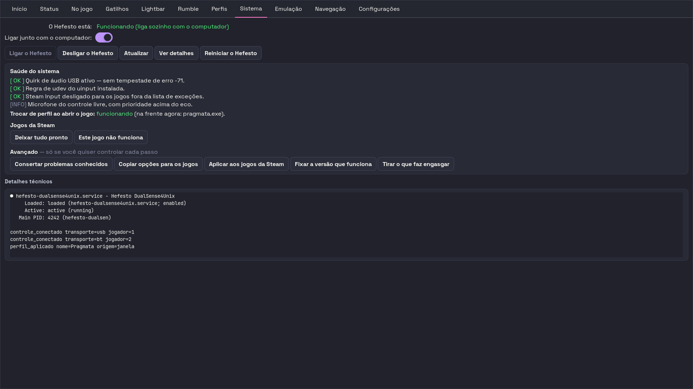

O painel de manutenção. No alto, a linha **"O Hefesto está:"**, o interruptor
**Ligar junto com o computador:** e a fileira de botões do serviço: **Ligar o
Hefesto**, **Desligar o Hefesto** (desligado, o controle continua funcionando —
só sem luzes, gatilhos e seus ajustes), **Atualizar** (relê o estado, não mexe
em controle nenhum), **Ver detalhes** e **Reiniciar o Hefesto**.

> Um sexto botão, **Corrigir modo de execução**, aparece só quando o Hefesto
> está rodando de um jeito improvisado — sem ligar sozinho e sem se recuperar de
> um travamento. Com o serviço no lugar certo, ele não existe na tela.

O bloco **Saúde do sistema** roda um diagnóstico ao abrir a aba, e logo abaixo
dele a linha **"Trocar de perfil ao abrir o jogo:"** diz se o daemon está
conseguindo ver qual janela está na frente — sem isso o perfil por jogo não
entra, e "o perfil não troca" fica indistinguível de "o perfil está errado".

Depois vem **Jogos da Steam**, com os dois botões que resolvem sem obrigar
ninguém a escolher como:

| botão | o que ele faz |
|---|---|
| **Deixar tudo pronto** | ajusta de uma vez as duas coisas que costumam brigar com o controle, com **um** consentimento só. Se a Steam estiver aberta, pede permissão para fechá-la por uns 20 s e reabrir; com um jogo aberto, não faz nada |
| **Este jogo não funciona** | marca o jogo que você acabou de abrir: nele os controles físicos ficam escondidos e o jogo passa a ver só os do Hefesto. Não fecha a Steam. Feche e abra o jogo para valer |

A marca do **"Este jogo não funciona"** se tira na aba **Perfis**, na caixinha
**"Esconder os controles físicos neste jogo"** do editor. E ela entrega a
**entrada**: a sua cor, os seus gatilhos, a sua vibração e os seus jogadores
continuam valendo.

Por último, o bloco **Avançado — só se você quiser controlar cada passo**, com
os quatro botões que fazem cada pedaço à mão: **Aplicar correções** (não pede
senha e nunca fecha a Steam), **Copiar opções para os jogos**, **Aplicar aos
jogos da Steam** e **Travar Proton validado** — os dois últimos pedem a Steam
fechada e fazem cópia de segurança antes.

**Ver detalhes** abre o registro técnico no quadro **Detalhes técnicos** ali
embaixo, que é o que se anexa a um relato de problema.

## Emulação

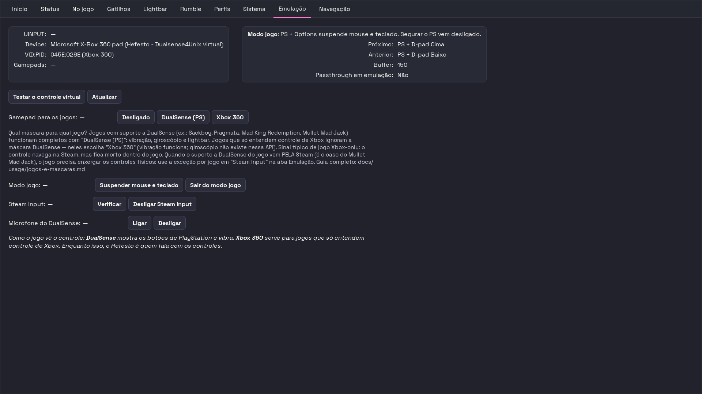

A visão técnica do que a aba Início resume. Em cima, dois quadros de leitura: o
do controle virtual (**UINPUT**, **Device**, **VID:PID**, **Gamepads**) e o do
**Modo jogo** (o atalho que o liga, **Próximo**, **Anterior**, **Buffer** e
**Passthrough em emulação**). **Testar o controle virtual** prova que o device
virtual nasce; **Atualizar** relê tudo.

Abaixo, quatro linhas de comando, cada uma com o estado à esquerda e os botões à
direita:

| linha | botões |
|---|---|
| **Gamepad para os jogos:** | **Desligado**, **DualSense (PS)**, **Xbox 360** |
| **Modo jogo:** | **Suspender mouse e teclado**, **Sair do modo jogo** |
| **Steam Input:** | **Verificar**, **Desligar Steam Input** |
| **Microfone do DualSense:** | **Ligar**, **Desligar** |

O texto de ajuda da própria aba explica qual máscara serve para qual jogo, e o
guia completo é [`jogos-e-mascaras.md`](jogos-e-mascaras.md).

> **"Gamepad para os jogos:" mexe no mesmo lugar que a aba Início** — os três
> botões passam pelo mesmo caminho de troca de modo, e não por um atalho
> próprio. **DualSense (PS)** e **Xbox 360** são os rótulos curtos das duas
> máscaras do "O jogo vê o controle como:"; **Desligado** é o modo **Controlar
> o PC**. Na **Conexão Nativa (Sony)** nenhum dos três fica realçado, e o
> estado ao lado diz o modo por extenso — porque nenhum dos três seria verdade
> ali.

## Navegação

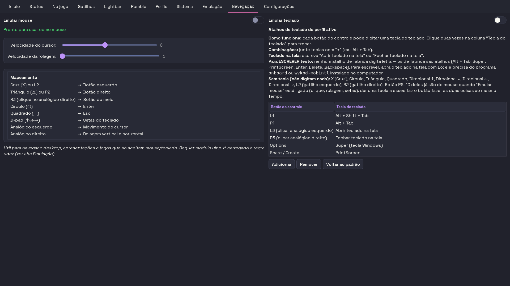

> **A aba se chamava "Navegação DSX" até a PALAVRA-01.** O rótulo na tira é
> **"Navegação"** — "DSX" é o nome de outro programa, e não dizia nada a quem
> abre a janela. O nome do arquivo da imagem (`readme_navegacao_dsx.png`)
> continua o antigo de propósito: renomeá-lo quebraria os links desta página e
> do `README.md` sem devolver nada.

Mouse e teclado lado a lado, em duas colunas. À esquerda, a emulação de mouse: o
interruptor **Emular mouse**, os deslizantes **Velocidade do cursor:** e
**Velocidade da rolagem:**, e a tabela **Mapeamento** — que é leitura, não
ajuste: ela diz quais botões viram clique, Enter, Esc, setas, movimento do
cursor e rolagem.

À direita, o interruptor **Emular teclado** e **Atalhos de teclado do perfil
ativo**: a lista de botão → tecla, com **Adicionar**, **Remover** e **Voltar ao
padrão**. É esta lista que se edita — o formato é `KEY_*` (`KEY_C`,
`KEY_ENTER`), `__OPEN_OSK__`/`__CLOSE_OSK__` para o teclado na tela, e combos
com `+` (`KEY_LEFTALT+KEY_TAB`).

> **NOTA DATADA — 10/08/2026: "escolha entre stick e touchpad" caducou, e a
> medição diz que ela nunca descreveu esta aba.** Esta linha prometia um seletor
> da **fonte do cursor**. **GRAU: MEDIDO** hoje contra o código: não há widget
> nenhum de fonte no `gui/main.glade` (a tabela da aba lista *"Analógico
> esquerdo → Movimento do cursor"* e *"Analógico direito → Rolagem vertical e
> horizontal"*, e mais nada), não há campo de fonte em `ProfileMouseConfig`
> (`enabled`, `speed`, `scroll_speed` — e `extra="forbid"`), e
> `integrations/uinput_mouse.py` não conhece touchpad. **O que é verdade hoje:**
> o cursor do mouse emulado sai do **analógico esquerdo**, sempre. O touchpad do
> DualSense move o cursor por outro caminho — ele é o touchpad do **sistema**,
> pelo libinput, e isso vale nos três modos (ver
> [`modos.md`](modos.md#o-touchpad-é-touchpad-do-sistema)).

Os **dois interruptores são irmãos e independentes**, e isso não é detalhe: o
rótulo único de antes dizia "Emular mouse+teclado" e governava **só** o mouse —
foi por isso que ela concluiu, com razão, que estava "com o modo mouse teclado
desligado" e mesmo assim levava Alt+Tab dentro do jogo. O Alt+Tab é do teclado.
Desligar **Emular teclado** tira tudo o que o controle digita: os atalhos da
lista, e o teclado na tela em L3/R3.

A lista de teclas mostra **os dezessete botões**, inclusive os que **não**
digitam nada — ela já escondeu os sem tecla e parecia completa. E a legenda diz,
com todas as letras, que **nenhum atalho de fábrica digita uma letra**: os de
fábrica são **Super** (Options), **PrintScreen** (Share / Create), **Alt+Shift+
Tab** (L1), **Alt+Tab** (R1) e o teclado na tela em **L3** e **R3**. Para
escrever texto, o caminho é o teclado na tela do L3.

> **Correção datada de 15/08/2026.** Este parágrafo dizia *"os vinte botões"* e
> listava **Enter, Delete e Backspace** entre os atalhos de fábrica. Os três
> eram os padrões das **regiões do touchpad**, que saíram da aba em 09/08 (nota
> logo abaixo) — vinte menos as três regiões dá os dezessete de hoje, que é o
> que `app/actions/input_actions.py` oferece em `CANONICAL_BUTTONS`. O número
> velho e as três teclas eram descrição de uma tela que já não existe, não
> medição a preservar.

> **NOTA DATADA — 09/08/2026: as três regiões do touchpad saíram desta aba.**
> Elas existiam (`Touchpad — lado esquerdo/meio/direito`, de fábrica Backspace,
> Enter e Delete) e foram retiradas por decisão dela, junto com a devolução do
> touchpad ao sistema. A razão é que o produto não pode oferecer duas coisas
> que se atropelam no mesmo dedo: com o touchpad de volta ao libinput o clique
> dele já é clique de mouse, e somar a tecla faria um clique **apagar texto**
> sem ninguém pedir. O runtime também se cala — quem responde é o estado real
> do nó, não o modo. Voltar é a mesma decisão do outro lado: o touchpad
> passaria a ser do Hefesto de novo, e as três regiões voltam junto. Uma coisa
> não vai sem a outra.

As duas colunas já foram abas separadas. Voltaram juntas em colunas porque
empilhadas elas inflavam a altura mínima da janela inteira — o `GtkNotebook`
adota o maior mínimo entre todas as páginas.

O interruptor do mouse só fica disponível no modo **Controlar o PC**. Fora dele,
ligar o mouse derrubaria o controle virtual e os jogadores do co-op no meio do
jogo, sem aviso — por isso ele nasce bloqueado, com a razão escrita em texto.

## O cabeçalho

A faixa acima da tira de abas, e ela vale para **todas** — inclusive as que
nenhuma das dez capturas desta página mostra: o script fotografa o
`main_notebook`, e isto mora no `header_bar`, fora do recorte. Por isso esta
seção foi escrita contra o código.

| o que aparece | o que responde |
|---|---|
| **"Ajustes vão para:"** + um chip (`Todos`, `Sony 1 · BT`, …) | **quem recebe** o que você fizer nas abas Lightbar, Gatilhos, LEDs e Rumble. Com `Todos`, vale para todos os controles |
| **"Número deste controle:"** + botões `1` `2` `3` `4` | **muda o número** do controle escolhido — o do cabeçalho, o dos cartões e o do LED de número. Os outros deslizam para abrir lugar. Só aparece com um controle escolhido **e** dois ou mais na mesa |
| **"Editando: Controle N"** | de qual controle são os ajustes que estão à vista. Sem endereço fixo, ele diz isso: *"vale para todos"* |
| **"Vibração em silêncio"** / **"Vibração fixa em X/Y"** | a vibração está **travada** pela aba Rumble e o jogo não a alcança. Devolve-se em Rumble → "Deixar o jogo controlar a vibração" |
| **"N jogadores saíram — não foi você; voltam sozinhos"** | o jogo derrubou o co-op. Não é gesto seu, e eles voltam sozinhos |

**O "Número deste controle:" e o "Desenho das 5 luzes" da aba Lightbar não são a
mesma coisa**, e confundi-los é o erro fácil: aqui muda-se o **número**; lá, só
a **aparência** das luzinhas.

Os dois últimos avisos moram aqui, e não na aba de onde vêm, por medição: quem
está jogando não tem a aba Rumble nem a Status abertas, e sem esta faixa a
vibração travada e o co-op derrubado somem sem uma palavra.

## O rodapé

Vale para qualquer aba — e os quatro botões **não** fazem a mesma coisa:

| botão | o que ele faz | o trabalho fica salvo? |
|---|---|---|
| **Aplicar** | manda o rascunho inteiro ao daemon e o controle obedece **agora** | **não.** Nada é escrito em disco |
| **Salvar Perfil** | pergunta o nome e grava `<nome>.json` na pasta de perfis | **sim** |
| **Importar** | lê um `.json` de fora, valida e copia para a pasta de perfis | **sim** |
| **Restaurar Default** | devolve o `meu_perfil` ao estado de fábrica e regrava o arquivo | **sim** (e sobrescreve o que havia) |

**A distinção custa um perfil, e por isso está aqui.** O **Aplicar** despacha
`profile.apply_draft` pelo IPC (`on_apply_draft`, em
`src/hefesto_dualsense4unix/app/actions/footer_actions.py`) e não abre arquivo
nenhum: o efeito é no aparelho, e some no
próximo perfil que entrar — por troca de janela, por jogo, ou por reinício do
daemon. Quem escreve no disco é o **Salvar Perfil**, e só ele conserva o que
você acabou de ajustar.

*Correção datada de 13/08/2026: esta seção dizia que os quatro "persistem o que
está editado para o perfil corrente". Era falso para o **Aplicar**, que é o
botão mais usado — e o texto que dizia a ela onde o trabalho fica salvo.*
